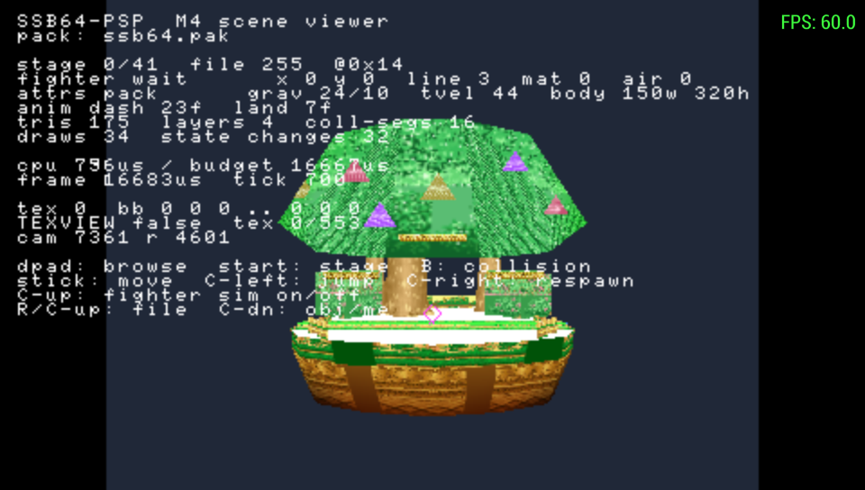
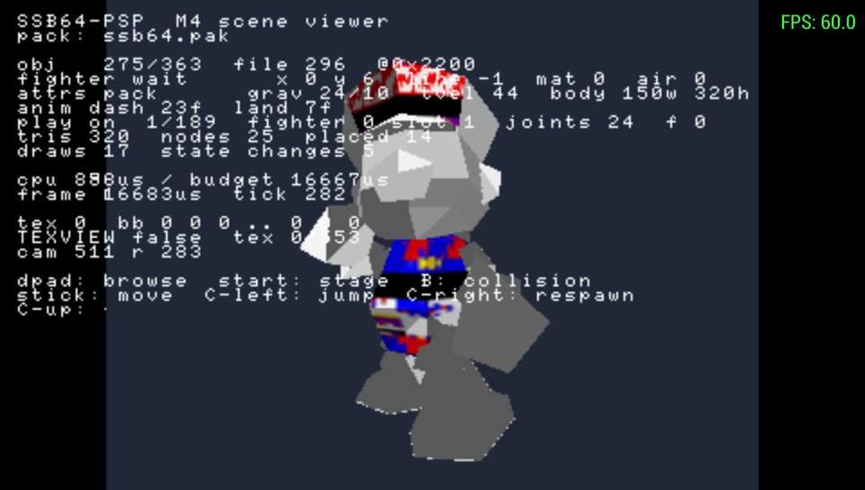

# SSB64PSP

A native Rust port of **Super Smash Bros. (N64)** to the **Sony PSP**.

This is *not* an emulator. It is a reimplementation of the game for PSP
hardware, using the [Super Smash Bros. decompilation][decomp] as the reference
for original behaviour and [`rust-psp`][rustpsp] for the platform layer.

> **Status: engine prototype.** The asset pipeline is complete and verified
> against a real ROM, real fighters and stages render on the PSP at a locked
> 60 FPS, and **a fighter walks, dashes, jumps and lands on a real extracted
> stage** under the original's own physics constants and status machine.
> Attacks, damage, opponents and the match loop are not implemented, and
> nothing has run on real hardware — see [Current status](#current-status).



*Dream Land: geometry, textures and palettes extracted from the ROM, placed by
the recovered scene graph and drawn through the PSP's GE, with a fighter
standing on the stage's real collision geometry. The overlay is the debug
build's; the numbers in it are read live.*

```
cpu 796us / budget 16667us    4.8% of the frame budget
frame 16683us  tick 700       59.94 Hz, one tick per frame, no drift
```

## Legal

You must supply your own legally obtained ROM dump.

This repository contains **no Nintendo code, data, ROM, texture, model or audio**,
and never will. Assets are extracted from your own ROM on your own machine at
build time, into `assets/generated/`, which is gitignored. `rom/` is gitignored.

## Requirements

* Rust stable (host tools and tests)
* Rust nightly, pinned — see `psp/rust-toolchain.toml`
* [`cargo-psp`][rustpsp]: `cargo install cargo-psp`
* Your own `Super Smash Bros. (USA).z64`

Supported ROM:

| | |
|---|---|
| Game code | `NALE` (US) |
| SHA-1 | `e2929e10fccc0aa84e5776227e798abc07cedabf` |
| MD5 | `f7c52568a31aadf26e14dc2b6416b2ed` |

## Quick start

```bash
# 1. Put your ROM here (gitignored)
mkdir -p rom && cp "/path/to/Super Smash Bros. (USA).z64" rom/

# 2. Check it is the supported revision
cargo run -p romtool -- verify "rom/Super Smash Bros. (USA).z64"

# 3. Inspect the asset archive
cargo run -p romtool -- info "rom/Super Smash Bros. (USA).z64"

# 4. Build the runtime asset pack -- this is what the PSP build loads
cargo run --release -p romtool -- pack "rom/Super Smash Bros. (USA).z64"
# -> assets/generated/ssb64.pak

# 5. Run the host test suite
cargo test

# 6. Build the PSP executable
cd psp && cargo psp --release
# -> psp/target/mipsel-sony-psp/release/EBOOT.PBP

# 7. Build and run it under PPSSPP, with a screenshot
tools/run-ppsspp.sh
```

Step 4 is not optional: `run-ppsspp.sh` stages `ssb64.pak` alongside the EBOOT
and the build has nothing to draw without it. To pull out the raw archive
payloads instead — byte-exact files, not converted assets — use
`romtool extract`.

> `tools/run-ppsspp.sh` forces PPSSPP's **software rasteriser**. That is not a
> preference — PPSSPP's hardware backends do not reflect CPU writes to emulated
> VRAM, and that is exactly how `sceGuDebugFlush` paints the debug overlay. Run
> under OpenGL and the diagnostics are computed but invisible. See RE-014.

## Architecture

Three layers, strictly separated. Game logic never mentions the PSP; the PSP
backend never mentions fighters.

```
              Layer A — Game            crates/ssb-game
       fighters, physics, collision, animation,
       stages, items, AI, menus, match state
                     │
              Layer B — Engine          crates/ssb-engine
       traits: Renderer, AudioBackend, Input, Clock
       math, coordinate conversion, fixed timestep
                     │
              Layer C — PSP backend     psp/
       sceGu, sceCtrl, sceAudio, VFPU, timing
```

That is the target shape; Layer A holds what has been ported so far, which is
physics, collision and the movement status machine. `ssb-rom` sits beside all
three rather than in the stack: it reads ROM formats at build time and the
runtime pack on device, so it is linked by both the host tools and the PSP
binary.

| Crate | Purpose | `no_std` | Target |
|---|---|---|---|
| `crates/ssb-rom` | ROM validation, VPK0, relocData archive, N64 formats, animation scripts, the runtime pack | yes (+alloc) | host + PSP |
| `crates/ssb-engine` | Layer B traits, math, coordinate conversion | yes | host + PSP |
| `crates/ssb-game` | Layer A game logic | yes | host + PSP |
| `tools/romtool` | Build-time extraction and conversion CLI, and the verifier for everything recovered from the ROM | no | host |
| `psp/` | Layer C backend + executable | yes | `mipsel-sony-psp` |

`psp/` is deliberately **outside** the root cargo workspace: it needs a pinned
nightly and `-Z build-std`, and keeping it separate lets `cargo test` at the
root run on stable.

## Current status

See [`docs/porting-status.md`](docs/porting-status.md) for the full table.

**Working and verified:**

* ROM validation, VPK0 decompression (all 499 compressed files) and the
  relocData archive (2132/2132 files, 61,343 intern + 3,092 extern relocations)
* Asset extraction and conversion into a 3.3 MB runtime pack: 2722 meshes
  (47,696 triangles, zero conversion failures), 3137 scene-graph nodes, 553
  textures, 41 stages' collision geometry, all 27 fighters' constants and all
  189 of their movement animations
* **Textured, shaded models placed by the scene graph render on device at
  60 FPS**, fighters in their own recovered palettes
* **Fighters render in their own colours** — flat-shaded parts take the
  combiner's `PRIM * SHADE`, with the per-costume colour recovered from the
  material-animation script that holds one costume per frame
* **Stages render textured on device** — their texels live in a separate
  archive file, reached through the relocations the converter now follows
* **All 41 stages' collision geometry** decoded, packed and queried; the ported
  `mpprocess` floor solver holds a simulated fighter still at 158/158 spawn
  points with zero drift
* **A fighter moves on device**: walk, dash, run, turn, squat, jump,
  double-jump, drop-through and landing, with the original's interrupt ordering
  and its tap-counter input model, on every character's real extracted
  constants and animation lengths
* **Fighters animate on device.** Packed figatree scripts drive a joint clock
  each, node matrices recompose every tick at 60 FPS, and the result is checked
  four ways: poses match the ROM across 3444 joints, no bone changes length in
  204,547 measurements over all 189 animations, feet stay planted through the
  grounded poses, and Turn's opening frame renders as a standing Mario
* 315 host tests passing



*The opening frame of Mario's Turn, played from the pack on device: 24 joint
clocks ticking, node matrices recomposed each tick. The grey is missing
materials, not a wrong pose — see the limitations below.*

**Known limitations:**

* **Never run on real PSP hardware.** PPSSPP is not proof of hardware
  behaviour; this is the biggest open risk.
* **Animation is not driven by gameplay yet.** It plays correctly in the
  viewer, but the status machine does not start one when a fighter changes
  state, so a fighter on a stage is still a sliding rest pose.
* No attacks, hitboxes, damage, knockback, opponents, stocks or match loop.
* No stage *loader* — the viewer browses stages; a match does not select one.
* The debug overlay only displays under PPSSPP's software rasteriser
  (`sceGuDebugFlush` paints VRAM with the CPU). See RE-014.
* Materials use a majority-vote lighting heuristic, and some `MObj` fields that
  affect appearance are still ignored.
* Only **costume 0** is packed for each fighter, so the alternate palettes a
  match would let you pick are not in the pack.
* 119 of 664 bound textures still fail to convert: 54 pointers nothing
  resolves, 36 landing past the end of the file they name, 13 segmented
  addresses and 16 missing a palette.
* At 1.1 MiB the full texture set no longer fits texture VRAM in one go. A
  match needs only one stage and a few fighters, but streaming is an open
  question.

**Not started:** audio, menus, save data, items, CPU AI, VFPU work.

**Current milestone:** the combat vertical slice. The animation pipeline works
and is validated; the next step is having the status machine drive it, so a
fighter walking on a stage is animated rather than sliding.

## Verifying the claims

Everything above is checkable against your own ROM. Start with the load-bearing
one: that VPK0 decompression is byte-correct, checked without needing a
reference decoder.

```bash
cargo run --release -p romtool -- check "rom/Super Smash Bros. (USA).z64"
```

```
files                 2132
load failures         0
intern reloc slots    61343
extern reloc slots    3092
chain/ROM mismatches  0
compressed files cross-verified against ROM geometry: 499
```

Each file's extern-pointer count is derivable two independent ways: by walking
a linked chain threaded through the *decompressed payload* (which a single
wrong byte would derail), and by measuring a *ROM offset gap* that does not
involve decompression at all. They agree for every file.

The same idea — two independent readings that have to agree — checks the
recovered game data. Each of these compares what `ssb-rom` decodes out of the
compressed archive against what the decompilation says in its own sources:

```bash
# Every fighter's physics constants, field by field
cargo run --release -p romtool -- fighters "rom/…z64" --verify

# Every movement animation's length, decoded two ways
cargo run --release -p romtool -- anims "rom/…z64" --verify

# Every animation played against the skeleton it belongs to, replayed from
# the built pack, and checked for a bone that changes length
cargo run --release -p romtool -- figatree "rom/…z64" --frames 40 \
    --pack assets/generated/ssb64.pak

# Which textures convert, and why the rest do not
cargo run --release -p romtool -- textures "rom/…z64"
```

A wrong offset table does not produce a near miss; it produces garbage. So
189 animation lengths agreeing across 27 fighters, or 1215 constant fields
agreeing one for one, is the evidence — not the fact that the code runs.

## Documentation

| Document | Contents |
|---|---|
| [`docs/ssb-architecture.md`](docs/ssb-architecture.md) | How the original game works, and where each subsystem lands |
| [`docs/reverse-engineering.md`](docs/reverse-engineering.md) | Open questions with evidence and confidence levels |
| [`docs/rendering.md`](docs/rendering.md) | N64 → PSP rendering translation |
| [`docs/memory.md`](docs/memory.md) | Memory layout and allocator plan |
| [`docs/porting-status.md`](docs/porting-status.md) | Per-subsystem progress |

## References

Studied as architectural references, not copied:

1. [ssb-decomp-re][decomp] — the SSB64 decompilation (**100% complete**)
2. [sf64-psp](https://github.com/TheMrIron2/sf64-psp) — Star Fox 64 on PSP
3. [n64psp](https://github.com/TheMrIron2/n64psp) — reusable N64→PSP runtime
4. [rust-psp][rustpsp] — Rust support for the PSP

Clone them into `refs/` (gitignored) to follow along:

```bash
mkdir -p refs && cd refs
git clone https://github.com/VetriTheRetri/ssb-decomp-re
git clone https://github.com/TheMrIron2/sf64-psp
git clone https://github.com/TheMrIron2/n64psp
git clone https://github.com/overdrivenpotato/rust-psp
```

## License

MIT OR Apache-2.0, for the code in this repository only. It confers no rights
to Nintendo's intellectual property.

[decomp]: https://github.com/VetriTheRetri/ssb-decomp-re
[rustpsp]: https://github.com/overdrivenpotato/rust-psp
