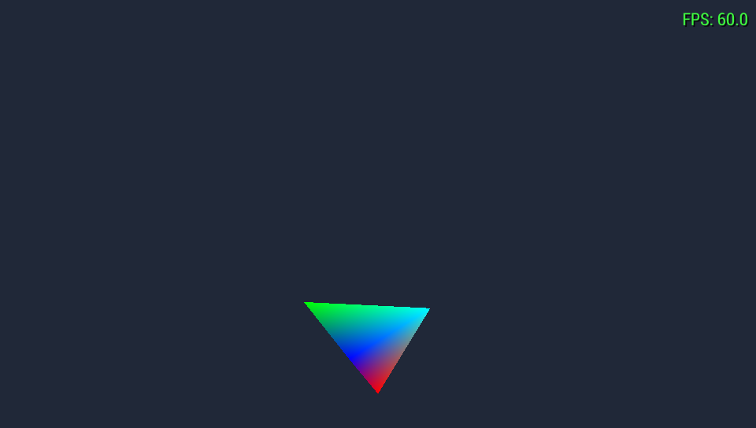

# SSB64PSP

A native Rust port of **Super Smash Bros. (N64)** to the **Sony PSP**.

This is *not* an emulator. It is a reimplementation of the game for PSP
hardware, using the [Super Smash Bros. decompilation][decomp] as the reference
for original behaviour and [`rust-psp`][rustpsp] for the platform layer.

> **Status: early.** The asset pipeline is complete and verified against a real
> ROM, and the PSP executable **boots in PPSSPP at a locked 60 FPS**. There is
> no Smash content on screen yet — see [Current status](#current-status).



*M1 baseline: a vertex-coloured tetrahedron driven by the ported `ftphysics`
gravity and air-drift code, at 60 FPS. Not Smash yet — this is the platform
proving that rendering, input, the fixed 60 Hz clock and the physics port all
work on-device.*

## Legal

You must supply your own legally obtained ROM dump.

This repository contains **no Nintendo code, data, ROM, texture, model or audio**,
and never will. Assets are extracted from your own ROM on your own machine at
build time, into `assets/generated/`, which is gitignored. `rom/` is gitignored.

## Requirements

* Rust stable (host tools and tests)
* Rust nightly, pinned — see `psp/rust-toolchain.toml`
* [`cargo-psp`][rustpsp]: `cargo install cargo-psp`
* Your own `Super Smash Bros. (USA).z64`

Supported ROM:

| | |
|---|---|
| Game code | `NALE` (US) |
| SHA-1 | `e2929e10fccc0aa84e5776227e798abc07cedabf` |
| MD5 | `f7c52568a31aadf26e14dc2b6416b2ed` |

## Quick start

```bash
# 1. Put your ROM here (gitignored)
mkdir -p rom && cp "/path/to/Super Smash Bros. (USA).z64" rom/

# 2. Check it is the supported revision
cargo run -p romtool -- verify "rom/Super Smash Bros. (USA).z64"

# 3. Inspect the asset archive
cargo run -p romtool -- info "rom/Super Smash Bros. (USA).z64"

# 4. Extract assets (writes to assets/generated/, gitignored)
cargo run --release -p romtool -- extract "rom/Super Smash Bros. (USA).z64"

# 5. Run the host test suite
cargo test

# 6. Build the PSP executable
cd psp && cargo psp --release
# -> psp/target/mipsel-sony-psp/release/EBOOT.PBP
```

## Architecture

Three layers, strictly separated. Game logic never mentions the PSP; the PSP
backend never mentions fighters.

```
              Layer A — Game            crates/ssb-game
       fighters, physics, collision, animation,
       stages, items, AI, menus, match state
                     │
              Layer B — Engine          crates/ssb-engine
       traits: Renderer, AudioBackend, Input, Clock
       math, coordinate conversion, fixed timestep
                     │
              Layer C — PSP backend     psp/
       sceGu, sceCtrl, sceAudio, VFPU, timing
```

| Crate | Purpose | `no_std` | Target |
|---|---|---|---|
| `crates/ssb-rom` | ROM validation, VPK0, relocData archive, N64 formats | yes (+alloc) | host + PSP |
| `crates/ssb-engine` | Layer B traits, math, coordinate conversion | yes | host + PSP |
| `crates/ssb-game` | Layer A game logic | yes | host + PSP |
| `tools/romtool` | Build-time extraction CLI | no | host |
| `psp/` | Layer C backend + executable | yes | `mipsel-sony-psp` |

`psp/` is deliberately **outside** the root cargo workspace: it needs a pinned
nightly and `-Z build-std`, and keeping it separate lets `cargo test` at the
root run on stable.

## Current status

See [`docs/porting-status.md`](docs/porting-status.md) for the full table.

**Working and verified:**

* ROM validation (SHA-1/MD5, byte-order and size rejection)
* **VPK0 decompression** — all 499 compressed archive files
* **relocData archive** — 2132/2132 files, 61,343 intern + 3,092 extern
  relocations, cross-verified against independent ROM geometry
* Asset extraction CLI producing 16.29 MiB + a manifest
* F3DEX2 display list decoding, N64 texture decoding (unit-tested)
* Fixed 60 Hz simulation clock, N64→PSP coordinate conversion
* 15 fighter physics functions ported from `ftphysics.c`
* 86 host tests passing

* **Boots in PPSSPP** (1.20.4, OpenGL). Module loads, GE display lists submit,
  geometry renders with correct vertex-colour interpolation, animation
  advances, and the ported physics runs on-device — all at a locked **60 FPS**.

**Known limitations:**

* **Never run on real PSP hardware.** PPSSPP is not proof of hardware
  behaviour; this is the biggest open risk.
* The on-screen debug overlay computes but does not display under PPSSPP
  (`sceGuDebugFlush` paints VRAM with the CPU). See RE-014.

**Not started:** texture/model conversion to PSP formats, scene graph, the
match loop, audio, menus, save data, VFPU work.

## Verifying the asset pipeline

The interesting claim is that VPK0 decompression is byte-correct. It is
checked without needing a reference decoder:

```bash
cargo run --release -p romtool -- check "rom/Super Smash Bros. (USA).z64"
```

```
files                 2132
load failures         0
intern reloc slots    61343
extern reloc slots    3092
chain/ROM mismatches  0
compressed files cross-verified against ROM geometry: 499
```

Each file's extern-pointer count is derivable two independent ways: by walking
a linked chain threaded through the *decompressed payload* (which a single
wrong byte would derail), and by measuring a *ROM offset gap* that does not
involve decompression at all. They agree for every file.

## Documentation

| Document | Contents |
|---|---|
| [`docs/ssb-architecture.md`](docs/ssb-architecture.md) | How the original game works, and where each subsystem lands |
| [`docs/reverse-engineering.md`](docs/reverse-engineering.md) | Open questions with evidence and confidence levels |
| [`docs/rendering.md`](docs/rendering.md) | N64 → PSP rendering translation |
| [`docs/memory.md`](docs/memory.md) | Memory layout and allocator plan |
| [`docs/porting-status.md`](docs/porting-status.md) | Per-subsystem progress |

## References

Studied as architectural references, not copied:

1. [ssb-decomp-re][decomp] — the SSB64 decompilation (**100% complete**)
2. [sf64-psp](https://github.com/TheMrIron2/sf64-psp) — Star Fox 64 on PSP
3. [n64psp](https://github.com/TheMrIron2/n64psp) — reusable N64→PSP runtime
4. [rust-psp][rustpsp] — Rust support for the PSP

Clone them into `refs/` (gitignored) to follow along:

```bash
mkdir -p refs && cd refs
git clone https://github.com/VetriTheRetri/ssb-decomp-re
git clone https://github.com/TheMrIron2/sf64-psp
git clone https://github.com/TheMrIron2/n64psp
git clone https://github.com/overdrivenpotato/rust-psp
```

## License

MIT OR Apache-2.0, for the code in this repository only. It confers no rights
to Nintendo's intellectual property.

[decomp]: https://github.com/VetriTheRetri/ssb-decomp-re
[rustpsp]: https://github.com/overdrivenpotato/rust-psp
