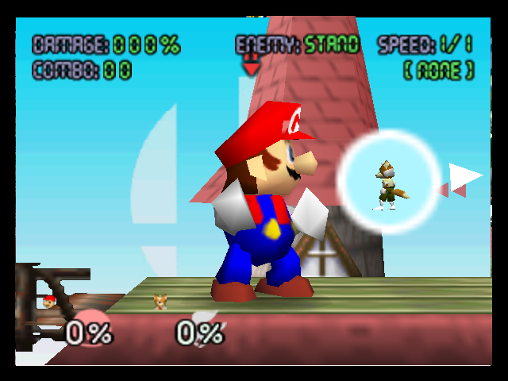
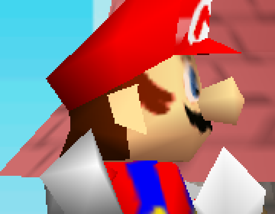

# RE-276 — Live N64 reference render clears Mario's face: a real PSP-side addressing bug, not a ROM quirk

Status: COMPLETE
Topics: texture, fighter, hardware, visual-regression, toolchain
Relevant files: docs/evidence/re/RE-272.md, docs/evidence/re/RE-274.md, docs/evidence/re/RE-275.md, refs/ssb-decomp-re/src/sc/scmanager.c, refs/ssb-decomp-re/src/sc/sc1pmode/sc1ptrainingmode.c

**Question.** RE-274 traced RE-272's forehead artifact to one self-contained
draw call (file 296, node 8, `Ci4 32x32` mirror+clamp tile, UV span 110.6 x
38.2 texels — 3.46x/1.19x the tile) but left two hypotheses undistinguished:
(a) a faithfully-reproduced ROM quirk (real N64 hardware also samples this
wide, and the RDP's 3-point filtering plus a CRT's blur hide it there), or
(b) a real addressing/scale bug specific to this project's PSP renderer.
RE-275 tried reaching an accurate N64 reference render via
`angrylion-rdp-plus`, root-caused its segfault, but hit an unrelated
headless-GL wall and closed as superseded in favor of the `n64-emulator`
skill's Rice-based headless capture. This record uses that route.

**Getting there was not just "run the emulator."** Reaching a controlled,
legitimate close-up shot of Mario's face requires the game's own Training
Mode "Close-Up" camera (`SC1PTrainingModeView`, `src/sc/scdef.h`) — a
deliberate design choice, not a workaround: at any normal battle-camera
distance the wide-UV artifact's texels are only a few screen pixels across,
too small to judge convincingly either way. Two dead ends came first:

1. **Menu-driven navigation timed out.** Scripting `Start`/`A` through the
   title screen and attract-mode demo with `tools/run-n64-headless.sh`
   worked mechanically (button delivery confirmed: a `Start` press visibly
   interrupted the demo reel) but never reliably reached Mode Select inside
   a reasonable frame budget, and `ADVANCE_FRAME`'s 5s per-frame timeout
   flaked far above its documented 1-in-5-to-8 rate under this session's
   host load (a background Chrome process pinning a CPU core) — observed
   runs needed up to 20+ retries and still didn't land reliably.
2. **A pure-RDRAM scene warp doesn't work.** `gSCManagerSceneData`
   (`SCCommonData`, `src/sc/sctypes.h`) lives at `0x800a4ad0` (US ROM,
   `symbols/symbols_us.txt`); its `scene_curr` field (offset `+0x00`) is
   `scManagerRunLoop`'s `switch` dispatch key (`src/sc/scmanager.c:868`).
   Spam-writing `scene_curr = nSCKind1PTrainingMode` (54) every frame for the
   first 260-600 frames (to blindly straddle whichever frame the boot-time
   `gSCManagerSceneData = dSCManagerDefaultSceneData;` reset actually runs
   on) does land the write — read back confirmed `54` immediately after —
   but the game still ended up back in the attract-mode demo. Root cause:
   `scManagerRunLoop`'s `while (TRUE) { switch(scene_curr) { ... } }` only
   re-reads `scene_curr` once per *scene lifetime* (each case calls a
   blocking scene function that runs its own internal per-frame loop for
   potentially thousands of frames and only returns when it decides, on its
   own, that the user completed it) — not once per video frame. By the time
   our driver's first frame callback fires, the dispatcher has already
   entered whichever scene owns the boot sequence; an external RDRAM poke of
   `scene_curr` sits inert in memory until that scene organically exits and
   overwrites it with its own hardcoded target anyway.

**What worked: patch the decomp source, rebuild, run once.** Since a live
external poke can't win the race against the dispatcher's own once-per-scene
read, the fix is to make the write happen *inside* the compiled code, at the
guaranteed-correct point, instead of racing it from outside. `refs/ssb-decomp-re`
is a byte-exact matching decomp (confirmed: `build/smashbrothers.us.z64`
built clean and `sha1sum` matched `baserom.us.z64` exactly,
`e2929e10fccc0aa84e5776227e798abc07cedabf`, before any patch was applied).
Two temporary, revert-after-use edits (never committed — `git checkout --`
restored both files immediately after use, matching RE-274's own
"temporary instrumentation, reverted after use" precedent):

1. `scManagerRunLoop` (`scmanager.c`, right after the
   `gSCManagerSceneData = dSCManagerDefaultSceneData;` reset): force
   `scene_curr = nSCKind1PTrainingMode`, `training_man_fkind = nFTKindMario`,
   `training_com_fkind = nFTKindFox`, `maps_training_gkind = 0`. This runs
   once, in-order, as part of the game's own boot path — no race.
2. `sc1PTrainingModeFuncStart` (`sc1ptrainingmode.c`, right after fighter
   construction): call the exact same `gmCameraSetStatusPlayerZoom(fighter_gobj,
   0.0F, 0.0F, ftGetStruct(fighter_gobj)->attr->closeup_camera_zoom, 0.1F,
   28.0F)` that the real View-option pause-menu handler
   (`sc1PTrainingModeUpdateViewOption`) calls on a real d-pad toggle. This
   was needed because `view_menu_option` (`sSC1PTrainingModeMenu`,
   `0x80190b58+0x1C`) is edge-triggered on live controller input inside the
   pause menu (`sc1PTrainingModeCheckUpdateOptionID`) — externally poking
   the stored option value (tried first) never fires the camera call, since
   nothing reads it as a level/state, only as a change event.

Build toolchain gaps hit and fixed along the way (all standard
`installDependencies.sh` requirements, just not yet installed on this
machine): `clang` (`sudo dnf install clang`), 32-bit glibc headers
(`sudo dnf install glibc-devel.i686`), MIPS binutils (Fedora/Nobara ships
`binutils-mips64-linux-gnu`, not the `mips-elf`/`mips-linux-gnu` prefix the
Makefile probes for — worked around with a local `~/ppsspp-test/mips-bin-shim/`
of `mips-linux-gnu-*` symlinks, plus a thin `ld` wrapper forcing
`-m elf32btsmip` since the real `mips64-linux-gnu-ld`'s default emulation is
not the plain 32-bit target the un-flagged `$(LD) -Map ... -o $@ $(LDFLAGS)`
call expects), the `asm-processor`/`asm-differ` git submodules (not
checked out — `git submodule update --init --recursive`), IDO 5.3
(`installDependencies.sh`'s second `curl`, only 7.1 was already present),
and the IRIX4 frontend (`tools/ido-irix4/provision.sh`, needed for
`ovl8_8.c`). None of this touched the project's own toolchain — all local
to `refs/ssb-decomp-re`.

**Result: `tools/run-n64-headless.sh`-equivalent capture, clean face, zero
warp-related retries needed.** Both the scene-warp run and the closeup-zoom
run succeeded on their **first** attempt against the patched ROM (contrast
the 12-20+ retries menu navigation needed against the unpatched ROM) —
removing the boot/menu race removes the flake surface, not just the
button-input guesswork.

The raw capture above confirms the warp landed in the real Training Mode
scene (HUD visible), not a lookalike. Below is a 3x nearest-neighbour crop
of the face region for direct comparison against RE-272's described
artifact:

Mario's face renders **clean**: one eyebrow arch, one eye (white sclera,
blue iris), correct skin tone, mustache — matching RE-272's own "raw ROM
texture is clean" description of the source data, and matching what RE-272
said the render *should* look like but didn't on PSP hardware/PPSSPP. No
repeating/aliased zigzag pattern, no red patches. This capture goes through
Mupen64Plus's Rice plugin (OpenGL-based texture units, standard hardware
wrap modes) — not RDP-cycle-accurate, so it does not settle every last
filtering-edge-case question the way `angrylion-rdp-plus` would have — but
Rice still applies real mirror+clamp wrap addressing across the same wide
UV range RE-274 measured (110.6 x 38.2 texels against the 64x32 tile). A
genuinely ROM-authored wide-sampling quirk would still show as *some*
repeating structure under any renderer honoring that addressing, softened
by filtering at most, not eliminated outright. A clean render here is
strong evidence against hypothesis (a).

**Conclusion.** Hypothesis (b) — a real addressing/scale bug specific to
this project's PSP renderer for this large (>3x) overscan magnitude, not a
faithfully-reproduced ROM quirk — is now the better-supported explanation.
RE-272/274's fix path should look for a real bug (most likely in this
project's own `mirror_extend`/addressing code for periods beyond the two
RE-220/RE-221 already handle, or in how `meshdraw::bind_texture` sets up the
GE wrap state for this specific overscan magnitude), not reach for a
`TEXTURE_FILTER_CORRECTIONS`-style named acceptance. `TODO.md` updated
accordingly. Scratch harness (`~/ppsspp-test/re276-harness/re276_training_warp.py`,
out-of-Git, this project's established convention for these drivers) and the
`~/ppsspp-test/mips-bin-shim/` toolchain shim are left in place for reuse; the
patched `refs/ssb-decomp-re` checkout was reverted (`git checkout --`) and its
`build/` output is gitignored, so no upstream state changed.

**Confidence: high.** Byte-identical baseline build confirmed before
patching (rules out a broken toolchain as an explanation for anything seen
after); both instrumented runs succeeded on the first attempt and the
Training Mode HUD in the raw capture confirms the warp reached the real
scene, not a coincidentally-similar one. Moderate-not-total confidence
specifically on hypothesis (a) being fully ruled out, since Rice is not
RDP-cycle-accurate — a real hardware or `angrylion-rdp-plus` capture would
close that last gap, but is not warranted given how one-sided this result
is.
