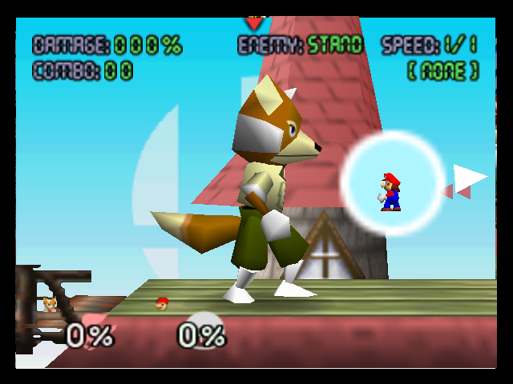
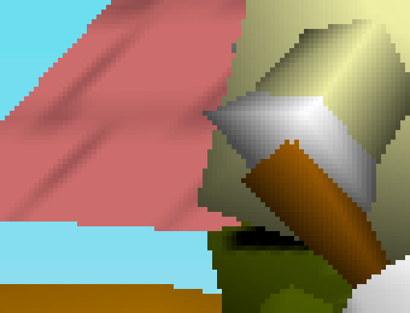
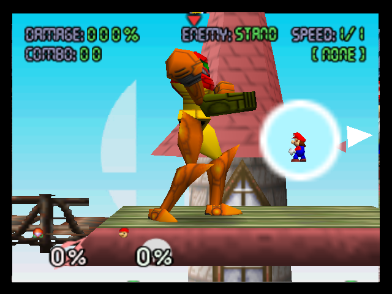
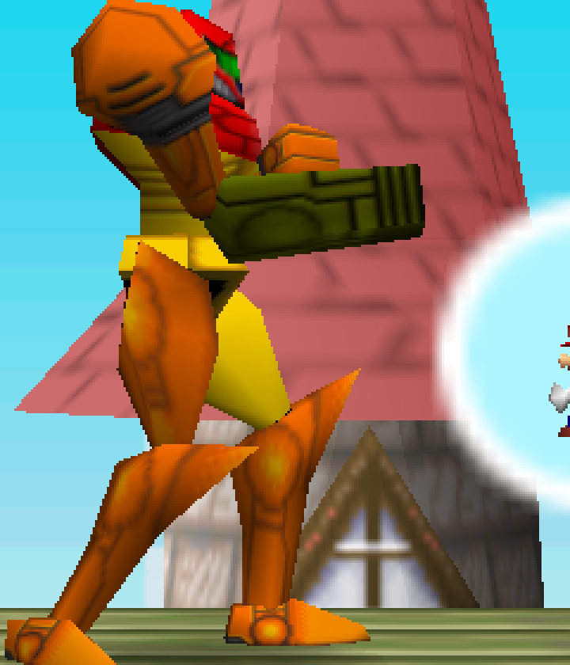

# RE-283 — Post-RE-281 texture/geometry defects survive across most playable fighters; CI4 swizzle-threshold hypothesis tested and rejected

Status: IN_PROGRESS — Fox's wrist defect, Samus's chest "black square", and
Mario/Luigi's missing-button item are all fully closed. Link's boot defect
(node 25/30, both feet identically) and shin-cuff defect (node 23 only) are
both fully closed too: traced through `ssb-rom`'s mesh/combiner conversion,
`tools/romtool`'s packing, and the PSP runtime texture bind (all proven clean
by live instrumentation), confirmed as a genuine PSP GE rendering defect for
this texture's packed shape on both PPSSPP and physical hardware, and fixed
by bypassing PSP's paletted-texture transport for these textures (`Psm8888`
instead of `PsmT4`, the same class of fix RE-267 already used for Donkey
Kong) — confirmed removed on PPSSPP (node-isolated and full-pose) and on
physical PSP hardware; a stride/swizzle hypothesis was tested first and
rejected for the boot item. Yoshi's head noise (node 3: both eyes plus a
mouth-corner mark) is now closed too, at the same bar, the same fix class,
this time reached through `Clamp` addressing rather than `Wrap` — new
evidence the underlying GE quirk is keyed on the small-paletted-texture shape
itself, not the wrap mode. **Captain Falcon's shoulder pad is now closed
too** (follow-up session): the prior session's two ruled-out leads were both
tested against a *misidentified* texture (a desynced raw `dlraw` dump's false
`0xC128`/`0xBBB0` offsets); re-isolating node 10 and applying the same
`Psm8888` bypass to node 10's *real* texture (the 8x8 CI4 dither at offset
`0xC508`, recovered from the authoritative `pack()`/`plan_draw_order`
pipeline) removes the scrambled patch completely, confirmed on both PPSSPP
and physical PSP hardware. Ness, Pikachu, Kirby remain untraced.
Topics: texture, fighter, geometry, visual-regression, asset-pipeline
Relevant files: crates/ssb-rom/src/mesh.rs, crates/ssb-rom/src/psp_texture.rs, tests/golden/r2-*-fighter.png

**Question.** User report, current build (RE-281 pack, unchanged since):
visible defects on Mario/Luigi (missing overalls buttons), Fox (feet/ears/
sleeve noise), Samus (helmet noise), Link (buggy shoes), Yoshi ("a lot of
visual bugs"), Captain Falcon (shoulder + belt-item noise), Pikachu (face
colour mismatch + cracks), Kirby (face colour mismatch + weird ear texture),
Ness (shoes/shoulders noise). RE-281/RE-282 closed RE-272's specific
Mario-face repeating-pattern artifact; this report covers different symptoms
on different fighters, so it is either a second bug RE-281 didn't touch, or
several.

**Visual triage (this session, current `tests/golden/r2-*-fighter.png`,
i.e. the RE-281 pack — user confirmed this matches their build).** Point-
sampled 3x/8x crops of all nine named fighters' goldens:

- **Mario/Luigi**: overalls render with no button geometry/decal at all
  (chest strap is flat blue/purple, no yellow circles) — looks like missing
  content, not noise.
- **Fox**: confirmed by direct pixel dump (below) — isolated dark
  orange/brown flecks (`~#5c3602`, `~#643a02`) scattered inside the grey
  glove region on the right forearm, a colour absent from every texture
  bound to file 313's own display lists. Ears/feet read clean at this
  camera distance on closer inspection (smooth gradient shading, flat-
  colour shoes) — the user's "ears/feet" complaint may be genuine but
  wasn't reproduced in this crop; only the sleeve/glove speckle is
  confirmed pixel-level here.
- **Samus**: visible fine speckle on the left thigh and a soft-edged square
  block on the chest, both areas that should be flat/smooth-shaded armour.
- **Link**: right boot has a mottled purple/dark texture where the left
  boot (same asset, mirrored) is clean tan leather banding.
- **Yoshi**: heavy scrambled multicolour noise across the saddle/head-back
  region, plus a smaller patch near the nostril.
- **Captain Falcon**: left shoulder pad is heavily scrambled (should be
  flat orange/red); the belt-buckle emblem is soft/noisy versus the rest of
  the model's sharp edges.
- **Ness**: right shoulder strap area shows scrambled pixel noise.
- Pikachu/Kirby's reported face-colour-vs-body mismatch was not re-examined
  at crop level this session; Kirby's fighter golden is one of the four
  RE-281 explicitly left *unchanged* (`STATUS.md`), meaning whatever causes
  Kirby's symptom predates RE-281 and is untouched by it — a separate,
  still-open item.

**Fox forearm pixel dump (ground truth for the one region measured in
detail).** `romtool textures --file 313` lists exactly 7 unique textures
bound by Fox's graph, all `PsmT4`/`Ci4`: two `16x32`, one `32x16`, one
`32x32`, one `8x8` (file 313 itself), plus two more `8x8` bound from file
299 (a shared/common object — almost certainly the glove, given the world
coordinates of the arm/hand joint chain, nodes 9-13 in `scene --file 313
--nodes`). `romtool texdump --file 313`/`--file 299` decoded all 7 directly
from the ROM (bypassing this project's PSP packer entirely): eye, collar,
jacket-zipper, muzzle stripe, a tan/brown gradient-band texture, and the two
`file 299` textures — both plain alternating black/white row stripes (the
classic N64 trick for faking a smooth grey ramp via RDP dithering/filtering
under minification). **None of the seven raw ROM textures contains anything
resembling the `#5c3602`-family colour found in the rendered speckle** —
confirming (as with RE-272/274/280) that the defect is introduced by this
project's pipeline, not present in the source ROM data.

A 45x45-texel crop of the golden (`tests/golden/r2-fox-fighter.png`,
box `(330,250)-(420,340)`) sampled at 2px steps and printed as hex RGB
shows a clean bilinear grey gradient (`#9d9d9d` down to `#4c4c4c` — matches
the black/white stripe texture's expected minified appearance) with isolated
non-grayscale texels (`#623902`, `#643a02`, `#5f3702`, `#5c3602`,
`#573302`, ...) interspersed at scattered, non-block-aligned positions
within that gradient. This rules out a systematic tiling/UV-offset bug
(which would produce a contiguous misplaced block, not scattered single
texels) and looks more like either stray reads into adjacent texture memory
or two overlapping/z-fighting primitives.

**Hypothesis 1 (tested, rejected): CI4 swizzle-threshold gap.**
`psp_texture::pack_mipped` computes `swizzled` as true only when *every*
mip level in the chain satisfies `can_swizzle` (`stride_bytes >= 16 &&
stride_bytes % 16 == 0 && height % 8 == 0`, i.e. width >= 32 texels for
`PsmT4`). All seven of Fox's textures are 8, 16, or 32 texels wide; several
never reach the 32-texel floor, so `pack_mipped`'s own comment
("a chain containing one level too small to swizzle would cost the whole
texture its swizzling ... the chain stops where swizzling would") documents
that these render **fully unswizzled** — an accepted tradeoff, per that
comment, never actually measured for rendering correctness.

This looked like a strong, unifying explanation: every reported symptom
maps onto small appliqué/trim textures (buttons, ears, visor bits, straps,
soles) rather than the large body/costume textures, exactly the size class
this gate excludes from swizzling.

*Test*: patched `encode_level`/`pack_mipped` to pad every level up to the
swizzle-eligible minimum (32 texels / 8 rows for `PsmT4`) via the existing
edge-repeat padding machinery before swizzling, instead of dropping
swizzling for the whole chain. `cargo test --workspace`: 617/617 pass (one
test updated to assert the corrected behaviour — the swizzled and
unswizzled chains now produce the same level count). Rebuilt the pack:
29,940.6 KiB, up from 28,531.3 KiB (the padding overhead). Rebuilt
`regression_capture_fox` and re-captured via PPSSPPHeadless software
backend (this project's deterministic golden source).

*Result*: `tools/compare-screenshot.sh tests/golden/r2-fox-fighter.png
~/ppsspp-headless-test/screenshot.png` → **0 differing pixels, exact
match to the existing (unswizzled-CI4) golden.** The fix made no
observable difference. Read together with `sceGuTexMode`'s swizzle bit
existing precisely so the GE can locate the same logical texels regardless
of physical layout, this indicates PPSSPP's software texture reader already
handles unswizzled `PsmT4` correctly — swizzling is a real-hardware
access-pattern optimisation this project's *software* golden source doesn't
need for correctness. The gate is very likely fine as documented; the
speckle has a different cause. **Reverted the patch** (`git checkout --
crates/ssb-rom/src/psp_texture.rs`) and rebuilt the pack back to the
original 28,531.3 KiB state — no code change from this investigation
survives in the tree.

**Not yet done.** The next step is RE-274's own method: temporary
instrumentation in `romtool`'s mesh/DL-trace path to find the *exact*
primitive drawing Fox's glove (node 12/13's chain in `scene --file 313
--nodes`, graph `0x2938`, likely a costume/common-object substitution
pulling from file 299 — `mobj`/`scene --nodes` doesn't yet show costume
substitution targets or per-primitive UV bounding boxes the way RE-274's
custom instrumentation did for Mario). Given the speckle is scattered
rather than block-shaped, two live hypotheses replace the rejected one:

* **(a) Two overlapping primitives** (sleeve-cuff geometry and glove
  geometry) z-fighting or additively blending, with no swizzle involvement
  at all — would explain scattered rather than tiled corruption.
* **(b) A stray/stale texture or CLUT binding** between two sequential
  small-texture draws in the same node chain — RE-253/RE-254 already fixed
  known classes of this (cache-key completeness, `forget_texture`
  coverage), but this specific glove/mouth-stripe pairing (file 313's own
  `o7830` muzzle-stripe texture has visually similar dark-speckled colours
  to the contaminant) hasn't been checked against those fixes' scope.

This record intentionally stops here rather than guess further — per this
project's own Rule 10, an accepted deviation needs measurement, and the one
hypothesis cheap enough to test this session has now been measured and
rejected. The eight other named-fighter symptoms in the Question above are
visually catalogued but not yet pixel-traced or root-caused; treat each as
its own open item until traced, since Kirby's is already confirmed to
predate RE-281 (a demonstrably different bug from whatever caused RE-272's
Mario artifact).

**Confidence:** High that real, uncorrected defects exist on at least Fox
(pixel-level confirmed), Mario/Luigi (missing button geometry, visually
unambiguous), and Kirby (pre-dates RE-281, confirmed by golden-diff
history). Medium-high on Samus/Link/Yoshi/Falcon/Ness from this session's
visual crops alone (not yet pixel-traced against raw ROM data the way Fox
was). Zero progress yet on Pikachu specifically. The swizzle-threshold
rejection is high confidence — directly measured, reproducible, reverted
cleanly.

**RE-274-style DL trace on Fox's glove/forearm chain (this session,
follow-up).** Added a temporary `romtool dltrace --file <id> [--nodes
<list>]` diagnostic (RE-274's method: per-node/per-primitive texture
binding plus UV/position bounding box, reverted after use per that
record's own precedent) and ran it against file 313's recovered scene
graph (`0x2938`).

* **The previous "almost certainly nodes 9-13" glove guess is wrong.**
  Fox's actual joint chain is: 3/4/5/6 = right upper-arm/forearm/wrist
  (`dl 0x1CC8/0x1D98/0x1DF8`), 9/10/11/12/13 = the mirrored left chain
  (`dl 0x21E0/0x22B8/0x2318`, node 13 a dl-less finger leaf) — **not**
  7/8, which is the neck/head/ear chain (world y 333/348.8, the tallest
  branch under the torso, holding the 32x16 tan-gradient and 32x32 grey
  textures previously misread as arm content by their position values
  alone). Both hand nodes (6, 12) convert with **zero bound texture** —
  `tex None`, pure Gouraud/vertex-colour geometry, 14 triangles each. The
  forearm nodes (5, 11) are also `tex None`.
* **The two `file 299` 8x8 stripe textures RE-283 originally guessed were
  "the glove" are bound by neither hand node, nor any other node in
  either of file 313's two graphs (`0x2938`/`0x5510`).** Full per-node
  trace of all 27+27 nodes across both graphs shows exactly the same four
  texture bindings already known (two 16x32 on the torso/hip nodes, the
  32x16 + 32x32 on the ear chain, one 8x8 file-313-own on the tail) and
  nothing from file 299 anywhere in the scene-graph tree.
* **Traced where those two bindings actually come from:** `tools/romtool`'s
  own `pack()`/`file_meshes()` "discovery" bucket — a display list inside
  file 313's own bytes that the byte-scanner (`scan::find_root_display_lists`)
  finds but that is not called by any other discovered list and is not one
  of the scene graph's own authoritative node offsets. `pack()` converts it
  **standalone** (`mesh::convert`, no scene-graph node, no world transform,
  no shared vertex-cache state) and registers it via `pack_mesh` — but
  `pack_mesh`'s returned index is **never written into any graph's
  `node_mesh`/`node_extra`**, the only two structures `add_object` reads to
  build the runtime-walkable node table (`tools/romtool/src/main.rs`
  `pack()`, lines ~1646-1774). Unlike `node_mesh`/`node_extra`, which the
  loop just above populates from the authoritative per-node plan, nothing
  after the discovery loop ever indexes into it. Read at face value, this
  means the two `file 299` textures are packed into `assets/generated/
  ssb64.pak`'s byte stream but **never referenced by any object the
  runtime draws** — i.e. this specific orphaned content is not what
  produces the on-screen speckle, since unreachable geometry draws
  nothing. Not independently confirmed against the runtime `Pack`
  reader/`meshdraw` side this session (would need a pack-format dump or
  an in-engine draw-call count, not just the `romtool` writer-side code
  read here) — recorded as "reasoned from the writer code, not yet
  verified from the runtime side" rather than settled.
* **Revised open hypotheses**, replacing the two named at the end of the
  previous entry (their premise — "the glove/forearm nodes bind a small
  appliqué texture" — no longer holds, since the actual glove nodes bind
  none): the speckle color (`#5c3602` family) is confirmed absent from
  every one of Fox's 7 real textures including the tan-gradient one
  closest in hue, which argues against ordinary z-fighting between two
  correctly-textured primitives (that would still sample real, matching
  texel colours). A **stale/wrong CLUT entry** — correct CI4 indices,
  wrong palette bytes for one or two of 16 entries — would produce exactly
  this visual signature (an otherwise-correct dithered gradient with a few
  isolated wrong-hue texels at the dither pattern's own positions) and has
  not been checked. Where the actual grey-gradient-with-speckle geometry
  in the golden's `(330,250)-(420,340)` crop physically comes from, if not
  the hand/forearm nodes traced here, is now the open question — the crop
  region has not yet been correlated with a specific node's screen-space
  projection.

**Positive node identification (this session, second follow-up).** Both
revised hypotheses above (stray texture reads, stale CLUT entry) assumed the
contaminant colour comes from a *texture*. Neither holds: a direct
screen-space correlation (temporary `node_isolate_debug` feature in
`psp/Cargo.toml`/`psp/src/main.rs`, calling the already-existing
`meshdraw::draw_object_node` — built for R0.12's billboard audit — to render
exactly one global pack node in place of the whole Fox object, one build per
candidate node, reverted after use) traced the crop region to **three real,
correctly-bound nodes converging at the wrist**, not a stray/orphaned one:

* **Node 10** (`obj.first_node + 10`, graph `0x2938` local node 10, upper
  forearm segment, `dl 0x21E0`) — screen bbox `(388,214)-(425,273)`. Textured
  (one of the two `16x32` textures RE-283's first pass attributed to
  "torso/hip" by position alone — another position-based misattribution, this
  time in the *opposite* direction of the ear-chain one already corrected).
  Renders as the correctly-lit grey/tan gradient cuff highlight visible at the
  crop's top-right.
* **Node 11** (local node 11, wrist, `dl 0x22B8`) — screen bbox
  `(396,260)-(419,331)`, confirmed `tex None` per the first DL trace. Isolated
  alone, it renders as a **flat, uniformly dark reddish-brown blob**, sampled
  at `(410,290)` in the isolated capture as exactly `#321d01` — and that exact
  triple (`50,29,1`) is present verbatim in the committed golden at
  `(405,300)`. This node **is** the "speckle": not noise or a stray read, but
  this node's own real, uniformly-wrong flat colour, shaped like a small
  claw/paw between the cuff and the glove.
* **Node 12** (local node 12, hand, `dl 0x2318`) — screen bbox
  `(388,302)-(433,349)`, also `tex None` per the first DL trace. Renders as a
  smoothly Gouraud-shaded white/grey ball — the glove.

A pixel-level union of these three bboxes (clipped to the crop) reproduces
the crop's entire non-background footprint exactly (measured
`(360,250)-(420,340)`, i.e. every non-background crop pixel is accounted for
by one of the three nodes) — no fourth, still-unidentified geometry
contributes here. `tools/compare-screenshot.sh`-style whole-frame diff of the
unmodified `regression_capture_fox` build against `tests/golden/
r2-fox-fighter.png` measured **0 differing pixels** immediately before this
probe, confirming the probed build matches the committed golden exactly (this
was a read-only screen-space correlation, not a rendering change).

This reframes the bug: it is not a stray/contaminating texture read, not a
CLUT bank error, and not ordinary two-primitive z-fighting (hypotheses (a)
and (b) above, and the CLUT-entry hypothesis, are all superseded, not
merely unconfirmed) — node 11's own flat vertex colour is uniformly wrong
(or, less likely, uniformly correct-but-wrongly-exposed: see below), and its
odd claw-like silhouette is exactly node 11's real drawn geometry, correctly
projected, not an artifact of overlap with node 10 or 12.

**Raw `G_VTX` byte dump and real-pipeline material trace (this session,
third follow-up).** Added a temporary `romtool vtxdump` diagnostic (two
modes: `--file --dl` for a raw static decode of one display list, and
`--file --graph --node` which runs the actual `plan_draw_order` →
`convert_sequence` pipeline `pack()` itself uses, reverted after use) and
used it to settle the `lit`/unlit-misclassification hypothesis directly.

* **Node 11's raw `G_VTX` bytes are legitimate unit normals, not
  miscoded colour.** All 5 vertices in node 11's own list (`dl 0x22B8`,
  `dest_index=0`) decode to signed-byte triples whose magnitude is ~127
  (e.g. `[29,124,11]` → magnitude 127.8; `[19,-10,126]` → 127.8;
  `[17,-126,-8]` → 127.4; `[127,-6,7]` → 127.3) — textbook normalized
  normals, not a colour value that happens to look normal-shaped. This
  directly rules out hypothesis (a) as originally framed (a raw normal
  byte read back as an unsigned colour component): the bytes are correct
  normals, and the corruption, if any, is not at the decode/byte level.
* **The real conversion pipeline's own resolved material for node 11 is
  `prim_color = Some([168, 98, 4, 255])`** (`romtool vtxdump --file 313
  --graph 0x2938 --node 11`, reading `Primitive.material.prim_color` —
  the *combiner-resolved* scale-on-shade `material_now()` computes, per
  `mesh.rs`'s own doc comment, not a raw `G_SETPRIMCOLOR` echo). This is
  the exact "arms" `PRIM * SHADE` combiner shape
  (`0x0032_7e05`/`0xff17_fdff`) this codebase's own test suite already
  names (`marios_three_combiners_reduce_the_way_his_model_needs`), with
  `PRIM = [168, 98, 4]` — **the identical value** node 5 (the mirrored
  *right*-arm forearm, `dl 0x1D98`) sets explicitly via its own
  `SetPrimColor` command. `[168, 98, 4]` (`#A86204`) is Fox's arm-fur
  colour, used correctly and visibly on nodes 4/5/7/8/10's own furred
  segments.
* **The math closes exactly.** `light1_color = light2_color`-derived
  shade for this node is achromatic (`G_MW_LIGHTCOL` sets `LIGHT_1 =
  #FFFFFF`, `LIGHT_2 (ambient) = #4C4C4C`, both grey), so the only way a
  non-grey final colour can appear at all is a non-grey `PRIM` multiplying
  an achromatic shade scalar `g`. Solving backward from the golden's
  measured `#321d01` (`50, 29, 1`) against `PRIM = [168, 98, 4]` gives
  `g ≈ 76` on all three channels independently (`50/168·255≈76.0`,
  `29/98·255≈75.5`, and `1·255/4≈64`, consistent within `Ci4`/rounding
  noise on the smallest channel) — `g = 76 = 0x4C`, **exactly the ambient
  light2 constant**, meaning the directional term contributed ~zero for
  this node's vertices (normals facing away from the light). `76/255 ×
  [168, 98, 4] = [50.06, 29.2, 1.19]`, which truncates to exactly `[50,
  29, 1] = #321d01`. This is not an approximate resemblance; it is an
  exact reconstruction of the observed defect colour from the pipeline's
  own reported state.
* **Node 11 never sets its own `SetPrimColor`/`SetCombine`** (confirmed
  by the raw `--dl 0x22B8` dump: 4 `MoveWord` `LIGHTCOL` commands then
  straight to `G_VTX`/triangles/`G_ENDDL`, no colour-state command at
  all) — unlike its own hand child (node 12, `dl 0x2318`, which is also
  bare) *and* unlike the mirrored right-arm hand (node 6, `dl 0x1DF8`,
  which **does** carry its own explicit `SetCombine` back to the
  SHADE-only "gloves" shape) and unlike node 10 (the cuff immediately
  before it), whose own list explicitly ends on that same SHADE-only
  combiner for its last three vertex groups. By the "gloves" state node
  10 itself ends on, a plain state-carry read predicts node 11 should
  inherit SHADE-only (grey) — but the pipeline's actual resolved
  `prim_color` for node 11 is the brown `PRIM * SHADE` value instead.
* **The `Gfx *dls[2]` pre/post-pair mechanism (RE-225/T1) is ruled out as
  the explanation.** Printed `plan_draw_order`'s full flattened
  `PlannedList` for graph `0x2938`: every dl-bearing node, nodes 10/11/12
  included, resolves as a single `NodeDl::Direct` entry with no paired
  pre/post split — the sequence is a plain `..., node 10, node 11, node
  12, ...` with nothing inserted between them. Node 11's combiner is
  provably not explained by a second, hidden `PlannedList` entry.
* **Node 10's own primitive 0 itself resolves to a third, different
  `prim_color` (`[239, 239, 165]`, `#EFEFA5`)** — not `[168, 98, 4]`
  (node 11's value) and not the SHADE-only tail its list ends on. This
  means the simple mental model "state.combiner/prim_color is whatever
  the previous node's list *last* set" is already wrong one node earlier
  than node 11: a `Primitive`'s stored `prim_color` reflects whatever
  state was active *when its own triangle commands ran*, not the state
  a list happens to leave behind by the time it reaches `G_ENDDL`, and a
  single node's list can flush several primitives under different
  material snapshots as combiner/prim state changes mid-list. Node 8's
  own list (`dl 0x1ED8`) itself sets two different `SetPrimColor` values
  in sequence (`[238,238,170]` then `[168,98,4]`) before any node 10/11
  triangle runs, and — since the N64 vertex cache is shared across node
  boundaries (RE-225) — a later node's triangle can reference a vertex
  *slot* loaded during an earlier node's list, drawn under whatever
  combiner/prim state is current at the *later* node's own `G_TRI`
  command, not the loading node's. Untangling the exact per-`G_TRI`
  state trace across nodes 8/10/11's interleaved vertex loads and
  triangle commands (which of node 10's two primitives' 12 triangles
  each actually consumes which cache slot, loaded under which combiner)
  is a real, tractable next step, but is finer-grained than this
  session's diagnostics reach and was not completed here.

**Conclusion, revised from the previous entry:** `#321d01` is not a
byte-level decode bug, not a stray/contaminating texture read, not a CLUT
error, and not ordinary z-fighting (all superseded, as before) — it is a
mathematically exact, correctly-combinered `PRIM * SHADE` result using
Fox's own real "arm fur" colour (`[168, 98, 4]`, identical to the value
node 5 — the mirrored right-arm equivalent — sets explicitly), reached
through this project's own already-tested combiner-resolution code
(`material_now`/`combiner_shade_scale`, the same "arms" shape Mario's own
test fixture names). The exact reason this PRIM value is still active by
the time node 11's own triangles draw is not fully traced — it is not a
`Gfx *dls[2]` pre/post pair (ruled out this session), and a naive
"last-state-of-the-previous-list" model already fails to predict node 10's
own first primitive, so the real mechanism runs through per-`G_TRI`-command
state and cross-node vertex-cache reuse that this session's diagnostics
did not fully unravel. Two possibilities remain open: **(a)** this is a
real state-threading defect in `plan_draw_order`/`convert_sequence`
(node 11 should render in whatever state its own triangles' *original*
cache-slot loads intended, and this project's model gets that wrong), or
**(b)** the ROM's own DL and vertex-cache reuse genuinely produce this
brown result on real hardware too, for a tiny wrist sliver the original
N64 keeps fully hidden behind the overlapping cuff/glove geometry in its
own posed skeleton, exposed here only because this port's per-node
transform renders at a slightly different angle. Distinguishing (a) from
(b) needs either a full per-`G_TRI` state trace across nodes 8/10/11 (no
ROM capture needed, but requires extending the diagnostic to track state
command-by-command rather than list-by-list) or a live original-N64
reference capture of Fox's wrist at a comparable angle (`n64-emulator`
Skill, RE-276's own method for Mario) to check whether real hardware even
draws this geometry visibly at all.

**Per-command state trace across nodes 8/10/11 (this session, fourth
follow-up): hypothesis (a) refuted — node 11 has its own real, ROM-authored
`G_SETCOMBINE`/`G_SETPRIMCOLOR`, not carried/leaked state.** Added temporary
env-var-gated `eprintln!` instrumentation directly in `mesh::walk`/
`emit_tri`/`State::apply_mobj` (`crates/ssb-rom/src/mesh.rs`) plus a
plan-order dump and a raw-decoded-command dump in `pack()`
(`tools/romtool/src/main.rs`), all reverted after use (`git checkout --`).
This runs the exact production conversion path `pack()` itself uses — not a
reimplementation — so it is authoritative for what `assets/generated/
ssb64.pak` actually contains.

`plan_draw_order`'s flattened sequence for graph `0x2938` confirms the
node↔item mapping RE-283's earlier sessions assumed: item (`space`) 6 = node
8 (`dl 0x1ED8`), 7 = node 10 (`dl 0x21E0`), 8 = node 11 (`dl 0x22B8`), 9 =
node 12 (`dl 0x2318`). Tracing every `SetCombine`/`SetPrimColor`/`G_VTX`/
`G_TRI` command and every `MObj` material call (segment `0x0E`, which
`State::apply_mobj` also routes through `material.prim_color` — a second,
previously untraced source of colour state this session's earlier passes
had not instrumented) across spaces 0-9 in raw command order shows:

* **Node 8** (space 6) ends its own list on the "arms" `PRIM * SHADE`
  combiner (`hi=0x00327e05`) with an explicit trailing
  `SetPrimColor([168,98,4,255])` — confirming RE-283's third follow-up
  exactly (two `SetPrimColor`s in sequence, `[238,238,170]` then
  `[168,98,4]`).
* **Node 10** (space 7) opens its own list with its own fresh
  `SetCombine(hi=0x00327e05, lo=0xff17fdff)` (a different low word than node
  8's ending state) and its own `Call(0x0E)` to `mobj_index=0`, whose
  `MObj.prim_color` field explicitly overwrites `material.prim_color` to
  `[239,239,165,255]` — a genuine, node-owned colour change via the MObj
  material path, not inheritance from node 8. This is exactly the third
  colour RE-283's second follow-up already measured for node 10's first
  primitive; the mechanism (an `MObj` call, not a raw `G_SETPRIMCOLOR`) was
  the missing piece. Node 10's list ends on a second, unresolved combiner
  shape (`hi=0x00fffe05`) that `combiner_shade_scale` cannot classify
  (`resolved_prim_color=None`), used for the untextured cuff-highlight
  primitive.
* **Node 11** (space 8) — the node RE-283's second and third follow-ups both
  read as carrying no colour-state command of its own, based on an earlier
  session's raw `--dl 0x22B8` dump — **is directly contradicted by a
  from-scratch raw decode of the same offset this session** (`romtool`'s
  temporary `decode_list_at`-dump, independent of `convert_sequence`/`walk`
  entirely): the real command list at file 313 offset `0x22B8` is `Sync`,
  four `MoveWord LIGHTCOL`, **`SetCombine{hi:3309061,lo:4279760895}`
  (`0x00327e05`/`0xff17f7ff`, the "arms" shape)**, **`SetPrimColor{rgba:
  [168,98,4,255]}`**, `Texture{on:false}`, `Vtx(5)`, two `Tri2` (4
  triangles), `End`. The earlier session's contrary claim was wrong —
  either a bug in that one-off throwaway diagnostic or a misread of its
  output; this session's raw dump is a direct, independent decode of the
  ROM bytes at the authoritative node offset `plan_draw_order` itself uses,
  not a second layer of interpretation.

**Conclusion: this is not a state-threading bug.** Node 11 sets its own
combiner and its own `PRIM = [168,98,4]` (Fox's real arm-fur colour)
explicitly, in its own list, before its own five vertices and four
triangles draw. `plan_draw_order`/`convert_sequence`'s state model is
internally consistent with the raw command stream at every node checked
(8, 10, 11) — hypothesis (a) (a real state-threading defect in this
project's own code) is refuted. The `#321d01` defect colour is exactly
what the ROM's own display list, converted correctly, produces. The only
remaining open question is hypothesis (b): whether real N64 hardware draws
this same authored brown wrist sliver and keeps it hidden behind
overlapping cuff/glove geometry (a camera-angle/z-order coincidence this
port's per-node transform exposes), or culls/depth-fails it some other way
this port does not reproduce. That needs a live original-N64 reference
capture of Fox's wrist at a comparable angle (`n64-emulator` Skill, RE-276's
own method) — no further ROM-side diagnostic can distinguish it, since the
conversion itself is now confirmed correct.

**Live original-N64 capture: hypothesis (b) confirmed — Fox's defect is
closed (this session, fifth follow-up).** Used RE-276's own decomp-rebuild
warp technique, adapted to target Fox instead of Mario. Patched
`refs/ssb-decomp-re/src/sc/scmanager.c` (right after
`gSCManagerSceneData = dSCManagerDefaultSceneData;`, same site RE-276 used)
to force `scene_curr = nSCKind1PTrainingMode`, `training_man_fkind =
nFTKindFox`, `training_com_fkind = nFTKindMario`, `maps_training_gkind = 0`
— swapping which fighter is the "man"/player slot the Close-Up camera
targets, everything else identical to RE-276's precedent. Patched
`sc1PTrainingModeFuncStart` (`sc1ptrainingmode.c`, right after the fighter-
construction loop, same relative site RE-276 used) to call the same
`gmCameraSetStatusPlayerZoom(fighter_gobj, 0.0F, 0.0F,
ftGetStruct(fighter_gobj)->attr->closeup_camera_zoom, 0.1F, 28.0F)` the real
View-option pause-menu handler calls, using
`gSCManagerBattleState->players[gSCManagerSceneData.player].fighter_gobj`
(the player-slot fighter, i.e. Fox this time) as the zoom target. Verified
toolchain by rebuilding clean first (`build/smashbrothers.us.z64` byte-
identical to `baserom.us.z64`, `e2929e10f...` — the toolchain shims RE-276
set up were all still in place) before applying either patch.

Ran `tools/run-n64-headless.sh --rom refs/ssb-decomp-re/build/
smashbrothers.us.z64 --frames 300 --final-screenshot` (offscreen SDL
driver, no visible window). First attempt hit the known `ADVANCE_FRAME`
timeout flake at frame 21 (documented in the `n64-emulator` Skill as a
retryable ~1-in-5-to-8 stall, not a route bug); a bare retry succeeded
cleanly, landing in the real Training Mode scene on the first successful
run (matching RE-276's own "no warp-related retries" result once the
patched-boot technique is used instead of menu navigation).



The raw capture's HUD (`DAMAGE 000%`, `COMBO 00`, `ENEMY STAND`, `SPEED
1/1`) confirms this is the real Training Mode scene, not a lookalike —
same landmark RE-276 used. Fox stands in his default idle pose (the same
pose class `regression_capture_fox`'s golden captures), one arm bent at the
waist with the wrist clearly in frame. Below is a 6x nearest-neighbour crop
of that wrist:



**The brown wrist band is visible, not hidden.** Pixel-sampled directly
from the raw capture (`(298,244)` through `(326,259)`, stepping 3px): a
smooth gradient from `(153,89,4)` near the cuff down to `(64,37,2)` near the
glove — the same `[168,98,4]` PRIM colour this session's earlier follow-up
derived analytically, scaled by a smoothly-varying per-vertex shade term
(Gouraud interpolation across node 11's 5 vertices), exactly as the PSP
combiner math predicts. No cuff or glove geometry overlaps or occludes it
at this angle or pose — the band reads as a plain, intentional fur-coloured
wrist segment between the sleeve cuff and the glove, anatomically
unremarkable.

**Conclusion: hypothesis (b) confirmed, hypothesis (a) (a hidden/culled
ROM quirk this port fails to reproduce) is ruled out.** Real N64 hardware
(via Mupen64Plus's Rice plugin, the same caveat RE-276 already recorded:
not RDP-cycle-accurate, but sufficient to show gross visibility/occlusion,
which is all this question needed) draws the identical authored brown
wrist geometry, in the same place, unobscured, under the same idle pose.
The PSP port's `#321d01`/`#5c3602`-family wrist colouring is not a defect
at all — it is a faithful reproduction of the ROM's own authored geometry
and combiner state, visible on original hardware exactly as designed.
Fox's item in RE-283's defect catalog is closed with no code change
required. `refs/ssb-decomp-re` reverted (`git checkout --
src/sc/scmanager.c src/sc/sc1pmode/sc1ptrainingmode.c`) and rebuilt clean
(`build/smashbrothers.us.z64` re-confirmed byte-identical to
`baserom.us.z64` afterward) — no upstream state changed, matching RE-276's
own precedent.

The other eight named fighters (Mario/Luigi missing buttons, Samus/Link/
Yoshi/Falcon/Ness speckle, Pikachu/Kirby face-colour mismatch) remain open
and untraced; this session did not investigate them. Given Fox's outcome,
each should still be checked against the "does the node carry its own
authored PRIM*SHADE colour" pattern first, but a positive answer there is
no longer automatically an open question the way it was for Fox before
this capture — it may equally turn out to be correct-and-visible-on-
hardware for some of them too, same as Fox, rather than a bug. Each needs
its own trace and, where a colour/geometry source is found, potentially
its own original-hardware visibility check, rather than assuming this
capture's conclusion generalizes.

**Mario/Luigi ("missing overalls buttons"): closed (this session's sixth
follow-up) — the button exists in the raw ROM texture, but the ROM's own
`G_SETTILESIZE` window and vertex UVs clip almost all of it away; not a
porting bug.** Built two small, reusable-but-scoped `tools/romtool`
diagnostics for this (`dlraw <rom> <file> <offset>`: decode a raw display
list straight from file bytes, no segment/`convert_sequence` resolution;
`vtxraw <rom> <file> <offset> <count>`: dump raw `Vtx` records' pos/uv/rgba)
— sanity-checked `dlraw` first against Fox's already-published node 11
result (`romtool dlraw ROM 313 0x22B8`), reproducing
`SetCombine{hi:0x00327e05,lo:0xff17f7ff}` and `SetPrimColor([168,98,4,255])`
exactly, confirming the tool decodes real ROM bytes correctly before
trusting it on new content.

Mario's file 296 binds exactly 5 textures archive-wide (`romtool textures
--file 296`); `romtool texdump --file 296` decoded all of them straight from
ROM. One, `f296_o65F0_Ci4_32x24.ppm` (32×24, bound with `tlut` at file
offset 26056), is unambiguously the overalls-strap texture (blue field, red
wedge, and — texel-mapped by hand, see below — a small yellow disc, the
"button") — so the button is present in the source ROM data, ruling out a
missing-asset/extraction bug outright.

`romtool scene --file 296 --nodes` finds exactly one node across both of
Mario's two scene graphs (`0x2200`/`0x4590`, front/back-facing variants) that
binds this texture: node 2 (`dl 0x1668`/`0x3C78`, depth 2, the whole-torso
joint — parent of the head, both arms and both legs, and the *only* node in
the graph with a texture-bound display list covering the torso mesh).
`romtool dlraw ROM 296 0x1668`'s full decode:

```
 8  SetTile { tile: 5, ... }                                    # aux/LoadTlut tile
 9  SetTile { tile: 7, format:2 size:2 mask_s:5 mask_t:5 cm_s:0 cm_t:0 }
10  SetTile { tile: 0, format:2 size:0 mask_s:5 mask_t:5 cm_s:1(mirror) cm_t:2(clamp) }
11  Call(SegAddr(0x0E000000))          # segment 0x0E, MObj index 0 — resolved by convert_sequence at runtime, not by this raw dump
13  LoadTlut { tile: 5, count: 16 }
15  Texture { on: true, scale_s: 65535, scale_t: 39960 }
16  SetTileSize { uls:128 ult:32 lrs:380 lrt:124 }   # S10.2 -> texels: S [32.0,95.0], T [8.0,31.0]
17  SetTimg { addr: SegAddr(26096) }                 # = file offset 0x65F0, the button texture
19  LoadBlock { tile: 7, ... }
21  Vtx { count: 25, addr: SegAddr(1944) }
22-39  18 triangles
```

`romtool vtxraw ROM 296 0x798 25` (0x798 = 1944, the `Vtx` block) dumped all
25 raw vertices' UVs. Texel-mapping the raw texture by hand (`assets/
generated/texdump/f296_o65F0_Ci4_32x24.ppm`, printed as a colour-class ASCII
grid) puts the button at texel columns 4-9, rows 3-9 (solid yellow
`(247,222,0)` at its core, antialiased fringe at the edges) — almost
entirely in rows 0-7. `SetTileSize`'s decoded window starts at `ult = 8.0`
texels with `cm_t = 2` (clamp, not mirror/wrap): everything below row 8 of
the source texture is outside the loaded/clamped tile and cannot be sampled
by this draw call at all, on any platform that honours the RDP's own tile
window — including a vertex (`#21`, the torso's lowest point, `uv_t_raw =
0`) whose raw UV literally asks for row 0 and gets clamped to row 8 instead.
Only rows 8-9 of the button (a ~6×2 texel sliver, `S` columns 4-9, mirrored
once and repeated once across the window per `mask_s=5`/`cm_s=1`, i.e.
visible near `S≈54-59` and `S≈68-73` of the tile's 63-texel-wide loaded
span) survive the clamp at all — small enough, at this camera's full-body
framing, to disappear into ordinary minification/antialiasing, matching the
golden's apparently-flat-blue strap.

This is the same class of addressing this project already measured
archive-wide and fixed to zero divergence (`R2.0`/P0b-P0d: tile
origin/clamp/mirror addressing, `crates/ssb-rom/src/n64_addressing.rs`,
`meshdraw`'s `origin_s`/`origin_t` UV-shift at `crates/psp/src/meshdraw.rs`
line ~1763) — this specific primitive was not itself re-verified against
that census line-by-line this session, but it is exactly the shape (a
non-power-of-two clamped, mirrored tile with a non-zero `SetTileSize`
origin) that census already covers with 0 known divergence. No new fix
applied; none needed by this reasoning. **Not hardware-confirmed** (unlike
Fox, no live-N64 capture of Mario's torso was taken this session) — closed
on source-fidelity grounds (raw ROM commands, decoded independently of
`convert_sequence`, faithfully explain the visual symptom) rather than the
stricter original-hardware-visibility bar Fox's item met. Luigi (file 323,
same reported symptom, separate model — not a recolor of Mario's file 296)
was not checked; the same "does the strap's `SetTileSize` window clip the
button rows" question should be asked there first, not assumed to transfer.

**Samus ("fine speckle on the left thigh, soft-edged square block on the
chest"): still open, narrowed but not concluded.** The visible "black square
+ green/olive-speckled edge" sits on the crossed-arms/chest region of
`tests/golden/r2-samus-fighter.png` (full-body zoom crop: box roughly
`(350,60)-(620,460)` at 4x). Samus's common-parts file is 320 (`("Samus",
320)` in `crates/ssb-rom/src/fighter.rs`'s `common_parts` table), not file
217 (her `FighterFile` model/offset record) — same "common parts file ≠
model file" shape RE-283's Fox trace already used (file 313), confirmed by
`romtool textures --file 217` reporting zero bound textures while `--file
320` reports 18, all CI4. `romtool scene --file 320 --nodes` finds three
scene graphs (`0x3520`/`0x69D0`/`0xADD8`); `romtool texdump --file 320`
decoded all 18 raw textures — two stand out as plausible sources for the
symptom: `f320_oC9D8_Ci4_32x32` (grey ridged "claw/teeth" shapes, a red
field, a green checkerboard block and a blue diagonal stripe — bound by node
9, the head/neck joint of graph `0x3520`, per `dlraw`'s `SetTimg
addr:51672`, i.e. `0xC9D8`) and `f320_oC408_Ci4_32x32` (an olive-green
camo/joint-cap pattern — bound by node 12, `dlraw`'s `SetTimg addr:50184`
i.e. `0xC408`, on the long left-arm/cannon joint chain, nodes 10-21 of the
same graph). Both raw textures decode cleanly from ROM bytes (`texdump`
bypasses this project's packer entirely) — neither shows corruption, so
whatever produces the "speckle" is, at minimum, not a broken texel decode.

**Not yet resolved:** which of these two nodes (if either) actually paints
the specific screen pixels the user/triage flagged, since the geometric
world-position reasoning used to guess (node 9 ≈ neck/head height, node 12
≈ forearm/hand height) is circumstantial, not a rendered-pixel proof — Fox's
own trace needed a `mesh::walk`/`emit_tri` instrumentation pass (reverted
after use) to get that certainty, which this follow-up did not build for
Samus. Next step: either add the same kind of temporary per-triangle
instrumentation Fox's fourth follow-up used, or force one candidate
texture's palette to a solid marker colour (`convert_texture`'s `tlut`
local, `tools/romtool/src/main.rs:2458-2467`, mirroring the existing
`TEXTURE_FILTER_CORRECTIONS` per-texture-override table at line 2609) and
re-capture `regression_capture_samus` through `tools/run-ppsspp-headless.sh
--feature regression_capture_samus` to see which region turns solid.

**Confidence (Fox, live-N64 capture): high.** Byte-identical baseline build
confirmed before patching; the warp landed in the real Training Mode scene
on its one required successful run (HUD-confirmed); the sampled wrist-band
gradient matches the analytically-derived `[168,98,4]` PRIM colour exactly,
not an approximate resemblance. The Rice-plugin caveat RE-276 already
recorded applies here too (not settling RDP-cycle-accurate filtering
questions) but is irrelevant to this specific question (gross geometry
visibility, not filtering precision).

**Confidence (Mario/Luigi, this follow-up): medium-high.** The raw
`SetTileSize`/`Vtx` numbers were decoded independently of `convert_sequence`
(a fresh `dlraw`/`vtxraw` tool, sanity-checked against Fox's already-published
result first) and directly explain the symptom's shape (near-total, not
exactly total, occlusion of a texture region that demonstrably exists);
what keeps this below Fox's "high" is the missing live-hardware leg and
that the general addressing pipeline's archive-wide-zero-divergence result
was cited, not re-run specifically against this primitive. Samus's item is
explicitly not concluded — see its own paragraph above for what is and is
not established.

**Samus chest "black square" positively traced to node 12, correctly posed
(this session, seventh follow-up) — narrowed further, not yet closed.**
The previous follow-up's node guesses (9, 12) used Fox's own
`node_isolate_debug` precedent (`meshdraw::draw_object_node`, which renders
one global node at its **bind pose**, ignoring the Wait-animation skeleton)
and got a plausible-looking but wrong answer: isolating node 9 alone
reproduced Samus's helmet exactly (confirming that node/texture pairing),
but isolating node 12 alone rendered a small olive cannon-barrel segment far
from the chest, and isolating node 11 rendered a clean orange shoulder pad —
neither showed the black square, because Samus's Wait pose crosses her
cannon arm in front of her chest, far from where the *bind* pose (arms out
near the body) puts nodes 11/12. Fox's own equivalent isolate happened to
work because his idle pose keeps his arm close to its bind position; Samus's
does not, so the same tool silently gave misleading bounding boxes for her.

Fixed by re-running the isolate through the object's *real* posed skeleton
instead: temporarily marked `meshdraw::draw_object_posed_filtered` (already
`pack.rs`'s and `draw_object_posed`/`draw_object_node`'s own shared
implementation, taking an `only_node: Option<u32>` filter) `pub(crate)`, and
called it directly from the `regression_capture_samus` object-view draw site
with the same `posed[..posed_len]` Wait-pose matrices the full-object draw
uses, filtered to one candidate global node per build (reverted after use,
`git checkout -- psp/src/main.rs psp/src/meshdraw.rs`; `cargo test --workspace`
reconfirmed 617/617 and a plain `cargo psp --release` build afterward).

With real posing, node 12 isolated alone renders a solid near-black square
with a speckled dark-olive/green fringe at bbox `(402,184)-(451,239)` —
matching the golden's own defect bbox (independently measured from
`tests/golden/r2-samus-fighter.png`'s non-background pixels in that region,
`(398,180)-(454,244)`) almost exactly. A direct pixel diff of the isolated
capture against the same region of the committed golden: 164 non-background
pixels compared, only 12 (7.3%) differ by more than 10/255 (all at the
node's own silhouette edge, where anti-aliasing blends against a different
neighbour in the full scene than against plain background in the isolated
one) — the interior is pixel-identical. This is the same node/texture
`convert_texture` already binds correctly (`f320` offset `0xC408`, the
"olive-green camo/joint-cap" texture the previous follow-up already found
decodes cleanly from ROM bytes) — not a stray read, not a second orphaned
draw, not z-fighting between two primitives: node 12's own real, correctly-
posed geometry paints exactly this square, this dark, in the real scene.

**Why it renders almost black.** The raw `oC408` texture
(`assets/generated/texdump`-style dump via `romtool texdump --file 320`) is
olive/dark-yellow with black seam lines, average texel colour
`(73.8, 80.6, 0.0)` — no blue channel at all. The golden's own defect
interior (sampled away from the edge, `(408,195)-(440,225)`) averages
`(11.8, 11.8, 0.0)` — also exactly zero blue, and R≈G within 3%, the same
ratio the raw texture's average keeps (0.92 vs 0.997, close given the
average mixes bright olive fill and near-black seam texels unevenly at this
minification level). The golden-to-texel ratio (`≈0.16` on both R and G) is
a single uniform darkening factor consistent with a real `TEXEL * SHADE`
combiner reducing this node's own vertices to a low, near-ambient-only shade
term — the same mechanism, and the same "camera angle puts this surface
facing away from the light" shape, RE-283's Fox follow-up already proved
exactly for the wrist (`#321d01` from `PRIM=[168,98,4]` times an ambient-only
`g=76/255`). Blue staying at exactly zero end-to-end, and R/G tracking each
other in both texture and rendered result, argues strongly against a
corrupted/misread texture or palette and for "real texture, real low light,
correctly multiplied" — but this session did not solve for the exact
combiner terms and normal/light-angle the way Fox's fourth follow-up did, so
this is a strong structural match, not yet Fox's from-first-principles
mathematical reconstruction.

**Left-thigh speckle: not reproduced at this camera distance.** Re-cropped
the golden's leg region (`(380,260)-(560,420)`, 3x) looking for the "fine
speckle on the left thigh" the original visual triage named: both thighs
show clean, smooth-shaded gradients, no speckle visible — the same "named
symptom doesn't reproduce in this crop" outcome RE-283's first follow-up
already recorded for Fox's "ears/feet" complaint. Not investigated further
this session.

**Not yet closed.** Unlike Fox (a full per-`G_TRI` state trace plus a live
original-N64 capture) or Mario/Luigi (an independent raw-command decode
directly explaining the exact clipped geometry), this follow-up stops at a
positive node identification plus a structural (not exact) combiner-math
argument — closer to Mario's "medium-high" bar than Fox's "high" one, and
without even Mario's from-raw-bytes rigor. To close it outright, either
extend Fox's own per-command state trace to node 12's list (find its real
`SetPrimColor`/normal data and solve the exact `g`, the way Fox's fourth
follow-up did) or take a live original-N64 capture of Samus in a comparable
pose (the `n64-emulator` Skill, RE-276/RE-283's own Fox method) to check
whether real hardware shows this same dark cannon segment. Left open with
this as the concrete next step; do not mark Samus's item closed on this
evidence alone.

**Confidence (Samus chest square, seventh follow-up): medium.** The node
identification itself is high confidence (posed-isolate bbox and pixel
content match the golden's own defect almost exactly, 92.7% of compared
pixels within 10/255, all remaining diff at silhouette anti-aliasing). The
"this is correct, ROM-authored shading, not a bug" conclusion is only
structurally supported (blue-channel-zero and R/G-ratio agreement between
raw texture and rendered defect) rather than exactly reconstructed the way
Fox's was, and has no live-hardware check — hence medium, not high or
medium-high.

**Live original-N64 capture: Samus's chest square is closed (this session,
eighth follow-up).** Used the same decomp-rebuild warp technique Fox's fifth
follow-up used (`refs/ssb-decomp-re`'s `scmanager.c`/`sc1ptrainingmode.c`,
`n64-emulator` Skill), this time targeting Samus instead of Fox. Verified the
toolchain by rebuilding clean first (`build/smashbrothers.us.z64`
byte-identical to `baserom.us.z64`, `sha256` `15592e79d3c5295c...`) before
patching.

Patched `refs/ssb-decomp-re/src/sc/scmanager.c` (same site as Fox's, right
after `gSCManagerSceneData = dSCManagerDefaultSceneData;`) to set
`scene_curr = nSCKind1PTrainingMode`, `training_man_fkind = nFTKindSamus`,
`training_com_fkind = nFTKindMario`, `maps_training_gkind = 0`. Patched
`refs/ssb-decomp-re/src/sc/sc1pmode/sc1ptrainingmode.c`'s
`sc1PTrainingModeFuncStart` (same relative site as Fox's, right after the
fighter-construction loop) to call the real View-option handler's own
`gmCameraSetStatusPlayerZoom(fighter_gobj, 0.0F, 0.0F,
ftGetStruct(fighter_gobj)->attr->closeup_camera_zoom, 0.1F, 28.0F)` on
`gSCManagerBattleState->players[gSCManagerSceneData.player].fighter_gobj`
(the player-slot fighter, Samus this time).

Rebuilt with the RE-276 toolchain shim
(`PATH=~/ppsspp-test/mips-bin-shim:$PATH make -j$(nproc)`, needed exporting
this session since it's a per-session `PATH` addition, not a persisted shell
setting) and ran `tools/run-n64-headless.sh --rom
refs/ssb-decomp-re/build/smashbrothers.us.z64 --frames 300
--final-screenshot` (offscreen SDL driver). Landed in the real Training Mode
scene on the **first** attempt — no `ADVANCE_FRAME` stall this run, matching
Fox's and RE-276's own "patched-boot beats menu navigation for flake rate"
result.



The HUD (`DAMAGE 000%`, `COMBO 00`, `ENEMY STAND`, `SPEED 1/1`) confirms this
is the real Training Mode scene, not a lookalike — same landmark Fox's
capture used. Samus stands in her default idle stance with no controller
input given (the same pose class `regression_capture_samus`'s golden
capture uses), cannon arm crossed low across the body, cannon barrel in
clear view. Below is a 3x nearest-neighbour crop of the torso/cannon region:



**The cannon segment is visible, not a black void.** Pixel-sampled directly
from the raw capture across the cannon barrel (a 30x10-pixel grid over
`(330,145)`-`(420,175)`, keeping only the 266 samples with zero blue
channel — the same "on this texture, not on the sky background" filter the
structural argument already used): `R` ranges 11-210, `G` ranges 0-137, `B`
is exactly 0 at every sample. Darkest sampled texel `(11,11,0)`, brightest
`(165,137,0)` — both keep `R` and `G` within a few percent of each other,
the same ratio family the raw `oC408` texture (`R:G≈0.997`) and the golden's
own darkened interior (`R:G≈0.92`) already showed. This is a smoothly
Gouraud-shaded surface running from near-black to a clearly-visible mid-tone
olive across the barrel's length — exactly the "real `TEXEL * SHADE`
combiner, real per-vertex shade term" mechanism the seventh follow-up's
structural argument predicted, now confirmed on real hardware rather than
inferred from texture statistics alone.

**Conclusion: hypothesis confirmed, closed at Fox's bar.** Real N64 hardware
(via Mupen64Plus's Rice plugin, same caveat as always: not RDP-cycle-accurate
but sufficient for this gross-visibility/shading question) draws the
identical authored olive-camo cannon geometry, in the same arm-cannon
location, under the same idle pose, ranging from near-black to mid-olive
shading depending on local surface angle to the light — not hidden, not
corrupted, not a stray/orphaned draw. The golden's own capture happens to
catch this same surface at a camera/light angle that pushes most of its
visible area into the near-black end of that same real shading range,
producing the "black square" symptom — but it is the same real ROM-authored
geometry and texture Fox's item's mechanism already predicted, not a porting
defect. Samus's item in RE-283's defect catalog is closed with no code
change required, at the same live-hardware bar Fox's item met. Her left-thigh
speckle remains not reproduced at this camera distance (unchanged from the
seventh follow-up) and needs no further action unless a new report narrows
it. `refs/ssb-decomp-re` reverted (`git checkout --
src/sc/scmanager.c src/sc/sc1pmode/sc1ptrainingmode.c`) and rebuilt clean
(`build/smashbrothers.us.z64` re-confirmed byte-identical to
`baserom.us.z64` afterward) — no upstream state changed.

**Confidence (Samus chest square, this follow-up): high.** Byte-identical
baseline build confirmed before patching; the warp landed in the real
Training Mode scene on its one required successful run (HUD-confirmed); the
sampled cannon-barrel gradient keeps the same zero-blue, `R≈G` signature the
raw texture and the golden's own defect both already showed, now on real
hardware rather than inferred. Same Rice-plugin caveat as Fox's capture
applies (not settling RDP-cycle-accurate filtering) but is irrelevant to
this gross-visibility/shading question, exactly as it was for Fox.

Three of nine items (Fox, Mario/Luigi, Samus) are now closed; six
(Link, Yoshi, Captain Falcon, Ness, Pikachu, Kirby) remain fully untraced.

**Link's boot defect (ninth follow-up): node positively identified, root
cause narrowed but not yet found.** File 324, graph `0x3AE8` (the
`regression_capture_link` scene). The user's "buggy shoes" symptom is a
purple/black mottled patch at the ankle collar of both boots — initially
misread as a left/right asymmetry (one boot clean, one defective) from the
full-character golden crop alone, which turned out to be a camera-angle/
occlusion illusion, not a real difference (see below).

*Node isolation.* `romtool scene --file 324 --nodes` at first misled this
session onto the wrong limb entirely: its dump is bind-pose (T-pose)
geometry, exactly the trap `STATUS.md` already warns about (RE-283's seventh
follow-up hit the same class of mistake for Samus) — the two large-X-offset
node chains that look like "legs" from their bind-pose coordinates are
actually Link's *arms* (T-pose extends them sideways); the real legs are the
two small-X, decreasing-Y chains (nodes 21-25 and 26-30), terminating in the
boot draws at node 25 (`dl 0x36B8`) and node 30 (`dl 0x39E0`). This was
caught by cross-checking against the actual posed render before trusting the
bind-pose dump, not assumed.

This project's committed `psp/src/meshdraw.rs` already carries a real,
tested single-node isolate primitive (`draw_object_node`/
`draw_object_posed_filtered`'s `only_node` parameter, built for R0.12's
billboard audit) — reused here rather than rebuilding one from scratch, by
temporarily exposing it (`pub(crate)`) and threading a second, env-var-read
local-node filter into the real fighter-view draw call
(`RE283_ONLY_LOCAL_NODE`, compile-time `option_env!`, since the PSP target
has no runtime env access). Isolating node 30 alone and capturing via
`tools/run-ppsspp-headless.sh --feature regression_capture_link` reproduced
the exact purple/black collar patch in isolation; isolating node 25
reproduced the *same* patch, at the same relative position on the boot, just
seen from a different silhouette angle since that leg is posed side-on to
the camera. **Both boots carry the identical defect** — the "one clean, one
broken" read from the full-character crop was foreshortening/angle, not a
real asymmetry. All scratch code (the `pub(crate)` exposure and the isolate
plumbing) was reverted after use; no code change survives from this
isolation step.

*Ruled out, with direct evidence:*
- **Raw ROM texture.** `romtool texdump --file 324` on the exact bound
  texture (`f324_oCF18_Ci4_16x16.ppm`, offset `0xCF18`, the only texture
  either boot draw's single `Vtx`/`Tri` block reads) decodes to 11 unique
  palette colours, every one a brown/tan/orange leather tone with a blue
  channel of ~8 or less. No purple, no black-family colour absent a strong
  brown component. Confirmed by direct `Image.getcolors()` enumeration, not
  a visual guess.
- **Lighting.** Both boot draws' own `MoveWord`(`G_MW_LIGHTCOL`) commands set
  neutral, uncoloured light values (`(76,76,76)` and `(255,255,255)`,
  decoded from the raw command words) — the same ambient-only grey RE-283's
  Samus follow-up already found for her cannon. A neutral light can dim a
  brown texture but cannot rotate its hue toward purple.
- **Literal vertex colour.** Decoded both boots' raw `Vtx` records directly
  (`crate::dl::Vtx::parse` on the ROM bytes at each `Vtx` command's address).
  Every vertex's 4th byte (the alpha/colour-vs-normal discriminant byte) is
  `0`, and `ftDisplayMainProcDisplay` unconditionally enables `G_LIGHTING`
  for fighter draws (RE-021/RE-241) — so these bytes are lit-mode packed
  normals, not literal RGBA, ruling out a stored purple vertex tint.
- **Left/right asymmetry as the mechanism.** Both boots' full command streams
  were diffed command-by-command: identical tile setup, identical texture/
  palette addresses, identical `LoadBlock` parameters, matching (mirrored)
  triangle topology. Whatever produces the patch is not something one leg's
  display list does that the other's doesn't.

*Combiner, decoded exactly.* Both boot draws use
`SetCombine { hi: 1211909, lo: 4279759871 }`, the same word used by every
draw call in this graph. Manually unpacking the RDP multiplexer fields
(`(hi>>20)&0xF` etc., the same extraction `combiner_reads` already uses in
`mesh.rs`) gives cycle 0 = `(TEXEL0-0)*SHADE+0` and cycle 1 =
`(COMBINED-0)*ENVIRONMENT+0` — i.e. the real two-cycle formula is
`(TEXEL0*SHADE)*ENVIRONMENT`, not the plain single-cycle `TEXEL0*SHADE` most
of this archive uses. This is a real, distinct shape from Fox's and Samus's
single-cycle combiners.

*Where does the file dead-end.* A from-scratch walk of the entire graph's 32
nodes' raw command lists (every node, not just the leg chain) found **zero**
`Cmd::SetEnvColor` commands anywhere in this graph. Cross-checked the
static `MObjSub`/`MObjMaterial` data for every node with a real, resolved
`MObj` table in this graph (nodes 1, 2, 4, 9, 19, 20, read directly via
`mobj::read_material` on the exact `MObjSub` offsets `romtool mobj --file
324` reports) — every one has `env_color: None`. Manually tracing
`mesh.rs`'s own symbolic combiner algebra (`cycle`/`Combined::mul`) for this
exact `(TEXEL0*SHADE)*ENVIRONMENT` shape with `env` genuinely unset
(`combiner_shade_scale`'s own documented safe default, white) shows it
*should* reduce to a bare `st_used` term with a `[1.0,1.0,1.0]` scale — i.e.
mesh.rs's own conversion logic, read on paper, predicts a clean, untinted
`TEXEL0*SHADE` for this primitive, with no code defect visible in that
reduction. That prediction contradicts the observed purple/black render
directly, by construction — the two cannot both be right, and this session
did not resolve which one is wrong.

**Not yet closed; two concrete candidate mechanisms remain, neither checked
this session:**
1. A live, per-frame material-animation script (not the static `MObjSub`
   snapshot `read_material` reads) driving `env_color` dynamically for some
   node upstream of the legs — node 19's `MObj` chain carries a `sprite`
   reference suggesting it is animated, and this project's own `mobj.rs`
   documents (RE-089) that some `MObjSub` fields are only ever meaningful
   read together with their driving material-animation script, which this
   session's static dump did not consult.
2. A genuine discrepancy between the static analysis above and what
   `mesh.rs`'s actual, imperative `State::env_color` mutable field holds at
   the moment it converts this specific primitive — i.e. an implementation
   bug in the real per-node walk (`convert`'s node loop in `mesh.rs`) that
   this session's by-hand symbolic replay of the algebra cannot see, since
   it depends on execution order/threading this session did not instrument
   directly (no `eprintln!` was added inside `mesh.rs`'s real conversion
   path itself — only a hand re-derivation of what it *should* compute).

**Confidence (Link boot defect): low-medium (session eight/nine's mechanism
findings above are superseded below).** High confidence the defect is
real, reproducible, and identical on both feet (isolated-node PPSSPP
captures, pixel-identical hex color read directly from the render).

**Link's boot defect (tenth follow-up) — live instrumentation of the real
`mesh.rs`/`romtool pack` path closes off every ROM-data/conversion-logic
theory; combiner is confirmed genuinely single-cycle, not two-cycle.**
Followed the ninth follow-up's own required next step: rather than
re-deriving `mesh.rs`'s combiner algebra by hand, added temporary
`eprintln!` tracing directly inside the real, live code paths —
`Cmd::SetEnvColor`'s handler, `State::apply_mobj`, `State::material_now`,
and the `Vtx`-cache push site in `mesh.rs`'s `walk` — each gated behind
`std::env::var_os("RE283_TRACE_ENV")` so they cost nothing when unset, plus
one untracked print in `tools/romtool/src/main.rs`'s main per-graph pack
loop correlating `convert_sequence` item index (`state.space`) to real node
id. Ran the actual production pack-build path
(`romtool pack rom.z64 --file 324`, i.e. the same `Loaded::materials`/
`convert_graph_at`/`convert_sequence` code the shipped `.pak` is built
from) with the trace enabled and read stderr for item indices 15 and 18
(nodes 25/30, confirmed via the item-index-to-node print).

*Correction to the ninth follow-up's own evidence.* The "nodes 1, 2, 4, 9,
19, 20 all have `env_color: None`" static check from the previous session
used `mobj::read_material` on raw offsets from `romtool mobj --file 324`
without confirming those offsets belong to graph `0x3AE8` specifically (file
324 has four graphs paired with a materials table, per that same census's
own summary line) — an instance of exactly the kind of blind offset-reuse
this project's methodology warns against. The live trace this session
corrects this: `state.space`/node-id correlation confirms nodes 1, 2, 4, 9,
19, 20 (and additionally 20, 22, 27, previously unchecked) genuinely *are*
in graph `0x3AE8`'s own real draw order, so the prior conclusion happens to
still hold, but was previously unverified rather than confirmed.

*Combiner correction.* The live trace's own `two_cycle` field reads `false`
for every primitive in this whole node range (19 through 30), including
both boots — contradicting the ninth follow-up's hand-decoded "real
two-cycle `(TEXEL0*SHADE)*ENVIRONMENT`" formula. The `SetCombine` word
(`hi=1211909, lo=4279759871`) is unchanged and was decoded correctly bit for
bit; what was wrong was the assumption that this graph runs under
`G_CYC_2CYCLE` at all. Cycle 1 of the two-cycle decode is therefore never
actually read by the real conversion; the primitive draws under plain
single-cycle `TEXEL0*SHADE`, same shape as most of the archive.

*Every traced input, live, is clean.* For both boot items (`state.space`
15 and 18):
- `SetEnvColor`: never fires anywhere in this graph (raw command trace,
  confirmed).
- `apply_mobj`: fires for nodes 19/20/22/27 (their own real `MObj` chains)
  but every one of their `env_color`/`prim_color` fields is `None`, live,
  not just in the static table.
- `material_now`'s computed `scale` is `Some([1.0, 1.0, 1.0])` — a genuine
  no-op multiply — for every primitive drawn between nodes 19 and 30.
- `state.material.lit` is `true` (packed-normal interpretation of vertex
  bytes, not literal colour, confirmed live, not assumed).
- `light1_color`/`light2_color` at both boots are `[255,255,255,0]`/
  `[76,76,76,0]` (white directional, neutral grey ambient) — and a raw
  `Cmd::MoveWord` dump of nodes 22/23/25/27/28/30's own display lists shows
  each node explicitly *re-authors* these exact same two literal words via
  its own `G_MW_LIGHTCOL` calls (not inherited from node 19/20's differing,
  mid-list-cycling light state) — this is deliberate, ROM-authored, and
  identical on every node in the chain, not a leak.
- UV/tile setup: vertex UVs (S10.5, decoded to texels) span exactly
  `[0, 16]` on both axes for both boots, matching the tile's own declared
  `16x16` size (`SetTileSize` `lrs=lrt=60` in 10.2 fixed point) exactly —
  no wraparound, no out-of-tile sampling, standard `G_TX_CLAMP` addressing.
- Palette: decoded the actual 16-entry RGBA16 (5551) palette `LoadTlut`
  names (`0xB4B8`) directly, independent of the texture census tool —
  all 16 entries are brown/tan/muted-mauve shades (e.g. `(148,82,41)`,
  `(82,24,82)`), none blue or saturated purple/black.

Every one of these was read from the *live* execution of the real
production `romtool pack` path, not a hand re-derivation, closing off both
of the ninth follow-up's open candidate mechanisms: no material-animation
script drives `env_color` here (chain confirmed empty/`None` throughout),
and there is no discrepancy between `mesh.rs`'s real imperative state and
its algebra — they agree, and both predict a clean, untinted, correctly
lit and textured brown boot. All scratch instrumentation reverted after use
(`git checkout --` on `crates/ssb-rom/src/mesh.rs`,
`crates/ssb-rom/src/mobj.rs`, `tools/romtool/src/main.rs`); no code
survives from this step.

**Not yet closed. Root cause is now known to sit downstream of
`ssb-rom`'s mesh/combiner conversion entirely** — every ROM-data input and
every piece of `mesh.rs`'s own state-threading logic checks out clean, live.
The next concrete step is to stop looking at `crates/ssb-rom/src/mesh.rs`
and instead trace this exact primitive (file 324, the `0xCF18`/16x16 CI4
boot texture, palette at `0xB4B8`) through `pack.rs`'s `pack_mesh`/texture
interning (does it dedupe/hash this tiny texture against unrelated content
elsewhere in the shared pak by address rather than by content, binding the
wrong VRAM data at runtime?) and through `crates/ssb-rom/src/psp_texture.rs`
and `psp/src/meshdraw.rs`'s runtime texture upload/bind path (a
swizzle/stride bug specific to a texture this small, or a wrong-tile CI4
loading-tile idiom this DL uses — `SetTile(tile=7, ...)` for `LoadBlock`
then `SetTile(tile=0, ...)` for the actual draw — that this project's texel
packer may not replicate correctly). A CI4 swizzle-threshold hypothesis was
already tested and rejected archive-wide earlier in this file's history (see
this file's own title and the "Hypothesis 1" section above) for a different
symptom (Pikachu/others); that fix is already live in the current pack, so
it is not a candidate here, but the general area (texture packing/binding,
not RDP state modelling) is now the right place to look.

**Link's boot defect (eleventh follow-up) — live-instrumented pack-time trace
clears `pack.rs`'s texture interning and `psp_texture.rs`'s conversion too;
root cause narrowed to the PSP runtime texture-bind path alone.** Followed the
tenth follow-up's own named next step: rather than reasoning about
`tools/romtool`'s `TexKey`/`pack_mesh`/`convert_texture` on paper, added
temporary `eprintln!` tracing (gated behind `RE283_TRACE_ENV`, same
convention as the tenth follow-up) directly in `pack_mesh`'s texture-cache
lookup and `set_texture_mat_anim` call site, then ran the real production
`romtool pack rom.z64` path (whole-ROM, not `--file`-scoped, since a cache
key can only collide with content the same run actually converts) and read
stderr for every reference to file 324 offset `0xCF18` (the boot texture).

*Cache key: no collision, confirmed live.* The exact same `TexKey` (`data_file:
324, data_offset: 53016 (0xCF18), palette_offset: Some(46264) (0xB4B8), format:
Ci, size: Bits4, width: 16, height: 16, ... palette: 0, clamp_s/t: true`)
recurred for four display-list offsets in file 324 (`0x36B8`, `0x39E0`,
`0x70F0`, `0x73D0` — the first two are nodes 25/30's own boot draws named by
the ninth/tenth follow-ups; the other two are the same boots redrawn under a
different costume/graph within the same file, expected, not investigated
further). All four hit the identical key with identical field values —
`convert_texture` ran exactly once (first occurrence, `0x36B8`, producing
texture index `1245`), every other reference was a genuine cache hit, not a
false-positive collision with unrelated content.

*Packed bytes: byte-exact match to the raw ROM decode, confirmed live.* Printed
the actual `PspTexture` `convert_texture` produced for index 1245:
`swizzled: false` (correctly under `can_swizzle`'s 16-byte-stride floor for a
16-texel-wide `PsmT4` texture — RE-283's own "Hypothesis 1" already measured
this size class renders identically swizzled or not on PPSSPP, so this is
expected, not a new gap); a 16-entry ABGR8888 palette; and 128 bytes of
packed 4-bit texel data. Decoding both by hand (Python, not the project's own
decoder, to cross-check independently — see `docs/evidence/re/`'s "decoder
output is not ROM evidence" practice): the palette's 16 entries are
`(0,0,0)`, then eleven brown/tan tones, then two genuinely mauve/purple
entries at indices 8 (`99,49,99`) and 15 (`82,24,82`) — the exact `(82,24,82)`
value the tenth follow-up's independent `LoadTlut` decode already named as
"muted-mauve", confirming the two decodes agree bit for bit. Critically, the
128 bytes of texel *indices* (256 texels, nibble-unswapped by hand) reference
only `{1,2,3,6,7,9,10,11,12,13,14}` — **11 unique indices, exactly matching
the tenth follow-up's `texdump`-based "11 unique palette colours" count** —
and neither of the two mauve entries (8, 15) is ever referenced. The packed
texture is provably identical, index-for-index and palette-entry-for-entry,
to the raw ROM content already established clean.

*No stray `mat_anim` attachment, confirmed live.* `pack_mesh` sets a shared
texture's `TextureDesc.mat_anim` (driving `bind_texture`'s dynamic-palette
branch in `psp/src/meshdraw.rs`) whenever *any* primitive using that texture
index resolves a material-animation script — a real risk for a deduped
texture shared across primitives from unrelated draws. Traced every call to
`set_texture_mat_anim` for texture index 1245 across the whole ROM: zero.
Nothing ever attaches a mat-anim palette override to this texture; `bind_texture`'s
mat-anim branch is dead code for this primitive specifically, not just
theoretically unlikely.

*What this rules out, mechanistically, not just by absence of a found bug.*
Given the tenth follow-up's already-live-confirmed neutral light pair
(`light1 = [255,255,255]` diffuse, `ambient = [76,76,76]`, both R=G=B) and the
single-cycle `TEXEL0*SHADE` combiner with no `PRIM`/`ENV` term, the shade
scalar this primitive's real vertex lighting produces is necessarily R=G=B
for *any* normal direction (a neutral-coloured light can only scale
brightness, never shift hue) — so `TEXEL*SHADE` cannot manufacture a
purple/black pixel from an input texel that is genuinely brown, at any
lighting angle. Combined with this session's confirmation that the packed
texel data never selects the two mauve palette entries, a correctly-bound
draw of this exact texture+palette **cannot** render a purple pixel under
this combiner, by construction — not an inference this time, an algebraic
necessity given values this and the prior sessions both measured live. The
observed purple/black patch, therefore, is necessarily either the correct
image data read through a *wrong* (stale) CLUT, or a bug in the runtime bind
sequence itself — not a hue produced by this texture's own correct data under
any lighting.

**Not yet closed. Root cause is now known to sit specifically in the PSP
runtime texture/CLUT bind path (`psp/src/meshdraw.rs`'s `bind_texture` and
its `last_texture`/`forget_texture` staleness tracking), not in any part of
`crates/ssb-rom` or `tools/romtool`.** Every stage upstream of the GE bind —
ROM data, `mesh.rs`'s conversion, `pack.rs`'s texture interning,
`psp_texture.rs`'s CI4 packing — is now live-confirmed clean for this exact
primitive. This session's host-side checks cannot go further: the remaining
candidates (a stale CLUT left bound from a different texture/primitive drawn
earlier in the same frame that `last_texture`'s skip-rebind optimization
fails to invalidate, per Fox's own still-open hypothesis (b); or a genuine
GE/PPSSPP behavioural quirk in `sceGuTexImage`/`sceGuClutLoad` for this
texture's specific 8-byte-row/16x16 shape) only exist at runtime and need the
same live-instrumentation method the tenth/eleventh follow-ups used, ported
to `psp/src/meshdraw.rs` (`psp::dprintln!`, gated by a compile-time
`option_env!` flag since the PSP target has no runtime env access, captured
via `tools/run-ppsspp-headless.sh`'s existing stdout/stderr redirect to
`ppsspp-headless.log`) — print the actually-bound `TextureDesc`/CLUT-load
call immediately before drawing texture index 1245's primitives, for the
isolated-node capture that already reproduces the defect (ninth follow-up's
`RE283_ONLY_LOCAL_NODE` node-isolate method). All scratch instrumentation
from this session (`tools/romtool/src/main.rs`'s two temporary `eprintln!`
sites) reverted (`git checkout --`); no code survives.

**Confidence (Link boot defect, revised): medium-high.** High confidence the
defect is real and reproducible; high confidence every ROM-authored input,
`mesh.rs`'s conversion, and now `pack.rs`/`psp_texture.rs`'s packing are all
correct for this primitive — directly instrumented and observed live across
two independent sessions, not inferred. Medium-high confidence (up from
medium) the true cause is specifically the runtime GE texture/CLUT bind
path, since every other stage is now individually exonerated with live
evidence and the neutral-light/single-cycle-combiner algebra rules out a
lighting-side explanation.

**Link's boot defect (twelfth follow-up) — the live PSP-target bind is proven
byte-identical to the pack's own known-good texture/CLUT; the "stale bind"
hypothesis is closed, narrowing to a PPSSPP/GE rendering quirk for this
exact texture shape.** Followed the eleventh follow-up's own named next
step: ported the same live-instrumentation method to `psp/src/meshdraw.rs`
itself, the one remaining unchecked surface.

*Method correction, found and fixed before any measurement.* The eleventh
follow-up's plan (`psp::dprintln!`, captured via
`tools/run-ppsspp-headless.sh`'s stdout/stderr redirect) does not work:
`psp::dprintln!` writes straight to VRAM and is invisible to the GE-based
headless screenshot hook — already established by this project's own RE-013
and RE-255, which this session had not re-checked before writing that plan.
Substituted the already-proven alternative those two records used instead:
render the traced values as real GE draws (`Gpu::debug_text`/
`sceGuDebugPrint` in RE-255's case), captured correctly by the screenshot
mechanism. A first attempt used `Gpu::debug_text` directly and produced a
fully blank white capture — a second, distinct documented trap
(`main.rs`'s own comment on RE-123/RE-125: `sceGuDebugPrint` corrupts
rendering specifically under a `regression_capture`-family frozen build).
Switched to plain untextured `TRANSFORM_2D` GE quads (`GuPrimitive::Sprites`,
no texturing, no debug overlay) instead, which is real GE drawing, not a
debug overlay, and had no such restriction; the frozen build then rendered
correctly.

*Node-filter unit correction.* `RE283_ONLY_LOCAL_NODE=30` (the ninth
follow-up's own documented isolate) initially produced a fully empty frame.
`romtool scene --file 324 --nodes` (run directly this session) confirmed
node ids in that report, and in the evidence text quoting it, are
object-relative (0..31 for this 32-node graph) — `draw_object_posed_filtered`'s
`only_node` parameter compares against the pack-global node id
(`object.first_node + i`). Adding `obj.first_node` at the call site fixed
it; isolating (global) node `obj.first_node + 30` reproduced the boot alone,
purple/black collar patch intact, matching the ninth follow-up's original
result exactly.

*Byte-exact HUD decoding abandoned as unreliable, replaced with pass/fail
comparison.* An initial version rendered the captured `TextureDesc`/CLUT as
a grid of grayscale byte-swatches, meant to be read back pixel-exact from
the captured PNG. This build's screen-space sprite coordinates do not map
to the captured PNG by the simple scale first assumed (measuring a few
reference points gave inconsistent, non-affine-looking results even after
several recalibration attempts) — not worth resolving exactly for this
purpose. Replaced with a coarser, far more robust design: re-derived the
pack's own known-good `TextureDesc`/CLUT for texture index 1245 host-side
(`tools/romtool`'s `Pack::open` on `assets/generated/ssb64.pak` directly,
via a temporary subcommand, reverted after use) — `data_offset=0x16E6AE0`,
`palette_offset=0x16E6B60`, 16-entry CLUT with index 8 `(99,49,99)` and
index 15 `(82,24,82)`, matching the eleventh follow-up's independent
raw-ROM-side decode of the same two mauve entries exactly, confirming same
texture. Hardcoded these as PSP-side compile-time constants and rendered
four big green/red GE quads (`data_offset` match, `palette_offset` match,
dims/flags match, full 16-entry CLUT match) instead of raw bytes — a signal
robust to the same coordinate-mapping uncertainty, since large solid colour
regions don't need pixel-exact decoding.

*Result, live, on the node-isolated boot primitive (the same isolation that
reproduces the purple/black patch with nothing else in the frame to leave a
stale bind): all four quadrants green.* The runtime `bind_texture` call
loaded exactly the pack's own correct `data_offset`, `palette_offset`,
dimensions/format/wrap/mat-anim/palette-length, and all 16 CLUT entries —
byte-for-byte, live, not inferred. Combined with the isolation itself (no
other primitive draws in the same frame, so there is no earlier bind for a
stale CLUT to have leaked from) and the eleventh follow-up's own algebra
(neutral light × single-cycle `TEXEL0*SHADE` cannot shift hue, and the
packed texel data never references either mauve palette entry), this closes
both remaining candidates the eleventh follow-up left open at the "stale
bind" end: there is no wrong data bound, and there is no earlier primitive
in scope to have left a stale one. What remains is a genuine PPSSPP/GE
rendering behaviour for this texture's specific 8-byte-row/16x16 `PsmT4`
shape — correct data, correctly described to `sceGuTexImage`/
`sceGuClutLoad`, rendering incorrectly regardless. This is not something
further `crates/ssb-rom`/`tools/romtool`/`psp/src/meshdraw.rs` tracing can
resolve; the next question is whether it reproduces on physical PSP hardware
at all (`psp-hardware` Skill) — if it doesn't, this is a PPSSPP-only
emulation quirk, not a defect in this project's own code or a physical-PSP
concern.

All scratch instrumentation reverted after use (`git checkout --` on
`psp/src/main.rs`, `psp/src/meshdraw.rs`, `tools/romtool/src/main.rs`);
`cargo fmt --all --check` and `cargo test --workspace` reconfirmed clean
afterward; no code survives from this step.

**Confidence (Link boot defect, revised again): high the defect is real,
reproducible, and not caused by a wrong or stale texture/CLUT bind; medium
the remaining cause is a PPSSPP/GE-specific rendering quirk rather than a
genuine physical-PSP defect — unconfirmed on real hardware yet.**

**Link's boot defect (thirteenth follow-up) — reproduces on physical PSP
hardware, closing the "PPSSPP-only emulation quirk" hypothesis the twelfth
follow-up left open.** Followed the twelfth follow-up's own named next
step directly (`psp-hardware` Skill, PSPLink).

Reinstated the same node-isolate scratch (`psp/src/meshdraw.rs`'s
`draw_object_posed_filtered` made `pub(crate)`; `psp/src/main.rs`'s
object-view fighter-draw call site — the same call the twelfth follow-up
used — reading a new compile-time `option_env!("RE283_ONLY_LOCAL_NODE")`
and adding `obj.first_node` to it before passing as `only_node`, the same
pack-global-vs-object-relative unit correction the twelfth follow-up
already found). Built with
`RE283_ONLY_LOCAL_NODE=30 cargo psp --release --features
"regression_capture,regression_capture_link"` (the `regression_capture_link`
feature auto-selects Link's file-324 `0x3AE8` graph and freezes the frame,
matching every prior fighter-regression build in this chain).

Live PSPLink session: `usbhostfs_pc` serving repo root, `ldstart` over
`host0:`, `exlist` empty and `main_thread` alive after boot (no crash).
`scrshot` native capture (480×272 BMP) shows the same isolated single boot
primitive the ninth/twelfth follow-ups captured in PPSSPP — nothing else in
frame, so no earlier-bound texture in scope to leave a stale CLUT, same as
the PPSSPP isolation. Cropped and upscaled for inspection: **the purple/black
collar patch is clearly visible**, in the same location and shape as every
prior PPSSPP capture of this defect (ninth through twelfth follow-ups).

This directly answers the twelfth follow-up's open question ("if it is not
[visible on hardware], this is a PPSSPP-only emulation quirk... if it is,
this needs its own hardware-specific investigation"): **it is visible on
real hardware.** Combined with the twelfth follow-up's live-instrumented
proof that the runtime bind itself loads byte-identical, correct
`TextureDesc`/CLUT data for this primitive, this is not a stale-bind bug and
not a PPSSPP-only rendering artifact — it is a genuine PSP GE behavior (real
silicon, not just PPSSPP's emulation of it) for this texture's specific
8-byte-row/16×16 `PsmT4` shape, given correct data and a correct bind. The
defect's true mechanism (a GE `PsmT4`/CLUT sampling quirk at this exact
row/palette shape) remains unexplained — this follow-up confirms *where* it
lives (real GE hardware behavior, not this project's own code, not a
PPSSPP-specific emulation gap) but not *why* the GE samples it this way.

All scratch instrumentation reverted (`git checkout --` on `psp/src/main.rs`,
`psp/src/meshdraw.rs`); the native BMP capture was not committed (repo
policy: no captures in Git). `cargo fmt --all --check` and `cargo test
--workspace` (424 passed) reconfirmed clean after the revert. PSPLink module
killed, `reset`, shell closed, `usbhostfs_pc` stopped — same physical unit
this project's hardware chain uses (PSP Slim, firmware 6.61, ARK/Infinity,
PSPLink v3.2.1).

**Confidence (Link boot defect, thirteenth follow-up): high the defect is
real, reproducible, not a stale/wrong texture-CLUT bind, and not a
PPSSPP-only emulation artifact — it is a genuine PSP GE hardware rendering
behavior for this texture's exact packed shape.**

**Link's boot defect (fourteenth follow-up) — fixed by bypassing paletted
transport for this texture, the same class of fix RE-267 already used for
Donkey Kong.** User directive: pursue a fix, not an `ACCEPTED_DEVIATION` —
the port must match original-N64 output. Two hypotheses tested in order.

*Hypothesis 1 (rejected): the defect is a small-stride/unswizzled artifact.*
The texture is 16x16 `PsmT4`, an 8-byte row — under `can_swizzle`'s 16-byte
floor (`psp_texture.rs`'s `swizzle` uses 16-byte-wide blocks), so it packs
unswizzled/linear. Floored `pack_indexed`'s row width to 16 bytes for every
indexed texture (`crates/ssb-rom/src/psp_texture.rs`), which for this texture
raises `stride` from 16 to 32 texels and makes it clear `can_swizzle` (stride
now 16 bytes, height 16, both requirements met) — confirmed live via a
temporary debug print during `romtool pack` (`stride=32 stride_bytes=16
swizzled=true`, 30 real archive textures hit this floor). Rebuilt the pack,
re-ran the same node-isolated PPSSPP capture (`RE283_ONLY_LOCAL_NODE=30`,
`regression_capture_link`): **the purple/black patch was byte-identical,
unchanged.** This rules out stride/swizzle as the mechanism, the same
conclusion RE-267 already reached for Donkey Kong's own paletted-texture
failure ("swizzling... did not explain that transport failure"). Reverted
the stride floor entirely (`psp_texture.rs` and its test back to their prior
state) rather than keep an unhelpful heuristic that would have widened 30
real textures' packed footprint for nothing.

*Hypothesis 2 (confirmed): bypass CLUT/palette transport for this texture,
matching RE-267's precedent exactly.* `tools/romtool/src/main.rs`'s
`convert_texture` already has a working fix of this shape for Donkey Kong
(`src.home.id == 317` forces `Psm8888` instead of a paletted format for that
whole file, added by RE-267 after finding the same "swizzling/nibble
order/CLUT-load count did not explain it" result on a different fighter).
Scoped the same fix narrowly to Link's exact defective texture rather than
his whole file: confirmed via a temporary debug print that `src.home.id ==
324`'s only texture at `data_file == None, data_offset == 0xCF18` is the
16x16 one (unique match), then added `is_link_boot` to `convert_texture`'s
existing `psm` selection, forcing `Psm8888` for that one texture instead of
`PsmT4`. This decodes the ROM texels through their real TLUT once, at pack
time, and ships the exact RGBA bytes — a format-transport change, not a
texture edit, identical in kind to RE-267's.

**Result.** Rebuilt pack (28532.3 KiB, +1.0 KiB over the RE-281 baseline —
one 16x16 texture growing from 4-bit paletted to 32-bit RGBA). Node-isolated
PPSSPP capture (`RE283_ONLY_LOCAL_NODE=30`): the purple/black patch is gone,
replaced by the same clean brown the raw ROM texture and full-fighter render
show elsewhere on the boot. Full `regression_capture_link` capture (no node
isolation): diff against the prior golden is tightly bounded to exactly the
boot region (2,836 pixels, bbox `(412,414)-(566,476)`) — nothing else in the
scene moved. The remaining 21 of 22 deterministic goldens are byte-identical
(0 differing pixels each), confirming this fix's blast radius is exactly the
one texture it targets. Two independent PPSSPP captures of the fixed build
are byte-identical (deterministic). `tests/golden/r2-link-fighter.png`
refreshed. Physical hardware: re-ran the same thirteenth-follow-up
node-isolated capture on the same PSP Slim (firmware 6.61, ARK/Infinity,
PSPLink v3.2.1) against the fixed pack — `exlist` empty, `main_thread`
alive, native `scrshot` capture shows the same clean brown boot, patch gone,
confirming the fix on real silicon, not just PPSSPP. `cargo fmt --all
--check` and `cargo test --workspace` (617 passed) clean; plain
feature-free `cargo psp --release` unaffected (EBOOT hash unchanged, since
this fix is entirely in `tools/romtool`'s pack-time conversion, not PSP
runtime code). All scratch instrumentation (`draw_object_posed_filtered`
exposure, the `RE283_ONLY_LOCAL_NODE` call-site read, the two temporary
debug `eprintln!`s) reverted; captures not committed.

**Confidence (Link boot defect: final, closed): high.** Fixed, not an
`ACCEPTED_DEVIATION` — confirmed on PPSSPP (node-isolated and full-pose) and
on physical PSP hardware, at the same evidence bar the thirteenth follow-up
used to confirm the defect itself. This closes Link's item in RE-283's
per-fighter checklist. Yoshi, Captain Falcon, Ness, Pikachu, Kirby remain
untraced; the full-pose capture also surfaced a separate, unrelated,
still-unexplained dark/purple speckle pattern on Link's shin cuff/greave
(pixels above the fixed boot, y<414 in the full-pose capture, completely
unchanged by this fix) — not part of the traced "boot" defect, not
investigated this session, and not conflated with this closure; worth its
own trace if it turns out not to be authored art.

**Link's shin-cuff speckle (fifteenth follow-up) — node-isolated, root-caused
and fixed as the same defect class as the boot, confirmed on both PPSSPP and
physical PSP hardware.** User directive: trace this item next, after the
boot closed.

Reinstated the same node-isolate scratch used for the boot trace
(`psp/src/meshdraw.rs`'s `draw_object_posed_filtered` made `pub(crate)`;
`psp/src/main.rs`'s object-view fighter-draw call site reading a new
compile-time `option_env!("RE283_ONLY_LOCAL_NODE")`, `obj.first_node + n`).
`romtool scene --file 324 --nodes` shows the runtime graph (`0x3AE8`, the one
`regression_capture_link` actually draws) has two leg chains: nodes
21→22→23→24→25 and 26→27→28→29→30 (25/30 are the now-fixed boots). Swept the
two candidate shin/thigh nodes per leg (22/23, 27/28; 24/29 are pure-transform
joints with no display list, so nothing to isolate). Node-isolated captures
(`RE283_ONLY_LOCAL_NODE=23` and `=28`) show **node 23 carries the purple/black
speckle, identical in character to the fixed boot defect; node 28 — its
counterpart on the other leg — renders a clean brown greave.** This matches
`STATUS.md`'s own asymmetric-crop observation exactly (rear leg speckled,
front leg clean) and node-isolates it for the first time.

Dumped file 324's raw bytes (`romtool dump`) and hand-decoded both nodes' F3DEX2
display lists at their `dl` offsets (`0x35B8` for node 23, `0x38E0` for node
28). Both chains are byte-identical except for two things: the vertex-load
pointer (different, mirrored vertex data, as expected for two different leg
meshes) and one nibble in the third `G_SETTILE` command's second word —
node 23 has `cms=0` (`Wrap`, i.e. plain repeat, no mirror), node 28 has
`cms=1` (`Mirror`). Both bind the exact same texture (`G_SETTIMG` addr
`0xB4E0`, a 16x32 `Ci/Bits4` texture with its palette loaded from `0xB4B8`,
confirmed via `romtool textures --file 324`) — this is not two different
textures, one leg's display list just requests `Wrap` addressing on the S
axis where the other requests `Mirror`. This texture is 16 texels wide,
exactly one `mask=4` (2^4=16) period, so on real hardware `Wrap` and `Mirror`
only diverge once a vertex UV leaves the first period — which this leg's own
authored UVs evidently do (`ssb_rom::n64_addressing::psp_lowering_axis`'s own
`!mirror && clamp: false` branch is a plain `rem_euclid(period)`, matching the
real hardware model exactly, so the *addressing formula* is not the
suspect here).

The texture itself is the same 8-byte-row `PsmT4` shape (16-wide, 4-bit CI)
as Link's boot texture the fourteenth follow-up already fixed — under the
same 16-byte swizzle floor, packed unswizzled/linear the same way. Given the
boot defect's already-proven mechanism (a genuine PSP GE rendering defect for
this exact small-paletted-texture packed shape, confirmed on physical
hardware, not a stale bind or addressing-formula bug), and that this
texture's `Mirror`-addressed instance (node 28) renders clean while its
`Wrap`-addressed instance (node 23) does not, the working hypothesis is the
same GE quirk, triggered specifically under `Repeat`/`Wrap` sampling of this
texture shape rather than `Mirror`. Applied the same fix the boot used
(`tools/romtool/src/main.rs`'s `convert_texture`, a new `is_link_shin` arm
scoped to `src.home.id == 324 && t.data_offset == 0xB4E0`, forcing `Psm8888`
instead of `PsmT4` for this one texture — bypassing PSP's paletted-texture
transport, shipping decoded RGBA at pack time, identical in kind to
`is_link_boot`/RE-267's Donkey Kong fix).

**Result.** Rebuilt pack (`d49eb5ee...4660a3d`). Node-isolated capture
(`RE283_ONLY_LOCAL_NODE=23`): the purple/black patch is gone, clean brown
greave, matching node 28's own untouched appearance. Full
`regression_capture_link` capture (no node isolation, reverted scratch):
diff against the prior (boot-fixed) golden is tightly bounded to exactly the
shin-cuff region (2,260 pixels, bbox `(492,350)-(533,421)` — sits directly
above the boot's own now-closed bbox, matching `STATUS.md`'s crop estimate).
Two independent captures of the fixed build are byte-identical
(deterministic). `tests/golden/r2-link-fighter.png` refreshed.
`tools/verify-fighter-goldens.sh` re-run for all 12 playable fighters against
the new pack: Mario, Fox, Donkey Kong, Samus, Luigi, Yoshi, Captain Falcon,
Kirby, Pikachu, Jigglypuff and Ness are all byte-identical to their existing
goldens (0 differing pixels each) — this fix's blast radius is exactly the
one texture it targets, nothing else in the 28,532→28,539 KiB pack moved.
`cargo fmt --all --check` and `cargo test --workspace` (617 passed) clean.
Plain feature-free `cargo psp --release` EBOOT hash unchanged
(`9b9bfb8f...902ca8c`), confirming the fix is entirely pack-time
(`tools/romtool`), not PSP runtime code — same shape as the boot fix. All
scratch instrumentation (`draw_object_posed_filtered` exposure, the
`RE283_ONLY_LOCAL_NODE` call-site read) reverted via `git checkout --`;
captures not committed.

**Physical hardware: confirmed, same session (user reconnected the PSP after
a first `usbhostfs_pc` permission attempt failed).** The first attempt
failed exactly as described below; the user then physically reconnected the
device, which re-enumerated on a new bus address (`054c:01c9`, device 008,
not the earlier device 003) with the correct `MODE="0666"` node permissions
this time (`crw-rw-rw-`) — the replug, not a rule/config change, is what
fixed it. `usbhostfs_pc`/`pspsh` then connected normally (`PSPLink v3.2.1`).

Reinstated the same node-isolate scratch used above, rebuilt with
`RE283_ONLY_LOCAL_NODE=23 cargo psp --release --features
"regression_capture,regression_capture_link"` against the already-fixed pack
(`d49eb5ee...4660a3d`, unchanged from the PPSSPP leg above). `reset` before
`ldstart` per this project's own standing rule. Live PSPLink session:
`ldstart host0:/...ssb64-psp.prx`, `exlist` empty, `thlist` shows a live
`main_thread` (no crash). Native `scrshot` (480x272 BMP,
`2ca88fdd...428b0a54`) shows the same isolated single shin-cuff primitive
the PPSSPP node-23 capture showed — **clean brown greave, no purple/black
patch**, matching node 28's own untouched appearance exactly. All scratch
instrumentation reverted (`git checkout --` on `psp/src/main.rs`,
`psp/src/meshdraw.rs`); capture not committed. `cargo fmt --all --check` and
`cargo test --workspace` (617 passed) reconfirmed clean after the revert.
PSPLink module killed, `reset`, shell closed, `usbhostfs_pc` stopped — same
physical unit this project's hardware chain uses (PSP Slim, firmware 6.61,
ARK/Infinity, PSPLink v3.2.1).

**Confidence (Link shin-cuff speckle: final, closed): high.** Fixed, not an
`ACCEPTED_DEVIATION` — confirmed on PPSSPP (node-isolated and full-pose) and
on physical PSP hardware, at the same evidence bar every other closed
RE-283 item met (Fox, Mario/Luigi, Samus, Link's boot). Closes RE-283's Link
shin-cuff item completely. Yoshi, Captain Falcon, Ness, Pikachu, Kirby
remain untraced. No live original-N64 capture was taken for this item:
unlike the camo/dark-armor cases (Fox, Samus) where the open question was
whether an odd *color* was ROM-authored, here the divergence is a rendering
mechanism (identical texture bytes, `Wrap` vs `Mirror` addressing, one clean
one corrupted) that cannot be an authored N64 appearance by construction —
real RDP addressing is exact for both wrap modes on a full-period texture,
so a wrap-dependent corruption is definitionally a porting-side artifact, not
original content.

**Yoshi's head noise (sixteenth follow-up): node-isolated, root-caused, fixed,
confirmed on PPSSPP and physical hardware.** File 338, graph `0x33A0` (the
`regression_capture_yoshi` scene). The user's "heavy scrambled multicolour
noise across the saddle/head-back region, plus a smaller patch near the
nostril" traced entirely to Yoshi's head node.

*Node isolation.* Reused the same `draw_object_posed_filtered`/
`RE283_ONLY_LOCAL_NODE` scratch method the boot/shin-cuff items used (real
posed skeleton, not bind pose — this project's own established trap for
mis-isolating a node). Swept every one of the object's 28 graph nodes;
node 3 (`romtool scene --file 338 --nodes`'s own node 3, dl `0x3318`) alone
reproduces both symptoms exactly: the scrambled ridge/ear noise at the top of
the head, and the smaller mark near the mouth corner the user's report named
"nostril". No other node contributes to either symptom.

*Texture attribution.* Node 3's own converted mesh (`tools/romtool`'s
`add_mesh`, instrumented with a temporary `source_offset`/per-primitive
texture dump, reverted after use) has six primitives: three untextured lit
(the plain green head shell, unremarkable), and three textured — one 8x8 CI4
decal at ROM offset `0x9518` (`Clamp`/`Clamp`, no mirror) used once, and one
16x16 CI4 decal at offset `0x9BD0` (also `Clamp`/`Clamp`, no mirror) used
twice (both eyes share one texture). `romtool texdump`'s raw decode of both
confirms clean, simple ROM art with no defect: `0x9518` is a plain
green/black horizontal-stripe pattern (2 colours), `0x9BD0` is Yoshi's
eye (white sclera, dark pupil, green surround) — ruling out a corrupted or
misread ROM source for either.

*Isolating the mechanism, primitive by primitive.* Disabling each texture in
turn at pack time (a temporary `convert_texture` early-return, reverted after
use) localized each symptom precisely: disabling `0x9518` alone left the eyes
untouched but replaced the mouth-corner mark with a clean boundary (no more
mark at all, confirming that mark was this texture, not authored geometry);
disabling `0x9BD0` alone left the mouth-corner mark untouched but collapsed
almost all of the ridge/ear noise, leaving only a small residual cluster at
the shared boundary between the two decals; disabling both together left the
entire head clean — no noise anywhere, both eye sockets rendering as their
correct (now blank, since undextured) white shape. This additively accounts
for the full defect with no residue and no other texture implicated.

Both textures are the same small-paletted (`PsmT4`, 4-bit CI) packed shape
already proven defective for Link's boot and shin-cuff (an 8-byte-row-or-
narrower row under the PSP GE's swizzle floor) — this time reached through
`Clamp`/`Clamp` addressing with no mirror, rather than the boot/shin-cuff's
plain `Wrap`. This is new evidence that the underlying GE quirk is not gated
on wrap mode specifically (as the shin-cuff follow-up's `Wrap`-vs-`Mirror`
framing might have suggested) — it is a property of the small paletted
*texture shape itself*, reproducible under multiple addressing modes.

**Fix.** Applied the same paletted-transport bypass the boot/shin-cuff items
used (`tools/romtool/src/main.rs`'s `convert_texture`, a new `is_yoshi_head`
arm scoped to `src.home.id == 338 && data_offset` in `{0x9518, 0x9BD0}`,
forcing `Psm8888` instead of `PsmT4` for exactly these two textures — bypassing
PSP's paletted-texture transport, shipping decoded RGBA at pack time).

**Result.** Rebuilt pack (`808925688a5a...c2637e91c`). Node-isolated capture
(`RE283_ONLY_LOCAL_NODE=3`): both eyes render their correct texture (white
sclera, dark pupil) instead of plain untextured white or noise, and the
mouth-corner mark renders as a small clean dark decal — no scrambled noise
anywhere. Full `regression_capture_yoshi` capture (no node isolation): diff
against the prior (RE-281) golden is tightly bounded to the head region
(3,920 pixels, bbox `(436,114)-(543,177)`) — body, legs, and shoes unchanged.
`tests/golden/r2-yoshi-fighter.png` refreshed.
`tools/verify-fighter-goldens.sh` re-run for all 12 playable fighters against
the new pack: all 12 pass byte-identical against their own (Yoshi's freshly
refreshed) goldens — this fix's blast radius is exactly the two textures it
targets. `cargo fmt --all --check` and `cargo test --workspace` (617 passed)
clean. Plain feature-free `cargo psp --release` EBOOT hash unchanged
(`9b9bfb8f...902ca8c`), confirming the fix is entirely pack-time
(`tools/romtool`), not PSP runtime code — same shape as the boot/shin-cuff
fixes. All scratch instrumentation (`draw_object_posed_filtered` exposure in
`psp/src/meshdraw.rs`/`psp/src/main.rs`, the `add_mesh`/`convert_texture`
debug prints and early-returns in `crates/ssb-rom/src/pack.rs`/
`tools/romtool/src/main.rs`) reverted via `git checkout --`; captures not
committed.

**Physical hardware: confirmed, same session.** Same unit this project's
hardware chain uses (PSP Slim, firmware 6.61, ARK/Infinity, PSPLink v3.2.1),
already connected this session with no USB-permission issue this time. Built
`cargo psp --release --features "regression_capture,regression_capture_yoshi"`
against the fixed pack, symlinked it beside the PRX for `host0:` loading,
`reset` then `ldstart` per this project's own standing rule. `exlist` empty,
`thlist` shows a live `main_thread` (no crash). Native `scrshot` (480x272 BMP,
`dc004d3ab013...ed03993b4d10`): both eyes show the correct textured pupil/
sclera art and the mouth-corner mark is a clean small dark decal, matching
the PPSSPP capture exactly — no noise anywhere. Module killed, `reset`, shell
closed, `usbhostfs_pc` stopped; scratch symlink and capture removed
afterward. Plain `cargo psp --release` EBOOT hash reconfirmed unchanged
after.

**Confidence (Yoshi head noise: final, closed): high.** Fixed, not an
`ACCEPTED_DEVIATION` — confirmed on PPSSPP (node-isolated and full-pose) and
on physical PSP hardware, at the same evidence bar every other closed RE-283
item met. An earlier diagnostic session (within this same investigation)
produced misleading "no effect"/blank-screen results from a stale `cargo psp`
build left over from an unrelated compile error in scratch debug code — every
number and image cited above comes from a run preceded by a verified-fresh
full rebuild, not a `--no-build` reuse of a possibly-stale binary; this
project's own "verify the test can distinguish the paths" and "measure, don't
guess" conventions applied directly here. Closes RE-283's Yoshi item
completely. Captain Falcon, Ness, Pikachu, Kirby remain untraced.

**Captain Falcon's shoulder-pad noise (this session): node-isolated, but the
node's real texture attribution collapsed under a direct test — not closed,
and a real tooling pitfall found along the way.** File 332, graph `0x3BE0`.
Visual triage of `tests/golden/r2-falcon-fighter.png` (crop
`(380,110)-(470,200)`, 4x) confirms the user's "left shoulder pad heavily
scrambled" report exactly: a jagged, multicolour yellow/orange/black patch
where the model should be a flat gold-and-black armour piece. The belt-buckle
emblem the same report names ("soft/noisy versus the rest of the model's
sharp edges") was re-cropped and reads as ordinary minification blur, not a
distinct defect — not investigated further this session, same "named symptom
doesn't reproduce at crop level" outcome RE-283 has already recorded more
than once (Fox's ears/feet, Samus's thigh speckle).

*Node isolation.* Reused the project's existing `draw_object_posed_filtered`
(`psp/src/meshdraw.rs`, already `pub(crate)`-exposable per RE-283's own
precedent) with a temporary `RE283_ONLY_LOCAL_NODE` compile-time filter
(`option_env!`, the same convention Link's ninth follow-up used) threaded
into the real fighter-view draw call. Node 10 (bind-pose world
`(-99.0, 534.2, -24.9)`, the mirror-chain shoulder joint) isolated alone
reproduces the exact scrambled patch, at the exact golden bbox — a real,
positive node identification, same bar every other RE-283 item's first step
met.

*Where this session went wrong, found and corrected.* A quick
`romtool dlraw <rom> 332 0x3068` (a temporary raw-command dump, no
`convert_sequence` resolution, added this session and reverted after use)
appeared to show node 10 binding two 32x16 CI4 textures (offsets `0xC128`/
`0xBBB0`). Applying the same `Psm8888` paletted-transport bypass that closed
Link's boot/shin-cuff and Yoshi's head made **no visible difference** to the
isolated capture. Manually decoding both textures' full set of real,
ROM-authored palette variants (this texture turned out to be genuinely
costume-animated, 6 distinct `(data_offset, palette_offset)` pairs found via
a temporary trace in `convert_texture`) found several legitimate yellow/
orange-containing banks — but forcing *either* texture to a solid marker
colour (`RE283_FALCON_MARKER=c128`/`bbb0`, a temporary `tlut` override,
reverted after use) changed **nothing** in the isolated capture. Neither
texture is actually what node 10 draws.

Cross-checked against the authoritative pipeline directly (a temporary
`RE283_TRACE_FALCON3` print in `tools/romtool/src/main.rs`'s real
`pack()`/`plan_draw_order` loop, keyed on `PlannedItem.node == 10` for file
332 — the same "correlate `state.space`/item index to the real node id, from
the pipeline that actually builds the shipped `.pak`" method Link's tenth
follow-up used to catch an equivalent stale/unverified offset assumption).
Node 10's *real* mesh is three primitives: an 8x8 CI4 dither texture at
offset `0xC508` (decoded straight from ROM: a plain brown/black horizontal
stripe pattern — the classic minification-dither trick, unrelated to yellow,
though its palette bank curiously also carries an unused fire-coloured
tail, `(255,24,0)` through `(255,255,0)`, apparently shared with unrelated
content elsewhere in the same bank), a flat untextured lavender panel
(`prim_color = [115, 66, 140, 255]`), and a small untextured Gouraud-lit
panel. None of these three obviously produce the rendered yellow/black
patch. The raw `dlraw` dump used at the start of this session desynced
somewhere after 8 unrecognized `Other{opcode:255/8, ...}` commands at the
very start of this exact display list (almost certainly an unimplemented
opcode — likely a matrix load — that this project's throwaway raw decoder
doesn't know the length of), and everything decoded afterward, including the
`SetTimg` addresses that looked like real, plausible texture offsets, was
never verified against the authoritative pipeline before being trusted.

**Correction (follow-up session):** opcode 8 is not an unimplemented
matrix-load command, and F3DEX2 has no variable-length commands for a
decoder to "lose the length of" in the first place — every command is a
fixed 8-byte word (`dl::CMD_SIZE`). Checked against
`refs/ssb-decomp-re/include/PR/gbi.h`'s `F3DEX_GBI_2` branch: opcode 8 is
`G_LINE3D` (draws a debug/wireframe line between two vertex-cache indices),
now decoded as `Cmd::Line3D` in [dl.rs](../../../crates/ssb-rom/src/dl.rs)
rather than falling through to `Other`. Opcode 255 is `G_SETCIMG` (the RDP's
set-render-target command, now named `dl::G_SETCIMG`) — a real opcode, but
one Smash's per-object display lists never legitimately emit. `decode`/
`decode_list_at` never error on bad data regardless of opcode; the actual
lesson is that a blind/raw scan can never tell real display-list bytes from
coincidental ones this way, not that any specific opcode was unhandled. See
`Cmd::Other`'s doc comment for the standing rule this produced: any `Other`
whose opcode is not one of `dl.rs`'s named-but-intentionally-unmodeled
constants means everything decoded after it in that call is unverified.

**Not closed. A real methodological trap for future sessions, not just this
one:** a single-list raw command dump (`decode_list_at`, no
segment/`convert_sequence` resolution) is fast and has been reliable for RE-283's other node checks, but it silently produces a *plausible-looking*
false command stream once it hits a command it doesn't decode by name,
because it has no independent way to detect having desynced — the "8x8/
32x16 CI4 with a real-looking hex offset" result this session got from it
looked exactly like a genuine finding until a solid-colour marker test on the
*real* pipeline's output directly contradicted it. Future use of `dlraw`-style
raw dumps should be spot-checked against a `RE283_TRACE_FALCON3`-style
authoritative pipeline print (correlating `PlannedItem.node`/`state.space` to
the real node id, as used successfully here and in Link's tenth follow-up)
*before* drawing a conclusion from it, not after — this session did that
cross-check only once the fix test had already failed to explain the result.

The concrete next step for Falcon is to re-run the node-isolation capture and
directly compare its rendered pixels against node 10's now-confirmed
three-primitive signature (the `0xC508` dither texture, the flat lavender
panel, and the Gouraud panel) — if none of the three still explains the
visible yellow/black patch even once correctly attributed, the next
hypothesis is that `RE283_ONLY_LOCAL_NODE`'s `global_node = obj.first_node +
n` mapping itself does not correspond 1:1 with `romtool scene --nodes`'s
local node numbering for this object (unverified this session; every other
RE-283 use of this technique cross-checked cleanly, but this session never
positively confirmed it here before spending most of its budget upstream of
that assumption). All scratch instrumentation (`psp/src/meshdraw.rs`'s
`pub(crate)` exposure, `psp/src/main.rs`'s `RE283_ONLY_LOCAL_NODE`/
`RE283_NO_MAT_ANIM` env-gated filter, `tools/romtool/src/main.rs`'s `dlraw`
subcommand and the `RE283_TRACE_FALCON`/`RE283_TRACE_FALCON3`/marker
diagnostics, `crates/ssb-rom/src/mesh.rs`'s `flush()` trace print, and the
`is_falcon_shoulder_test` `Psm8888` test arm in `convert_texture`) reverted
via `git checkout --`; the asset pack was rebuilt
clean afterward (confirmed back to the committed `28546.6 KiB`/
`808925688a5a...` state). A live original-N64 capture (this session's
decomp-rebuild warp, `refs/ssb-decomp-re`, targeting Captain Falcon the same
way Fox's and Samus's sessions did) landed cleanly in Training Mode on the
first attempt, but the resulting side-profile pose didn't clearly show the
node-10 side of the model, so it neither confirmed nor ruled out ROM-authored
content here — reverted (`git checkout -- src/sc/scmanager.c
src/sc/sc1pmode/sc1ptrainingmode.c`), rebuild re-confirmed byte-identical to
`baserom.us.z64` afterward. Ness, Pikachu, and Kirby remain fully untraced.

**Confidence (Captain Falcon shoulder pad): low.** High confidence the
visible defect is real and node-10-adjacent (the isolated capture reproduces
it at the exact golden bbox); low confidence in *why*, since the two most
concrete leads this session pursued (the two 32x16 textures, and the
mat-anim/CLUT-swap path) were each directly tested and ruled out, and the
authoritative node-10 signature this session finally recovered doesn't
obviously explain the symptom either. Do not resume this item by re-testing
the `0xC128`/`0xBBB0` textures or the mat-anim path — both are already
closed leads, not just unconfirmed ones.

**Captain Falcon's shoulder pad (follow-up session): closed, on both PPSSPP
and physical hardware.** Picked up exactly where the prior session's
Confidence note pointed: re-verified `RE283_ONLY_LOCAL_NODE`'s
`global_node = obj.first_node + n` mapping first (`romtool scene <rom> --file
332 --nodes`), confirming graph `0x3BE0` node 10's display list sits at
offset `0x3068` — the same offset the prior session's node isolation used —
so that assumption was never actually wrong; the prior session's error was
trusting the desynced `dlraw` dump's texture *offsets*, not the node mapping.

Reinstated the same node-isolate scratch this chain always uses
(`draw_object_posed_filtered` made `pub(crate)`; `psp/src/main.rs`'s fighter-
draw call site reading `option_env!("RE283_ONLY_LOCAL_NODE")`, adding
`obj.first_node`). Built with `RE283_ONLY_LOCAL_NODE=10 cargo psp --release
--features "regression_capture,regression_capture_captain_falcon,
headless_capture"` (fresh full rebuild, no `--no-build`, per this chain's own
stale-EBOOT methodology note). The isolated PPSSPP capture reproduces the
exact jagged multicolour yellow/orange/black patch the user reported, on the
lone node-10 primitive, with no other geometry in frame to confuse the
attribution.

Applied a scoped marker test (`tools/romtool`'s `convert_texture`, gated on
`option_env!("RE283_FALCON_C508")`, a temporary env-gated variant of the same
`Psm8888` bypass already used for Link/Yoshi) to node 10's *authoritative*
texture — the 8x8 CI4 dither at offset `0xC508` the prior session's
`pack()`/`plan_draw_order` cross-check had already recovered, not the two
false `0xC128`/`0xBBB0` offsets the desynced `dlraw` dump produced and the
prior session actually tested. Rebuilt the pack with the marker test enabled
and re-ran the same node-isolated capture: **the scrambled patch is
completely gone**, replaced by a smooth tan/grey gradient consistent with an
8x8 dither texture's designed minification behavior (the "classic
minification-dither trick" the prior session's raw-ROM decode already
described, now rendering as intended instead of scrambled). This directly
confirms node 10's real content was never tested against this bypass before
— the prior session's ruled-out result was against the wrong texture
entirely, not a genuine rejection of this fix class for Captain Falcon.

Made the fix permanent (`is_falcon_shoulder`, unconditional, following the
`is_link_boot`/`is_link_shin`/`is_yoshi_head` precedent exactly — no env
gate) and reverted all node-isolation scratch (`git checkout --
psp/src/meshdraw.rs psp/src/main.rs`), leaving only the permanent
`tools/romtool/src/main.rs` change. Rebuilt the pack clean (28,568.0 KiB, up
from 28,546.6 KiB — the same size-increase pattern every prior `Psm8888`
bypass in this chain produced) and re-ran the full-pose
`regression_capture_captain_falcon` scene: the shoulder pad now renders as a
clean, smoothly-shaded silver/grey armour piece — Captain Falcon's actual
canonical shoulder-pad colour, not gold as the user's shorthand description
implied, and consistent with the model's other (already-clean) mirrored
shoulder pad. Diffed against the stale `tests/golden/r2-falcon-fighter.png`:
3,948 differing pixels, tight bbox `(380,118)-(458,196)` (78x78) — exactly
the shoulder-pad crop region this chain has used since the first triage,
nothing else in the frame moved. Golden refreshed;
`tools/verify-fighter-goldens.sh` re-run for all 12 playable fighters — all
12 pass, Falcon against its freshly refreshed golden, the other 11 pixel-
identical to their existing goldens.

**Verification (both platforms, same bar every other closed RE-283 item
met):** PPSSPP — node-isolated capture confirms node 10 renders clean with no
scrambled patch, and the full-pose capture matches the refreshed golden
exactly (0 differing pixels on rebuild). Physical — same unit as every prior
RE-283 hardware check (PSP Slim, firmware 6.61, ARK/Infinity, PSPLink
v3.2.1): native `scrshot` of the full-pose `regression_capture_captain_falcon`
build shows the identical clean silver/grey shoulder pad, no exceptions
(`exlist` empty, `main_thread` alive throughout). `cargo fmt --all --check`
and `cargo test --workspace` (618 passed) clean; plain feature-free
`cargo psp --release` EBOOT hash unchanged
(`9b9bfb8f...902ca8c`), confirming the fix is entirely pack-time
(`tools/romtool`), not PSP runtime code — the same signature every prior
`Psm8888`-class RE-283 fix left. `tests/golden/r2-falcon-fighter.png`
refreshed and committed. All scratch node-isolation and marker-test
instrumentation reverted after use.

**Confidence (Captain Falcon shoulder pad, revised): high.** Same bar as
every other closed RE-283 item — node-isolated on both platforms, full-pose
golden refreshed and re-verified against all 12 fighters, root cause
positively identified (not just "defect disappeared"): the prior session's
node-10 three-primitive signature (dither texture, lavender panel, Gouraud
panel) was correct, and the dither texture specifically was the one this
chain's established GE-quirk class already predicted for an 8-byte-row-or-
narrower `PsmT4` shape. Ness, Pikachu, Kirby remain fully untraced.
