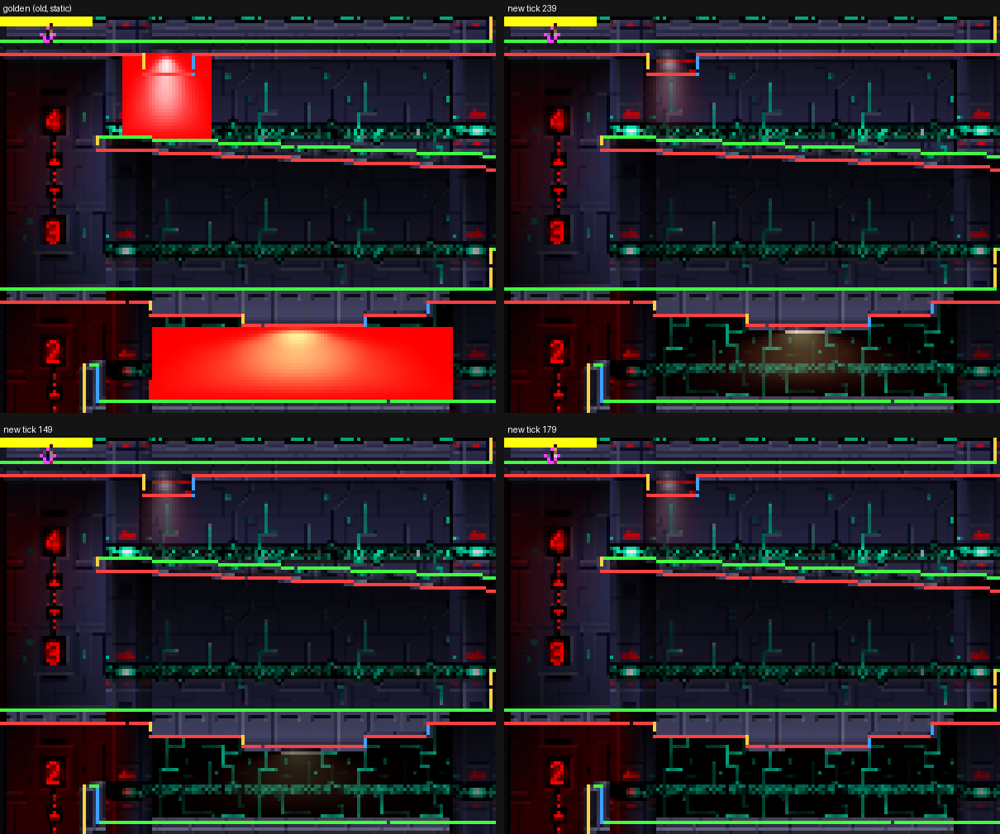
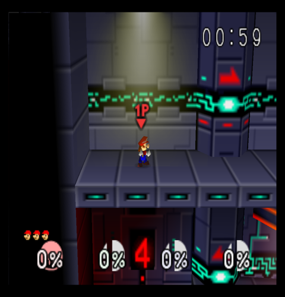

# RE-322 — Dynamic stage `PrimColor` and `Light1Color`/`Light2Color` tracks

Status: COMPLETE (host reference exact; PPSSPP A/B; PSP-2000 timing and capture; N64 reference partial)
Topics: material, animation, lighting, combiner, psp-ge, pack, stage, visual-regression, hardware
Relevant files: `crates/ssb-rom/src/{anim_color,mesh,pack,skeleton}.rs`,
`psp-runtime/src/meshdraw.rs`, `tools/romtool/src/{main,matcolors}.rs`,
`psp-game/src/main.rs`, `psp-asset-viewer/src/main.rs`

**Question.** RE-086 and RE-301 left the stage colour-window tracks as a
limitation: "values are baked into vertex colour or lack a stage GE-light
context". Which attachments use them now, what do they drive, and how do they
lower onto the GE?

## Census (current ROM)

`romtool stages` now lists every script that sets a colour-window track. Of
61 stage script attachments, 3 do, all on Race to the Finish (file 149,
render layer 1, graph `0x6120`, stage header file 295, viewer `stage 40`):

| Node | `MObj` | `MObjSub` (flags) | Script | Track | Keys | Period |
|---|---|---|---|---|---|---|
| 6 | 0 | `0x36D0` (`PRIMCOLOR`) | `0x6600` | `PrimColor` | `FFFFFF69` ↔ `FFFFFF47`, 4 ticks each | 8 |
| 10 | 0 | `0x3748` (`PRIMCOLOR`) | `0x67F0` | `PrimColor` | `FFFFA3` alpha 102 → 0 → 102 → 100 → 0 → 102 (60/60/1/59/60) | 240 |
| 10 | 1 | `0x37C0` (`LIGHT1 \| LIGHT2`) | `0x6828` | `Light1Color`, `Light2Color` | `B3B3B3`/`808080` → 0 → full → `B0B0B0`/`7D7D7D` → 0 → full | 240 |

**2 `PrimColor` tracks, 2 light tracks** (one `Light1Color`, one
`Light2Color`, one script). No stage animates `EnvColor` or `BlendColor`.
Every key is `SetExtValBlock`: linear per-byte interpolation, looped by
`SetAnim`. Both `PrimColor` scripts keep RGB constant; **only alpha animates**.

## Source use

`gcPlayMObjMatAnim` writes the value into `mobj->sub` (`objanim.c:1350-1414`);
`gcDrawMObjForDObj` emits `gDPSetPrimColor` under `MOBJ_FLAG_PRIMCOLOR` and
`gSPLightColor(LIGHT_1/LIGHT_2, ...)` under `MOBJ_FLAG_LIGHT1/2`
(`objdisplay.c:1210-1245`) into the segment-`0x0E` branch the list calls.

- **Glows (node 6 list 1 `0x5F10`→`0x5F80`, node 10 list 1 `0x6020`).**
  Combiner `FC309661 552EFF7F`: RGB `(PRIM - ENV) * TEXEL0 + ENV`, alpha
  `TEXEL0 * PRIM`. Task list 1 is reset to `G_RM_AA_ZB_XLU_SURF` by
  `grDisplayLayer1*ProcDisplay`, so the animated alpha is the blend factor.
  The in-list `G_MW_LIGHTCOL` writes on list 1 are inert: nothing reads
  `SHADE`.
- **Node 10 list 0 `0x5D20`.** Sets `G_LIGHTING | G_SHADING_SMOOTH`, calls
  `MObj` 1, draws 2 lit triangles with the inherited `TEXEL0 * SHADE`
  combiner. `LIGHT_1` is the directional light, `LIGHT_2` the ambient
  (`gSPNumLights(1)`). The direction is the stage's `light_angle.x/y`, loaded
  once per frame by `sc1PGameFuncLights`/`scVSBattleFuncLights`
  (`ftDisplayLightsDrawReflect`); nothing animates it.
- **Inheritance.** RDP/RSP state persists across nodes. Node 8's list sets
  its own `G_SETPRIMCOLOR` (`FFFFFF99`) and node 9 inherits it, so neither
  reads node 6's track. The converter attached node 6's script to both.

## Findings outside the colour path

1. **The stage material animator never ticked entries 64–102.**
   `MaterialAnimator` held a fixed 64-joint array; the v33 pack has 103
   `MatAnimDesc`s. Race to the Finish (84–86), Final Destination (64–66),
   Board the Platforms (67–79) and Metal Mario's stage (80–83) never
   animated. It now holds one heap joint per pack entry (103 × 448 B =
   46 KiB). Required here: the three file-149 entries sit past 64.
2. **Global phase.** `MaterialJoint`'s tick `n` equals the decomp's frame
   `n + 2` for every track (it decrements `anim_wait` on the first parse and
   sets `length = -anim_wait` without `- anim_speed`). All material tracks
   share it, so they stay mutually synchronised; the offset is two frames of
   scene-start phase. Left unchanged (TODO.md).
3. **Static list-1 glows draw opaque.** The same `G_RM_AA_ZB_XLU_SURF`
   reset applies to every layer-1 list-1 primitive. Seeding it generally
   (measured with a trial pack) makes 12 more primitives blend: Race to the
   Finish nodes 8/9 and 10 on other stages; left unchanged (TODO.md). The N64 frame
   below shows node 8's static glow as a translucent cone.

## Lowering

**Converter.** `MeshMaterial::anim_colors` records which registers still hold
the animated `MObj`'s value: set when an `MObj` emitting that register is
applied with a script, cleared by `G_SETPRIMCOLOR` or the matching
`G_MW_LIGHTCOL` offset. Result: node 6 and 10 glows animated, nodes 8/9
static, node 10 list 0 animated lights, node 11 (lighting cleared) unlit.

- `AlphaBlend::Prim(alpha)`: single-cycle `TEXEL0_ALPHA * PRIM_ALPHA`,
  classified only while `PRIM` is animated. Vertex alpha carries the static
  primitive alpha (lit vertices keep it too).
- The list-1 XLU reset sets `translucent` only for those animated-alpha
  primitives.

**Pack v34.** `flags::PRIM_ANIM` (21), `LIGHT1_ANIM` (22), `LIGHT2_ANIM`
(23; light flags only on `LIT`). No descriptor grows: **pack-size delta 0
bytes** (22,224,368). 29 primitives carry `PRIM_ANIM` (2 stage, 27 manager
effects), 3 carry both light flags (1 stage, 2 Link Spin Attack).

**Runtime.**

- `anim_color::stage_colors` masks the stage animator's tracks by those
  flags; spawned-effect players are unchanged.
- Glows: existing `TEXTURE_BLEND` path. `sceGuTexEnvColor` takes the live
  `PRIM` RGB, the per-frame vertex copy the live alpha; the GE's
  `Blend`/`Rgba` alpha is `At * Af` = `TEXEL0_A * PRIM_A`; blending
  `SrcAlpha/OneMinusSrcAlpha` is XLU_SURF's `IN * A + MEM * (1 - A)`. Exact
  up to GE rounding.
- Lights: `anim_color::light_scope` returns `StageAnimated` for a `LIT`
  primitive with a light flag outside the fighter scope when the caller set
  `DrawState::set_stage_light(stage.light_angle_xy)`. The first such
  primitive in a frame installs light 0 with `ftDisplayLightsDrawReflect`'s
  direction (shared with the fighter path); colours go through the same
  `(LIGHT_1, LIGHT_2)` latch as fighters (`sceGuLightColor` diffuse,
  `sceGuAmbient`), material white. Vertex colour (the baked shade) is
  ignored for this primitive only; every other stage primitive keeps its
  baked shade.
- **Cache.** `anim_color::Latch` replaces the two fighter-light
  `Option` caches: unknown always writes, identical values skip, a frame
  start, fighter scope change or `invalidate_all` forces a reinstall. The
  animated light flags are in `last_flags`, so lighting enable is never shared
  with a static primitive.

## Verification

- **Reference (`romtool matcolors --pack`).** An independent reference
  written from `objanim.c` (first-frame `AOBJ_ANIM_CHANGED`,
  `length = -anim_wait - anim_speed`, the two-lane packed multiply) replays
  each script from the ROM bytes and checks the pack's bytes match the ROM.
  Runtime `MaterialAnimator` vs reference over 600 ticks at phase 2:
  **0 mismatching ticks** for all 3 entries, first frame, key boundaries,
  midpoints and loop boundary included. Exact, no quantisation.
- Host tests: 10 `anim_color` (interpolation, exact keys, loop, independent
  lights, flag masking, static fallback, scope, latch skip/no-skip,
  static↔animated alternation, sync with a palette track), 4 `mesh`
  (register inheritance, `Prim` alpha under the XLU reset, no reset → no
  blend, literal light write), 2 `pack` (flag gating, lit alpha kept), 1
  `skeleton` (103 entries all tick). Workspace with ROM: 865 pass.
- Pack built twice, byte-identical, SHA-256
  `ff5166dded1faa79c07f4aca275a87aa6f35cc23c2483bd5cf0cde72e42921b5`.
- **PPSSPP.** `stage 40` at freeze ticks 240/150/180 (`SSB64_CAPTURE_TICKS`,
  new diagnostic build variable), native hashes `738072…`/`b0256f…`/`1e5bf1…`.
  Old path: the golden (opaque red boxes, static). 239 vs 179 differ on
  8,828 pixels at 2x, 239 vs 149 on 8,612, all inside the glows and the node
  10 fixture: the glow fades out at 179, the fixture goes dark with its
  lights.

- **N64 reference.** A temporary decomp patch (reverted; rebuilt ROM SHA-1
  back to `e2929e10…`) booted into 1P Race to the Finish; Mupen64Plus Rice,
  frames 100–1615. Idle Mario stays at the start, so only node 8's static
  glow is in view: a translucent cone, not an opaque box. The animated glows
  and the lit fixture were not in view; the per-value proof is the reference
  check above.

- Goldens: 8 rebaselined, 68 of 68 match twice.
  `r2-stage-bonus3-race-to-the-finish` (10,656 px) is this change;
  `r2-stage-final-destination`, `r2-stage-metal-mario`,
  `r2-stage-bonus2-fox` and the four `r2-metal-texgen*` scenes (24,612 to
  44,596 px) are finding 1: their palette, texture and UV cycles now tick
  like entries 0–63 already did. Final Destination's front faces now show
  the same palette phase as its entries 54–63.
- **PSP-2000** (Slim, 6.61 ARK, PSPLink v3.2.1, pack `ff5166dd…`, temporary
  uncommitted instrumentation alternating dynamic/static every 120 frames,
  `stage 40`, 3,600 frames each): render CPU 3,739 vs 3,634 µs (+105),
  GE tail 52 vs 51 µs, 59 draws both, state changes 122 vs 118 (+4),
  frame time 70,644 vs 70,620 µs. `MaterialAnimator::tick` costs 716 µs per
  simulation tick for 103 entries (≈7 µs each; ≈270 µs more than 64).
  Capture `397036…` renders the translucent glows; no exceptions.
  The viewer's per-tick simulation cost grows with run time in both HEAD and
  this build (3.97 ms/tick at frame 1,200), so absolute frame times across
  runs are not comparable; the interleaved A/B is.

## Cost

Per frame on Race to the Finish: 4 GE register writes (light colour,
ambient, lighting enable/disable around one primitive) plus one light
install; the glows reuse the existing per-frame vertex copy and texture
function cache. Zero pack bytes. 46 KiB heap for the animator.

## Limits

- GE rounding for the blend and the lighting dot product (normals as signed
  bytes, `/127`); the RSP uses its own fixed point. Not measured per pixel:
  the fixture was not in the N64 view.
- Environment and blend colour tracks keep the unmasked path (no stage
  uses them).
- A later `MObj` that emits no colour but names another script leaves the
  first script's value in the register; that case falls back to the static
  value. No ROM stage content does this.
