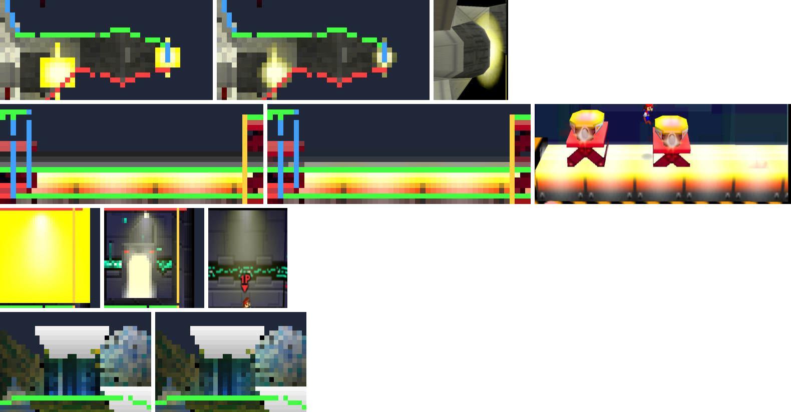

# RE-323 — Task-list-1 XLU reset for static stage primitives

Status: COMPLETE (pack diff measured per primitive; PPSSPP goldens; N64 references for Sector Z, Board the Platforms and Race to the Finish)
Topics: material, combiner, alpha, blending, depth, stage, pack, visual-regression
Relevant files: `crates/ssb-rom/src/mesh.rs`, `tools/romtool/src/main.rs`

**Question.** RE-322 applied `grDisplayLayer1*ProcDisplay`'s task-list-1
`G_RM_AA_ZB_XLU_SURF` reset only to primitives with an animated `PRIM`
alpha, and RE-250 applied only its depth bits. What does the whole reset
change, which alpha formula does each affected primitive use, and is the
result closer to the original?

## Source behaviour

`grDisplayLayer1PriProcDisplay`/`SecProcDisplay` (`gr/grdisplay.c:86-108`)
set `gDPSetRenderMode(G_RM_AA_ZB_XLU_SURF, G_RM_AA_ZB_XLU_SURF2)` on
`gSYTaskmanDLHeads[1]` before walking the ground `GObj`. The word is
`0x005049D8`: `AA_EN | Z_CMP | IM_RD | CLR_ON_CVG | CVG_DST_WRAP | ZMODE_XLU |
FORCE_BL`, blender `IN * A_IN + MEM * (1 - A_IN)` in both cycles, no
`TEX_EDGE` coverage.

The reset happens once per graph, not per `DObjDLLink` item. The converter
applies it per list-1 item (RE-250). **Measured:** 21 list-1 items in 8
graphs; none sets its own render mode, so every later item still holds the
reset and the two models give the same state.

## Change

- `State::set_render_mode` applies a render-mode word (shared with
  `G_SETOTHERMODE_L` shift 3). The list-1 seed applies the whole XLU word:
  `translucent`, `alpha_test` off, depth bits as before. `State::xlu_seed`
  is gone.
- `AlphaBlend::Prim` (`TEXEL0_ALPHA * PRIM_ALPHA`) now also classifies a
  **static** register, where the render mode blends. An unknown `PRIM`
  register declines.

## Measured impact (pack v34, primitive by primitive)

Pack diff against `ff5166dd…`: 15 primitives change; prim indices, texture
content and every other descriptor field are otherwise equal.

| Prims | Stage (file, list-1 node DL) | Alpha formula | Result |
|---|---|---|---|
| 3163 | Planet Zebes (105, `0x5870`) | `TEXEL0 * SHADE`; vertex alpha 42–255 | blends |
| 3388–3393 | Sector Z (109, `0x8438`–`0x85A0`) | `TEXEL0` | blends |
| 3511, 3516 | Saffron City (112, `0x6920`, `0x6980`) | `TEXEL0` | blends |
| 4259 | Board the Platforms, Mario (137, `0x31F0`) | `TEXEL0` | blends |
| 4890, 4892 | Race to the Finish nodes 8/9 (149, `0x5FC0`, `0x6000`) | `TEXEL0 * PRIM`, `PRIM` alpha `0x99` | blends |
| 5004–5006 | Staff roll (195, `0x77B8`–`0x7880`) | `TEXEL0 * PRIM`, alpha `0xFF` | already `TRANSLUCENT` by its own render mode; now blends |

Only 2 of the 12 list-1 primitives use `TEXEL0 * PRIM`. The other 10 use
formulas RE-130 already classified; they were opaque only because the
render-mode half of the reset was missing. The staff-roll primitives are the
one change outside list 1: its own mode is XLU, its formula is `TEXEL0 *
PRIM`, and it previously declined. Pack size +1,312 bytes, one more texture
(1,874): build-time filter compensation, which reads
`material_alpha_state`, now bakes a separate 16×16 copy for Sector Z
primitives 3392/3393.

**Rejected variant: classify `TEXEL0 * PRIM` regardless of render mode.**
That changes the vertex alpha of 52 more, still opaque, primitives (MV
opening room, item/effect models, Kirby/Pikachu, Board the Platforms
common platforms). 42 of them use `G_AC_THRESHOLD` with reference 8, so
their GE alpha test result changes. `r1-mvopeningroom` changed on 85,912
pixels: surfaces appeared opaque, including a 30%-alpha shadow drawn as a
solid dark rectangle. Most of these are task-list-1 graphs outside the
stage layers. `func_80016338` (`sys/objdisplay.c`) resets head 1 to
`G_RM_AA_ZB_XLU_SURF` for every camera, but an earlier head-1 draw under the
same camera can change it. The converter does not model that. The shipped
change leaves those primitives' vertex alpha unchanged (TODO.md).

## Verification

- Host tests (`mesh`): static glows blend with the literal `PRIM` alpha;
  the reset is the whole XLU mode (depth, no cutout); an unknown `PRIM`
  register declines (checked by breaking the decline: the test fails);
  without the reset a static register stays unclassified. Workspace with
  ROM: 868 pass.
- Pack built twice, byte-identical: 22,225,680 bytes, SHA-256
  `a40728812aa9e91c7f437899d1763bd0f97e30ab1f31372df470906112ea1818`.
- Goldens: 4 changed and were rebaselined, 68 of 68 match twice.
  `r2-stage-bonus3-race-to-the-finish` 8,764 px, `r2-stage-bonus2-mario`
  1,156 px, `r2-stage-zebes` 236 px, `r2-stage-sector-z` 224 px (2x).
  `r2-saffron-city-gate` does not show Saffron's list-1 sprites, and no
  golden shows the staff roll.
- **N64 references.** Temporary decomp patches (reverted; rebuilt ROM
  SHA-1 back to `e2929e10…`) booted Training Mode on Sector Z and Planet
  Zebes, and the Board the Platforms bonus stage with Mario. Spawn positions
  were moved to bring the primitives into view. Mupen64Plus Rice.
  - Sector Z: the Great Fox engine glows are soft translucent halos. The old
    path drew opaque yellow squares; the new path draws soft glows.
  - Board the Platforms: the glow above the hazard bar fades into the
    background. The old path drew the glow sheet's low-alpha texels as dark
    opaque bands; the new path draws a pale haze.
  - Race to the Finish: RE-322's frame shows node 8's glow as a translucent
    cone. The new path draws it translucent instead of an opaque yellow box.
  - Planet Zebes: the frames show translucent light beams above the stage
    cylinders but not primitive 3163 itself. Its change (236 px) rests on
    the decomp render mode and the RE-130 `TEXEL0 * SHADE` formula.

## Limits

- Rice is not RDP-exact; the N64 frames confirm translucency and shape,
  not per-pixel values.
- Not captured on a physical PSP. The change adds GE blending to 15
  primitives and no new state kind.
