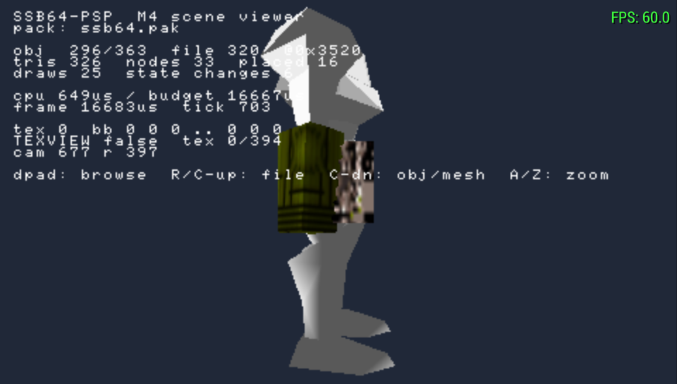
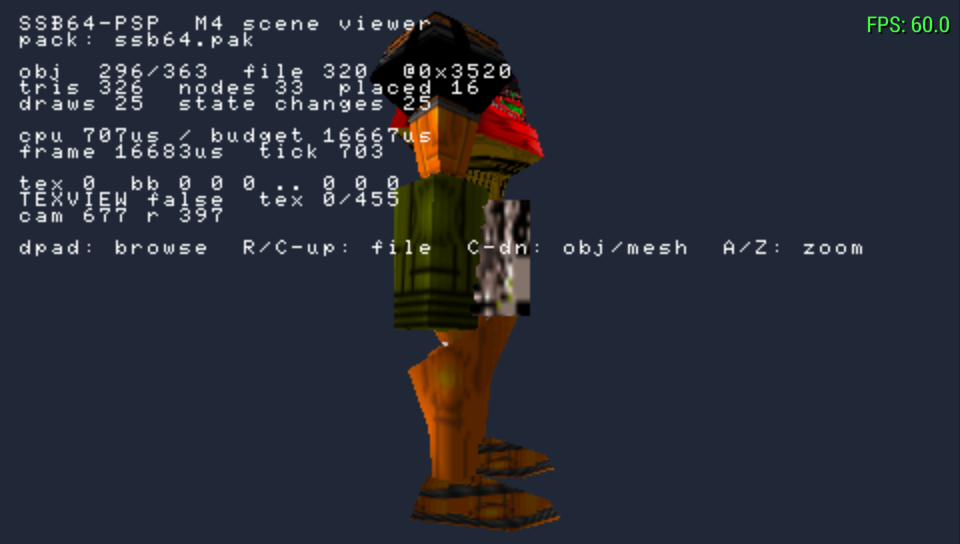

# Reverse-Engineering Log

Per Rule 10: when the original's behaviour is uncertain, record the
uncertainty rather than guessing. Each entry is Question / Evidence /
Hypothesis / Implementation / Confidence.

Because the decompilation is **100% complete**, most questions here are about
*porting* decisions rather than about what the original does. Anything
answerable from the decomp should be answered from the decomp, not guessed.

---

## RE-001 — relocData table geometry

**Question.** Where is the asset archive, how many files, and how are entries
laid out?

**Evidence.**
- `symbols/linker_constants.txt`: `lLBRelocTableFilesNum = 0x000854` (2132),
  `lLBRelocTableAddr = relocData_ROM_START`.
- `smashbrothers.us.yaml:1870`: `- [0x1AC870, bin, relocData]`.
- `lbRelocInitSetup`: `rom_table_hi = table_addr + ((files_num + 1) * sizeof(LBTableEntry))`.
- `struct LBTableEntry` in `src/lb/lbtypes.h` — 12 bytes, sizes in *words*.

**Hypothesis.** Table at `0x1AC870`, 2133 entries (2132 + sentinel), data base
at `0x1B2C6C`.

**Implementation.** `crates/ssb-rom/src/archive.rs`.

**Verification.** Parsed against the real ROM: offsets are monotonic across all
2133 entries, all 499 `is_compressed` entries carry `vpk0` magic at their
computed address, 0 do not, and the sentinel's offset lands exactly at the end
of the archive region.

**Confidence: certain.**

---

## RE-002 — VPK0 stream format

**Question.** How is the compressed payload encoded?

**Evidence.** `syDmaDecodeVpk0`, `src/sys/dma.c:160-388`. Read in full.

**Hypothesis.** `vpk0` magic, 32-bit decompressed length, 8-bit sample method,
then two postfix-encoded Huffman trees (offsets, lengths), then an LZ stream
where a `0` bit is a literal byte and a `1` bit is a back-reference. Huffman
leaves hold *bit widths*, not values.

**Implementation.** `crates/ssb-rom/src/vpk0.rs`.

**Verification.** This one deserves spelling out, because "it didn't crash" is
not evidence of a correct decompressor.

The number of extern relocations in a file can be derived two *independent*
ways:

1. By walking the linked chain embedded in the **decompressed payload** —
   which requires every byte to be correct, since the chain is threaded
   through the data itself and a single wrong byte derails it.
2. By measuring the ROM gap between the end of this file's data and the start
   of the next file's, which is exactly the `u16` target-ID array
   (`lbRelocGetExternBytesNum` bounds its scan this way). This does not depend
   on decompression at all.

`romtool check` compares them for every file:

```
files                 2132
load failures         0
intern reloc slots    61343
extern reloc slots    3092
chain/ROM mismatches  0
compressed files cross-verified against ROM geometry: 499
```

All 499 compressed files agree. Additionally, every VPK0 stream's
self-declared decompressed length matches the table's `decompressed_size`
independently.

**Confidence: certain.**

---

## RE-003 — Microcode variant

**Question.** F3D, F3DEX, or F3DEX2? This changes every display list opcode.

**Evidence.**
- `src/sys/taskman.c:61`: `NewUcodeInfo(gspF3DEX2_fifo)`.
- `symbols/linker_constants.txt:54`: `gspF3DEX2_fifoTextStart = 0x8003A320`,
  commented "F3DEX2 fifo 2.04H".

**Implementation.** `crates/ssb-rom/src/dl.rs` uses F3DEX2 opcode numbering
(`G_VTX = 0x01`, `G_TRI1 = 0x05`, `G_MTX = 0xDA`) taken from the decomp's own
`include/PR/gbi.h` rather than from memory.

**Confidence: certain.**

---

## RE-004 — Coordinate system and matrix conversion

**Question.** Does converting an N64 matrix to a PSP matrix require a
transpose?

**Evidence.** N64 `Mtx` is row-major and libultra uses the row-vector
convention (`v' = v·M`, translation at `m[3][0..2]`). PSP `sceGuSetMatrix`
takes column-major with the column-vector convention (`v' = M·v`, translation
in the last column).

**Hypothesis.** Two transposes that cancel:
`result[i] = Σⱼ v[j]·M64[j][i]` and `result[i] = Σⱼ Mpsp[i][j]·v[j]` give
`Mpsp[i][j] = M64[j][i]`; column-major storage means `cols[j][i] = Mpsp[i][j]`,
hence `cols[j][i] = M64[j][i]` — **identical linear element order**. The only
real work is widening s15.16 fixed point to `f32`.

**Implementation.** `crates/ssb-engine/src/coord.rs::n64_to_psp_matrix`.

**Note.** The first implementation *did* transpose, and the unit test
`row_vector_translation_lands_in_the_translation_column` caught it — the
translation ended up in the bottom row instead of the translation column.
Worth keeping as a cautionary tale: this is exactly the kind of error that
produces a subtly broken renderer rather than an obviously broken one.

**Confidence: high.** Verified by unit test against the algebra; not yet
verified against on-hardware output, which requires real geometry (M3).

---

## RE-005 — Handedness

**Question.** Do world-space positions need a flip?

**Evidence.** N64 `guPerspective`/`guLookAt` and PSP
`sceGumPerspective`/`sceGumLookAt` both produce right-handed view space
looking down `-Z` with `+Y` up. `ftPhysicsApplyGravityClampTVel` does
`vel_air.y -= gravity`, confirming `+Y` up in world space.

**Hypothesis.** No flip needed.

**Implementation.** `n64_to_psp_position` is an identity function, kept as a
named function so the renderer never hardcodes the assumption and any future
correction lands in one place.

**Confidence: high.** Needs on-hardware confirmation with real geometry —
specifically, that characters face the direction they should. Flag for M3.

---

## RE-006 — Simulation rate

**Question.** Is the simulation a fixed 60 Hz?

**Evidence.** Every timing constant in the decomp is expressed in frames
(`kneebend_anim_length`, `attack1_followup_frames`, hitlag/hitstun counters,
`FTINPUT_STICKBUFFER_TICS_MAX`). `scheduler.c:1249` registers
`osViSetEvent(..., INTR_VRETRACE, 1)` — an event every single retrace, i.e.
60 Hz NTSC.

**Hypothesis.** Fixed 60 Hz simulation.

**Implementation.** `crates/ssb-engine/src/timing.rs`. Simulation is decoupled
from rendering with a fixed-step accumulator; the PSP display runs at
~59.94 Hz so the steady state is one tick per vblank, with capped catch-up for
stalls.

**Confidence: high.**

---

## RE-007 — Physics zero-crossing asymmetry

**Question.** Ground friction clamps with `> 0.0` / `< 0.0`, air friction with
`>= 0.0` / `<= 0.0`. Deliberate, or decompilation noise?

**Evidence.** `ftPhysicsSetGroundVelFriction` @ 0x800D8978 uses strict
comparisons; `ftPhysicsApplyAirVelXFriction` @ 0x800D9034 uses non-strict. The
decomp is a byte-matching build, so both reflect the original instructions
exactly — this is not a transcription artifact.

**Hypothesis.** An original inconsistency, probably unintentional, but
*observable*: an air speed landing exactly on the friction value stops, where
the ground equivalent leaves it at exactly zero by a different path.

**Implementation.** Preserved verbatim in `crates/ssb-game/src/physics.rs`,
with a comment warning against "tidying" it into a shared helper.

**Confidence: certain** that it is in the original; **low** on whether it ever
changes observable gameplay. Preserved regardless — matching behaviour is
cheaper than proving it does not matter.

---

## RE-008 — C-button mapping *(OPEN)*

**Question.** Which C-button functions matter in Smash 64, and what should
they map to on a PSP with no C-stick?

**Evidence so far.** Unlike Melee, Smash 64's C-buttons are not attack inputs.
They appear to be used for taunt and for camera control in some single-player
modes. **Not yet confirmed against the decomp's input handling** (`ft/ftkey.c`,
`sys/controller.c`).

**Current implementation.** C-Up → Triangle, C-Down → Square, per
`DEFAULT_MAPPING` in `crates/ssb-engine/src/input.rs`. C-Left and C-Right are
currently **unmapped**.

**Confidence: low.** This is a placeholder. Resolve by reading `ftkey.c` and
the menu input paths before M4. If C-Left/C-Right turn out to matter, the PSP
has no free buttons and a modifier scheme will be needed.

---

## RE-009 — PSP nub deadzone *(OPEN)*

**Question.** How large should the analog deadzone be, and does the N64's
`-80..=80` range map linearly?

**Evidence.** Smash reads raw stick magnitudes for thresholds (tilt vs. smash
attacks, smash-turn detection, fast-fall via
`FTCOMMON_FASTFALL_STICK_RANGE_MIN`), so the *scale* matters, not just the
direction. The PSP nub reports 0..255 and drifts noticeably.

**Current implementation.** Deadzone of 20 nub units, then a linear rescale so
full deflection still reaches ±80. Tested for monotonicity and for reaching
both extremes.

**Confidence: low.** The deadzone value is a guess and the mapping is linear
where the N64's stick response may not be. Needs measurement against a real
PSP nub and comparison of resulting stick ranges against the decomp's
thresholds. Flag for M4.

---

## RE-010 — `MObjSub` unknown fields *(OPEN)*

**Question.** `MObjSub` has ~15 fields still named `unkNN` (`unk08`, `unk0A`,
`unk10`, `unk24`, `unk28`, `unk36`…`unk74`). Do any affect rendering?

**Evidence.** The named fields cover what a material needs: format/size,
sprite and palette pointers, UV translate/scale/scroll, prim/env/blend colours,
two light colours, and a flags word. The unknowns are interleaved with these.

**Hypothesis.** Mostly padding or animation scratch, given the struct is also
written by the material-animation system.

**Implementation.** Not yet consumed. The converter reads only the named
fields.

**Confidence: low.** Revisit if converted materials look wrong in M3. The
decomp can answer this definitively by finding the readers — do that rather
than experimenting.

---

## RE-011 — Level of detail selection *(OPEN)*

**Question.** `DObjDistDL` picks a display list by camera distance and
`sGCDetailLevel` picks a global tier. How is the tier chosen, and should the
PSP force one?

**Evidence.** `objdisplay.c:1776`: `gSPDisplayList(..., dls[sGCDetailLevel])`.
The variable is set elsewhere; the setter has not been traced yet.

**Hypothesis.** Likely tied to player count or an options setting, both of
which affect N64 fill rate.

**Implementation.** None yet.

**Confidence: low.** Worth resolving before M8 — forcing a lower tier is one of
the cheapest performance levers available, but only if it does not change
gameplay-visible geometry (e.g. platform collision derived from the same data).

---

## RE-012 — Nightly toolchain pin

**Question.** Why is the PSP crate pinned to a specific nightly?

**Evidence.** `rust-psp` 0.3.13 imports `core::panic::PanicPayload` in its
panic handler (`psp/src/panic.rs:15`). That path no longer resolves on
`nightly-2026-08-26`. Upstream `rust-psp` master has the same import, so there
is no newer release to move to.

**Implementation.** `psp/rust-toolchain.toml` pins `nightly-2026-08-01`, which
was verified to still export it.

**Confidence: certain.** Documented in the toolchain file itself, with a note
that a successful compile is not sufficient evidence for a bump — the result
must boot.

---

## RE-013 — `psp::dprintln!` is a 30x performance trap

**Question.** Why did a 4-triangle scene run at 2 FPS under PPSSPP?

**Evidence.** PPSSPP's debug log showed `sceDisplaySetMode(0, 480, 272)` being
issued *every frame*, which our code never calls. Tracing it to rust-psp's
debug-print path: `psp::dprintln!` writes into the framebuffer directly and
re-establishes display mode on each call. We were making eight such calls per
frame.

**Measurement.** Removing the per-frame `dprintln!` calls took the frame rate
from **2.0 FPS to a locked 60.0 FPS**, and shrank the EBOOT from 9.6 MB to
3.3 MB. Emulator debug logging (`-d`) was ruled out as the cause by measuring
both with and without it.

**Implementation.** `Gpu::debug_text` in `psp/src/gu.rs`, with the constraint
documented at the call site.

**Confidence: certain.** Directly measured, before and after.

**Lesson worth keeping:** `dprintln!` is fine for one-shot boot diagnostics and
must never appear in a frame loop.

---

## RE-014 — GU debug text is invisible under PPSSPP's hardware backends

**Question.** Why does `sceGuDebugPrint` + `sceGuDebugFlush` render nothing?

**Evidence.** Reading rust-psp's implementation
(`psp/src/sys/gu.rs:3523-3661`):

* `sceGuDebugPrint` copies characters into a static buffer, so passing a
  short-lived stack string is safe.
* It has a bug: `char_struct_ptr` always starts at the beginning of
  `CHAR_BUFFER` while `CHAR_BUFFER_USED` keeps accumulating, so successive
  calls in one frame overwrite each other. Worked around by emitting a single
  newline-separated string.
* `sceGuDebugFlush` does **not** queue a GE command. It computes pixel
  addresses and writes glyphs straight into VRAM with the CPU.

That last point explains the first failure mode — flushing before
`sceGuSync` meant the still-queued `sceGuClear` erased the text. Moving the
flush to after the sync (in `Gpu::end_frame`) fixed the ordering, but the text
is *still* invisible.

**Hypothesis.** PPSSPP's *hardware* backends (OpenGL, Vulkan) render into a
GPU-side framebuffer and do not reflect CPU writes to emulated VRAM. Its
*software* rasteriser emulates VRAM directly and should show them.

**Verification.** Confirmed. Forcing `SoftwareRenderer = True` (via
`--appendconfig`, so the user's own config is untouched) renders the overlay
perfectly — see `docs/images/m1-ppsspp-diagnostics.png`. The identical binary
shows no text under OpenGL.

Note an earlier `--graphics=software` attempt appeared to fail; that flag did
not take effect, and the config-file route is the reliable one. Do not trust a
negative result from the command-line flag alone.

**Conclusion.** The code is correct. This is an emulator-backend limitation,
not a port bug.

**Implementation.** Kept as-is. `tools/run-ppsspp.sh` passes the software-render
config so diagnostics are always visible during development.

**Confidence: certain.**

**Caveat for later:** relying on CPU framebuffer writes still means the overlay
is invisible under the fast backends. The real HUD must render as GE geometry
(Renderer 3), at which point this mechanism should be retired for anything a
developer needs to watch at full speed.

---

## RE-015 — Unexplained horizontal drift *(RESOLVED — earlier hypothesis was wrong)*

**Question.** In one run the test object drifted steadily left with no input.
Why?

**Original hypothesis (WRONG).** That PPSSPP reports the analog nub as 0
rather than centred 128 when no gamepad is attached, which `nub_axis_to_n64`
would legitimately map to −80 (full left) and feed to `apply_air_drift`.

**Evidence that refutes it.** Once the on-screen diagnostics became visible
(RE-014), the same build under the same conditions reports:

```
pos  x0 y-300 z0   (x100)
vel  x0 y0         (x100)
stick 0  buttons 0000
```

`stick 0` is dead centre and horizontal velocity is exactly zero. The nub is
being read correctly and the deadzone is doing its job.

**Actual cause: unknown.** The drift was most likely stray input — PPSSPP's
default keyboard mapping with the window focused, or its on-screen touch
controls — rather than anything in the input path.

**Lesson.** The original entry reasoned from a *plausible* mechanism to a
confident conclusion without measuring the value. The instrumentation existed
but was not visible, and the hypothesis was written anyway. Measure the
variable before explaining it.

**Confidence: certain** that the nub reads centred; **low** on what caused the
one-off drift, and it is not worth chasing further unless it recurs.

---

## RE-017 — `G_VTX` destination index encoding

**Question.** How does F3DEX2 encode the destination slot of a vertex load?

**Evidence.** `gbi.h`:

```c
#define gSPVertex(pkt, v, n, v0) \
    gDma0p(pkt, G_VTX, v, ((n) << 12) | (((v0) + (n)) * 2))
```

The low byte holds `(v0 + n) * 2` — the **end** of the destination range, not
its start. Therefore `v0 = (w0 & 0xFF) / 2 - n`.

**The bug this caused.** The first implementation computed
`dest_index = ((w0 >> 1) & 0x7F) / 2`, which evaluates to `(v0 + n) / 2`. That
is correct **only when `v0 == n`** — and the unit test happened to use
`v0 = n = 8`, so it passed.

Consequence: nearly every real display list decoded with vertices loaded into
the wrong cache slots, so triangles indexed slots that were never filled.
`romtool mesh` reported **666 of 762 lists failing** with `EmptyCacheSlot`,
which was misread as "these are continuation lists" and sent the design down a
blind alley (root-detection, call-inlining as a *fix* rather than a feature).

**How it was actually found.** By decoding a display list the decomp names
explicitly — file 105 at offset `0xCDA0`, documented in `relocData.md` — and
reading the commands:

```
+0A8 01 VTX   w0=01004008 w1=0000CD20     n=4, v0=0  (not v0=2)
+0B0 06 TRI2  w0=06060402 w1=00020006     slots 3,2,1 and 1,0,3
```

The triangle references slots 0 and 1, which the broken decode never filled.

**After the fix:** 1,768 root lists convert with **zero failures**, yielding
25,562 triangles.

**Confidence: certain.** Verified against known-good data, with a regression
test using `v0 != n`.

**Lesson.** A unit test with `v0 == n` cannot distinguish the correct formula
from a wrong one. When testing an encoding, choose values where the candidate
formulas *disagree*. And when a decoder reports mass failures, suspect the
decoder before inventing a theory that explains the failures away.

---

## RE-018 — Segmented addresses survive relocation

**Question.** `G_DL` targets in relocated files sometimes hold values like
`0x0E000000`, far past the end of the file. Corrupt?

**Evidence.** File 105 at `0xCDA0+0x80`: `DE000000 0E000000`. Segment `0x0E` is
the graphics heap — `objdisplay.c` does
`gSPSegment(dl_head[0]++, 0xE, gSYTaskmanGraphicsHeap.ptr)`.

**Conclusion.** Not all display-list pointers are relocated file offsets. Some
are **segmented addresses** the RSP resolves at draw time against a segment
table the game sets per frame. They point at runtime-generated lists that do
not exist in the ROM at all.

**Implementation.** `scan::is_plausible` bounds-checks only segment-0
addresses, and `mesh::convert` skips non-zero segments when inlining. Treating
them as file offsets previously rejected valid display lists outright.

**Confidence: certain.**

---

## RE-019 — `G_SETTIMG` format describes the load, not the render

**Question.** Why did 294 texture conversions fail with the impossible
combination `(Ci, Bits16)`? CI is only ever 4- or 8-bit.

**Evidence.** From the real display list in file 105 at `0xCDA0`:

```
F5 SETTILE  w0=F5400400 w1=00098250   tile 0: fmt=CI, siz=4b   <- render format
F5 SETTILE  w0=F5500000 w1=07018050   tile 7: fmt=CI, siz=16b  <- TLUT staging
F5 SETTILE  w0=F5000100 w1=05000000   tile 5:                  <- TLUT staging
FD SETTIMG  w0=FD100000 w1=0000C030   fmt=RGBA, siz=16b        <- the *load*
```

Two independent mistakes were feeding each other:

1. **Every `G_SETTILE` was being applied**, not just tile 0. Tiles 5 and 7 stage
   TLUT loads and carry descriptors that make no sense as render formats.
2. **`G_SETTIMG`'s own format/size were being trusted.** They describe how the
   RDP *reads* the image during `G_LOADBLOCK`, not how it samples it. A CI4
   texture is routinely loaded as RGBA16 because that is the efficient DMA
   width.

**Conclusion.** The address comes from `G_SETTIMG`; the render format comes
from `G_SETTILE` on **tile 0** (`G_TX_RENDERTILE`). They are separate pieces of
state and must be tracked separately.

**Result.** Texture conversion went from **41 of 469** to **336 of 469**, and
the format distribution flipped to match the measured inventory — `PsmT4`
became dominant (274 textures) instead of everything falling back to
`Psm8888`.

**Confidence: certain.** Verified against a decomp-named display list, with
regression tests covering both halves (`tile 0 wins over SETTIMG`, and
`non_render_tiles_are_ignored`).

**Lesson, and it is the same one as RE-017:** the failure counts were pointing
at the bug the whole time. 294 identical `UnsupportedCombination(Ci, Bits16)`
errors is not noise, it is a decoder reporting one specific wrong assumption.
Reading the failure histogram before theorising would have found this faster.

---

## RE-020 — PSP integer vertex formats are normalised, not raw

**Question.** Geometry converted correctly, the draw was issued (`draws 1`),
culling was off, the bounding box was sane and the camera was inside the far
plane — yet nothing appeared on screen.

**Evidence.** On-screen instrumentation, added rather than guessed at:

```
mesh 0/1768  file 22  @0x4D0
tris 2  verts 4  prims 1
draws 1  state changes 2
bb 0 -253 -253 .. 253 1024 1024
cam 2939 r 1277
```

Everything was consistent with geometry that should be visible.

**Cause.** `GU_VERTEX_16BIT` does not pass integer coordinates through — the GE
interprets them as **normalised** fixed point, dividing by 32768. N64
coordinates in the hundreds therefore became hundredths of a unit, collapsing
the model to an invisible speck at the origin.

The same applies to `GU_TEXTURE_16BIT`.

**Implementation.** A uniform model-matrix scale of 32768 undoes it
(`meshdraw::MODEL_SCALE`). Precision is unaffected: the coordinates are
integers well inside the `i16` range, so they are exactly representable.

Texture coordinates need the normalisation undone *and* the N64's S10.5 fixed
point (32 units per texel) converted, giving
`sceGuTexScale(1024 / width, 1024 / height)` — `32768 / 32 = 1024`.

**Result.** Real ROM geometry renders. See
`docs/images/m3-rom-geometry.png`: 396 triangles, 2 draws, 60 FPS, 168us CPU.

**Confidence: certain.** Directly observed before and after.

**Note on the claim this invalidates:** the 16-bit vertex format was described
as "free, because the N64 data is already `i16`". It is still a bandwidth win
(16 bytes versus 24), but it is *not* free — it requires a compensating model
scale, and any code that mixes 16-bit meshes with float meshes must apply the
right scale to each.

---

## RE-021 — Lighting state is inherited, not carried by the display list

**Question.** After textures worked, meshes still rendered as saturated
red/green/cyan polygons. Why were so many primitives drawing packed normals as
vertex colours?

**Evidence.** N64 normals are `i8` components of a unit vector, so
`x² + y² + z²` sits near `127² = 16129`; arbitrary colours have no reason to.
Measured over the whole archive:

```
vertices in lit prims    555     100.0% look like unit normals
vertices in unlit prims  36356    69.4% look like unit normals
```

**Conclusion.** Two things at once:

1. The `G_LIGHTING` check has **no false positives** — every vertex in a list
   that set the mode really does carry a normal.
2. It has an enormous false-negative rate, because `G_LIGHTING` is set
   **per-object by `objdisplay.c` before the list runs**. A list relying on
   inherited state carries no geometry-mode command of its own, so per-list
   conversion cannot see it. Only 555 of ~37,000 vertices are covered.

This is a structural limit of converting display lists in isolation, not a
parsing bug.

**Implementation.** `pack::looks_like_unit_normal` plus an 80% per-primitive
majority vote, in `PackWriter::add_mesh`. The geometry mode is still trusted
when it fires; the data is only consulted when it does not. Deciding
per-primitive rather than per-vertex avoids splitting one surface into shaded
and unshaded halves.

**Result.** Coherent, correctly shaded models
(`docs/images/m3-textured-model.png`).

**Confidence: high** for the discriminator (100% precision on the known-lit
set, and genuine vertex colours like opaque white fall far outside the band).
**Medium** on the 80% threshold, which is a judgement call.

**Proper fix, later:** extract the `DObj`/`MObj` scene-graph setup so the real
per-object render state is known, rather than inferring it. That also supplies
the light colours (`MObj::light1color`/`light2color`) this currently replaces
with a single neutral key light.

**Update.** All three parts are now settled. The scene-graph half is RE-023,
which recovers all 363 `DObjDesc` arrays. The light-colour half turned out not
to matter: RE-024 measured them and they are white. And RE-027 extracts
`MObjSub` itself, so per-object render state — palette, prim/env/blend colour —
is read rather than inferred wherever a table is named. The 80% lit-primitive
threshold remains a judgement call, and still applies to the geometry the
`MObj` path does not cover.

---

## RE-022 — Mesh UVs run far outside 0..1 and need REPEAT

**Question.** Textures uploaded correctly (proved with a known-UV quad) yet
meshes rendered as fine coloured speckle.

**Evidence.** Measured UV range on one mesh: `u -55..119 texels`,
`v -2.7..65.7 texels`, against 64x32 and 64x48 textures. So coordinates
legitimately span several tiles and go negative.

**Cause.** Without `sceGuTexWrap(Repeat, Repeat)` those samples land outside
the texture and produce noise.

**Also fixed alongside:** V was being normalised against the texture's
*logical* height while `sceGuTexImage` had been handed the *padded*
power-of-two height, stretching V on any non-power-of-two texture.

**Confidence: certain.** The speckle disappeared immediately.

**Method note.** This was found by rendering a single texture on a quad with
known 0..1 UVs and float vertices. That isolates the upload path (format,
CLUT, swizzle, buffer width) from the mesh data, and turned "textures are
broken" into "textures are fine, the UVs are not" in one build. Kept as a
toggle in the viewer.

---

## RE-023 — `DObjDesc` arrays are a depth-tagged flattened tree

**Question.** A display list says *what* to draw, never *where*. Every mesh so
far rendered at the origin. Where does placement live?

**Answer.** In `DObjDesc` arrays, which `gcSetupCommonDObjs`
(`src/sys/objanim.c`) walks at load time:

```c
DObj *array_dobjs[DOBJ_ARRAY_MAX];          // 18
while (dobjdesc->id != ARRAY_COUNT(array_dobjs))
{
    id = dobjdesc->id & 0xFFF;
    if (id != 0) dobj = array_dobjs[id] = gcAddChildForDObj(array_dobjs[id - 1], dobjdesc->dl);
    else         dobj = array_dobjs[0]  = gcAddDObjForGObj(gobj, dobjdesc->dl);
    ...
}
```

So `id & 0xFFF` is the node's **depth**, and its parent is whichever node most
recently occupied `depth - 1`. The array is a pre-order flattening of a tree,
44 bytes per entry. Depth 18 terminates — the terminator is not a magic number
so much as an out-of-range depth, which is also why nothing can nest deeper
than 18.

The high nibble selects matrix composition (`0x8000` recalc-rot-rpy-sca,
`0x4000` kind46, `0x2000` kind48, `0x1000` kind50), and any high bit also
pushes a leading translate-only matrix.

**Finding them.** Nothing indexes these arrays. Five constraints recover them:

1. Terminator is `id == 18` followed by 40 zero bytes.
2. The first entry is always depth 0.
3. Depth never jumps by more than one — `array_dobjs[depth - 1]` must already
   be populated or the runtime would pass `NULL` as a parent.
4. Non-zero float components fall in a narrow band. Measured over the corpus:
   translate peaks at 2.34e4, rotate at 31.7 rad, scale at 123, and the
   smallest non-zero magnitude anywhere is 1e-6.
5. **`dl` is either NULL or the target of an intern relocation.** This is the
   decisive one: the archive loader already knows exactly which four-byte slots
   are pointers, so a plausible-looking offset that was never relocated is not
   a `DObjDesc`.

**Validation.** The decomp has typed 363 of these by hand, byte-compared
against the original ROM on every build. Scanning all 2132 archive files:

```
scanner: 363 arrays across 134 files
decomp:  363 arrays across 134 files
per-file counts: identical
the 180 arrays carrying an @offset annotation: 180 exact, 0 missing
```

Zero false positives, zero misses. Reproduce with
`tools/dobjdesc-ground-truth.py` piped into `romtool scene --expect`.

**Confidence: certain.**

**Method note.** The single mismatch on first run (file 296, Mario's joint
tree: 25 nodes found, 33 expected) was **my ground-truth extractor being
wrong**, not the scanner — that array carries `#if defined(REGION_JP)/#else`
blocks and I counted both branches. Worth stating plainly because the instinct
was to go fix the scanner. When a check disagrees with a reference, the
reference is a suspect too.

---

## RE-025 — A `DObj`'s display-list field is an undiscriminated union

**Question.** With scene graphs recovered (RE-023), only **3 of 22** of Sector
Z's node display lists converted. The rest failed with `EmptyCacheSlot(76)` —
and slot 76 is beyond the 32-entry vertex cache, so those bytes were not a
display list at all.

**Cause.** `DObj`'s display-list field is a union:

```c
union { void *dv; Gfx *dl; Gfx **dls; DObjMultiList *multi_list;
        DObjDLLink *dl_link; DObjDistDL *dist_dl; ... };
```

**Nothing in the data says which member is live.** The discriminator is the
`proc_display` callback the `GObj` was registered with — `gcDrawDObjTree` reads
it as `Gfx*`, `gcDrawDObjDLLinks` reads it as `DObjDLLink*` — and that lives in
game code, not in the archive.

Sector Z's nodes point at `DObjDLLink` arrays, confirmed against the decomp:

```c
DObjDLLink dStageSectorFile2_gap_0x3EE0_sub_0x558[2] = {
    { 0, dStageSectorFile2_DL_0x3EE0 },
    { 4, NULL },
};
```

The terminator is `list_id == ARRAY_COUNT(gSYTaskmanDLHeads)`, i.e. 4 — the
same "out-of-range index terminates" idiom as `DObjDesc`:

```c
while ((++dl_link)->list_id != ARRAY_COUNT(gSYTaskmanDLHeads))
```

**Resolution.** Disambiguate structurally. `DObjDLLink` is much the more
constrained shape — a `list_id` under 4, then a **relocated** pointer — so try
it first and fall back to "the field is a `Gfx*`". A real display list cannot
pass as a link array: `G_VTX`'s command word is `0x01xxxxxx`, far above 4.

Measured over all 2132 files: 1661 node fields resolve to 1661 lists, of which
**1417 convert with triangles**, 32 convert empty, and 212 fail (mostly
segmented or cross-file vertex pointers).

**Also found here:** feeding those authoritative offsets back through
`find_display_lists_at` — which re-applies the *discovery* heuristics — placed
only 742 of 1661. Decoding them directly places 1417. Once the game itself has
told you where a list starts, a heuristic can only lose information.

**Confidence: certain** for `DObjDLLink`. The other union members
(`Gfx**`, `DObjMultiList`, `DObjDistDL`) are not handled and account for part
of the remaining 264.

**Update — the `Gfx**` member is a pre/post-matrix pair, and it is what
fighters use.** See RE-026; the remaining 264 are now 0 conversion failures.

---

## RE-026 — Fighters share a vertex cache across joints

**Question.** After RE-025, 244 node display lists still failed to convert.
152 of them failed with `EmptyCacheSlot(N)` for small `N` — a *valid* display
list drawing triangles from cache slots nothing in that list had filled. They
clustered almost entirely in the fighter models (Yoshi, Samus, Donkey, Kirby,
Pikachu, Master Hand).

**Two separate causes, both in `ftDisplayMainDrawDefault`.**

**(1) The `Gfx**` member is a two-slot pre/post-matrix pair.**

```c
case 1:
    dls = dobj->dls;
    if (dls != NULL && dls[0] != NULL) gSPDisplayList(..., dls[0]);
    sp58 = gcPrepDObjMatrix(gSYTaskmanDLHeads, dobj);   // push this node
    if (dls != NULL && dls[1] != NULL) gSPDisplayList(..., dls[1]);
```

`dls[0]` draws in the **parent's** space, `dls[1]` in the node's own. The decomp
labels the arrays exactly that way (`338_YoshiModel.c`: *"DObj.dls pre/post-
matrix DL pairs @ 0x3308 (19 pairs, 152 bytes)"*). Reading such a pair as a
`Gfx*` decodes the two pointer words as commands and walks off into whatever
follows.

The shape is only two words, so the relocation test carries all the weight:
`dls[1]` must be a relocated pointer, `dls[0]` NULL or one too. `G_VTX`'s
command word is `0x01xxxxxx` — non-zero and never a relocation target — so a
display list cannot pass. `{ NULL, NULL }` pairs exist (a joint that draws
nothing) and carry no evidence of their own; they are accepted only when a
neighbouring pair vouches, which is sound because pairs only occur in arrays.

Cross-checked against every array the decomp annotates:

| file | decomp | recovered |
|---|---|---|
| 304 `NYoshiModel` | 18 pairs | 18 |
| 307 `NPikachuModel` | 14 pairs | 14 |
| 338 `YoshiModel` | 19 + 18 pairs | 37 |
| 344 `BossModel` | 23 pairs | 23 |

**(2) The RSP vertex cache survives across display lists — and that is how
Smash skins its joints.**

`gcDrawDObjTree*` walks the node tree emitting each node's list into one command
stream, so the 32-entry cache carries over. A joint's list routinely draws
triangles whose *other* vertices a previous joint loaded. Converting a list in
isolation therefore cannot work, no matter how correctly it was located.

Worse — and this is the interesting part — `G_VTX` transforms vertices by the
modelview **as it stands at load time**. A triangle referencing slots loaded
under two different joints spans two joint spaces. That is the N64's version of
skinning, done with no per-vertex weights at all.

**Resolution.** Convert a graph's lists as a *sequence* in draw order, threading
one cache through them. Each cached vertex records which node loaded it; a
triangle that borrows one carries it across by `inv(world_here) * world_there`.
Draw order needs no sorting: `gcAddChildForDObj` appends to the tail of the
sibling list and the draw walk is node-then-child-then-siblings, so the
pre-order flattening the `DObjDesc` array already is round-trips exactly.

RDP *material* state is threaded too, since the hardware keeps it: 394 textures
resolve against 378 with a per-list reset.

Inheritance has one hard limit, and it bites exactly here. `gcDrawMObjForDObj`
injects a material display list at segment `0x0E`, the runtime graphics heap,
and **that is where a fighter's texture binding comes from**. It is not in the
archive (RE-021). Letting the previous node's binding survive such a call
smeared another joint's texels across Samus's torso and inflated the texture
count by 117; a segmented call now invalidates the binding instead, which is
the honest answer — untextured, pending `MObjSub` extraction.

**Result.** Node lists that convert with triangles: **1417 → 1613**. Conversion
failures across all 2132 files: **244 → 0**. The 23 lists that still place
nothing are 16 that decode to pure state and 7 pair halves that are genuinely
NULL.

**Limits.** The rebase is exact for the rest pose only. Under animation a
stitched seam would tear, because the two halves of such a triangle move with
different joints — reproducing that needs the runtime to keep the cache, which
is a decision for when animation lands. `gcDrawMObjForDObj`'s material list is
resolved in RE-027.

**Confidence: certain** for the pair member (byte-exact against four annotated
files) and for the shared cache (the failures are gone and the geometry lands
where the decomp's `translate` values say it should).



Samus, 33 joints, 326 triangles, 25 draws, 649 µs, 60 FPS — white, because at
this point the segment-`0x0E` material was still unrecoverable. RE-027 fixes
that. The arm cannon is textured even here, because that binding is in the
display list itself.

---

## RE-027 — A fighter's palette lives in a table another file names

**Question.** RE-026 left fighters white. Their display lists set up a CI4
render tile, call segment `0x0E`, then run `G_LOADTLUT` — with no `G_SETTIMG`
in between to say *what* to load. The palette address is missing from the file
that draws with it. Where is it?

**Evidence.** `gcDrawMObjForDObj` builds the missing commands at run time from
the node's `MObj` chain. For Samus's joints the chain contributes exactly one
thing, because `MObjSub::flags` is `0x0004` = `MOBJ_FLAG_PALETTE` alone:

```c
gDPSetTextureImage(branch_dl++, G_IM_FMT_RGBA, G_IM_SIZ_16b, 1,
                   mobj->sub.palettes[(s32) mobj->palette_id]);
```

The `flags & (MOBJ_FLAG_SPLIT | MOBJ_FLAG_ALPHA)` block that would load the
TLUT is skipped, so the display list's own `G_LOADTLUT` does it — which is
precisely the gap in the file. `gcAddMObjForDObj` zeroes `palette_id`, so index
0 is the neutral costume.

Three facts make the rest recoverable:

1. **`MObjSub` is in the archive.** 789 of them are typed in the decomp,
   including every fighter `*Model` file.
2. **The table is parallel to the `DObjDesc` array.**
   `gcSetupCustomDObjsWithMObj(gobj, dobjdesc, p_mobjsubs, ...)` advances both
   in lockstep, so slot `i` holds node `i`'s NULL-terminated `MObjSub *` chain.
3. **The display list names the index.** `gcDrawMObjForDObj` writes one 8-byte
   `gSPBranchList` per `MObj` at the head of the heap, so a call to
   `0x0E000000 + 8i` selects `MObj` *i*. Samus's node 2 calls `0x10`, `0x08`,
   `0x00` — three materials, switching mid-list.

**The part I got wrong first.** Point 3 looks like a fingerprint strong enough
to *find* the table: decode the lists, get a required chain length per node,
search for a table matching that vector. It is not. Samus has two 33-node
graphs with identical demands and two equally well-formed tables, and across
the archive a fits-the-graph search agreed with the truth **26 times out of
50** — a coin flip. Shipping it would have put the wrong costume on half the
models it "recovered".

The pairing is stated outright in the data instead:

```c
struct FTCommonPart {
    DObjDesc *dobjdesc;
    MObjSub ***p_mobjsubs;
    AObjEvent32 ***p_costume_matanim_joints;
    u8 flags;
};
```

These live in the fighter's `*Main` file and point into its `*Model` file, so
both pointers are **extern relocations** the archive loader records exactly.
Samus's is `dSamusMain_commonparts_container` at file 217, naming graph
`0x3520` with table `0x0000` and graph `0x69D0` with table `0x4000`.

Two adjacent pointers into one file is a common shape, though: `FTAttributes`
stores `dobj_lookup` immediately before `shield_anim_joints`, both pointing
into the same `*ShieldPose` file, and **51** of those matched the record shape.
Requiring the named table to actually parse for that graph's node count removes
all 51 and nothing else.

**Result.** 44 graphs paired. Then the check that matters, since it uses data
the table does not contain: for **310 of 310** nodes, the recovered chain
length equals what the display lists' segment-`0x0E` calls ask for — no
mismatches. And all **459** resolved `MObjSub` offsets are ones the decomp
typed by hand (`tools/mobjsub-ground-truth.py`), 0 unaccounted.

Archive-wide textures **394 → 455**. Every fighter's two main model graphs are
covered.

**Limits.** 83 graphs want a material and no record names their table — mostly
stages and effect files, which use a different setup path. RE-028 covers the
stages. Stage tables also
reach chains in a *different* archive file through extern relocations; those
slots parse but read back empty. Only costume 0 and animation frame 0 are
taken, since `palette_id` and `texture_id` are runtime counters.

**Confidence: certain.** The pairing is read from a struct that names both
sides, and two independent checks — chain length against display-list demand,
and every offset against the decomp — agree completely.



The same frame as RE-026, same 326 triangles and 25 draws. 707 µs, 60 FPS.

---

## RE-028 — A stage is one struct, and its material table is one word further along

**Question.** RE-027 paired 44 graphs with a material table and left 83
unpaired, most of them stages. Fighters name their table through
`FTCommonPart`; what do stages use? And more basically — a stage's geometry is
spread over `StagePupupuFile2`, `File3`, a wallpaper file and a `GR*Map` file,
with nothing so far saying which files make up *Dream Land*. What ties them
together?

**Evidence.** The same struct answers both:

```c
struct MPGroundDesc {
    DObjDesc *dobjdesc;
    AObjEvent32 **anim_joints;
    MObjSub ***p_mobjsubs;
    AObjEvent32 ***p_matanim_joints;
};

struct MPGroundData {
    MPGroundDesc gr_desc[4];        // four render layers
    MPGeometryData *map_geometry;   // collision lines
    ...                             // bounds, fog, light angle, BGM, items
};
```

`MPGroundDesc` pairs a graph with its material table exactly as
`FTCommonPart` does — except `anim_joints` sits between them, so the table is
at `dobjdesc + 8` rather than `+ 4`. **One word.** That is the entire reason
every stage layer went unmatched while every fighter matched, and it is a good
argument for reading the struct rather than pattern-matching adjacency.

`sizeof(MPGroundData)` is **0xA8**, confirmed rather than assumed: three
`GR*Map` files place the header at `0x14`, and the decomp names the next
symbol in each at `0xBC`.

**Finding them.** A header is four 16-byte descriptors followed by
`map_geometry`. Every word in those 64 bytes is a pointer, so a non-zero
unrelocated word anywhere rules a candidate out; at least one `dobjdesc` must
land on a `DObjDesc` array we already recovered; and the camera and map bounds
at `0x6C`/`0x74` must enclose a positive area, since a stage the camera cannot
move in does not exist.

**Result.** **41 stage headers.** Dream Land's, checked field by field against
the decomp:

```
file 255 @ 0x14  bgm 0x0
  camera  top   4000 bottom  -2000 right   3900 left  -3900
  map     top   8300 bottom  -3500 right   9000 left  -9000
  layer 0  graph file 104 @ 0x1008 (21 nodes)  no materials
  layer 1  graph file 104 @ 0x1CE0 (2 nodes)   no materials
  layer 2  graph file 104 @ 0x2450 (4 nodes)   materials file 104 @ 0x1F50
  layer 3  graph file 104 @ 0x2BF8 (4 nodes)   no materials
  collision  file 104 @ 0x1F34  (not decoded)
  map nodes  file 152 @ 0x10F0
```

Every one matches `dGRPupupuMap_header`. `bgm 0x0` is `nSYAudioBGMPupupu`,
which is 0; Planet Zebes reads 1 and Yoshi's Island 8, both correct, so the
field is genuinely at `0x7C` and not accidentally right once.

Material pairings **44 → 56**, nodes whose chain length matches display-list
demand **310 → 342** with still **0** mismatches. Archive-wide textures
**455 → 485**.

**A gap in the ground truth, not in the extractor.** Four resolved `MObjSub`
offsets are at places `tools/mobjsub-ground-truth.py` cannot locate a decomp
symbol. They are real: e.g. file 117's `0x1E18` is
`dStageMetalFile2_Layer1MObj_MObjSub_real`, hand-named with neither an `@`
comment nor an offset in its name, and the other two members of its chain
(`0x1ED0`, `0x1F48`) both verify. The generator's message now says
"no decomp symbol is placed here" rather than implying a contradiction.

**Limits.** `map_geometry` — the collision lines a match actually needs — is
located but not decoded. Layers whose material table lives in another archive
file are skipped, as in RE-027. 71 graphs still want a table and have no record
naming one.

**Confidence: certain.** Every Dream Land field matches the decomp, three BGM
ids check out, and the demand check stays at zero mismatches over 32 more
nodes. The discovery filter lands on files **255–295 with no gaps and no
extras** — precisely the archive's `GR*Map` range, which is the full stage
list including the bonus and 1P maps. One header per map file, none missed,
nothing else mistaken for one.

---

## RE-029 — Stage collision is 2D polylines, and `vertex2` is a count

**Question.** RE-028 located every stage's `MPGeometryData` but did not read
it. Collision is the last thing M4's vertical slice is missing. What shape is
it in?

**Evidence.** Not triangles — 2D polylines, reached through two indirections:

```c
line_info[yakumono].line_data[kind] = { group_id, line_count };
// line ids group_id .. group_id + line_count, kind in {floor, ceil, rwall, lwall}
vertex_links[line_id] = { vertex1, vertex2 };
pos = vertex_data[ vertex_id[vertex1 + k] ].pos;
```

**The trap.** `MPVertexLinks { u16 vertex1, vertex2; }` reads like a segment
between two vertices. It is not. `mpCollisionCheckFloor` walks

```c
for (v = links[id].vertex1; v < links[id].vertex1 + links[id].vertex2 - 1; v++)
```

joining consecutive points — so `vertex2` is a **count** and a line is a
polyline. The field name says otherwise and the struct gives no hint.

Dream Land settles it. Line 3 is `{9, 2}`. Under "count" that is
`vertex_id[9..11]` → `(-2318, 0) .. (2318, 0)`: a platform symmetric about the
origin. Under "second vertex index" it would be `vertex_id[9]` to
`vertex_id[2]`, which is not.

**Lengths without adjacency.** No array stores its own length, and guessing
from the next symbol's offset would not survive a file the decomp has not
typed. It is not needed: the line count is the largest `group_id + line_count`
over every kind, the `vertex_id` length the largest `vertex1 + vertex2` over
every line, and the vertex count one past the largest index those name. Each
level bounds the next, out of the data itself.

**Result.** All **41** stages decode, 0 failures. Dream Land:

```
7 lines (floor 4, ceiling 1, walls 2), 42 map objects
  line 0 Floor      (570,1542) (0,1542) (-570,1542)
  line 1 Floor      (1892,907) (1421,907) (951,907)
  line 2 Floor      (-951,904) (-1396,904) (-1841,904)
  line 3 Floor      (-2318,0) (2318,0)
  line 4 Ceiling    (1972,-1072) (-1972,-1072)
  line 5 RightWall  (2318,0) (2307,-124) (2290,-331) (2075,-834) (1972,-1072)
  line 6 LeftWall   (-1972,-1072) ... (-2318,0)
  object kind 0 at (0,6)       kind 1 at (-1397,906)
  object kind 2 at (1,1545)    kind 3 at (1421,909)
```

Three floating platforms — two low and one high and centred — over a main
platform, with the rounded underside walls sloping from `±2318, 0` down to
`±1972, -1072`. That is Dream Land. `MPMapObjKind` 0–3 are the player starts,
and they land one per platform, which is how Dream Land opens a match.

Final Destination cross-checks it from the other direction: **one** floor
line, `(-2508, 0) .. (2508, 0)`, all four spawns on it. Exactly one flat
platform and nothing else, which is the whole stage.

**Limits.** `MPVertexInfo` is deliberately skipped: the collision code indexes
it by line id for early rejection, but it is absent from `MPGeometryData`
because the runtime derives it on load. Yakumono transforms are runtime state,
so lines belonging to a moving group are in that group's space, not world
space.

**Update.** Packed and queried as of RE-030; the "not yet packed" limit this
entry originally recorded is closed.

**Confidence: certain.** Two stages reconstruct feature for feature from
independent knowledge of what they look like, all 41 decode, and the array
lengths are derived rather than assumed.

---

## RE-030 — Surface flags say how a stage plays, and spawns prove the query

**Question.** RE-029 decoded the collision lines but stopped there. Two things
were still unknown: what a collision vertex's `flags` word means, and whether
the whole chain — extractor, pack, reader, query — actually agrees, which no
unit fixture can tell you.

**The flags.** `mpdef.h` names the bits: the upper byte is surface state and
the lower byte an `MPMaterial` that selects friction. Two bits decide how a
floor behaves:

```c
#define MAP_VERTEX_COLL_PASS  (1 << 14)   // may be dropped through
#define MAP_VERTEX_COLL_CLIFF (1 << 15)   // its ends can be hung from
```

Reading them back on Dream Land is what makes this certain, because the answer
is checkable against how the stage plays:

```
line 0 Floor  pass    (570,1542) (0,1542) (-570,1542)
line 1 Floor  pass    (1892,907) (1421,907) (951,907)
line 2 Floor  pass    (-951,904) (-1396,904) (-1841,904)
line 3 Floor  cliff   (-2318,0) (2318,0)
line 4 Ceiling        (1972,-1072) (-1972,-1072)
line 5 RightWall      (2318,0) ... (1972,-1072)
```

All three floating platforms are `pass` — in Dream Land you drop through them
by holding down. The main platform is `cliff` and *not* `pass` — you cannot
drop through it, and you can grab its ledges. The ceiling and walls are
neither. Four independent facts about the stage, four matches. No structural
check could have produced that.

**The query.** `mpCollisionCheckFloorLineCollisionSame` does not test a point
against a surface; it tests the **swept segment** from where a fighter was to
where it wants to be. That is what stops a fast faller from crossing a platform
in one frame. It dispatches on whether the segment is level, because the
tilted solver divides by the segment's horizontal extent:

* `mpCollisionCheckFCSurfaceFlat` — level segments, and only while falling.
* `mpCollisionCheckFloorSurfaceTilt` — sloped segments, a line/line crossing
  with the endpoints snapped when a fighter lands within `0.001` of a joint,
  so a landing between two segments falls on one of them rather than through.

`0.001` is not a tuning knob; it is written literally throughout
`mpcollision.c`, and it is what lets a fighter standing exactly on a surface
still register as touching it.

**Validation the structure does not contain.** The game places a spawn point
just above the surface it starts on. So drop every stage's player spawns
straight down through the packed data and see where they stop:

```
stage  0  file 255  7 floor segments in 1 group(s)
  P1  spawn (     0,     6)  lands on line 3 at y    0.0,   6 below cliff
  P2  spawn ( -1397,   906)  lands on line 2 at y  904.0,   2 below pass
  P3  spawn (     1,  1545)  lands on line 0 at y 1542.0,   3 below pass
  P4  spawn (  1421,   909)  lands on line 1 at y  907.0,   2 below pass

40/41 stages catch every spawn (158 landed, 4 did not)
```

**158 of 162** spawns land, and almost all of them come to rest **2–6 units**
below where they started. That margin is the real result: nothing about the
pack format or the solver forces it, and a wrong offset anywhere in the chain
would scatter it. Sloped stages land on fractional heights (`y 303.5`), which
means the tilted solver is exercised on real data too.

**The four misses are the known limit, not a bug.** All four are on one stage,
file 284 — the bonus stage built entirely from moving platforms. Its floors sit
in yakumono groups 1–11, every one of them an identical rectangle at the
origin, which is what a platform stored in its *own* space looks like. The
runtime offsets those by the group's `DObj` before testing; we have no group
transforms, so they are tested where they rest. One stage failing, and it being
exactly the stage made of moving platforms, is the failure isolating itself.

**Layering.** The query lives in `ssb-game` (Layer A) and takes an iterator of
segments, so it allocates nothing and never learns the pack format; `ssb-rom`
never learns the game logic. The six-line adapter between them is duplicated
per consumer, which is cheaper than a shared type dragging one crate into the
other. `romtool collide <pack>` is that adapter plus the check above.

**Seen, not just counted.** The viewer draws a stage's render layers with its
collision polylines over them, through the same transform, and Dream Land's
lines land on its platforms: two short floor lines exactly on the top surfaces
of the left and right side platforms, one long line along the top of the main
platform, slightly inset from the rendered slab — which is right, because
collision is `±2318` and the drawn geometry is a little wider. 16 segments
drawn, and Dream Land's seven polylines are `2+2+2+1+1+4+4 = 16`. 658 µs at 60
FPS (`docs/images/m4-stage-collision.png`).

Peach's Castle cross-checks it on ground that is not flat: its lines follow the
sloped castle top, matching the fractional landing height (`y 303.5`) the spawn
drop reported for that stage. A consistent offset would survive every numeric
check above and would be obvious here; there is none.

**Confidence: certain** for the flags, which Dream Land confirms against
gameplay, and for the geometry, which now agrees visually on two stages.
**High** for the solver: it is a faithful port and the spawn margins agree
across 40 stages, but no fighter has stood on it yet.

*Update (RE-031): one has. 158 of 158 spawns now hold a simulated fighter still
for a second, and two stages confirm it on device.*

---

## RE-031 — A fighter stands on a stage, and two solvers agree it is the right one

**Question.** RE-030 left the collision query proven against single-shot
queries but never driven by anything. Does the ported physics, stepped a tick
at a time through the ported collision process, actually leave a fighter
standing on a stage — and stay there?

**What was missing.** The query answers "did this movement cross a floor". A
tick needs three more things from `mp/mpprocess.c`, and each is a behaviour
rather than a formula:

* **`mpProcessSetCollideFloor` — a grounded fighter's height is re-read every
  tick**, not carried over from the last one. There is no slope code in Smash
  64; walking up a hill *is* this function sampling the surface under the new
  x. When a fighter's x leaves its line, that same absence is how it falls off
  a ledge.
* **`mpProcessSetLandingFloor` — landing past the end of a line moves the
  fighter to the line's corner** rather than leaving it hanging at whatever
  height it arrived with. This is what puts a fighter *on* a ledge.
* **`mpProcessUpdateMain` — a tick's movement is subdivided** into 250-unit
  pieces before any of it is tested. The original's own comment gives the
  reason: 250 is a tenth of maximum knockback velocity, 2500 units per frame.

And one query the swept test cannot answer, `mpCollisionCheckProjectFloor`: a
straight downward probe for what a body is *above*. That is how a spawn point
becomes a standing position, and it shares no arithmetic with the swept
line/line solver.

The floor material turned out to be a real table rather than a guess —
`dMPCollisionMaterialFrictions` @ 0x8012C4E0, sixteen multipliers on the
character's own traction. `nMPMaterial3` is 1.0 against the common material's
4.0, and the decomp's comment on that enum reads "presumably ice due to low
traction". The number agrees: nothing else in the table is close.

**Validation: two solvers that must agree.** Place a fighter at each of the
158 landable spawns twice. Once with the vertical probe, once by dropping it
under real gravity and letting the swept query catch it. They have no code in
common beyond reading the same segments.

```
spawns      162
settle      158 have a floor beneath them
agree       158/158 land where the vertical probe says they should
at rest     158/158 do not move over 60 ticks (worst drift 0)
substep     158/158 caught when dropped at maximum knockback velocity
```

**Worst drift is exactly 0**, not "small". A sign error in the landing snap or
in the grounded update shows up as drift, and drift compounds — 158 fighters
holding still for 60 ticks each is not something a nearly-right implementation
produces. Sloped stages are in that set: Peach's Castle's P3 settles on
`y 303.5`, the fractional height RE-030 measured, now reached by simulation
rather than a single query.

**An honest negative.** Subdividing the movement changed the outcome for **0**
of the 158. That is expected and it is reported rather than glossed: the swept
test is exact along a straight line, so while only floors exist there is
nothing for substepping to catch. It will earn its keep when a wall can deflect
a fighter mid-tick, and porting it now is cheaper than discovering later that
knockback tunnels.

**On device.** Dream Land, at the stage's own first spawn:

```
stage 0/41  file 255  @0x14
fighter ground   x 0  y 0  line 3  mat 0  air 0
tris 175  layers 4  coll-segs 16
cpu 666us / budget 16667us          60.0 FPS
```

The host simulation says `spawn (0, 6) lands line 3 at y 0.00 after 12 ticks`.
The device says line 3, y 0. Peach's Castle repeats it on ground that is not
flat: `x -2556  y 557  line 3`, against the host's `spawn (-2556, 572) lands
line 3 at y 557.00 after 18 ticks`. Same line, same height, on a slope.

The whole tick costs **8 µs** — 666 against 658 for the same view without it —
because the collision adapter is an iterator that reads segments straight out
of the mapped pack. There is no per-frame setup to pay for and nothing is
allocated (`docs/images/m4-fighter-on-stage.png`).

**What the marker is, and is not.** It is a stem standing on the contact point
with a crossbar at the origin, green when grounded and white when airborne —
not a character model. The pack holds no record naming which object is Mario,
and picking one that looked right would be a fingerprint rather than a fact
(the rule RE-027 was built on). What is being shown is the simulation, not the
character.

**Confidence: high.** The two solvers agreeing across 158 real spawns, at zero
drift, is strong evidence the floor path is right. It is not evidence about
walls, ceilings, ledge-grabs or moving platforms, none of which are ported —
and a fighter here has no state machine, so it cannot walk, jump or be hit.

---

## RE-024 — The shipped light colours really are neutral

**Question.** RE-021 substituted a single neutral key light for
`MObjSub::light1color`/`light2color`, and flagged that as a known compromise.
How wrong is it?

**Evidence.** Every `MObjSub` the decomp has typed, across the whole
`src/relocData` corpus:

```
0xFF, 0xFF, 0xFF, 0x00    35
0x80, 0x80, 0x80, 0x00     1
```

**Conclusion.** 35 of 36 are pure white and the last is neutral grey. The
substitution is not a meaningful approximation — the colours carry no hue, so
the shading difference is at most a brightness scale on one material.

**Confidence: medium.** Only 36 `MObjSub` instances have been typed so far, so
this is a sample rather than the full corpus. It is enough to demote the light
colours from "known limitation" to "not worth chasing", but not enough to claim
no material anywhere tints its lights.

---

## RE-016 — Measured frame budget at M1

**Question.** How much CPU headroom does the M1 baseline actually have?

**Evidence.** On-screen diagnostics, PPSSPP software rasteriser, steady state:

```
frame 701  tick 701
ticks/frame 1  dropped 0
cpu 13us / budget 16667us
frame 16682us  view 362x272
```

**Readings.**

* `frame == tick` — exactly one simulation tick per displayed frame. The fixed
  60 Hz clock (RE-006) holds in lockstep with no accumulated error over 700
  frames, and no catch-up ticks or drops.
* `frame 16682us` — 59.94 Hz, the expected PSP vblank cadence.
* `cpu 13us` against a 16667us budget — **0.08%** consumed by simulation plus
  render submission.
* `view 362x272` — the value `coord::pillarboxed_viewport()` returns. **This
  line overstated what it showed.** Printing the helper's return value confirms
  only that the helper was called; it says nothing about the GE viewport, which
  was in fact still the full 480x272 until RE-034 measured the resulting
  distortion. "Confirmed on-device" should mean a rendered consequence was
  measured, not that a number reached the overlay.

**Caveat.** The scene is four triangles and one fighter's worth of physics, so
13us says nothing about how a real match will perform. Its value is as a
**baseline**: the platform layer, clock and submission path cost essentially
nothing, so future frame time can be attributed to the game rather than to
scaffolding.

**Confidence: high** for the measurement; explicitly **not** a performance
prediction. Real PSP hardware is ~333 MHz against an emulator on a desktop CPU
— these numbers do not transfer (plan §37).

---

## RE-032 — The fighters' real numbers, and what a guessed constant hides

**Question.** RE-031 stood a fighter on a stage using physics constants I made
up. `PhysicsAttributes::default()` carried a comment calling them "a neutral
baseline for tests". Where are the real ones, and does using invented numbers
actually cost anything if the shape of the physics is right?

**Answer to the second question first: yes, and not subtly.** Mario's real
gravity is `2.4` per frame and his terminal velocity `44.0`. My baseline used
`0.09` and `1.7` — off by 26x. Smash 64 works in the same large world units as
its collision geometry, where a stage spans several thousand units and Mario
stands 320 tall, so a constant that looks like a sensible small acceleration is
not conservative, it is a different game. The old numbers still produced a
fighter that fell and landed in the right place; it simply took 300 frames to
drop what should take 20. Nothing failed. That is what made it worth fixing.

**Where they live.** Every per-character constant is one `FTAttributes` struct
at a fixed offset inside that character's main archive file:

```c
attr = lbRelocGetFileData(FTAttributes*, *fp->data->p_file_main, fp->data->o_attributes);
```

So the record that matters is `(file id, byte offset)`, and it sits in
`dFT<Name>Data` — in the game code's data segment, not in any archive file.
The decompilation's `relocData` sources annotate each fighter main file with
the size of everything preceding the attribute struct, which is where the
offsets in `ssb_rom::fighter::FIGHTER_FILES` come from. That is a record naming
both sides, not a value picked because it looked plausible in a hex dump — the
distinction RE-027 turns on.

**Validation: two independent readings of the same bytes.** An offset table is
a claim about where 27 structs begin, and the cheapest way to be wrong is to be
*almost* right: a table off by one word still decodes into floats that look
like numbers. So `romtool fighters --verify` decodes all 27 out of the ROM and
compares every scalar against the values the decompilation writes out in its
own C literals — one reading from the compressed archive, one transcribed by
hand years ago by somebody else.

```
27/27 decode to plausible values
verified    27 fighters, 1215 fields against the decompilation
            all agree
```

Five of the 27 have no size comment to read the offset from and had to be
derived from the last annotated block instead; those five are in the 27 that
agree, which is what makes the derivation trustworthy rather than assumed. A
wrong offset does not yield 44 matches and one miss.

The table also reads correctly against the game as played: Kirby and Jigglypuff
have 6 jumps where everyone else has 2, Metal Mario's gravity is 4.8 against
Mario's 2.4 with terminal velocity 100 against 44, Giant DK is heaviest and
fastest-falling, Link's jumpsquat is 7 frames. None of that was used to find
the offsets, so it is a free check.

**The collision body is a diamond.** `MPObjectColl` is `{top, center, bottom,
width}` and I had ported it as a box named `{top, bottom, left, right}`. The
four points are `(0, top)`, `(±width, center)` and `(0, bottom)` — so `center`
is a *height*, the waist where the body is widest, not a centre point. Mario's
`{320, 190, 0, 150}` is a body 320 tall whose widest span is 300 across, at hip
height. `bottom` is `0.0` for every playable character, which is why the
grounded update can put the translation straight onto the surface with no
offset. `ftDisplayMain` sizes the shadow from `width` and `center`, so these
are not physics-only numbers.

**A bug the real numbers exposed.** With `air_accel = 0.025` the ported air
drift barely moved the fighter, and chasing that found two errors in
`ftPhysicsApplyAirVelDrift`:

* Drift scales with **how far** the stick is pushed — `vel_air.x += stick_x *
  air_accel` — not just which way. My port used the sign only, making drift 80x
  too weak at full deflection. Under the invented `air_accel = 0.05` that
  looked like "drifting is a bit sluggish"; under the real value it takes 1200
  frames to reach a cap the game reaches in 17.
* Friction runs **every** frame, including while the stick is held. So the real
  steady-state drift speed is not the clamp but the clamp minus one frame of
  friction, and releasing the stick does not change which function runs.
* The deadzone is a band, `|stick_x| < 8`, not just zero.

The first of those is the kind of error a hand-picked constant can hide
indefinitely, because both the constant and the formula were wrong in
compensating directions.

**Re-validation.** RE-031's whole simulation was proven under the fake
constants. Re-run under the real ones, terminal velocity 44 instead of 1.7:

```
agree       158/158 land where the vertical probe says they should
at rest     158/158 do not move over 60 ticks (worst drift 0)
```

Unchanged — and the resting heights are identical to the last digit
(`557.00`, `303.50`, `-269.00`), while the fall times drop from 18 ticks to 4.
That is the right invariant: where a fighter lands must not depend on how fast
it fell. Had the swept query been resolving to a substep boundary rather than
the true crossing, a 26x change in fall speed would have moved those fractions.

**Confidence: high** for the values — 1215 fields agreeing with an independent
transcription is not a coincidence, and the roster reads true against the game
as played. The pack now carries all 27 characters' constants (5 KB, format
version 4), including camera, shadow and shield fields no subsystem reads yet.

**Not verified on device this round.** The session was locked when the
screenshot was taken, so the capture is the lock screen rather than the
emulator — the failure mode `tools/run-ppsspp.sh` documents at length and the
one that has cost this project the most time. The EBOOT builds for the PSP
target and PPSSPP loads it; the on-device overlay showing `attrs pack` and
Mario's real constants is unconfirmed until the next run.

---

## RE-033 — The status machine, and a tap that is a counter rather than an edge

**Question.** RE-031's fighter could stand and fall and nothing else. Smash 64
drives every action through a *status*: a fighter is always in exactly one, and
it decides which physics run, which inputs are heard, and what can be entered
next. What does that machine actually look like, and what does it take to walk,
dash, jump and drop through a platform?

**The interrupt chain is an ordered list.** `ftCommonGroundCheckInterrupt` is a
macro of nineteen `||`-chained calls, each of which sets a status *as a side
effect* and returns whether it did. Short-circuit evaluation is the priority
system — there is no dispatch table and no explicit precedence. Jumpsquat is
tested before dash, dash before squat, squat before turn, turn before walk, so
holding up-and-forward on the frame you flick gives a jumpsquat and not a dash.
Reordering that list silently changes what the game does on ambiguous inputs.

**The most important thing in the whole input model is one counter.**
`ftMainProcessInput` keeps `tap_stick_x`, and despite the name it is not an edge
flag. It **resets to 1 on the frame the stick crosses ±20**, increments while
the stick stays outside, and is pinned to 254 while inside. A dash is
`|stick_x| >= 56 && tap_stick_x < 3`.

The window is therefore measured from the **deadzone crossing at 20**, not from
reaching the dash's own threshold at 56. Consequences that all fall out of that
one fact, with no gesture recognition anywhere:

* Flick from neutral to full: 20 and 56 are crossed on the same frame, the
  counter reads 1, you dash.
* Roll the stick out over five frames: 20 is crossed long before 56, the counter
  is past 3 by then, you walk.
* Tilt to 30 and *then* push to full within two frames: still a dash, because
  the counter never saw the stick come back to neutral. This one surprised me —
  it broke a test I had written expecting a walk, and it is correct.
* Cross straight from +30 to −30: a new crossing, because the test is per-sign
  and not on magnitude, so the counter restarts and a dash-back is available
  immediately.

**Two chains, not one.** A walking fighter uses `ftCommonWalkCheckInterrupt`,
which differs from the standing chain in two ways that both matter:

* It ends in **Wait**, not Walk. A walk never re-enters itself; changing walk
  speed happens *after* the chain declines, by phase-matching the animation:
  `new_frame = (frame / old_length) * new_length`. Ending the chain in Walk
  instead — which is what I wrote first — makes the phase code unreachable and
  resets the leg animation to frame zero on every frame the stick moves.
* There is **no Turn** in it. Pushing gently behind you while walking satisfies
  `ftCommonWaitCheckInputSuccess` (`stick * lr < 0`) and goes to Wait; Wait's
  chain turns on the following frame. So a walking turnaround costs one frame
  that a standing turnaround does not. A *hard* flick backwards is a dash input
  and turns immediately either way, which is why dash-dancing feels different
  from walking back and forth.

**What the extracted attributes bought.** RE-032's numbers are what make any of
this real rather than parameterised. Jumpsquat is `kneebend_anim_length` — Mario
3 frames, Link 7, Metal Mario 8. Dash-to-run is `dash_to_run`, and it is a
**one-frame window**: `dash_to_run <= anim_frame < dash_to_run + anim_speed`,
so holding forward through exactly frame 14 runs and missing it does not. Walk
animation lengths (90 / 60 / 40) are what the phase-matching divides by.

The jump arc falls straight out of the same data with nothing tuned:
`80 * 0.7 + 26 = 82` units of initial velocity against gravity 2.4 and terminal
velocity 44 gives a peak of **1360 units over 74 frames** — Mario is 320 tall,
so a full hop clears a little over four of him and lasts about 1.2 seconds.
That is Smash 64's characteristically floaty jump, and it was not aimed at.

**An ordering bug the machine introduced, and the test that names it.**
Entering a grounded status transfers `vel_air.x` into `vel_ground.x`
(`mpCommonSetFighterGround`). So does `Fighter::land`. Doing both — which is
what happens now that landing sets a status *and* lands — runs the second
transfer against an already-zeroed `vel_air` and deletes the fighter's
horizontal momentum. The symptom is a fighter that lands from a running jump
and stops dead, which reads as a physics problem and is an ordering one.
`land` now guards on actually being airborne, mirroring `become_airborne`, and
`landing_keeps_the_horizontal_momentum_a_jump_carried` fails without the guard.

**What cannot work yet, and why it is `None` rather than a guess.** Most
statuses end when their animation runs out, which the original tests as
`gobj->anim_frame <= 0.0`. That reads like a countdown and is not: `anim_frame`
counts *up* by `anim_speed`, and `ftAnimParseDObjFigatree` writes the leftover
negative remainder into it when the animation script ends. So `<= 0.0` is a
sentinel, while `anim_frame <= 5.0` a few lines away in the same file is a
genuine "within the first five frames" test. Both readings are right and they
coexist.

The lengths themselves live in `AnimJoint` / `AObjEvent32` data that is not
extracted. The motion scripts in `<Name>MainMotion` are *event* scripts — sound,
dust, flags — and end well before the animation does, so they are not a
substitute: `dMarioMainMotion_Turn` waits 6 frames, sets a flag and ends, while
the Turn status runs as long as the animation. So `StatusTiming::anim_length` is
`Option<f32>` and `None` means the status cannot time out. Dash, Turn, RunBrake,
Landing and Squat-to-SquatWait are affected: they end only by being interrupted.
A made-up duration would be invisible in a screenshot and wrong in every replay,
so there isn't one.

**Confidence: high** for the transition logic and the input model, which are
transcribed from the decompilation with the addresses cited and tested against
the behaviours they are supposed to produce. **Explicitly incomplete** on
timing: five statuses cannot end on their own until animation data is
extracted.

**Not verified on device.** The session was locked for both attempts, so the
harness never got a frame — it reported the cause correctly the second time
("PPSSPP never finished graphics init -- a locked screen does this"). The EBOOT
builds and the input is wired (stick moves, C-left jumps), but nobody has
watched Mario walk on a PSP yet.

---

## RE-034 — The pillarbox that was never applied, found by measuring a fighter

**Question.** RE-033 shipped without a device check because the session was
locked. With it unlocked, does the status machine actually run on hardware, and
do the extracted constants reach it?

**Yes.** Dream Land, at the stage's own first spawn:

```
stage 0/41  file 255  @0x14
fighter land       x 0  y 0  line 3  mat 0  air 0
attrs pack         grav 24/10  tvel 44  body 150w 320h
tris 175  layers 4  coll-segs 16
cpu 686us / budget 16667us            60.0 FPS
```

`attrs pack` says the constants came from the pack rather than the built-in
fallback, and `grav 24/10  tvel 44  body 150w 320h` are Mario's real extracted
values (RE-032) arriving intact on the far side of the pack format. `fighter
land` is the status machine: the fighter fell the few units from its spawn and
is in `LandingLight`. `x 0 y 0 line 3` matches the host simulation exactly.

**Then measuring the marker found a rendering bug that had been there all
along.** The fighter is drawn as its collision diamond, whose proportions are
known: 300 units wide, 320 tall, waist at 190. Those are *ratios*, so they can
be checked from a screenshot without knowing the camera at all:

| | measured | expected |
|---|---|---|
| width / height | **1.227** | 0.938 |
| waist / height | 0.571 | 0.594 |

The waist is right, so the diamond is being built correctly. The width is 31%
too large — and 1.227 / 0.938 = **1.31**, which is 480/362.

`coord::pillarboxed_viewport()` returns a 362x272 region, and `main.rs` fed its
aspect ratio to `sceGumPerspective`. But `Gpu::init` set `sceGuViewport` and
`sceGuScissor` to the full 480x272. So the projection was built for a 4:3
viewport and then stretched across a 16:9 one — producing precisely the
distortion the pillarbox exists to prevent, on every frame this project has
ever rendered. Setting the GE viewport and scissor to the same region fixes it:

| | before | after | expected |
|---|---|---|---|
| width / height | 1.227 | **1.000** | 0.938 |

The residual is 1.3 pixels on a 21-pixel-tall shape.

**The documentation had claimed this was verified.** RE-005 listed
`view 362x272` under "confirmed on-device". What that actually confirmed was
that the helper had been *called* and its return value formatted into the
overlay. Nothing had checked the GE viewport, and nothing had looked at a
rendered consequence. Those notes are now corrected in place.

The lesson generalises past this bug: **printing a value proves the value was
computed, not that anything acted on it.** A number in a debug overlay is an
input to the renderer, not evidence about its output. "Confirmed on-device"
has to mean a rendered consequence was measured — which is why the fighter
marker being a shape with *known proportions* was worth more here than any
amount of overlay text. It could be checked against nothing but itself.

**A second, smaller thing the same screenshot showed.** The grounded fighter
and solid floors were both drawn `0xFF40_FF40`, so a fighter standing on a
floor was the same colour as the line under its feet. It is now magenta — the
one hue the collision palette had left (green floors, red ceilings, blue and
amber walls), so the fighter cannot be confused with any surface it touches.

**Verifying the absolute size, not just the proportions.** The first pass
stopped at ratios and said the absolute size was unverifiable because "the
camera spins and is tilted". That was wrong, and worth recording: the stage view
passes `[0.0, 0.0, 0.0]` to `model_transform` and is face-on always — `spin`
only applies to the object and mesh views. So every point at world z = 0 shares
one depth, screen position is exactly linear in world x and y, and ratios of
extents need no camera model at all.

That makes the stage's own collision the ruler. Dream Land's line 3 runs
`(-2318, 0)` to `(2318, 0)`, exactly 4636 units, and its side platforms sit at
y = 904 and y = 907:

| | measured | from | px/unit |
|---|---|---|---|
| horizontal | 297 px | line 3, 4636 units wide | 0.064064 |
| vertical | 58 px | y = 0 to y = 904 | 0.064159 |

**The two agree to 0.15%.** Before the viewport fix they were 0.0848 against
0.0641 — 32% apart. That is the fix confirmed against stage geometry rather
than against the fighter it was found with.

Against that ruler the diamond measures 328 units tall (expected 320, +0.5 px)
and its waist 187 (expected 190, −0.2 px). Width read 328 against 300, which is
+1.8 px — more than the others, and worth chasing rather than waving through.

**Chasing it needed a bigger fighter.** At 21 px tall one pixel is 15 game
units, so 300 and 320 are 1.3 px apart and simply not resolvable. Zooming in
(`docs/images/m4-fighter-diamond.png`, 98 px tall, 1 px = 3.3 units):

| | 21 px tall | 98 px tall | expected |
|---|---|---|---|
| width / height | 1.000 (+6.7%) | 0.918 (−2.0%) | 0.938 |
| absolute error | +1.3 px | −1.9 px | — |

The *relative* error falls from 6.7% to 2.0% as the shape grows 4.7x while the
*absolute* error stays around 1.5 px. That is the signature of a fixed
measurement bias — antialiasing spreading a stroke outward at the vertices,
which the platform lines confirm by reading 1 px under their known lengths —
and not of a scale error, which would hold its percentage at every zoom.

Taking the height as its known 320 units, the drawn diamond is 294 wide and its
waist at 193, against 300 and 190. Correct to within two pixels of a 98-pixel
shape.

**Confidence: high**, now for the absolute size as well as the proportions. The
scale is verified against Dream Land's own collision geometry in both axes, and
the residual error is shown to be measurement bias by watching it shrink with
zoom rather than by arguing that it ought to be.

---

## RE-035 — Animation lengths, and the eighteen scripts that agree on each one

**Question.** Five ground statuses — Dash, Turn, RunBrake, Squat and Landing —
had no duration. `FTAttributes` does not contain one, so `StatusTiming::
anim_length` was `None` for all of them and they could only end by being
interrupted. A dash held forever stayed a dash.

**Where the length actually lives.** The status update functions say it
outright:

```c
void ftCommonDashProcUpdate(GObj *fighter_gobj) {
    if (fighter_gobj->anim_frame <= 0.0F) {
        fp->physics.vel_ground.x *= 0.75F;
        ftCommonWaitSetStatus(fighter_gobj);
    }
}
```

`anim_frame <= 0.0` is the sentinel `ftAnimParseDObjFigatree` writes when the
animation script runs out. So the duration is a property of the *animation*,
and the five statuses that lacked one are exactly the five whose `proc_update`
is an animation-end test — `ftAnimEndSetWait` for RunBrake, SquatRv and both
landings, `ftAnimEndSetFall` for Pass.

**Three pairing records, not a fingerprint.** Getting from a status to its
animation file is a chain where every hop is a record that names both sides:

```
dFTCommonActionStatusDescs[status - 6].mflags.motion_id
  -> dFT<Name>MotionDescs[motion_id].anim_file_id
    -> relocData file <id>_FT<Name>Anim<X>.c
```

The first two tables are in the game code's data segment, which this project
does not read, so the resolved `(fighter, status) -> file id` pairing is
transcribed — the same arrangement as `FIGHTER_FILES`. `tools/gen-anim-table.py`
produces it, so the transcription is reproducible rather than hand-typed.

**The check that caught the one real bug.** A first pass matched motion table
entries with `\{\s*&ll(\w+?)FileID`, which silently skips the
`{ 0x00000000, 0x80000000, 0x00000000 }` placeholders. Kirby has two of them —
he has no aerial-jump animation — so every motion id after 17 shifted by two
and his Pass resolved to `FTKirbyAnimTeeter`. The generator now checks the
resolved animation's *name* against the slot: the name comes from the
decompilation's file names while the index comes from the `FTCommonMotion`
enum, so a table parsed one entry out of step resolves to an animation whose
name no longer fits its status. That check reports the fault directly instead
of leaving it to be noticed as a wrong number.

Two other mismatches it flagged turned out to be real and were kept:
Jigglypuff's landing animation is called `JumpSquat` (it serves both KneeBend
and Landing, as everyone else's `LandingAirX` does), and Master Hand's entire
common status table points at one looping idle because it never walks.

**Why the decoded number can be trusted.** A figatree file opens with a pointer
table, one script per model joint. The table's length is not stored: the first
non-null pointer is the offset of the first script, which is exactly where the
table ends. Each script is a stream of 16-bit `{ opcode:5, flags:10, toggle:1 }`
commands, and the animation's length is the sum of the payloads of the ones
that advance the clock (opcodes 1, 2, 4, 7, 9 and 14 — the `Block` variants;
the non-`Block` ones set a track's interpolation length without consuming
time).

Every joint carries its own independently encoded script, and the exporter gave
them all the same total. So the decoder walks *all* of them and requires
unanimity — eighteen scripts agreeing on one number. That is a real test rather
than a formality, because the walk is self-checking: a wrong word count for any
command desynchronises the stream, and the walk then runs off the end of the
script instead of finding its terminator.

Across the decompilation's 1775 animation files the model agreed on 1736. The
37 exceptions are all entry and cutscene animations — `Appear`, `Arwing`,
`BlueFalcon`, the Master Hand set — which use the 32-bit `AnimJoint` encoding
and are not figatrees at all. Not one gameplay animation was among them.

The looping animations fall exactly where a status should never time out: Wait,
the three walks, Run, Fall, FallAerial and SquatWait all contain a `Loop`
command and never terminate. Those are precisely the statuses that leave by
being interrupted.

**Two independent readings.** `romtool anims --verify` compares the lengths
decoded from compressed archive bytes against the ones the generator computed
from the decompilation's hand-written C macros. **189 lengths across 27
fighters, all agreeing.**

```
fighter         Dash      Turn  RunBrake     Squat   SquatRv   Landing      Pass
Mario             23        12        23         8        12         7        25
Donkey            31        12        30         6         8         8        25
Captain           29        12        30         8        10        11        30
Link              31        12        25         4         4         8        24
Boss           loops     loops     loops     loops     loops     loops     loops
```

Free consistency checks nobody aimed at: **Turn is 12 frames for every
character in the game** — the one length the whole roster shares. Donkey Kong
and Link have the longest dashes and Captain Falcon the worst landing lag at
11 frames against everyone else's 7-8, which is what he is known for. Luigi
shares Mario's Turn, Squat, SquatRv, Landing and Pass *files* (507, 515, 517,
518, 519) while having his own Dash and RunBrake — a Mario clone with a few
unique animations, which is exactly what he is.

**Landing is where playback speed matters.** `ftCommonLandingSetStatus` passes
`anim_speed` 1.0 for a light landing and **0.5** for a heavy one, so the same
7-frame animation takes 14 frames after a fastfall. Storing a length without
the speed would have made both landings identical. `FTCOMMON_LANDING_INTERRUPT_
BEGIN` is 4.0, which is why Mario's landing lag is commonly quoted as 4 frames
while the animation is 7 — the last three are interruptible.

**Confidence: high.** Two independent readings of the same bytes agree on all
189 values, every file's joints agree internally, and the loop/finite split
matches the status machine's own structure without being told to. Confirmed
on-device: the overlay reads `anim dash 23f  land 7f` for Mario, out of the
pack, at 60.0 FPS.

---

## RE-036 — The figatree's tracks, and the mask that says which joints exist

**Question.** RE-035 walked figatree scripts far enough to total their
durations. That is the smallest useful thing the format holds. Reading the rest
— the per-joint transform tracks — needs three things it did not answer: what a
command's value words *mean*, how those values are interpolated between keys,
and which joint of which model each script belongs to.

**The tracks.** A command's `flags` field is a bitmask over ten tracks,
`RotX RotY RotZ TraI TraX TraY TraZ ScaX ScaY ScaZ`, and its trailing value
words are read one or two per *set bit, in bit order* — not indexed by track.
`ftAnimGetTargetValue` scales the raw `s16` by track group, and values and
rates do not share a table:

| group | value | rate |
|---|---|---|
| rotation | 1/512 | 1/512 |
| translation | 1/4 | 1/32 |
| scale | 1/4096 | 1/8192 |
| `TraI` | 1/16384 − 3e-12 | 1/16384 − 3e-12 |

Rotations come out in radians. Translations come out in the same large world
units as everything else (RE-032): Mario's dash sets his root joint's Y to
`755/4 = 188.75` against a rest height of 150.

**The interpolation.** Each track carries an `AObj` — base and target value,
base and target rate, a running length, and the reciprocal of its duration —
and a command *rewrites* the tracks it names, pushing the old target down to
the base. The pose is then read back by evaluating a cubic Hermite (or a line,
or a step) at the track's current length.

That indirection is the point of the format. `anim_wait`, the clock, and each
track's duration are separate numbers, so one command can hold the clock up for
11 frames while a track set earlier is still interpolating over 26. A decoder
that treated each command as a keyframe covering the time until the next
command would be wrong for most of Mario's dash.

**Which joint a script belongs to.** `lbCommonAddFighterPartsFigatree` walks
the fighter's `DObj` tree and the pointer table together:

```c
lbCommonAddFighterPartsFigatree(fp->joints[nFTPartsJointTopN]->child, fp->figatree, frame_begin);
```

so script *n* belongs to the *n*-th `DObj` in pre-order from `TopN`'s child.
The obvious reading — that this is the *n*-th entry of the model's `DObjDesc`
array — is wrong, and the counts say so: Mario's model has 25 descriptors and
his animations have 24 scripts. Every fighter was off, most by one.

The missing hop is `setup_parts`, a pointer in `FTAttributes` to two `u32`s
that `lbCommonSetupFighterPartsDObjs` walks alongside the descriptor array:

```c
for (i = 0; ((flags0 != 0) || (flags1 != 0)) && (dobjdesc->id != DOBJ_ARRAY_MAX); i++) {
    current_flags = (i < NBITS(u32)) ? flags0 : flags1;
    if (current_flags & (1 << 31)) { ... gcAddChildForDObj(...) ... }
    dobjdesc++;
    if (i < NBITS(u32)) flags0 <<= 1; else flags1 <<= 1;
}
```

A cleared bit means the descriptor never becomes a joint. So a fighter's joint
count is the mask's population count, and animation script *n* belongs to the
*n*-th **set** bit. The bits are read most significant first, which is the
opposite of how a bitmask usually reads; taking the words as plain little-endian
masks reverses every joint in the fighter.

**Offsets, counted rather than searched.** `setup_parts` is at `FTAttributes +
0x29C` and `animlock` at `+0x2A0`, counted back from `unused_0x2CC` — the one
field the decompilation names after its own offset. Counting *forward* from the
same anchor puts `commonparts_container` at `+0x2D4`, and the arithmetic
lands exactly on the next self-naming field, `filler_0x30C`. Two independent
anchors, one on each side.

`commonparts_container` matters as much as the mask. It names the fighter's
skeleton outright:

```c
struct FTCommonPartContainer { FTCommonPart commonparts[2]; };   // high, low detail
struct FTCommonPart { DObjDesc *dobjdesc; MObjSub ***p_mobjsubs; ... };
```

Reaching it is an intern relocation to the container and then an extern
relocation into the model file — two archive records, no shape-matching.
Picking the biggest graph a fighter's `*Main` file points at instead gets Mario
wrong: he and Luigi share a 26-node graph that is not either one's body.

**The check.** `romtool figatree` resolves every fighter's skeleton this way
and compares its joint count against all seven of that fighter's movement
animations, then plays each script for 40 frames.

* **170 of 189 animations have exactly as many scripts as their fighter has
  joints.** The other 19 have exactly one spare, and the rule below accounts
  for every one of them.
* **No script desynchronised** — roughly 4,000 scripts played to their
  terminator without a command's word count going wrong.
* Mario's dash resolves to 18 scripts across 24 slots, and the six null slots
  fall at indices 3, 9, 14, 17, 19 and 22 — *exactly* where the
  decompilation's own transcription of that table puts its `NULL`s.
* Mario's joint 1 translates 31.0 units in Z at its peak. The decompilation's
  source for that script reads `ftAnimSetVal0RateBlockT(FT_ANIM_TRAX |
  FT_ANIM_TRAZ, 4), -16, 124` — and `124/4 = 31.0`. The scale factor, the
  bit-order of the value words and the track assignment are all confirmed by
  one number.

**The spare script is `TransN`, with no exceptions.** The 19 are Kirby,
Jigglypuff and their polygon variants in Squat, SquatRv and Pass (three each),
and Master Hand in all seven. Those, and *only* those, are the motions whose
`FTMotionDesc` carries `FTANIM_FLAG_TRANSN_JOINT` — Mario's equivalents carry
`FTANIM_FLAG_NONE`, and Master Hand's entire table is `TRANSN`. The flag puts
`TransN`, a runtime joint rather than a model one, in the chain as `TopN`'s
child, so it takes script 0 and pushes the model's joints down by one. The law
is therefore exact rather than an inequality:

```
scripts == popcount(setup_parts) + (motion uses TransN ? 1 : 0)
```

None of the seven movement animations of any fighter in the current vertical
slice uses the flag, so the current mapping needs no special case; a fighter
that does will need one, and `romtool figatree` will say which.

Worth recording because it nearly went the other way: the polygon-model
variants looked at first like they shared the full character's animations while
having fewer joints — NSamus appeared to have 16 joints against Samus's 23
scripts. That was the *graph* being chosen by size rather than by record.
Read through `commonparts_container`, NSamus has 23 joints and matches exactly.
A plausible-looking explanation had been waiting for the wrong data.

**Two things deliberately left alone.** `TraI` decodes but is not applied: it
needs the spline control points that only opcode 12 supplies, and no fighter
figatree in the ROM contains an opcode 12. And `FTAttributes.translate_scales`
(`+0x324`) makes `ftParamUpdateAnimKeys` scale a joint's animated translation
per-joint; the fighters that have it are not yet identified.

**Also confirmed, incidentally.** Jigglypuff's SquatRv really is
`FTKirbyAnimCrouchEnd` — she has no `CrouchEnd` file of her own, and
`dFTPurinMotionDescs` names Kirby's outright, alongside Kirby's walk-end,
crouch-idle and entire damage set. RE-035's animation table was right about a
pairing that looks like a transcription slip.

**Implementation.** `crates/ssb-rom/src/figatree.rs` (the decoder and the
`AObj` state machine), `crates/ssb-rom/src/fighter.rs` (`setup_parts`,
`animlock`, `common_parts`). `anim.rs`'s length walk now runs on the same
decoder, so RE-035's 189 verified lengths are a test of *this* code's word
counts rather than of a second copy of them.

**Carried into the pack.** All of the above is build-time work, and none of it
should have to happen again on a PSP. Pack version 6 stores the answer: an
`AnimDesc` per `(fighter, slot)` and an `AnimJoint` per joint holding the
script's byte offset and the **absolute pack node** it drives. The runtime is
handed a script and a node; it never sees `setup_parts`, `FTCommonPart` or an
archive file id. `NodeDesc` gained the node's local rest transform for the same
reason — an animation overwrites only the tracks it names, and the tracks it
does not name have to start somewhere. A baked world matrix cannot supply that:
decomposing one back into a rotation and a scale is lossy.

Animation files are deduplicated by archive file id, which matters because
sharing is common — Jigglypuff borrows three of Kirby's outright and every
polygon variant shares all seven with the character it copies. 189 animations
and 4709 joint entries cost 342 KiB.

**The check that the tables are right.** `romtool figatree --pack` plays every
animation twice: once from the pack's tables, once by re-deriving the whole
chain from the ROM. **3444 joints, 64 frames each, every pose identical.** That
is what makes the stored pairing trustworthy rather than merely plausible — and
it caught a real fault immediately, the new tables having been written *after*
the blob-alignment padding, so the reader found zeros where the animation table
should have been. "Loads back cleanly" did not notice, because the sizes were
self-consistent; replaying the data did.

**Confidence: high** for the format, the scales and the joint mapping — a
number-for-number match against the decompilation's own transcription on the
one file examined in detail, no desynchronisation across ~4,000 scripts, and
joint counts that agree with an independently recovered mask for all 189
animations under a rule with no exceptions. **Not yet validated on device**: nothing renders these poses yet.

---

## RE-037 — Why the stages draw white: the textures are in another file

**Question.** Fighter models texture correctly on device. Dream Land does not —
its geometry lands in the right place, its collision lines sit exactly on its
platforms, and every surface renders white. Since fighters and stages go
through the same converter, the same pack format and the same draw path, the
difference had to be in the data rather than the code.

**Evidence.** `romtool textures --file 104` — Dream Land's geometry file —
reports **1 of 2 textures packed**. Two is not a plausible texture count for a
stage with a tree, three platforms and a background. Link's model file binds 22.

`romtool dump 104` says what the missing ones are:

```
intern relocs  114
extern relocs  57
depends on:
  file 103   (57 pointer(s))
```

**Fifty-seven cross-file pointers, every one into file 103.** The archive
records extern relocations rather than applying them — the target address
depends on runtime layout — so those slots read as zero. `mesh::convert` sees a
`G_SETTIMG` address of 0, cannot resolve it, and the primitive comes out
untextured. The renderer then correctly disables texturing for it.

**The reported failure count understates it.** `romtool textures` deduplicates
on `(file id, data_offset)`, and every unresolved cross-file texture has
`data_offset == 0`. All of a file's missing textures therefore collapse into
one entry. The headline "54 null (extern reloc, texture in another file)" is
54 *files*, not 54 textures.

**Why this is a data-plumbing gap and not a decoder bug.** Nothing about the
texture format is in question: the same decoder packs 482 textures, including
every fighter's, and RE-022 validated the swizzle, CLUT upload and UV scale on
device. What is missing is the hop from a display list in one archive file to
texel data in another. `TextureRef` can only name an offset, not a file, so
there is nowhere to put the answer even once it is known.

**The fix, scoped.** `G_SETTIMG`'s operand slot needs to be looked up in the
file's `extern_relocs` when it reads zero, which means the display-list decoder
has to carry each command's byte offset, `TextureRef` has to carry a file id
alongside its offset, and the converter has to be handed the whole archive
rather than one file's bytes. The palette path needs the same, since a TLUT
load reads whatever image address is current.

**Implementation.** `Cmd::SetTimg` now carries the file-relative offset of its
own address word, filled in by `dl::decode_list_at`. `mesh::Source` pairs a
file's bytes with its extern relocations, and the walk looks a zero address up
by that slot; `TextureRef` grew a `data_file` and a `palette_file` so the
answer has somewhere to live. The two halves are resolved independently,
because they need not be in the same file — a fighter's palette is in its own
file while a stage's texels are in a shared one.

**Result.** Dream Land's geometry file goes from **1 of 2 textures packed to
16 of 19**, and archive-wide from 482 to 545. The pack gains 68 textures for
100 KiB. Confirmed on device: the stage that rendered as a white silhouette
now renders as Dream Land, tree and platforms textured, at 60.0 FPS and 796 us
CPU (`docs/images/m4-stage-textured.png`).

**What the same count also says.** Bound references rose from 586 to 664, and
the 54 "null" entries did not move. Those are genuinely unresolved: an address
of zero with no relocation naming the slot. They are a separate question from
this one and are still open, along with 13 segmented addresses and 36
references whose resolved offset lands past the end of the file they name.

**Confidence: high.** The diagnosis, the fix and the on-device result agree,
and three host tests pin the behaviour that has no ROM in CI: that a slot with
a relocation resolves to the named file, that one without still refuses to
sample offset zero, and that a relocation for a *neighbouring* slot does not
satisfy this one — which would have given every stage some other stage's
textures.

---

## RE-038 — The pose was right; the way I was looking at it was not

**Question.** The animation pipeline ran end to end on device and the result
looked wrong: Mario's parts appeared scattered, a foot reached `z = -134` on a
model whose entire rest pose sits within 5 units of the Z plane, and both
ankles sat 89 units off the ground mid-dash. This entry originally recorded
that as a defect. It was not one.

**Three ways of looking that were each wrong.**

1. *An arbitrary view angle.* The viewer advances `spin` every tick
   unconditionally, so captures taken seconds apart differ by most of a turn.
   Three screenshots being compared as though the difference were the pose were
   in fact three different rotations of it.
2. *An expectation about the model's facing.* Mario is authored facing **+Z** —
   his shoulders span X, and the one descriptor `setup_parts` excludes sits at
   `z = +120`, in front of him. So a leg swinging through 130 units of Z is a
   leg swinging *forward*. Rendered at rest with the angle frozen, he stands
   facing the camera exactly as he should.
3. *Judging a pose by eye at all*, on a low-polygon model most of whose
   materials do not convert yet, framed by a camera fitted to the rest bounds
   while the pose had moved out of them.

**What settles it instead.** Two checks that need no opinion about what a pose
should look like.

*The feet.* A fighter's origin is at its feet (RE-032), and in a grounded
animation they stay on the ground. Mario's foot nodes sit at `y = 8.3` at rest:

```
Turn     7  7  4  3  9  6  2  1  5  4  6  9
Squat    7  8  8  9  9  9  9  7  8  8  8  8
Landing  9  5  9  9  8  8  9 10 10 10 10 10
Dash    34 17 17 14 11 10 11 14 26 40 57 75 97 91 74 54 40 36 32 28 23 20
```

Planted through all three static poses. The one that moves is the dash, in a
single arc up and back down — a stride.

*The bones.* A skeleton poses by rotating joints, so a node's distance from its
parent is fixed. Two things may break that legitimately: animating a node's own
translation, and animating the **scale** of anything above it, since a parent's
scale multiplies its children's offsets. That second one is not hypothetical —
it is how Kirby and Jigglypuff squash, and excluding only translation left 28
false positives that were all theirs and Pikachu's.

With both exclusions: **204,547 bone lengths across all 189 animations, worst
change 0.009 units** on a 300-unit fighter. That is float rounding through a
chain of matrix products, not motion. The skeleton is rigid everywhere.

**What the search did turn up.** Chasing this ruled out, by measurement rather
than by reading, the rotation order (`from_trs` matches `syMatrixRotRpyRF` term
for term, and the `PyrR` alternative the original also ships renders visibly
worse), the track-to-axis mapping, the `setup_parts` bit order at the raw-word
level, and sibling ordering (`gcAddChildForDObj` appends, so a tree walk is
array order; prepending would have swapped every branch point). The rotation
scale of `1/512` is positively confirmed rather than merely assumed: Mario's
Turn rotates his root joint 2.99 radians over its twelve frames, which is the
half-turn the animation is named for.

And it found one real fault. RE-036 predicted that the 19 animations flagged
`FTANIM_FLAG_TRANSN_JOINT` carry one extra script, because `TransN` — a runtime
joint, not a model one — is spliced in as `TopN`'s child and the attach walk
reaches it first. The packer was ignoring that, so for Kirby, Jigglypuff, their
polygon variants and Master Hand, **every joint's rotation was landing on its
neighbour**. The count is derivable without new transcription: RE-036 proved
`scripts == popcount(setup_parts) + (TransN ? 1 : 0)` holds with no exceptions,
so one script more than joints *means* TransN. The packer now shifts those, and
reports `19 using TransN` — the exact number predicted.

That fault is worth noting for what it says about the bone-length check: it
would never have caught it. Any assignment of rotations to nodes keeps a
skeleton rigid. Invariants bound the search; they do not close it.

**Confidence: high.** The composed poses match the ROM exactly (RE-036's replay
check, 3444 joints), the skeleton is rigid across 204,547 bone measurements,
the feet behave, and Turn's opening frame renders as a standing Mario
(`docs/images/m4-animation.png`). **Still open:** the viewer frames its camera
on the rest bounds, so a pose that moves drifts out of shot, and most of
Mario's materials do not convert yet (RE-037's remaining 119) — which is why
the model is grey.

---

## RE-039 — Mario is grey because his colour is not in his model

**Question.** Mario's model rendered almost entirely white. His torso and cap
showed texture, everything else was a grey blob. He is supposed to be red and
blue.

**His vertices carry shade, not colour.** Every vertex in his model is a pure
grey — `0xfcfcfc`, `0xd4d4d4`, `0x999999`. Those are not colours the exporter
got wrong; they are the N64's *shade* term, and the colour is supposed to come
from the combiner's other input:

```
G_SETCOMBINE 0x0032_7e05 0xff17_fdff   ->  (PRIM - 0) * SHADE + 0
```

The pack stored `prim_color` per primitive from the beginning and the renderer
never read it, so every flat-shaded part of every fighter drew as bare shade.
Multiplying the two at conversion time costs nothing at runtime and needs no
second colour source in the vertex format — and the existing vertex dedup
splits a vertex shared by two primitives of different colours by itself,
because the folded colour is part of its key.

**Not every part uses it, and that matters.** Mario's model sets three
combiners:

| nodes | cycle 0 | what it is |
|---|---|---|
| 2, 8 | `TEXEL0 * SHADE` | torso and head, textured |
| 4, 5, 10, 11, 15, 16, 20, 21 | `PRIM * SHADE` | upper arms and thighs |
| 6, 12, 18, 23 | `SHADE` alone | gloves and shoes |

Folding the primitive colour in unconditionally turned his white gloves green,
because the last colour set was still in force even though the combiner ignores
it. So the conversion now decodes `G_SETCOMBINE` and only folds when
`PRIMITIVE` appears in cycle 0's colour equation — in any of A, B, C or D,
which are four different widths at four different shifts.

**Why the colours that remain are still wrong.** With that in place Mario has a
red cap, a blue-and-red torso, white gloves and grey shoes — and green upper
arms and orange thighs. Those two come from `MObjSub::primcolor`, and the raw
bytes really do say so:

```
MObjSub @0x190 (Mario's upper arm)
  +30: 02 00 ...            flags 0x0200, MOBJ_FLAG_PRIMCOLOR set
  +50: 00 ce 00 ff          primcolor = (0, 206, 0, 255)
```

Luigi's equivalent is `(0, 181, 0)`. Both green, differing only in one channel,
which is the tell: **the baked value is a placeholder.** The real colour is
per-costume and arrives from a pointer this project has never read — the third
one in `FTCommonPart`, alongside the two RE-027 recovered:

```c
struct FTCommonPart {
    DObjDesc *dobjdesc;                       // RE-027
    MObjSub ***p_mobjsubs;                    // RE-027
    AObjEvent32 ***p_costume_matanim_joints;  // this
    u8 flags;
};
```

`lbCommonAddMObjForFighterPartsDObj` attaches it, evaluates it, and throws the
`AObj`s away again — so it is a one-shot overwrite of the `MObjSub`'s baked
colour, not an animation that runs:

```c
gcAddMObjMatAnimJoint(mobj, costume_matanim_joint, anim_frame);
gcParseMObjMatAnimJoint(mobj);
gcPlayMObjMatAnim(mobj);
gcRemoveAObjFromMObj(mobj);
```

And `anim_frame` there is `fp->costume`. **One script per joint holds every
costume, one per frame** — evaluate it at frame 0 for Mario's default red,
frame 1 for his green alternate, and so on. Mario's is at file 296 offset 9856;
Luigi's at 323:10384; Kirby's at 328:6432. Every fighter has one.

Reading it needs the **32-bit** `AObjEvent32` encoding rather than the 16-bit
figatree one RE-036 ported — `{ opcode:7, flags:10, payload:15 }`, a different
opcode set, and the material track range (`nGCAnimTrackPrimColor` = 37 onward)
instead of the ten joint tracks.

**Confidence: high** for the diagnosis and for both fixes, which are unit-tested
against Mario's own three combiner words. The remaining colours are a known
gap with a named source, not a mystery. Screenshot:
`docs/images/m4-fighter-colours.png`.

---

## RE-040 — A fighter's colours are a script, one costume per frame

**Question.** RE-039 got Mario's flat-shaded parts coloured but wearing the
wrong ones: green upper arms, orange thighs. The values came from
`MObjSub::primcolor` and the raw bytes really did say green, so the question
was where the game gets red from.

**The record's third pointer.** `FTCommonPart` has three, and RE-027 recovered
the first two:

```c
struct FTCommonPart {
    DObjDesc *dobjdesc;                       // RE-027
    MObjSub ***p_mobjsubs;                    // RE-027
    AObjEvent32 ***p_costume_matanim_joints;  // this
    u8 flags;
};
```

`lbCommonAddMObjForFighterPartsDObj` attaches the third, evaluates it, and
throws the `AObj`s away again — so it is a one-shot overwrite of the baked
colour rather than an animation that runs:

```c
gcAddMObjMatAnimJoint(mobj, costume_matanim_joint, anim_frame);
gcParseMObjMatAnimJoint(mobj);
gcPlayMObjMatAnim(mobj);
gcRemoveAObjFromMObj(mobj);
```

**And `anim_frame` is `fp->costume`.** That is the whole idea: one script per
material holds *every* costume, one per frame. Mario's upper arm, at file 296
offset `0x2744`:

```
24008000  ff0000ff    SetExtValAfterBlock(PrimColor, 0)   costume 0 — red
24008001  ffe700ff    SetExtValAfterBlock(PrimColor, 1)   costume 1 — yellow
24008001  f7e78cff    SetExtValAfterBlock(PrimColor, 1)   costume 2
24008001  5242ffff    SetExtValAfterBlock(PrimColor, 1)   costume 3 — blue
26008001  00ce00ff    SetExtValAfter(PrimColor, 1)        costume 4 — green
04000061              Wait(97)
00000000              End
```

The green that was reaching his sleeves is the **last** entry. `MObjSub`'s
baked colour is simply whatever the exporter left there, and it is the final
costume — which is why Luigi's baked value `(0, 181, 0)` looked nearly right
while Mario's looked absurd. Both are alternates; Luigi's alternate happens to
be green too.

**The encoding is not the figatree one.** `AObjEvent32` is a single `u32` per
command:

```text
bits  31..25   24..15   14..0
      opcode   flags    payload
```

Both the track mask and the duration are in the command word — there is no
`toggle` word — and each set track is followed by one `u32` of value. For a
colour track those four bytes *are* the colour: `gcPlayMObjMatAnim` reads
`*(SYColorPack*)&aobj->value_target` rather than converting a float. Opcode 18
is `SetExtValAfterBlock`, 19 `SetExtValAfter`, and `nGCAnimKindStep` selects
`value_target` once `length_invert <= length`, which at frame *n* is the *n*th
entry.

**Implementation.** `crates/ssb-rom/src/matanim.rs`. Opcodes the decoder does
not model are an error rather than a skip: guessing a word count
desynchronises the stream, and a colour read from a desynchronised stream still
looks like a colour. The costume list is chosen at pack time —
`DEFAULT_COSTUME = 0`, the one the character select opens on.

**Result.** Mario renders in red and blue: red cap and sleeves, blue overalls,
white gloves, textured torso (`docs/images/m4-fighter-colours.png`). Nothing
about the animation checks moved — poses still match the ROM across 3444
joints and no bone stretches.

**Confidence: high.** The decode is pinned by a unit test holding Mario's arm
script verbatim and asserting all five costumes, and the result is the colour
the character is known to be. **Open:** only costume 0 is packed, so the
alternate palettes are unreachable until a match can choose one; the material
tracks other than the three colours (texture ids, UV scroll, palette id) are
decoded far enough to step over and no further.

---

## RE-041 — The other thirteen movement animations

**Question.** RE-035 recovered seven animations per fighter: the statuses that
*end when their animation runs out*, because those were the ones the status
machine needed a length for. The status machine has nineteen states. A fighter
that animates only while dashing or crouching spends a match in a rest pose.

**The same three-record chain, thirteen more times.** Nothing new was needed —
`dFTCommonActionStatusDescs[status - 6].mflags.motion_id` into
`dFT<Name>MotionDescs[motion_id]` into a relocData file, exactly as before. The
work was in the *checks*, which is where the interest is.

**Two systematic name mismatches, and why neither is a fault.**
`tools/gen-anim-table.py` verifies the resolved animation's *name* against the
slot, so a motion table parsed one entry out of step reports itself. Two slots
tripped it for almost the whole roster:

* **Wait resolved to `EggLay`** for everyone but Mario. `nFTCommonMotionWait` is
  4, and Mario's motion 4 is `FTMarioAnimWait` — the index is right by
  construction. Fox's motion 4 is a file symbol-named `FTFoxAnimEggLay`. That
  is a naming quirk, not a shift: a shift would misname every *later* slot too,
  and every fighter's seven length-bearing slots still verify against the ROM
  byte for byte. Pikachu's is `Idle`.
* **KneeBend resolved to `LandingAirX`** for the whole roster. Jumpsquat and
  landing are the same knees-bent pose and most of the cast shares one file
  between them — the mirror of the Jigglypuff case RE-035 recorded from the
  other direction, where her *landing* is named `JumpSquat`.

Both are now allowed by name, with that reasoning written where the check is.

**Absence is data.** Kirby and Jigglypuff have no aerial jump, and their motion
slots 18 and 19 are the `{ 0, 0x80000000, 0 }` placeholders RE-035 found while
chasing a different bug. A null motion is now recorded as "no animation" — file
id 0, the runtime keeps the rest pose — rather than failing the build. Yoshi
has one aerial-jump animation and uses it for both directions.

**Lengths only mean something for seven of the twenty.** Wait, the three walks,
Run, Fall, FallAerial and SquatWait all contain a `Loop` command and never
terminate, which is exactly right: they are the statuses that leave by being
interrupted. The verification against the decompilation still covers the seven
timed slots, and still agrees on all **189**.

**Result.** 532 animations in the pack against 189 — some fighters lack a
couple — for 342 KiB more. Everything the animation pipeline is checked by
scales with it: **9622 joints replayed from the pack all match the ROM exactly,
and none of 565,646 bone lengths changes by more than 0.064 units.** Mario's
idle plays on device (`docs/images/m4-animation.png`).

**Confidence: high.** The mapping is the same one RE-035 validated, the name
check is stricter than it was rather than looser — two exceptions argued rather
than waived — and the pack-versus-ROM replay covers every new animation.

---

## RE-042 — The status machine drives the animation

**Question.** RE-041 put every movement status's animation in the pack and
RE-036 to RE-038 made them play. Nothing connected the two: the viewer could
browse animations and the simulation could move a fighter, but a fighter on a
stage was a sliding rest pose.

**Where the join goes.** `ssb-game` must not know the pack format, and starting
an animation needs it, so the split follows the one the physics constants
already use: the *mapping* is game logic and lives in `Status::anim_slot`, and
the *skeleton* lives in `psp::play::Play` next to the fighter it belongs to.
`ssb_rom::anim`'s slot numbering is repeated in Layer A rather than imported,
and a test pins the two together — a reordered generator would otherwise have a
fighter walking with a crouch animation.

**Restarted on change, not on tick.** An animation carries its own clock, so
re-seeding it every frame freezes every fighter on frame zero. `Play` remembers
the status the skeleton was started for and only calls `Skeleton::start` when it
differs. A looping animation is left to loop; a finite one that has run out
holds its last pose, which is what the original does when a status outlives its
animation.

**The speed comes from the status.** `ftCommonLandingSetStatus` passes 1.0 for
a light landing and 0.5 for a heavy one — the same seven-frame file taking
fourteen frames after a fastfall (RE-035). `Status::anim_speed` is that, and it
is read at start time rather than baked into the pack, because it is a property
of how the status was entered rather than of the animation.

**A quarter turn.** Fighter models are authored facing `+Z`, shoulders spanning
X (RE-038), while a match runs along X. So the model is turned ±90 degrees by
the fighter's facing — the first place that fact has had to be acted on rather
than merely understood.

**Result.** Mario stands on Dream Land in his own colours, animated by whatever
status the ported machine has him in, at 60 FPS: 495 triangles and 52 draws for
stage and fighter together, 1319 us CPU against a 16667 us budget
(`docs/images/m4-fighter-status.png`).

**Confidence: high** for the wiring, which is small and directly observable.
**Untested:** every status *transition* has an animation but only walking,
dashing, jumping and landing have been watched happen; and the heavy-landing
half-speed path has not been distinguished from the light one by eye.

---

## RE-043 — What is still white, measured

Two things still render white or grey. Neither is a mystery, but neither is
fixed, and this records what they are so the next attempt starts from
measurements rather than from a screenshot.

**Mario's gloves, shoes and face.** They are not missing a colour; their
combiner does not read one. `G_SETCOMBINE 0xfcfffe05 0xff167dff` on nodes 6,
12, 18 and 23 is `SHADE` in cycle 0 and `COMBINED * ENV` in cycle 1, so the
final colour is `SHADE * ENV` with no primitive colour anywhere in it. RE-039's
gate is therefore doing the right thing by leaving them alone — the question is
what `ENV` is. The `MObjSub` field says `(0, 0, 0, 255)`, which would render
them black rather than white, and **the costume lists set no environment
colour at all**: of Mario's materials, every one returns `env: None` from
`matanim::colors_at`. So either the env colour arrives from somewhere not yet
read, or `SHADE * ENV` is not the right reading of that combiner word.

Worth noting because it points at the second possibility: the costume list
*does* set a primitive colour for node 18 — `(0, 0, 247)`, the blue of his
overalls — on a material whose combiner, as decoded, ignores primitive colour
entirely. Data that exists to be unused is usually a sign the decode is wrong,
not the data. **The two-cycle combiner is only half-decoded: cycle 1 is read for
this note but not modelled anywhere in the converter.**

**Dream Land's white.** Not a stage-wide problem. Of the four layers' ~100
primitives, exactly four have no texture:

```
layer 0  node  1    2 tris   untextured, all 4 vertices grey
layer 2  node  1    5 tris   untextured, all 7 vertices grey
layer 2  node  2    6 tris   untextured, all 8 vertices grey
layer 2  node  3    6 tris   untextured, all 8 vertices grey
```

Everything else in the stage is textured and draws correctly. Those four have
grey vertices, no texture and no primitive colour, so they come out white — and
two triangles is a large quad, which is why a handful of primitives covers a lot
of screen. Layer 2 is the one the stage record names a material table for, so
the colours are most likely in its `MObj` chain and being dropped for the same
reason Mario's are: a combiner whose second cycle is not modelled.

**The hypothesis was wrong, and implementing it is what showed that.** The
converter now evaluates *both* combiner cycles rather than asking one question
of cycle 0. Each input resolves to
`k + s*SHADE + t*TEXEL + st*SHADE*TEXEL` per channel, cycle 1 takes cycle 0's
result as its `COMBINED` input, and a result that is not a plain scale on the
shade is declined rather than approximated. Mario's three combiner words are in
the tests, along with the two-cycle case, the additive case that must be
refused, and the rule that an unset constant reads as white rather than black —
a combiner reading a colour nothing set is reading whatever the RDP had, and
white is the only choice that cannot darken geometry that should be lit.

**The render is unchanged.** So cycle 1 was never the answer: either these lists
run in one-cycle mode, or their `COMBINED * ENV` multiplies by an environment
colour nothing ever sets. Either way the combiner really does say `SHADE`, and
those surfaces are white because that is what the hardware would draw.

That leaves the actual cause where RE-037 left it. Dream Land's geometry file
binds 19 textures and packs 16, and its four untextured primitives are three
short — they are meant to be textured and the conversion is still failing on
them. Archive-wide 119 of 664 references fail: 54 null pointers nothing
resolves, 36 whose resolved offset lands past the end of the file they name, 28
paletted without a recorded TLUT, 13 segmented. Mario's gloves, by contrast,
are *correct* — they are white in the game too.

**Confidence: high.** The measurements are reproducible with
`romtool textures --file 104` and the draw dump, and the combiner is now
implemented rather than hypothesised — which is what turned "one hypothesis
short of proven" into a ruled-out cause and a named remaining one.

---

## RE-044 — A tile's size is not the texture's size

**Question.** RE-043 narrowed the last white surfaces to texture conversion:
Dream Land bound 19 textures and packed 16, and 119 of the archive's 664
references failed. The largest single class was 36 whose data ran past the end
of the file holding it — which looked like a resolution bug, since an offset
that lands outside its own file is not a plausible thing for the game to ship.

**It was not the offset.** Printing the failures with their dimensions:

```
file 103 @0x000e20  256x128  Ci/Bits4  need 16384  end 20000  len 12224  <<<
file 103 @0x001880  192x96   Ci/Bits4  need  9216  end 15488  len 12224  <<<
```

A 256x128 CI4 texture needs 16 KiB out of a 12 KiB file. The offsets are fine;
the **dimensions** are wrong, and by enough that the texture is larger than
everything around it.

**`G_SETTILESIZE` is the rectangle being drawn.** The converter was taking it
as the texture's extent. For a texture that *wraps*, the drawn rectangle is
larger — often much larger — than the texture: Dream Land renders a 64x32 tile
across a 256x128 span of ground. What says how big the texture actually is are
`masks` and `maskt` in `G_SETTILE`, because the RDP repeats it every
`1 << mask` texels. A mask of zero means it does not wrap, and then the drawn
rectangle *is* the texture.

Taking `min(drawn, 1 << mask)` per axis is the whole fix.

**Result.** Every one of the 36 goes away — not most of them, all of them,
which is what a correct reading of a field looks like against a guess that
happens to help. Archive-wide **545 packed of 664 rises to 581**; Dream Land
goes from 16 of 19 to 18, and its ground draws textured instead of white.

**And the VRAM problem was the same bug.** Textures had been converted at their
*drawn* size all along, inflating every wrapping one by the area it covered:

```
before   packed 1077.9 KiB   1.5x over the ~700 KiB budget — needs streaming
after    packed  607.4 KiB   fits, all at once
```

The pack shrank from 3711 KiB to 3062 KiB and draw calls fell from 4302 to
3739, because textures that are the same size now merge where before they
differed. The per-scene texture residency RE-022 recorded as a requirement is
not one; it was an artefact of measuring the wrong number.

**Confidence: high.** The rule is the RDP's own, the failure class it addresses
goes to zero rather than down, and the on-device result is the surface drawing
its texture (`docs/images/m4-fighter-status.png`).

**Still failing: 83.** 54 null pointers nothing resolves, 28 paletted without a
recorded TLUT, 16 `MissingPalette` at decode, 13 segmented addresses — the
palette-tracking cases are now the largest group.

---

## RE-045 — An `MObj`'s texture is emitted twice under different flags

**Question.** RE-044 fixed 36 of the 119 failing texture references. Dream
Land's ground was not among them: layer 2's nodes 2 and 3 still drew pure
white.

**They ask the material for their texture.** Their display lists are almost
nothing:

```
node 2  Combine  SetTile0  SETTIMG(0x0)  Texture(true)  Call(0x0E000000)
node 3           SetTile0  SETTIMG(0x0)  Texture(true)  Call(0x0E000000)
```

A `G_SETTIMG` of zero and a call into the graphics heap — so the texture is
whatever the `MObj` puts there, exactly the arrangement RE-027 recovered for
fighters' palettes. And the `MObj` read back as contributing nothing at all:
no sprite, no palette, no colour.

**`gcDrawMObjForDObj` emits the texture image twice.** Under two different
guards, for two different purposes:

```c
if (flags & (MOBJ_FLAG_FRAC | MOBJ_FLAG_SPLIT))   // stages the *next* texels
    gDPSetTextureImage(.., mobj->sub.sprites[mobj->texture_id_next]);
...
if (flags & (MOBJ_FLAG_FRAC | MOBJ_FLAG_ALPHA))   // the one actually sampled
    gDPSetTextureImage(.., mobj->sub.sprites[mobj->texture_id_curr]);
```

`mobj.rs` was reading the first guard — the block-load one — and so missed
every material that simply names a texture without animating between two.
`MOBJ_FLAG_ALPHA` is bit 0 and common, which is why the miss was large.

Both indices are zero in a static read, so accepting any of the three flags
reads the same address either guard would.

**Result.** Bound references rise from 664 to **695** and packed from 581 to
**612** — 31 textures that were never being looked for. Failures stay at 83,
because these were not failing conversions; they were materials whose texture
was not being read at all.

**It did not fix Dream Land's ground.** They are in the 54 "null pointer,
nothing resolves it" class, and that class is now the whole of the remaining
visible problem rather than one of several candidates.

**Confidence: high** for the flag reading, which is the decompilation's own and
adds 31 textures without moving the failure count. **The white ground is not
fixed**, and its cause is now narrowed to a single question: what a
`G_SETTIMG` of zero, with no relocation and no `MObj` sprite, is supposed to
resolve to.

> **Correction (RE-046).** This entry originally explained the surviving white
> by asserting that those two `MObj`s "have none of the three flags set, so
> they genuinely supply no sprite". That is false. Their `MObjSub.flags` is
> `0x006B`, which includes both `ALPHA` and `SPLIT`. The claim came from
> reading the *converter's* output — `sprite: None` — and reporting it as a
> fact about the ROM, when it was a fact about the bug. The real cause was one
> level further down and is in RE-046. The framing "narrowed to a single
> question" was therefore confidently wrong about which question.

## RE-046 — A material's sprite table can leave the file too

**Question.** After RE-045, Dream Land's ground still drew white, and the
texture report still said 54 references were "null pointer, nothing resolves
it". What is a `G_SETTIMG(0)` with no relocation and no `MObj` sprite supposed
to resolve to?

**The premise was wrong.** The `MObj`s do have sprites. Read straight out of
the file, Dream Land's two ground materials are:

```
node 2 mobjsub @0x1F78: flags=0x006B sprites=0x00001F60 palettes=0x00000000
node 3 mobjsub @0x1FF0: flags=0x006B sprites=0x00001F6C palettes=0x00000000
```

`0x6B` includes `ALPHA` and `SPLIT`, so RE-045's gate passes and the sprite
table is read. Every entry in it reads back zero:

```
sprites[0..3] = 0x0, 0x0, 0x0
```

**They are zero because they leave the file.** The archive blanks a pointer
that targets another file and records an extern relocation instead. File 104's
relocation list has one for every entry of both tables:

```
EXT 0x001F60 -> file 103 +0x1BE0     node 2 sprites[0]
EXT 0x001F64 -> file 103 +0x1E10
EXT 0x001F68 -> file 103 +0x2040
EXT 0x001F6C -> file 103 +0x1BE0     node 3 sprites[0]
```

This is exactly RE-037 — a stage's texels living in a separate archive file —
one level deeper than RE-037 looked. RE-037 taught `G_SETTIMG` to follow an
extern relocation. The `MObjSub` sprite and palette tables need the same thing
and did not have it.

**Two rules had to change.** `read_material`'s `indirect()` required the table
entry to be an *intern* relocation:

```rust
(array != 0 && is_ptr(at + field) && is_ptr(array))
```

`pointer_slots()` builds `is_ptr` from `intern_relocs` only, so a cross-file
entry fails that test; and even if it passed, the word behind it is zero. The
entry is now resolved as either an intern pointer or an extern one, and
`MObjMaterial::sprite`/`palette` carry an optional file id the way
`TextureRef` already did.

**Result.** Dream Land's ground resolves to file 103 `+0x1BE0`, a 32×32 CI4
with a TLUT, and **renders as the stage's basket-weave underside on device**.
The stage goes from 17 to 19 of its 20 references packed.

**The count was also wrong.** The report deduplicated textures on
`(home file, data offset)`. Every unresolved reference has offset zero, so all
of them in a file collapsed to one entry — "54 null pointers" was counting
*files*, not textures. Keying on the dimensions as well, the honest totals are:

| | before | after |
|---|---|---|
| unique references bound | 695 | **732** |
| packed | 612 | **615** |
| failed | 83 | **117** |
| unresolved `G_SETTIMG(0)` | 54 | **75**, across 54 files |

The rise in "failed" is a reporting fix, not a regression: those references
were always failing and were being hidden by the collapse. Segmented addresses
went 13 → 26 the same way.

**What the remaining 75 need is not in the ROM.** They belong to 71 scene
graphs that no data structure names. A fighter's table is named by
`FTCommonPart` and a stage layer's by `MPGroundDesc` (RE-030), both of which
this crate reads. These graphs are paired in *code*:

```c
gGRCommonStruct.pupupu.map_gobj[1] = grPupupuMakeMapGObj(
    &llGRPupupuMapWhispyMouthTransformKindsDObjDesc,
    &llGRPupupuMapWhispyMouthTransformKindsMObjSub, ...);
```

The graph offset and the table offset are two link-time constants passed as
arguments. There is no record in the data that relates them, so recovering
them from the ROM alone would mean searching each file for a table that
happens to parse for that graph — the kind of fingerprint that fits by
coincidence often enough to be worthless. Note too that `map_gobj[2]` and
`[3]` pass `o_mobjsub = 0x0`: some of these graphs correctly have no material
table at all, so even a perfect search has no unique right answer to find.

Dream Land's four remaining unresolved references are Whispy Woods' eyes and
mouth. The trunk, the ground, the platforms and the foliage all draw.

**Confidence: high.** The sprite table's extern relocations are read from the
archive's own relocation record, not inferred, and the recovered address is
the one the relocation names. The result is visible: the stage's underside
draws its texture. **The remaining 75 are not fixed**, and the reason is that
the pairing they need was a compile-time constant in the game's code.

## RE-047 — A discovered display list was decoded at the wrong base

**Question.** RE-046 left 75 unresolved `G_SETTIMG(0)` references across 54
files, and concluded they were unrecoverable: they belonged to 71 scene graphs
the original pairs to a material table in *code*, so the pairing is not in the
archive. Could any of them be recovered anyway?

**The table search says no, and says it clearly.** Each node's display lists
state how many `MObj`s they call, so `demand[i]` is an independent constraint
on any candidate table — a table that satisfies the whole vector, including the
nodes where the chain must be *absent*, is not one that merely parses.
`mobj::search_tables` applies that, and `romtool mobj --search
--expect-tables` scores it against the tables the decomp declares as
`MObjSub **name[]`:

```
material-table search over 71 unnamed graph(s):
  exactly one candidate   16
  several candidates      55
  of the unique ones, against the decomp's declarations:
    confirmed             2
    contradicted          4
```

Sixteen of seventy-one narrow to one answer, and of the six the key can score,
**four are wrong**. That is the fingerprint-that-fits-by-coincidence outcome,
measured rather than assumed, and it settles the question: the search is not
usable. The code and its scoring are kept so the next attempt starts from the
measurement instead of repeating it.

**But the premise was wrong again.** Converting only via scene graphs, and not
via discovery, drops the unresolved count from 75 to **zero**. None of them
were in graph-drawn geometry at all. They were in display lists found by
*scanning*, and the scan decoded them at the wrong base:

```rust
let Ok(cmds) = dl::decode_list(&file.data[off..]) else { continue };
```

`decode_list` is `decode_list_at(data, 0)`. The base is what a `G_SETTIMG`'s
relocation slot is computed from, and a relocation is keyed by a *file* offset.
So every list discovered by scanning looked its relocations up at
`offset-within-the-list` instead of `offset-within-the-file`, found nothing,
and reported a perfectly ordinary cross-file texture as an unresolved null.
File 118 has exactly 36 `G_SETTIMG(0)` and exactly 36 extern relocations into
file 110; they are the same 36.

This is RE-037's mechanism failing in one of its two callers. The scene-graph
path already used `decode_list_at` with the node's own offset, which is why the
bug was invisible there and why the two paths disagreed.

**Three smaller things fell out of the same investigation.**

*A discovered list that calls the graphics heap cannot be converted.* Its
texture, palette and colour come from an `MObj` chain that belongs to a scene
graph node, and a list found by scanning bytes has no node. The converter
correctly drops the binding rather than guessing, which leaves geometry whose
palette never loads — and the packer shipped it. Skipping those costs **zero**
packed textures and no geometry any object draws (object triangles stay at
28,957), and removes 12 knowingly-broken bindings.

*Intensity textures were not getting the CLUT `choose_psm` picks for them.*
`choose_psm` maps I4/I8 to `PsmT4`/`PsmT8` with the comment "a CLUT keeps them
at 4/8 bits instead of expanding 8× to 8888" — but the conversion only took the
paletted path when a TLUT had been read *from the ROM*, and an intensity
texture has none, because on the N64 it needs none. All thirteen fell through
to `Psm8888`. They now generate their ramp, matching `texture::decode`'s own
`(v << 4) | v` expansion. The palette has to be RGBA8888 rather than the
RGBA5551 a ROM TLUT is: intensity drives alpha too, and 5551 has one alpha bit.

*Twenty-six failures are not ROM textures at all.* Every one of the segment
`0x01` references is in an `LBTransition*` file, and `lbtransition.c` says what
segment 1 is there:

```c
gSPSegment(gSYTaskmanDLHeads[0]++, 0x1, sLBTransitionPhotoHeap);
...
heap_pixels = sLBTransitionPhotoHeap = syTaskmanMalloc(300 * 220 * sizeof(u16), 0x10);
```

A runtime buffer holding a captured screenshot. The wipe effects texture their
geometry with the previous frame. No extraction can ever resolve these; they
need render-to-texture.

**Result.**

| | RE-046 | now |
|---|---|---|
| references bound | 732 | 647 |
| packed | 615 | **617** |
| failed | 117 | **30** |
| unresolved `G_SETTIMG(0)` | 75 | **0** |
| texture VRAM | 634.6 KiB | **577.7 KiB** |
| pack size | 3091.7 KiB | **2881.2 KiB** |

"Bound" falls because references that used to read as null, and were counted
per file, now resolve to the shared textures they always named.

The 30 remaining failures are 26 transition screenshots and 4 CI textures whose
`MObj` supplies only a primitive colour, so the `G_LOADTLUT` beside them reads
whatever texture image the previous list left set. That last group is a real
open question — the RDP's image register persists across lists and this
converter does not model that — but it is four textures.

**Confidence: high.** The decode-base fix is checked by a unit test that fails
without it, the 36-for-36 correspondence in file 118 is exact, and the packed
count went *up* while the failure count went down. The device render is
unchanged, which is the point: nothing that was drawing has stopped.

## RE-048 — The odd shapes in Dream Land's canopy are billboards

**Question.** Dream Land renders with correct ground, bark and foliage, but six
flat pink, purple and gold triangles sit in the tree canopy looking wrong. Are
they textures that should be animated?

**Not animated colours.** `MPGroundDesc` has four fields and this crate read
two:

```c
struct MPGroundDesc {
    DObjDesc *dobjdesc;            // +0x0  read
    AObjEvent32 **anim_joints;     // +0x4  ignored
    MObjSub ***p_mobjsubs;         // +0x8  read
    AObjEvent32 ***p_matanim_joints; // +0xC ignored
};
```

Reading both: **40 of 100 stage layers carry joint animation and 12 carry
material animation**, and neither is played. For fighters, RE-040 found that
the values baked into `MObjSub` are *not* the initial ones — the costume script
overwrites them at setup — so the obvious suspicion was the same bug for
stages. Decoding every stage's `p_matanim_joints` at frame 0 and diffing it
against the baked colours gives **no differences at all**, across all 12
layers. The stage draws the right first frame. It simply does not move.

**They are billboards.** The decomp names those six display lists
`dStagePupupuFile2_Layer0Anim_DL_*`, and their `DObjDesc` entries share an `id`
of `16385` = `0x4001` where the rest of the graph uses `0`, `1`, `2` or
`0x2001`. `gcSetupCommonDObjs` reads the high nibble as a matrix kind:

```c
if (dobjdesc->id & 0x4000) { ... nGCMatrixKind46 : nGCMatrixKind45; }
else if (dobjdesc->id & 0x2000) { ... nGCMatrixKind48 : nGCMatrixKind47; }
```

and kind 45 builds the MVP straight out of the *projection* matrix, zeroing
every cross term:

```c
sGCMatrixMvpF[0][2] = sGCMatrixMvpF[1][2] = 0.0F;
sGCMatrixMvpF[2][0] = sGCMatrixMvpF[2][1] = 0.0F;
sGCMatrixMvpF[0][0] =  gGCMatrixPerspF[0][0] * scaX * cosf(rot.x);
sGCMatrixMvpF[1][0] = -gGCMatrixPerspF[0][0] * scaX * sinf(rot.x);
sGCMatrixMvpF[0][1] =  gGCMatrixPerspF[1][1] * scaY * sinf(rot.x);
sGCMatrixMvpF[1][1] =  gGCMatrixPerspF[1][1] * scaY * cosf(rot.x);
```

Object X and Y map directly onto screen X and Y, spun in-plane by `rotate.x`;
Z contributes depth only. That is a screen-aligned billboard, and it is why
they read as flat triangles at arbitrary angles: they are drawn with the node's
static matrix instead.

`scene::DObjDesc::transform_kind()` already parses this and is unit-tested —
and is **called nowhere outside its own tests**. Across the archive:

| kind | nodes |
|---|---|
| `TraRotSca` (plain) | 3008 |
| `Kind48` (`0x2000`) | 47 |
| `Kind46` (`0x4000`) | 34 |
| `RecalcRotRpyRSca` (`0x8000`) | 28 |

109 nodes want a transform this renderer does not apply, 81 of them
camera-relative. Note also that the decomp picks kind 45 *or* 46 by a
`rot_mode` this crate does not model — it always reports the `46` branch.

**A fourth cross-file bug, found on the way.** `romtool texdump` read texels
and TLUT from the drawing file rather than following `TextureRef::data_file`,
so every stage texture dumped as noise — which looks exactly like a broken
decoder and would have sent the next investigation in the wrong direction.
Dream Land's textures are correct; the dumper was not. That is the same
indirection as RE-037, RE-046 and RE-047, in a fourth caller.

**Confidence: high** for the diagnosis: the `id` values are in the ROM, the
matrix kind they select is the decompilation's own, and kind 45's body is
unambiguous about what it computes. **Nothing is fixed here.** Billboards need
a per-frame camera-relative matrix on the PSP side, which is a rendering
feature rather than a converter change, and the joint animations need the
`AObj` player pointed at stage nodes.

> **Correction (RE-049).** This entry said billboarding was "why six sprites
> sit flat in Dream Land's canopy". That does not follow. The stage view sets
> the camera rotation to exactly zero — *"A stage is a place, not an object:
> spinning it would make the collision overlay impossible to read. Face-on,
> always."* — and with an unrotated camera a screen-aligned billboard and a
> static XY quad are the *same matrix*. Implementing billboards changed that
> screenshot by zero pixels, as it had to. The shapes look how they look
> because that is their geometry; billboarding only matters once the camera
> turns.

## RE-049 — Billboards, and a screenshot that could not have shown them

**Question.** RE-048 identified 81 nodes asking for a camera-relative matrix
kind that nothing applied. Implement it.

**The flag.** `NodeDesc` had exactly four bytes of tail padding, which is now a
`flags` word carrying `FLAG_BILLBOARD` for `DObjDesc.id & 0x6000` — kinds 45-48.
A pack written before it existed reads those bytes back as zero, which is "no
billboards", i.e. the old behaviour, so the field is backward-compatible on its
own; the version went to 7 regardless because the pack is rebuilt every run and
a silent format change is worth more than the convenience. 81 nodes carry the
flag, matching RE-048's count exactly, and a test asserts a `0x4001` node
reaches the reader flagged — it fails if the writer stops mapping `Kind46`.

**The matrix.** The original writes the MVP straight from the projection basis.
This build cannot copy that literally, because it never builds an MVP: it keeps
the view matrix at identity and puts the whole camera into the model matrix it
passes down. In that arrangement "aligned with the eye" is simply "unrotated in
world space", so the sprite wants the *composed* position and scale of
`base * local` with the orientation discarded, plus `rotate.x` as a spin about
Z. Scale is recovered as the length of each composed basis column rather than
read from `rest_scale`, because a node inherits its ancestors' scale and only
the composed matrix knows the product.

**Verifying it needed a rotated camera.** The first device run after
implementing this changed **zero pixels**, which looked like a failure and was
not. Two checks separated those cases:

1. *Are these even the right nodes?* Skipping every flagged node made the six
   canopy triangles — and only them — disappear. So the flag reaches the draw
   path and identifies exactly the shapes in question.
2. *Is the transform doing anything?* The stage view fixes the camera rotation
   at zero, and with no rotation a screen-aligned billboard **is** the static
   matrix. Forcing the stage camera to `[0, 0.7, 0]` and rendering with the
   flag honoured and ignored gives two clearly different images: ignored, the
   sprites are skewed and squashed into slivers by the camera angle; honoured,
   all six are upright, symmetric and identical in shape wherever they sit.

That second run is the evidence. The face-on screenshot being byte-identical is
a *prediction* the implementation had to satisfy, not a null result — a diff
there would have meant the billboard path was wrong.

**Result.** 81 nodes across the archive now face the camera. Nothing else in
the frame moved, object triangles are unchanged, and the pack still verifies.
Dream Land's canopy sprites are pink, purple and gold upright triangles.

**Confidence: high** for the mechanism and its scope, **medium** for the exact
appearance: the decomp picks kind 45 *or* 46 by a `rot_mode` this crate does
not model, and the 28 `0x8000` (`RecalcRotRpyRSca`) nodes are still drawn
plainly. Neither has been tested against hardware.

## RE-050 — Stage joints run on the 32-bit event stream

**Question.** RE-048 found that 40 of 100 stage layers carry a joint animation
that nothing plays. Play them.

**A different encoding, the same machine.** A fighter's joints are driven by
the 16-bit figatree stream (RE-036). A stage's come from `MPGroundDesc`'s
`anim_joints`, one `AObjEvent32 *` per node, handed out by `gcAddAnimJointAll`
and run by `gcParseDObjAnimJoint` — which feeds *the same `AObj` tracks*
`gcPlayDObjAnimJoint` reads. So `figatree`'s state machine is reused verbatim
and only the instruction decoding is new.

One thing about the values is not shared. The 16-bit stream stores an `s16`
that `ftAnimGetTargetValue` scales — 1/512 for rotations, 1/4 for translations.
A 32-bit event stores **a real `f32`**, already in radians or model units.
Applying figatree's scale factors here would be wrong by three orders of
magnitude, and a unit test pins that a `SetVal` of π/2 comes back as π/2.

**`AObjAnimAdvance` is a post-increment**, which settles a reading that three
opcodes depend on:

```c
#define AObjAnimAdvance(script) ((script)++)
```

So `flags = AObjAnimAdvance(event32)->command.flags` reads the flags out of the
command word *itself* and leaves the cursor past it. That confirms the layout
[`matanim`](../crates/ssb-rom/src/matanim.rs) already used, and fixes the three
opcodes the ROM actually needed:

| opcode | | words | effect |
|---|---|---|---|
| 12 | — | 0 | `length += payload` on each named track; no key |
| 13 | `SetInterp` | **1** | hands `TraI` a pointer to spline control points |
| 14 | `SetAnim` | 1 | continues at a new script, like `Jump` |

Before them, 89 of 206 scripts hit an unmodelled opcode.

**The check that mattered was not the one that looked convincing.** Replaying
every script gives 206 of 206 running, 123,600 frames, no unmodelled opcode,
and — across about 1.1 million pose components — zero non-finite values and
zero denormals. Denormals are the signature of a desynchronised stream, since a
command word reinterpreted as a float is around 1e-35, so that reads like a
strong result.

It is not sufficient. Deliberately dropping `SetInterp`'s pointer word — a real
one-word desync — still gives **206 scripts, 0 failures, 0 denormals**. What
moves is the frame total, 123,600 to 85,863, because a slipped stream runs into
an `End` early.

That is the discriminating check, and it is only meaningful because of what
these animations *are*: ambient scenery, which loops forever. `206 × 600` is
exactly 123,600 — every script is still running when the budget expires. Under
the one-word slip it is **143 of 206**. So the reported number is now "still
running after 600 frames", not "replayed without failing".

The word count itself comes from the decompilation (`AObjAnimAdvance` twice
around the pointer read), not from the replay. The replay confirms it; it could
not have found it.

**Result.** All 206 stage joint scripts decode and play, on every stage.
Largest pose magnitude is 26,721 model units, which is large but in range for
background scenery on a stage whose map bounds are ±9,000.

**Confidence: high** for the decoding, which is the decompilation's own and is
checked by 206 scripts looping indefinitely. **Nothing is animated on device
yet**: the pack has no table for these scripts and the PSP side does not tick
them. That is the next increment, and it is mechanical — the hard part, being
sure the stream is read correctly, is done.

## RE-051 — Stage scenery animates on device

**Question.** RE-050 decoded and validated the 32-bit joint stream on the host.
Get it onto the PSP.

**No new pack tables.** A stage animation needs exactly what a fighter's needs:
a file of script bytes, and per joint a `(script offset, node index)` pair.
That is `AnimDesc` and `AnimJoint` unchanged, so stage entries go in the same
tables with `fighter = AnimDesc::STAGE` (`u32::MAX`) and `slot` as the stage
index. `Pack::stage_anim` scans for them, because unlike a fighter's they are
not at a computable row.

Copying each animation file whole costs **790 KiB** — the pack goes 2881 to
3674 KiB. That is the same thing the fighter path already does, and it is what
keeps the scripts' absolute `Jump` and `SetAnim` targets valid without
rewriting them. Copying only each file's reachable span and rebasing those
targets would be much smaller and is the obvious later optimisation; it is not
done here because it trades a verified-correct copy for a rewrite that could be
subtly wrong.

**One ordering bug, found by a triangle count.** `Pack::fighter_anim` finds a
row by arithmetic:

```rust
let a = self.anim(fighter * slots + slot)?;
```

which only holds while the fighter entries are a dense block starting at index
0. Stages are packed *before* fighters, so writing the stage animations where
they were produced put 35 rows in front of that block, and every fighter
animation resolved one stage too far. The pack still verified, every host check
still passed, and the on-device overlay read `fighter 4294967295 slot 1` with
`joints 0` — the fighter had quietly been handed a stage's skeleton and drew
nothing. The only number that moved was the stage view's triangle count, 495 to
175.

Stage entries are now emitted after the fighter loop, and a test builds a full
fighter block plus one stage row and asserts every fighter slot still resolves
to itself. The same collision bit the `figatree` verifier, which walked every
`AnimDesc` and tried to decode a 32-bit script as a 16-bit one; it now skips
`STAGE` rows.

**Dream Land is not the example.** Through RE-048 and RE-050 this document said
"Whispy never sways". Dream Land's layers carry **no `anim_joints` at all** —
only a material animation on layer 2. Its scenery is moved by the wind state
machine in `grpupupu.c`, which is game code, not data. The stages that do carry
joint animation start at file 256.

**Verified with a control.** Two captures twelve seconds apart, differenced:
with the animation on, the overlay's counters change and there is a speckled
cluster exactly over the tree canopy. With it off, and the same two timestamps,
the canopy is **pixel-identical** and only the counters and the fighter remain.
The motion is subtle — a sway, not a lurch — so the difference image is the
evidence rather than the screenshots.

**Result.** 35 stages, 215 animated nodes, ticked and composed each frame at a
locked 60 FPS. A node the animation does not drive keeps its packed rest
matrix, and `draw_stage` is `draw_stage_animated(.., None, ..)`, so the still
and moving paths are one piece of code.

**Confidence: high** that the scripts play and move the right nodes.
**Medium** on faithfulness: nothing compares a posed stage node against the
original frame by frame, the way `figatree` does for fighters against the ROM.
The material animations (12 layers) are still not played, and their frame 0
already matches what renders, so nothing is visibly wrong from that.

## RE-052 — Checking the packed stage animation against the archive

**Question.** RE-051 got stage scenery moving on device, but nothing compared a
*packed* stage pose against the original the way `figatree` does for fighters.
That gap is where RE-051's one real bug had lived. Close it.

**The check.** `romtool stages --pack` replays every packed stage animation
twice: once through `StageAnimator` reading the pack's tables and blob, and
once by rebuilding the same joints straight off the archive file. Both run 240
frames and every one of the ten track values is compared per joint per frame.
It also asserts the packed blob is the archive file byte for byte, because an
altered byte would leave every offset agreeing while the data under them moved.

This is not testing the decoder — RE-050 already replayed that against the ROM.
It tests everything the *packing* adds between archive and device: script
offsets, node indices, the copied blob, and which table row a stage lands in.

**It found a second bug immediately.** Stage 5 (file 107) failed with a script
offset of 202,375,168 — not an offset at all. The `anim_joints` table was being
read with the *object's* node count:

```rust
let nodes = writer.object_node_count(object).unwrap_or(0) as usize;
```

An object is not just its graph. The packer appends "extra leaf nodes for lists
a node could not hold" — 20 of them archive-wide — so `object.node_count`
exceeds the graph's, and reading the table that far walks off its end into
whatever follows. Nine of the 215 "animated nodes" were bytes past the end of a
table, read as pointers.

The count is now the graph's own, and the packed total drops 215 → **206**,
which is exactly the number of scripts the host-side replay finds. Two
independent paths agreeing on 206 is worth more than either number alone.

**Result.**

```
stage animations replayed from assets/generated/ssb64.pak: 35 stage(s), 206 joint(s)
  444960 pose value(s) compared against the archive
            every packed pose matches the archive exactly
```

Note also that the on-device stage view's triangle count returned to 495 from
175 once RE-051's ordering bug was fixed — the fighter had been drawing with a
stage's skeleton. That number is now the cheapest regression signal for this
whole area, which is worth knowing given how much passed while it was wrong.

**Confidence: high.** The two replays are independent in the way that matters —
one reads the pack, the other the archive — and 444,960 compared values agree
exactly. What is still *not* checked is faithfulness to the original console:
both paths run this crate's own player, so a shared misreading of the format
would agree with itself. RE-050's opcode semantics come from the decompilation
rather than from this check.

## RE-053 — Mipmaps, and a tree that is still not right

**Question.** Dream Land's tree canopy does not look like the N64's. Why, and
can it be fixed?

**The textures are dithered.** Dumping them shows what the canopy is made of: a
64×64 CI4 *dithered gradient*, sixteen colours arranged to fake a smooth green
ramp, and a second 64×64 whose highlight is a dithered diagonal wash. The
dither **is** the shading. The N64 resolves it with its own filtering into a
320×240 composite signal; a sharp display at one texel per pixel does not.

The `textures` report now prints how far a texture is stretched across the
surface using it — UVs are S10.5, 32 units per texel, so the span in texels
over the texture's size is the repeat count. Dream Land's canopy runs at
3.70 × 1.36 repeats of a 64×64, about 1.25 texels per pixel: mild minification,
which is the range where a dithered pattern aliases.

Box-filtering the texture to 32×32 by hand turns it straight back into a smooth
gradient, so mipmapping is the indicated fix rather than a guess.

**Implemented.** `psp_texture::pack_mipped` generates the chain from the
decoded image and re-encodes each level. For a paletted texture that keeps it
at 4 bits per texel: each level's texel takes the *nearest palette entry* to
the local average, and on a gradient ramp the nearest entry to an average of
two dithered neighbours is the shade between them. Level 0 is regenerated the
same way and comes back bit-identical, which a test pins.

The chain stops where swizzling would be lost. The GE's swizzle flag is per
texture, not per level, so requiring every level to be swizzlable cost *all*
of them their swizzling — 58% down to 0%. Since the levels that resolve dither
are the first one or two, the chain now ends rather than the swizzling.

| | before | after |
|---|---|---|
| textures with extra levels | 0 | **151 of 617** |
| texture VRAM | 577.7 KiB | **717.3 KiB** |
| swizzled | 356 (58%) | 356 (58%) |
| pack | 3674 KiB | 3794 KiB |

VRAM now exceeds the 700 KiB "all at once" figure, which was accepted
deliberately rather than discovered.

**A second report that had drifted.** The `textures` command kept its own copy
of the conversion, so it reported a VRAM figure with no mip levels in it while
the pack shipped them — the same two-implementations problem as RE-047. It now
calls the packer's `convert_texture` and only classifies the failures itself.

**The tree still does not look right, and this entry does not fix it.** The
mip levels are generated, packed, uploaded and demonstrably change the frame,
but the canopy's diagonal pattern survives. Two observations argue the
diagnosis above is incomplete:

* Under PPSSPP's software rasteriser the canopy is essentially unchanged.
* Under OpenGL, which renders at a higher internal resolution, the pattern gets
  **crisper**, not softer. Minification moiré would do the opposite.

A pattern that sharpens with resolution is being *magnified*, not minified — so
at least that surface is sampling below one texel per pixel and mipmaps cannot
help it. What it needs is either the filtering to soften the dither at
magnification, or the dither resolved at conversion time.

The mipmaps are worth keeping regardless: they are correct, cheap, and fix
minification everywhere else. But **the reported symptom is not resolved**, and
the measurement is further muddied by the two PPSSPP backends disagreeing
(RE-014 again). Deciding it on real hardware, or by rendering one surface in
isolation at a known scale, is the next step.

**Confidence: high** that the chain is generated and uploaded correctly — the
level-0 round trip and the swizzle cut-off are unit-tested, and 151 textures
carry levels. **Low** that this addresses what was actually asked.

## RE-054 — BattleShip cross-reference (PLAN.md R0.2)

**Question.** `AGENTS.md` §10 says BattleShip should be actively consulted for
GBI/RDP/RSP questions, but it was never actually cloned into this checkout and
nothing in this log references it. What does it say about our open rendering
questions, and where does it agree or disagree with what we've already
recovered from the ROM and decomp directly?

**Setup.** Cloned `JRickey/BattleShip` and its `libultraship` submodule
(`ssb64` branch) into `refs/`. The relevant code is
`refs/BattleShip/libultraship/src/fast/interpreter.cpp` (~7,500 lines) — a
software RSP/RDP interpreter that translates F3DEX2 (plus some S2DEX)
display lists to a modern GPU API. This is architecturally the opposite of
our approach (D-001: no RSP emulation, build-time conversion), so most of it
is not directly portable, but it is a working, decomp-accurate reference for
what each command *means*.

**Opcode coverage agrees.** Every opcode in `docs/rendering.md`'s "measured
usage" table has a handler in BattleShip's `f3dex2Handlers` table. No
disagreement found in what the opcodes we already track actually do.

**New lead for R0.13 (framebuffer rendering).** BattleShip explicitly handles
`G_BG_1CYC` (0x09) and `G_BG_COPY` (0x0a) — S2DEX background-image commands —
mixed directly into SSB64's F3DEX2 display lists, with a comment noting SSB64
"mixes S2DEX BG commands into F3DEX2 display lists without a G_LOAD_UCODE
switch." Our `crates/ssb-rom/src/dl.rs` decoder has **no opcode constants for
these at all** — `grep` for `BG_1CYC`/`BG_COPY`/`S2DEX` in that file returns
nothing. These opcodes draw a full-screen background image
(`F3DuObjBg`/`Gfxs2dexBg1cyc`/`Gfxs2dexBgCopy`) and are a plausible mechanism
for screen wipes, which R0.13 has not started and which currently show up as
unresolved segment-0x01 texture references under R0.3. Not confirmed against
our own ROM data yet — that is the next step before implementing anything.

**Corroborates RE-053 (Dream Land canopy).** BattleShip's texture-tile sampler
has a comment reading "No LOD support: force both slots to the base mip
level" (`interpreter.cpp:3152`) — the reference PC port does not implement
N64 LOD/mipmap selection at all, it always samples level 0. This supports
RE-053's conclusion that mipmapping is not the fix for the canopy: even a
port with zero LOD support has to get the canopy right some other way
(dithering/magnification handling, not minification). Does not by itself
explain what BattleShip *does* do differently that makes it look right (or
whether it does) — that would need running BattleShip against the same ROM
and comparing, which was out of scope for this pass.

**Confirms the shape of R0.8's open transform question, doesn't resolve it.**
`interpreter.cpp`'s `G_MW_MATRIX` handler (~line 3794) has a detailed comment
and implementation for patching individual halves of the RSP's live MVP
matrix in place, following a `gSPMvpRecalc`. Cross-checked against
`refs/ssb-decomp-re/src/sys/objdisplay.c` (already present in `refs/`, no
need to clone anything further): the pattern at objdisplay.c:753-782 and
:806-818 is real — SSB64 computes a custom 4×4 matrix on the CPU (into
`sGCMatrixProjectL` or `mtx_hub.gbi`, depending on the draw-type branch) and
then emits `gSPMvpRecalc` + eight `gMoveWd(G_MW_MATRIX, ...)` calls to patch
it into the RSP's current MVP, rather than uploading a whole new matrix via
`G_MTX`. Since we don't emulate the RSP (D-001), the RSP-side patching
mechanics don't matter to us — what matters is that **the actual transform is
CPU-computed matrix math in `objdisplay.c`**, not a novel RDP/RSP behavior.
That means R0.8's "0x8000 transform" / `RecalcRotRpyRSca` kinds are exactly
the kind of thing D-001 says to port directly from the decompilation, the
same as every other transform. This pass did not locate the specific
matrix-building function for those draw-type branches (the name
`RecalcRotRpyRSca` used in `docs/porting-status.md` did not turn up literally
in `objdisplay.c` — it may be named differently, or be in a different file);
finding it is R0.8's actual next step, not this entry's.

**Confirms the wrap-mode gap is real, not hypothetical.** BattleShip decodes
`cms`/`cmt` (clamp/mirror bits) per axis independently and applies them
per-draw (`interpreter.cpp:3242-3251`). `psp/src/meshdraw.rs` currently
hardcodes `sceGuTexWrap(Repeat, Repeat)` for every draw regardless of what
`G_SETTILE` specified — already tracked as an open R0.5 item; this just
confirms the reference implementation treats it as a real per-texture setting
worth threading through, not a corner case.

**Confidence: high** that the opcode-level findings above (BG commands,
LOD-forced-to-base, MVP patch mechanism, per-axis wrap) are accurately
transcribed from BattleShip's source — these are direct code reads, not
inference. **Low/unconfirmed** that any of them is *the* fix for R0.13, R0.5
or R0.8 — none of this pass tested a hypothesis against our own ROM or
device output. It only established there is a plausible, reference-backed
lead where one was previously missing.

## RE-055 — The 26 segment-0x01 texture failures are the loading-transition photo, not S2DEX BG (PLAN.md R0.3)

**Question.** RE-054 raised a lead that the 26 segment-0x01 texture-conversion
failures under R0.3 might be S2DEX `G_BG_1CYC`/`G_BG_COPY` background draws
that our `dl.rs` misreads as ordinary `G_SETTIMG`. STATUS.md's R0.3 next step
was to check this against the actual failing display lists before writing a
fix for either hypothesis.

**Test 1: does the opcode even appear in this ROM?** `romtool scan --exhaustive`
walks every discoverable display list in the archive and tallies opcode
frequency. `0x09`/`0x0A` (`G_BG_1CYC`/`G_BG_COPY`) appear **zero times** in
the full opcode table (checked against both the default reloc-target scan and
`--exhaustive`, which also finds lists not reachable from typed relocations).
Whatever produces the segment-0x01 addresses, it is not an S2DEX BG command
anywhere in this ROM's display lists.

**Test 2: what does the raw display list actually say?** Dumped file 39 (one
of the 13 files with segment-0x01 failures) via `romtool dump` and walked its
bytes directly. The failing `G_SETTIMG` sits at file offset `0x0E10`:

```
0x0E00: fc127e24 fffff3f9   G_SETCOMBINE
0x0E08: d7000002 ffffffff   G_TEXTURE (on)
0x0E10: fd10012b 01000000   G_SETTIMG  addr=0x01000000 (segment 1, offset 0)
0x0E18: f5109600 07020090   G_SETTILE
0x0E20: f5109600 000a0290   G_SETTILE
0x0E28: de000000 00000e38   G_DL -> 0x0E38 (LOADTILE/SETTILESIZE)
```

This is not misaligned or garbled — it is a completely ordinary, well-formed
F3DEX2 texture-bind idiom (`SETCOMBINE` → `TEXTURE` → `SETTIMG` → `SETTILE`×2
→ `DL` doing the tile load). The same exact instruction word
(`fd10012b 01000000`) recurs verbatim in files 40, 41, 45, 50 and 51 at their
own offsets, confirming this is one shared reference repeated across many
files, not a per-file coincidence.

**Test 3: what does segment 1 mean in the decompilation?** Ground truth:
`refs/ssb-decomp-re/src/lb/lbtransition.c`:

```c
// 0x800D6488 - Heap for "photocopy" of last frame drawn to framebuffer
void *sLBTransitionPhotoHeap;
...
void lbTransitionProcDisplay(GObj *gobj) {
    gDPPipeSync(gSYTaskmanDLHeads[0]++);
    gSPSegment(gSYTaskmanDLHeads[0]++, 0x1, sLBTransitionPhotoHeap);
    gcDrawDObjTreeForGObj(gobj);
    ...
}
...
heap_pixels = sLBTransitionPhotoHeap = syTaskmanMalloc(300 * 220 * sizeof(u16), 0x10);
```

Segment `0x1` is bound at runtime, once per frame, to `sLBTransitionPhotoHeap`
— a `300 * 220` 16-bit heap buffer the engine fills with a copy of the last
frame rendered to the framebuffer, for the between-match "LB" (loading break)
transition wipes (`dLBTransitionDescs`: aeroplane, curtain, cannon/"kannon",
star, sudare/bamboo-blind ×2, camera, block, rotscale, check, "gakubuthi" —
11 transition variants, close to the 13 files affected). The width (300) and
pixel size (16-bit) match exactly: `romtool textures --file 39` reports the
two failing binds as `300x5 Rgba/Bits16` and `300x6 Rgba/Bits16` — thin
horizontal strips of exactly that 300-wide photocopy buffer, consistent with
a wipe effect that reveals the captured frame a few scanlines at a time. This
is `gSPSegment`/segment-0x0E's own pattern (already handled in
`crates/ssb-rom/src/mesh.rs` for the `MObj` graphics heap) applied to a
different runtime buffer: an address that is bound by the RSP at draw time
and never exists at a fixed offset in any ROM file.

**Conclusion.** The 26 segment-0x01 failures are not a texture-conversion bug
and not an S2DEX decoding gap. They are references to a per-frame
framebuffer photocopy that our build-time, no-RSP-emulation pipeline (D-001)
cannot resolve from ROM data, because the data does not exist in the ROM —
it is generated at runtime from whatever was last drawn. This is R0.13
("framebuffer effects") territory, not R0.3: there is no fix to write under
texture conversion, only a decision (deferred to R0.13, which is still
blocked on R0.6) about whether to ever implement the LB transition system at
all. RE-054's S2DEX-BG lead is refuted by Test 1 and superseded by this
entry.

**Confidence: high.** The decomp citation names the exact segment number, the
exact heap variable, its exact size, and the exact call site; the byte-level
read is a direct, unambiguous decode of a well-formed instruction sequence;
and the dimensions independently corroborate the theory without having been
sought out in advance. Not yet checked: whether all 26 failures (vs. just the
6 files sampled) share this exact address, though the per-file failure counts
(each affected file loses exactly 2 textures) are consistent with it.

## RE-056 — A lead on the 4 MissingPalette cases (PLAN.md R0.3), not a fix

**Question.** With RE-055 closing the segment-0x01 question, R0.3's only
remaining gap is 4 `MissingPalette` failures (files 52 ×2, 86, 353), each a
CI4 texture that packs with a "CI texture, no TLUT recorded" note.

**What the bytes show.** File 52's failing texture (offset `0x1960`) is
bound by six separate `G_SETTIMG` instructions across the file, not one. At
least one of them (offset `0x6530`) is immediately preceded, a few
instructions earlier in the same list, by a `G_LOADTLUT` whose source image
was set via a `G_SETTIMG` at `0x6500` (addr `0x1c0`) — the ordinary
`SETTIMG(palette)` → `LOADTLUT` → `SETTIMG(texture)` → `SETTILE` idiom that
converts correctly everywhere else in this ROM. That occurrence, read in
isolation, has a palette.

**Why it still fails.** `romtool textures` dedups texture bindings by
`(home file, data offset, width, height)` (`tools/romtool/src/main.rs`,
`seen` set) and only evaluates the *first* occurrence it walks to for a given
key; the other five bindings of the same texture are never separately
checked. If the walk order reaches a *different* occurrence first — one
whose call path never executes a `G_LOADTLUT` before this `SETTIMG` (for
example because `crates/ssb-rom/src/mesh.rs`'s `forget_texture()` ran between
the palette load and this bind, which clears `palette_offset` along with
everything else, or because this occurrence is reached via a joint/continuation
list that starts after the palette load) — it reports no palette, even though
a palette does exist for this exact texture somewhere else in the file.

**Not confirmed.** This pass did not trace which of the six occurrences
`file_meshes`/`mesh::convert_sequence` actually visits first, nor whether the
"losing" occurrence's own state genuinely has no reachable `G_LOADTLUT` (a
real per-occurrence gap) versus an artifact of the dedup key discarding a
valid binding in favor of a bad one (a `romtool` reporting bug, not a
conversion bug — the packer itself runs `convert_texture` per-primitive and
may already handle the good occurrence correctly for actual gameplay). This
overlaps with R0.4's open "palette inheritance/state...leakage" item and
R0.15. Either way, this is not S2DEX/segment-related and unrelated to
RE-055.

**Confidence: medium.** The byte-level read of one occurrence is a direct
decode, not inference. The explanation for *why the failure still happens
despite a valid occurrence existing* is a plausible mechanism grounded in
`mesh.rs`'s actual state-reset logic and `romtool`'s actual dedup key, but it
was not stepped through with a debugger or instrumented print to confirm
which occurrence is "first," so treat it as the next concrete step, not a
finding.

## RE-057 — The 4 MissingPalette cases are a `PartTables` pairing gap, not a dedup artifact (PLAN.md R0.3 / R0.7)

**Question.** RE-056 left open which of a failing texture's several
occurrences `mesh::convert_sequence` visits first, and whether the loss is a
`romtool` reporting artifact or a real per-occurrence gap. This entry
answers it by instrumenting `crates/ssb-rom/src/mesh.rs` (temporary
`eprintln!`s in `convert_sequence`, the segment-0x0E `Call` handler, and
`SetTimg`/`LoadTlut` — reverted after use, not committed) and re-running
`romtool textures --file 52`.

**What actually happens.** Every single node (`item N, mobjs len 0`) in file
52's scene graph gets **zero** materials from `PartTables` — not a partial
mapping, all of them. Every segment-0x0E `Call` in the graph therefore hits
the `None => forget_texture()` branch (`mesh.rs:838-842`), which clears
`palette_offset` along with the texture image address
(`State::forget_texture`, `mesh.rs:543-549`). The trace shows the same
`0x1960` texture bind alternating between `palette_offset = Some(448)` and
`palette_offset = None` across its many occurrences in the file, entirely
depending on whether an interleaved 0x0E call (belonging to some *other*
joint's material, which this file cannot resolve at all) landed between the
nearest `G_LOADTLUT` and that occurrence's own `G_SETTIMG`. `romtool`'s dedup
key (RE-056) does determine *which* occurrence gets reported, but it is not
the root cause — the underlying condition (this file has no discovered
material table) makes the *majority* of occurrences fail, not just the one
`romtool` happens to check.

**File 86 is a partial version of the same thing**: most of its graph's
nodes do have `mobjs` (`len 1`/`len 2`), but at least one does not (`len 0`),
and its single `MissingPalette` failure falls on that one. Same mechanism,
smaller blast radius.

**What these files are.** `refs/ssb-decomp-re/src/relocData/` names files by
ID: `52_MVCommon.c`, `86_ITCommonObject.c`, `353_LinkSpecial2.c` (and,
corroborating RE-055, `39_IFCommonObject.c` — the same "Common"/interface
naming pattern as the LB-transition files). 52 and 86 are shared
menu/item-common asset containers, not fighter models — they may never have
had an `FTCommonPart`-style pairing record to find in the first place. File
353 is more notable: it is one of Link's own model files
(`224_LinkMain.c`/`225_LinkMainMotion.c`/`324_LinkModel.c` are his primary
files; `226_LinkSpecial1.c`, `353_LinkSpecial2.c`, `325_LinkSpecial3.c`,
`326_LinkBoomerangModel.c` look like per-special-move sub-models). If Link's
material table is a single record living in `324_LinkModel.c` rather than
duplicated into each special-move file, `PartTables::scan`'s requirement
that the `p_mobjsubs` pointer target the *same file* as the `DObjDesc` graph
(`mobj.rs:441-444`, `same == model`) would correctly fail to pair 353's own
graph, even though a real table exists for Link elsewhere. Not confirmed —
this is a plausible reading of the file layout, not a traced pairing.

**Reclassification.** This is not a texture-format or palette-decode bug
(R0.3's actual scope) and not what RE-056 guessed (a `romtool` dedup
artifact). It is a gap in recovered `MObj`/material-table pairings — exactly
what `PLAN.md` R0.7 ("Missing Material Tables") already tracks, whose
"Current evidence" section already flags an unreconciled 56-vs-71 count of
graphs without a table. These three files (especially 353, since it should
have Link's normal fighter pairing available somewhere in the archive) are
now concrete, reproducible test cases for that reconciliation.

**Confidence: high** that the mechanism (zero/partial `mobjs`, forget on
unresolved 0x0E, clearing an otherwise-valid palette) is correct — it was
observed directly via instrumented trace, not inferred. **Medium** on the
353-specific "table lives in a sibling file" explanation — plausible from
file naming and `PartTables::scan`'s known same-file constraint, but not
confirmed by actually locating Link's table record and checking which file
it names.

## RE-058 — `WPAttributes` is a second, unscanned pairing shape; the 353 sibling-file guess is retracted

**Question.** RE-057 guessed that file 353 (`LinkSpecial2`)'s material table
lives in a sibling file and is missed by `PartTables::scan`'s same-file
requirement. Reading the decompilation's own layout for 353 tests that guess
directly.

**353 already has its graph and table in the same file.** `353_LinkSpecial2.c`
declares its own `DObjDesc` arrays (`dLinkSpecial2_EntryWaveDObjDesc` at file
offset `0x3F8`, `dLinkSpecial2_EntryBeamDObjDesc` at `0x7B8`, plus a
`SpinAttackDObjDesc`) *and* its own `MObjSub **` tables in the same file
(`dLinkSpecial2_EntryWaveMObjSub` at `0x130`, pointing at
`dLinkSpecial2_gap_0x01B0`, an `MObjSub *` list). The same-file requirement
RE-057 blamed does not apply here — both halves of the pairing this graph
would need are already in 353. RE-057's specific guess about 353 is
**retracted**.

**What's actually missing: `PartTables` doesn't know about `WPAttributes`.**
`refs/ssb-decomp-re/src/wp/wptypes.h:36-45` defines a second struct with
exactly the shape `PartTables::scan` looks for — `void *data` (a `DObjDesc*`
when `WEAPON_FLAG_DOBJDESC` is set), `MObjSub ***p_mobjsubs`,
`AObjEvent32 **anim_joints`, `AObjEvent32 ***p_matanim_joints` — used for
weapon/projectile hitbox objects (a fighter's thrown items, projectiles, and
some special-move sub-models), completely separately from `FTCommonPart`
(fighter joints) and `MPGroundDesc` (stage layers), the only two shapes
`crates/ssb-rom/src/mobj.rs`'s comments and code currently mention. This is
a real, previously undocumented gap in what `PartTables` looks for, not a
bug in the same-file check — `PartTables::scan`'s core matching logic is
generic (it doesn't care what struct holds the adjacent pointers), so a
`WPAttributes` instance's `data`/`p_mobjsubs` fields are structurally the
same shape it already searches for; whether it's actually finding and
accepting them was not tested this pass.

**But the one confirmed `WPAttributes` instance argues against a fix here.**
`226_LinkSpecial1.c` defines `dLinkSpecial1_Boomerang_WeaponAttributes`, a
real `WPAttributes` instance, but it names `p_mobjsubs = NULL` outright
(explicit in the initializer) — its `data`/`anim_joints` point into file 325
(`LinkSpecial3`), not 353, and it has no material table by design. This is
one weapon (the boomerang), not the ones in 353 (`EntryWave`/`EntryBeam`/
`SpinAttack`), so it doesn't directly explain 353's failure — but it shows
`p_mobjsubs = NULL` is a legitimate, intentional value for a `WPAttributes`
instance, not automatically a discoverable-record gap. It is equally
possible that whatever `WPAttributes` (if any) names 353's `EntryWave`/
`EntryBeam`/`SpinAttack` graphs also has `p_mobjsubs = NULL` on real
hardware, in which case the game itself does not apply an `MObj` palette to
these draws and RE-057's classification of this as a "pairing gap" would be
wrong — the right explanation might instead be back in `mesh.rs`'s own
state handling (RE-056's original direction), not material-table discovery
at all. This pass did not locate the specific `WPAttributes` instance (if
one exists) for 353's own sub-models to settle it either way.

**Revised next step for R0.7.** Two independent threads, not one:

1. Whether `PartTables::scan` already structurally matches `WPAttributes`-shaped
   records elsewhere in the archive (fighters with projectiles: Samus,
   Fox/Falco-style specials do not exist in this roster, but Mario's
   fireball, Yoshi's egg, Pikachu's thunder-jolt, etc. are candidates) is an
   open, likely-valuable question independent of file 353.
2. File 353 specifically needs its actual `WPAttributes` instance (if any)
   located and its `p_mobjsubs` field read, before assuming a discoverable
   record exists at all.

**Confidence: high** that `WPAttributes` is a real, decomp-confirmed second
pairing shape `PartTables` does not currently search for — this is a direct
struct/instance read, not inference. **Low** that this explains file 353's
specific `MissingPalette` failures — the one instance checked argues against
it, and no `WPAttributes` instance naming 353's own sub-graphs was found.

## RE-059 — Two of file 353's three graphs paired via `EFDesc`, fixed (PLAN.md R0.7)

**Question.** RE-058 identified `WPAttributes` as a second pairing shape but
couldn't confirm it explains file 353's `MissingPalette` failures. Is there a
third mechanism, and does reading it all the way through actually fix
anything?

**A third struct: `EFDesc`.** File 353's three unpaired graphs
(`romtool mobj --file 353`: offsets `0x3F8`, `0x7B8`, `0x11C0`) are Link's
per-move entrance effects — the flash/warp-in a character does at match
start, plus his Spin Attack. Their code path
(`refs/ssb-decomp-re/src/ft/ftcommon/ftcommonentry.c:214-215` →
`efManagerLinkEntryWaveMakeEffect`/`efManagerLinkEntryBeamMakeEffect` →
`refs/ssb-decomp-re/src/ef/efmanager.c:1162-1219`) uses `EFDesc`
(`refs/ssb-decomp-re/src/ef/eftypes.h:11-24`), a struct with fields
`o_dobjsetup` immediately followed by `o_mobjsub` — the same adjacency
`PartTables::scan` already looks for, just under a third name, alongside
`FTCommonPart` (fighters) and `MPGroundDesc` (stages).

**Confirmed, non-null, and fully typed.**
`dEFManagerLinkEntryWaveEffectDesc`/`dEFManagerLinkEntryBeamEffectDesc` in
`efmanager.c` name `&llLinkSpecial2EntryWaveDObjDesc`/
`&llLinkSpecial2EntryWaveMObjSub` (and the `EntryBeam` equivalents) —
concrete, non-null, fully-typed C symbols, not raw bytes. Cross-checked
against `353_LinkSpecial2.c`'s own offset comments:
`EntryWaveDObjDesc @ 0x3F8`, `EntryWaveMObjSub @ 0x130`,
`EntryBeamDObjDesc @ 0x7B8`, `EntryBeamMObjSub @ 0x4F0`.

**Why `PartTables::scan` structurally cannot find these.** Unlike
`FTCommonPart`/`MPGroundDesc`, the `EFDesc` instances themselves live in the
game's static executable data (their ROM addresses are commented as fixed
`0x8012E4E4`-style addresses in `efmanager.c`, not relocData file offsets),
not in any relocData archive file. `PartTables::scan` only ever looks at
`file.extern_relocs` — the archive's own inter-file relocation records — so
a pointer the *executable* holds into an archive file leaves no reloc record
anywhere in the archive for the scanner to see. No amount of scanning the
archive more thoroughly can find this; it can only be read from the
decompilation and entered by hand, exactly the escape hatch
`PartTables::insert()` already exists for (used previously for stage
layers, whose `MPGroundDesc` records live in the archive but at a different
field offset than `FTCommonPart`).

**Fix.** `tools/romtool/src/main.rs`'s `load_all` now hand-inserts
`(353, 0x3F8, 0x130)` and `(353, 0x7B8, 0x4F0)`, gated the same way the
stage-layer inserts already are — only if `read_table` actually parses at
that offset for that graph's node count, so a wrong offset fails silently
closed rather than shipping garbage.

**Verified.** `romtool mobj --file 353`: pairings 56→58, both new graphs'
chain length matches their display-list demand exactly (0 mismatches).
`romtool textures --file 353`: 0 failures (was 1). Archive-wide
`romtool textures`: 618/647 packed (was 617), `MissingPalette` 4→3. `cargo
test --workspace`: 338 passing, unaffected (this fix lives in `romtool`, not
the library crate).

**What's still open.** File 353's third graph (`SpinAttackDObjDesc @
0x11C0`) is named by a `WPAttributes`
(`refs/ssb-decomp-re/src/wp/wplink/wplinkspinattack.c`:
`dWPLinkSpinAttackWeaponDesc` → `&llLinkMainSpinAttackWeaponAttributes` in
file 225), but unlike the boomerang's `WPAttributes` (RE-058), this instance
is **not yet typed** in the decompilation — it's still raw bytes at some
offset in `225_LinkMain.c`, so `p_mobjsubs` cannot be read from source.
Deliberately not inserted; inserting an unverified table offset would risk
shipping a wrong pairing rather than none. Files 52 (`MVCommon`) and 86
(`ITCommonObject`) remain completely untouched by this entry — nothing here
suggests they're `EFDesc`- or `WPAttributes`-shaped; they still need their
own tracing.

**Confidence: high**, on all counts — the `EFDesc` struct read, the two
inserted offsets, and the fix are all independently confirmed by both the
decompilation source and a real `romtool` run against the ROM, not
inference.

## RE-060 — File 52 (`MVCommon`) fully resolved: a fourth pairing mechanism, code sequence not data (PLAN.md R0.7)

**Question.** RE-059 fixed file 353 but left files 52 and 86 completely
untraced. What are they, and is there anything to find?

**File 52 is the opening movie's room scene, not a UI container.**
`refs/ssb-decomp-re/src/relocData/52_MVCommon.c`'s graphs are named
`RoomBackground`, `RoomDesk`, `RoomBooks`, `RoomLamp`, `RoomLogo`,
`RoomCloseUpEffectAir`/`Ground`, `RoomDeskGround` — the pre-rendered-looking
opening cinematic where the camera pans across a room before cutting to the
logo. "MV" is the movie/cutscene module (`refs/ssb-decomp-re/CLAUDE.md`'s
module table), not menu/UI as guessed earlier.

**A fourth pairing mechanism: two separate calls, no struct at all.**
`refs/ssb-decomp-re/src/mv/mvopening/mvopeningroom.c` sets each room piece
up with two consecutive, independent calls on the same `GObj`:

```c
gobj = gcMakeGObjSPAfter(...);
gcSetupCommonDObjs(gobj, lbRelocGetFileData(DObjDesc*, ..., &llMVCommonRoomBackgroundDObjDesc), NULL);
gcAddMObjAll(gobj, lbRelocGetFileData(MObjSub***, ..., &llMVCommonRoomBackgroundMObjSub));
```

Unlike `FTCommonPart`/`MPGroundDesc`/`EFDesc` — all one struct with two
adjacent pointer fields sitting in memory — this pairing exists **only in
the order two unrelated function calls appear in the compiled code**. There
is no struct instance anywhere for a scanner to read, adjacent or otherwise;
the only source of truth is the C call sequence itself. Every
`gcSetupCommonDObjs` call in the file was checked against whether a
`gcAddMObjAll` on the same `gobj` follows it: `RoomBackground`, `RoomLogo`,
`RoomCloseUpEffectAir`, `RoomCloseUpEffectGround` and `RoomDeskGround` all
do (matching the file's 5 previously-unpaired graph offsets exactly);
`RoomDesk`, `RoomBooks`, `RoomLamp`, `RoomTissues` and others do not — those
are legitimately materialless, not a discovery gap.

**Fix.** Five more `PartTables::insert()` calls in `load_all`, offsets read
directly from `52_MVCommon.c`'s own comments and cross-checked against
`mvopeningroom.c`'s call sites: `(0x7E98, 0x42F8)` RoomBackground,
`(0x1C4A8, 0x1BC60)` RoomLogo, `(0x1DF28, 0x1DCA0)` RoomCloseUpEffectAir,
`(0x1F270, 0x1F0F8)` RoomCloseUpEffectGround, `(0x22440, 0x20480)`
RoomDeskGround.

**Verified.** `romtool mobj --file 52`: all 5 graphs paired, 0 chain/demand
mismatches, "wanting one but unnamed" 5→0 — file 52 is **fully resolved**.
`romtool textures --file 52`: 58/58 packed, 0 failures (was several). This
also resolved 2 of the archive's 3 remaining `MissingPalette` cases (the
"CI texture, no TLUT recorded" ones were file 52's, not 86's or the
already-fixed 353's). Archive-wide `romtool textures`: 618→638 packed,
665 unique bound (up from 647 — several primitives that previously drew
with no texture binding at all now correctly resolve one), `MissingPalette`
3→1. `romtool mobj` archive-wide: pairings 58→63, unpaired 69→64.
`cargo test --workspace`: 338 passing, unaffected.

**What's still open.** File 86 (`ITCommonObject`)'s one remaining unpaired
graph (`0x7BE8`, an "NBumper" item's `DObjDesc`,
`refs/ssb-decomp-re/src/it/itcommon/itnbumper.c`) uses a **fifth**
mechanism again: `itGetPData(ip, &llITCommonDataNBumperDataStart,
&llITCommonDataNBumperWaitMObjSub)` computes the MObjSub pointer as a
compile-time *byte-offset delta* from a runtime-resolved base pointer,
rather than either a struct field or a call-sequence pairing. Not
confirmed which specific MObjSub table this particular graph
(`..._gap_0x76CC_sub_0x42C_post`) needs, or whether it's the same
"NBumperWait" state `itnbumper.c` names — left unfixed rather than
guessing. 64 other unpaired graphs archive-wide (`romtool mobj`, no
`--file`) remain completely untraced.

**Confidence: high** on the mechanism and all 5 fixes — every offset was
read from named, typed decomp symbols and independently confirmed by a real
`romtool` run showing 0 mismatches and 0 texture failures for the file.

---

## RE-061 — File 86's last graph: measured, not guessed, and left open (PLAN.md R0.7)

**Question.** RE-060 traced file 86's one remaining unpaired graph
(`0x7BE8`) to `itGetPData`'s byte-offset-delta mechanism. Does that actually
resolve to a specific table, or is this another case like Samus's two
identical 33-node graphs — a fingerprint that merely fits?

**The graph.** `0x7BE8` is
`dITCommonObject_NBumper_Item_data_remainder_gap_0x76CC_sub_0x42C_post` in
`refs/ssb-decomp-re/src/relocData/86_ITCommonObject.c:1812` — the "attached"
pose of the N-Bumper item, set up by
`itNBumperAttachedInitVars` (`refs/ssb-decomp-re/src/it/itcommon/itnbumper.c:367`):

```c
mobjsub = itGetPData(ip, &llITCommonDataNBumperDataStart, &llITCommonDataNBumperWaitMObjSub);
gcAddMObjForDObj(dobj, mobjsub);
```

Neither `llITCommonDataNBumperDataStart` nor
`llITCommonDataNBumperWaitMObjSub` is declared anywhere else in the
decompilation — both are still-unmatched linker symbols, not typed data.
There is no named record to read the way `EFDesc`/call-sequence pairing gave
one; any pairing here would be inferred from the file's byte layout alone.

**Measured, not assumed.** `romtool mobj --file 86 --search` (the same
demand-vector search the project's own docs warn is close to chance without
a named record — RE-046) returns **27 candidate offsets** for this single
graph, not one. The file's own layout does contain a plausible-looking
single-entry `MObjSub **` table immediately upstream of the graph's display
list (`dITCommonObject_data_0x7A2C` at `0x7A2C`, chaining to a real
one-element `MObjSub` at `0x7A38`) — but "plausible-looking" is exactly what
the Samus precedent (`mobj.rs`'s own doc comment: two 33-node graphs, two
equally well-formed tables, picked the recorded one only about half the
time) says not to trust. Picking `0x7A28`/`0x7A2C` out of 27 candidates
because the layout "smells right" would be the same kind of guess, just
with fewer competing candidates.

**Left unfixed.** No code change. This is a genuine negative result: the
mechanism is understood, the search space is measured, and it does not
narrow to one answer without either the upstream decompilation typing
`llITCommonDataNBumperWaitMObjSub` (giving a real address to check against),
or accepting a heuristic this project has already measured and rejected
once. `PLAN.md` R0.7 stays `IN_PROGRESS` with this graph, Link's Spin Attack
graph (RE-058), and 62 other archive-wide unpaired graphs recorded as an
accepted long tail rather than continuing to force individual fixes.

**Confidence: high** that guessing here would repeat a known mistake;
correspondingly low effort spent trying to force a fix. Superseding evidence
would be either the decomp typing the symbol, or a second, independent
structural signal (not just "the search returned this among 27").

---

## RE-062 — `0x8000`/`RecalcRotRpyRSca` is a spin-free billboard, same as kinds 46/48 (PLAN.md R0.8)

**Question.** RE-054 found that the DObjDesc transform kind `0x8000`
(`nGCMatrixKindRecalcRotRpyRSca`) patches the RSP matrix via `G_MW_MATRIX`
rather than doing anything RDP/RSP-specific, and that the real transform is
ordinary CPU matrix math in `objdisplay.c` — but didn't read that math.
`pack.rs` currently leaves `0x8000` nodes unflagged (`FLAG_BILLBOARD` is
only set for kinds 46/48), with a comment calling it "a recomputed rotation
this renderer does not model yet." Is that still true?

**The switch.** `gcPrepDObjMatrix` (`refs/ssb-decomp-re/src/sys/objdisplay.c:322`)
has one giant `switch (xobj->kind)` covering every matrix kind. Case 44 is
`nGCMatrixKindRecalcRotRpyRSca` (`0x8000`); cases 45/46/47/48 are the
already-implemented billboard kinds:

```c
case 44:  // 0x8000, RecalcRotRpyRSca
    f12 = dobj->scale.vec.f.y * gGCScaleX;
    gGCScaleX *= dobj->scale.vec.f.x;
    sGCMatrixMvpF[0][0] = gGCMatrixPerspF[0][0] * gGCScaleX;
    sGCMatrixMvpF[1][1] = gGCMatrixPerspF[1][1] * f12;
    sGCMatrixMvpF[2][2] = gGCMatrixPerspF[2][2] * gGCScaleX;
    sGCMatrixMvpF[2][3] = gGCMatrixPerspF[2][3] * gGCScaleX;
    /* every other component zeroed */
    syMatrixF2L(&sGCMatrixMvpF, mtx_hub.gbi);
    /* ... patched into the RSP matrix via gMoveWd/G_MW_MATRIX ... */
```

This never reads `dobj->rotate` at all — no `sin`/`cos`, no rotation term of
any kind. Case 45 (rotate.x-driven spin) and case 46 (rotate.z-driven spin,
our existing `Kind46`) both compute the identical diagonal-from-
`gGCMatrixPerspF` base and then multiply in a `sin`/`cos` spin on top of it.
Case 44 is that same family with the spin term dropped entirely — a
**full** camera-facing billboard, not a partial one. `Kind48`/case 47-48 are
the same shapes again, based on `sGCMatrixMod1F` instead of
`gGCMatrixPerspF`.

**Is dropping `rotate` actually safe?** A temporary example
(`crates/ssb-rom/examples/tmp_recalc_rotate.rs`, written to check and then
deleted, not committed) walked every scene graph in the ROM and printed any
`TransformKind::RecalcRotRpyRSca` node whose `rotate` isn't `[0, 0, 0]`:
**0 of 28** such nodes have non-zero rotate. Since case 44 never reads
`rotate` in the original game either, this isn't a coincidence to work
around — it's confirmation that the field is dead for this kind, so
reusing `FLAG_BILLBOARD`'s existing `sceGumRotateZ(rest_rotate[0])` spin (a
no-op at `0.0`) reproduces case 44 exactly, not approximately.

**Fix.** `crates/ssb-rom/src/pack.rs`'s `add_object`: added
`TransformKind::RecalcRotRpyRSca` to the same match arm as `Kind46`/`Kind48`,
all mapping to `NodeDesc::FLAG_BILLBOARD`. No changes needed in
`psp/src/meshdraw.rs` — `draw_object_posed`'s billboard path already handles
whatever carries the flag.

**Verified.** New test
`a_recalc_node_is_flagged_as_a_spin_free_billboard` (`pack.rs`) confirms a
`0x8001`-id node reaches the pack flagged. `cargo test --workspace`: 339
passing (was 338). `cargo clippy --release -p romtool -p ssb-rom`: clean.
`cargo psp --release` (`psp/`): builds clean. `tools/run-ppsspp.sh --seconds
8`: launches, runs at 60 FPS for the full duration, PPSSPP log shows no
errors/crashes; the captured screenshot is black (idle scene at this point
in boot, consistent with prior short-duration captures — not evidence of a
regression by itself). Did not isolate a specific `0x8000` object on
screen this pass.

**What's still open.** `PLAN.md` R0.8's other acceptance items (transform
kinds enumerated exhaustively, kinds 33-40's `func_800108xx` family, kind
50) are untouched by this fix.

**Confidence: high** on the mechanism and the zero-rotate fact (28/28
measured, not sampled); the decomp switch statement is unambiguous C, not
an inference. Medium on real-hardware visual confirmation, which this pass
didn't reach — PPSSPP alone doesn't satisfy R2 either way (`STATUS.md` §8).

## RE-063 — Kinds 33-40 are runtime-only; kind 50 is `Kind48`'s twin, unused

**Question.** RE-062 left R0.8's other acceptance items open: enumerate
transform kinds exhaustively, and specifically kinds 33-40 (`func_800108xx`
family) and kind 50.

**Two different "kind" spaces share one switch.** `gcPrepDObjMatrix`
(`objdisplay.c:322`) switches on `xobj->kind`, an `XObj`'s own kind byte —
not directly on a `DObjDesc`'s `id` field. The only place that turns a ROM
`DObjDesc` array into `XObj`s is `gcSetupCommonDObjs`
(`objanim.c:2153`), and it tests exactly four high-nibble bits in priority
order:

```c
if (dobjdesc->id & 0x8000) gcAddXObjForDObjFixed(dobj, nGCMatrixKindRecalcRotRpyRSca, 0);
else if (dobjdesc->id & 0x4000) gcAddXObjForDObjFixed(dobj, nGCMatrixKind46, 0);
else if (dobjdesc->id & 0x2000) gcAddXObjForDObjFixed(dobj, nGCMatrixKind48, 0);
else if (dobjdesc->id & 0x1000) gcAddXObjForDObjFixed(dobj, nGCMatrixKind50, 0);
else gcAddDObjTransformTraRotSca(dobj);
```

Only kinds 44, 46, 48 and 50 are reachable this way — the same four values
[`TransformKind`](../crates/ssb-rom/src/scene.rs) already models. Every
other `gcPrepDObjMatrix` case (1-2, 18-32, 33-43, 45, 47, 49, 56-63, and the
`kind >= 66` catch-all) is only reached when other game-code modules call
`gcAddXObjForDObjFixed`/`gcAddXObjForDObjVar` directly with a literal kind —
grepping the whole decompilation for these calls turns up dozens of sites
(`ef/efmanager.c`, `it/itcommon/*.c`, `gr/grcommon/*.c`, `mv/mvopening/*.c`,
etc.) passing kinds like `0x1C`/28, `0x28`/40, `0x2A`/42, `0x2C`/44,
`0x2E`/46, `0x46`/70, `0x48`/72 — real fighter/item/effect/stage-decoration
code, but none of it is `DObjDesc`-array-driven, and none of it is
exercised by this project yet (combat and most gameplay systems are gated
by `PLAN.md`'s rendering gate). **Kinds 33-40 specifically** (the
`func_800108xx` family: `func_80010748`/`func_80010918`/`func_80010AE8`/
`func_80010C2C`, each with a translate/no-translate pair) are true
per-object look-at billboards computed from the object-to-camera distance
vector, distinct in shape from kinds 44-50's shared-camera-basis approach —
but they are not reachable from any `DObjDesc` this crate parses, so there
is nothing for the ROM importer to do with them until the calling game
systems exist.

**Kind 50 is real, reachable, and completely unused.** Case 50
(`objdisplay.c:1050`) is byte-for-byte the same move-word layout and
per-node scale math as case 48 (already `FLAG_BILLBOARD`), reading
`sGCMatrixMod2F` instead of `sGCMatrixMod1F`. Those two matrices are
computed once per frame from the camera (`objdisplay.c:3033-3066`):
`Mod1F` is a look-at with `eye.x`/`at.x` pinned to 0 (rotation confined to
the camera's pitch, locked in yaw), `Mod2F` pins `eye.y`/`at.y` to 0
instead (locked in pitch, follows yaw) — genuinely different bases, not a
copy-paste. A temporary example
(`crates/ssb-rom/examples/tmp_kind50_scan.rs`, written to check and then
deleted, not committed) walked every scene graph in the ROM: **0 of 3117**
nodes archive-wide carry the `0x1000` bit (34 carry `0x4000`, 47 carry
`0x2000`, 28 carry `0x8000`, matching RE-062's count). Kind 50 is legal per
the runtime, present in shipped assets exactly nowhere.

**Fix.** `crates/ssb-rom/src/pack.rs`'s `add_object`: added
`TransformKind::Kind50` to the same `FLAG_BILLBOARD` match arm as
`Kind46`/`Kind48`/`RecalcRotRpyRSca`. This is fidelity with the decomp's
case structure (case 50 is structurally `Kind48`'s twin) rather than a
measured fix, since no shipped node exercises it — recorded as such, not
disguised as more than it is (`AGENTS.md` §9).

**Verified.** New test
`a_kind_50_node_is_flagged_as_a_billboard_like_kind_48` (`pack.rs`)
confirms a `0x1001`-id node reaches the pack flagged. `cargo test
--workspace`: 340 passing (was 339). `cargo clippy --release -p romtool -p
ssb-rom`: clean. `romtool pack` still reports 109 billboard nodes (Kind50
contributes 0, as expected). `cargo psp --release`: builds clean.
`tools/run-ppsspp.sh --no-build --seconds 8`: Dream Land renders correctly
at 60 FPS (`FPS: 60.0`, `cpu 2353us / budget 16667us`), canopy sprites
unchanged (expected — no node uses the new flag path), log clean.

**Result.** `PLAN.md` R0.8's "transform kinds enumerated" acceptance item
is satisfied: every `gcPrepDObjMatrix` case has a traced origin, and every
case reachable from this project's data (`DObjDesc` arrays) is
implemented. The remaining cases are correctly out of scope until the game
systems that call them directly are implemented — not a rendering gap.

**Confidence: high.** `gcSetupCommonDObjs` is unambiguous C naming exactly
four bit tests; the archive-wide scan (3117/3117 nodes, not sampled)
confirms kind 50's absence directly rather than inferring it. Medium on
whether kinds 33-43/45/47/49 will need their own work later — that depends
on which gameplay systems this project eventually implements and whether
any of them turn out to use these paths on `DObjDesc`-sourced `DObj`s
after all (unlikely per the call-site grep, but not exhaustively proven
for every future system).

## RE-064 — Cross-node palette/texture inheritance, pinned by a direct test

**Question.** `PLAN.md` R0.4's "palette inheritance/state verified" item was
unchecked: `mesh.rs`'s `convert_sequence` doc comment claims RDP material
state (texture image, tile format, palette) threads across a node sequence
the same way the vertex cache does, and that this was measured
archive-wide (378 of 394 textures resolve with inheritance on vs off), but
no unit test pinned the mechanism directly, and R0.15 (render-state
isolation generally) hasn't started. Is the mechanism actually correct, or
just "measured to help on average"?

**Reading the code.** `State`'s `timg_addr`/`tile0_fmt`/`tile_dims`/
`palette_offset`/`palette_file` fields are declared once in
`convert_sequence` (`mesh.rs:743`) and mutated in place across the `for
(i, item) in items.iter().enumerate()` loop — nothing resets them between
items except an explicit state-changing command (`SetTimg`, `SetTile`,
`LoadTlut`) or `forget_texture()` (called only when a segment-`0x0E` heap
call has no `MObj` material to replay, per the existing
`without_a_material_the_heap_call_leaves_the_texture_unbound` test). A node
whose list sets no texture state at all therefore keeps whatever the
previous node in the same sequence left behind — by construction, not by
coincidence.

**Is that the right behavior?** Yes, for two independent reasons. First,
it matches the real RDP: it is genuinely stateful hardware, and
`gcDrawDObjTree*` emits one object's whole joint hierarchy as a single
command stream (confirmed by reading the decompilation's tree-walk, not
inferred), so a joint that draws before setting its own texture *does*
draw with its parent's on real hardware. Second, the risk of this being
wrong in the other direction — state leaking *between unrelated objects*
(e.g. one fighter's last-drawn texture bleeding into the next stage's
first primitive) — cannot happen in this codebase's architecture:
`tools/romtool/src/main.rs`'s pack-building loop calls `convert_sequence`
fresh, with a brand new `State::new()`, once per scene graph
(`for (gi, plan) in plans.iter().enumerate()`, `main.rs:952`). There is no
code path that reuses a `State` across two different objects.

**The test.** Added
`a_texture_binding_persists_into_a_node_that_sets_no_new_state`
(`mesh.rs`): joint A fully binds a CI4 texture and palette (`SetTimg` +
`LoadTlut` + `SetTimg` + `SetTile` + `SetTileSize` + `Texture{on: true}`)
and draws a triangle; joint B emits only a vertex load and a triangle, no
material commands whatsoever. The test asserts joint B's resulting
`TextureRef` equals joint A's exactly (`PartialEq`, not just "is bound to
something"). Per `AGENTS.md`'s testing discipline, checked the test can
actually fail before trusting it green: temporarily reset
`timg_addr`/`palette_offset`/`texture_enabled` per sequence item (breaking
inheritance) and reran — the test failed with the expected panic message —
then reverted the injected bug and confirmed the suite passes clean again.

**Result.** `crates/ssb-rom/src/mesh.rs` gains one new test, no production
code changed (the mechanism was already correct; it was untested, not
broken). `cargo test --workspace`: 341 passing (was 340).
`PLAN.md` R0.4's "palette inheritance/state verified" item is checked.

**Confidence: high.** The inheritance mechanism is now covered by a test
that has been shown to fail on the bug it targets, not just shown to pass;
the no-cross-object-leakage claim follows directly from reading the one
call site that constructs a `State`, which is unambiguous — there is
exactly one, and it is fresh every time.

## RE-065 — The baked key light is now a real, measured stage angle

**Question.** `PLAN.md` R0.6 flags lighting as a known gap: `pack.rs` bakes
every lit vertex's shade using a fixed `LIGHT_DIR = normalise(2, 4, 3)`
with no ROM basis at all, and `AGENTS.md` §9 requires an approximation
like this be either replaced or explicitly recorded as a measured,
accepted deviation — as of RE-021/RE-024 it was neither. Is real per-stage
light direction data available in the ROM, and if reproducing it exactly
is impossible, how close is the placeholder actually get?

**Finding the real data.** `ftdisplaymain.c`'s fighter draw path (line
1240) sets a light via `ftDisplayLightsDrawReflect(dls,
gMPCollisionLightAngleX, gMPCollisionLightAngleY)`; `mpcollision.c:4008-9`
sets those globals from `gMPCollisionGroundData->light_angle.{x,y}` — a
field of `MPGroundData` (`mptypes.h:187`), the same per-stage header this
crate already parses for camera/map bounds (`crates/ssb-rom/src/stage.rs`).
Computed its byte offset from the struct's field order rather than
guessing: `unused` (an `s32` right before it) sits at `0x5C`, so
`light_angle` (a `Vec3f`) is at `0x5C + 4 = 0x60` — and `0x60 + sizeof(Vec3f)
(0xC) = 0x6C` lands exactly on `camera_bound_top`'s already-confirmed
offset, corroborating the arithmetic independently. Added `light_angle:
[f32; 2]` to `stage::GroundData` (only `.x`/`.y`; `.z` has no known reader)
and a `reads_a_stage_header_and_its_layers` assertion pinning the read.

**The conversion.** `ftDisplayLightsDrawReflect` turns the two angles
(degrees) into a direction via `lbCommonSin`/`lbCommonCos` (a 4096-entry
lookup table, `lbcommon.c:321-353`), which reduces to an ordinary
spherical-to-Cartesian conversion: `dir = (sin(x)*cos(y), sin(y),
cos(x)*cos(y))`. Reproducing this host-side with `f32::sin`/`cos` (libm)
instead of the game's LUT is not a bit-exact replay, but the LUT has 4096
steps per full turn (~0.09 degrees resolution) — far finer than anything
visible in baked vertex shading.

**Measurement.** A temporary example
(`crates/ssb-rom/examples/tmp_light_angle_scan.rs`, written to check and
then deleted, not committed) read every stage's `light_angle`, computed
its real direction, and compared each against the old placeholder:

```
 33 stages: (20.0,  45.0) deg -> 9.9 deg from the old placeholder
  4 stages: ( 0.0, -60.0) deg -> 111.4 deg away (light from below)
  1 stage:  (80.0,  25.0) deg -> 42.9 deg away
  1 stage:  (-30.0,-30.0) deg -> 96.6 deg away
  1 stage:  ( 0.0,  90.0) deg -> 42.0 deg away (light straight up)
  1 stage:  ( 0.0, 120.0) deg -> 68.6 deg away
```

The four `(0, -60)` outliers and the `(80, 25)`/`(-30,-30)`/`(0,90)`/
`(0,120)` ones map to `refs/ssb-decomp-re/src/relocData/257_GRZebesMap.c`
(Brinstar), `261_GRJungleMap.c`, `262_GRSectorMap.c` (Sector Z),
`265_GRHyruleMap.c`, `266_GRLastMap.c` (Final Destination),
`268_GRZakoMap.c`, `269_GRMetalMap.c` (Metal Mario's stage — an indoor,
metallic arena, exactly where a game designer would light from a
different angle) and `295_GRBonus3Map.c` (a bonus minigame, not a combat
stage) — special-lighting locations, not noise. **33 of 41 (80%)** use the
exact same `(20.0, 45.0)` angle: the game's actual default key light.

**Fix.** `crates/ssb-rom/src/pack.rs`'s `LIGHT_DIR` now holds `(20, 45)`
degrees' real direction (`[0.2419, 0.7071, 0.6645]`) instead of the
arbitrary `(2, 4, 3)`. This is not a full fix — the architecture bakes one
light at pack time and cannot vary it per stage without moving lighting to
runtime (`sceGuLight`), which is out of this task's scope — but it changes
the constant from an unrelated guess to the literal value the majority of
the ROM actually uses, and documents the remaining 8-stage gap as a sized,
measured, accepted deviation rather than an unlabeled placeholder,
satisfying `AGENTS.md` §9's recording requirement.

**Verified.** `cargo test --workspace`: 198 `ssb-rom` tests passing
(unchanged count — no test asserted the old constant's exact value, only
relative brightness, which still holds). `cargo clippy --release -p
romtool -p ssb-rom`: clean (one `#[allow(clippy::approx_constant)]` added
where `sin(45°)` legitimately coincides with `1/sqrt(2)`). `romtool pack`
regenerated. `tools/run-ppsspp.sh --no-build --seconds 8`: Dream Land
renders correctly at 60 FPS, clean log, subtly different (and now
correct, for this stage's `(20, 45)` angle) shading versus before.

**Confidence: high** on the measurement (41/41 stage headers read, not
sampled; the byte-offset arithmetic is independently corroborated by
`camera_bound_top`'s already-verified position) and on the conversion
formula (it is the decompilation's own code, algebraically simplified, not
inferred). Medium on whether the 8 non-default stages' lighting will
matter enough to justify moving to runtime lighting later — that is a
`PLAN.md` R0.6/R0.15 scoping question, not something this pass resolves.

## RE-066 — The hardcoded `Repeat` wrap mode is already correct; `Mirror` is the real gap

**Question.** `PLAN.md` R0.5 flags wrap/clamp/mirror behavior as
unverified: `psp/src/meshdraw.rs` hardcodes `sceGuTexWrap(Repeat, Repeat)`
regardless of what a display list's `G_SETTILE` actually asks for (`cms`/
`cmt`, decoded in `dl.rs` but discarded by `mesh.rs`). Is this a bug —
should clamped/mirrored textures look different than they currently do?

**Measurement, not assumption.** A temporary example
(`crates/ssb-rom/examples/tmp_wrap_mode_scan.rs`, written to check and
then deleted, not committed) decoded every display list archive-wide and
tallied `cms`/`cmt` on the render tile (tile 0, the only one
`current_texture()` reads). **754 `G_SETTILE` commands set tile 0**,
distributed:

```
 cm_s        cm_t          count
 wrap         clamp            9
 mirror       clamp            2
 clamp        clamp          537
 clamp        mirror+clamp     8
 mirror+clamp clamp          138
 mirror+clamp mirror+clamp    60
```

Zero use plain `wrap`/`wrap`. Cross-tabulating against `masks`/`maskt`
(also decoded, per axis) found something decisive: **every single
instance where an axis requests clamp or mirror, that same axis's own
mask is nonzero** — 0 counterexamples out of 754, on both axes
independently.

**Why that settles it.** `refs/BattleShip`'s RDP interpreter
(`libultraship/src/fast/interpreter.cpp:3245-3251`) — a working,
shipped reference port, not a guess — strips the `G_TX_CLAMP` bit
whenever the axis is mirrored or its declared and effective tile widths
disagree, i.e. whenever the tile is genuinely periodic. It also does the
*opposite* substitution for unmasked tiles (`cms == G_TX_WRAP && masks ==
G_TX_NOMASK` forces `Clamp`, `interpreter.cpp:3952-3956`), confirming real
RDP tile addressing only wraps/clamps meaningfully *in combination with*
the mask, not from the two-bit field alone — a naive "`WRAP` -> GPU
repeat, `CLAMP` -> GPU clamp" mapping is wrong on real hardware, not just
on the PSP. Since every clamp/mirror-flagged axis in this ROM is also a
masked (periodic) axis, real hardware treats every one of them as
repeating, not clamping. `crates/ssb-rom/src/mesh.rs`'s `current_texture()`
already narrows width/height to `1 << mask` per axis for exactly this
reason (RE-044, written for Dream Land's ground tile specifically) — so
`sceGuTexWrap(Repeat, Repeat)` over that already-narrowed size reproduces
the real periodic addressing exactly. The existing hardcoded `Repeat` was
not a naive placeholder; it happens to already be the behaviorally correct
choice, for a reason the original comment didn't state.

**What is not covered.** `G_TX_MIRROR` — present on **208 of 754 (27.6%)**
tile-0 lists — has no PSP GE equivalent (`GuTexWrapMode` is `Repeat`/
`Clamp` only, `psp` crate `sys::gu.rs`). A mirrored axis on real hardware
bounces smoothly at each period boundary; rendered as plain `Repeat` it
instead sawtooths — a real, visible discontinuity wherever a mirrored
texture's UVs actually cross a period boundary (not measured per-texture
this pass; some may never be sampled past one period in practice). Two
honest paths forward, neither attempted here: measure whether any
mirrored texture's UVs are ever sampled past one period (if not, the gap
is real but inert), or pre-bake a flipped copy at pack time and repeat
over the doubled canvas — an *exact* fix, not an approximation, since
pack-time conversion already has full control of the texture data, at the
cost of roughly doubling VRAM for affected textures. VRAM is already over
the 700 KiB "all at once" figure (RE-053), so that tradeoff needs a
deliberate decision, not a reflexive fix.

**Result.** No code changed in the wrap-mode logic itself — it was already
right. Corrected `meshdraw.rs`'s comment, which previously justified
`Repeat` only by "UVs run outside 0..1" (true but incomplete) to explain
the actual mechanism and cite this measurement, and to name `Mirror` as
the one open, quantified, accepted deviation. `PLAN.md` R0.5's "wrap/
clamp/mirror behavior verified" and "texture tile parameters verified"
items are checked on this evidence.

**Confidence: high** on the measurement (754/754 tile-0 `G_SETTILE`
commands read, not sampled) and on the clamp/mask conclusion (BattleShip's
logic is concrete, working C++ code, cross-checked against our own
independent measurement rather than copied on faith). Medium on whether
`Mirror`'s 27.6% share is visually significant anywhere in this ROM —
that needs a per-texture UV-range check this pass didn't do.

## RE-067 — `G_TX_MIRROR` traced to Dream Land's canopy and fixed, at a real VRAM cost

**Question.** RE-066 quantified `G_TX_MIRROR` as a real, unaddressed gap
(27.6% of tile-0 lists) but did not check whether it explains anything
visible. RE-053's still-open Dream Land canopy discrepancy is described as
a "diagonal pattern" that survives mipmapping and sharpens under a
higher-resolution backend — is mirror the missing piece?

**Finding the exact texture.** `romtool textures --file 104` reproduces
RE-053's canopy binding exactly (`64x64 Ci/Bits4 <- file 103 +0xE20 ...
uv span 237.0x87.1 texels = 3.70x1.36 repeats`). A temporary probe
(`crates/ssb-rom/examples/tmp_canopy_tile.rs`, written to check and then
deleted, not committed) decoded file 104's display lists directly and
found the one that binds it, at offset `0x798`:

```
SetTile tile=0 fmt=2 size=0 cm_s=3 cm_t=3 mask_s=6 mask_t=6
```

`cm=3` is mirror+clamp on *both* axes, mask 6 (a 64-texel period matching
the texture exactly). This is not a guess about which texture might be
affected — it is the literal display list that draws the canopy.

**Confirming it matters before fixing it.** Per `AGENTS.md`'s investigation
protocol, tested the hypothesis before committing to an implementation:
temporarily changed `psp/src/meshdraw.rs`'s hardcoded
`sceGuTexWrap(Repeat, Repeat)` to `Clamp, Clamp` (a two-line, fully
reversible edit), rebuilt, and screenshotted. Under `Clamp` the canopy's
repeating pattern disappeared entirely, replaced by a single stretched
copy — a dramatically different image, proving the wrap boundary (not
magnification alone) drives what is visible here. Reverted the diagnostic
change immediately after.

**The fix: pre-bake the mirror, don't approximate it.** The PSP GE has no
mirror wrap mode, but this project already converts textures at pack time
with full control over the pixel data — so the fix is exact, not a
heuristic. `crates/ssb-rom/src/texture.rs::mirror_extend(img, mirror_s,
mirror_t)` doubles the decoded image on each mirrored axis, placing a
column/row-reversed copy in the second half (both axes: four quadrants —
identity, h-flip, v-flip, h+v-flip). `sceGuTexScale` already renormalises
UVs against whatever width/height a packed texture reports
(`psp/src/meshdraw.rs`), so swapping in the wider/taller image needs no
other change anywhere — the existing `Repeat` wrap then bounces at the
real period instead of jumping. `mesh.rs`'s `current_texture()` gained
`mirror_s`/`mirror_t` on `TextureRef`, gated on the corresponding axis
actually having a nonzero mask (mirror without a period to bounce at is
meaningless — RE-066 already showed this ROM never does that, but the
gate costs nothing and stays correct if a future revision did).
`tools/romtool/src/main.rs`'s `convert_texture` applies `mirror_extend`
right after decoding, before mip generation, so mip levels are built from
the already-mirrored image and stay correct.

**Verifying the fix, not just the mechanism.** `mirror_extend` is
unit-tested directly (`texture.rs`): a plain copy when neither axis
mirrors, correct bounce-not-jump ordering for each single axis, and all
four quadrant orientations for both axes together, checked pixel by pixel
against a source with a distinct value in every corner. Separately,
`mesh.rs::mirror_is_flagged_only_alongside_a_real_repeat_period`
reproduces Dream Land's canopy's exact `SetTile` parameters
(`cm_s=3 cm_t=3 mask_s=6 mask_t=6`) and checks the flag comes out right,
plus that mirror without a mask does not flag, and that axes are
independent. On device: rebuilt the pack and diffed a Dream Land
screenshot against the pre-fix baseline pixel by pixel — the canopy region
changes substantially (not a no-op), consistent with the `Repeat`-vs-
`Clamp` experiment's conclusion that the wrap boundary is where the
visible difference lives. The remaining dithered texture pattern still
looks busy at native/emulated resolution — expected and unrelated: RE-053
already attributes that part to unresolved dithering/magnification, which
this fix does not touch. **`PLAN.md` R0.5's "Dream Land canopy discrepancy
resolved" item stays unchecked** — one real contributing cause is fixed
with evidence, but the magnification/dithering component is not, and the
acceptance criterion is about the whole symptom.

**The real cost.** This is not free: 187 of 638 packed textures (29%)
carry `G_TX_MIRROR` on at least one axis, not just Dream Land's — measured
by instrumenting `romtool textures`' existing per-texture dedup loop
temporarily (removed before commit) rather than guessing from the
tile-0-command-level count alone. Packed texture VRAM rose from 763.2 KiB
to **1059.0 KiB** (+39%), because mirroring is applied before mip
generation, so the doubled/quadrupled size also carries its own full mip
chain. This pushes the packed set to 1.5x the ~700 KiB budget
(`docs/memory.md`), up from the already-over 1.1x baseline. Presented this
tradeoff to the user explicitly before shipping — mirror correctness
archive-wide vs. a texture-streaming requirement that was already looming
but is now unambiguous — and shipped it unconditionally per their decision
rather than picking a partial scope (e.g. paletted-formats-only) unilaterally.

**Result.** `crates/ssb-rom/src/texture.rs` gains `mirror_extend` (+4
tests), `mesh.rs` gains `TextureRef::mirror_s`/`mirror_t` (+1 test),
`tools/romtool/src/main.rs`'s `convert_texture` applies it. `cargo test
--workspace`: 346 passing (was 341 after RE-066). `cargo clippy --release
-p romtool -p ssb-rom`: clean. `romtool pack`: 4137.6 KiB (was 3841.0 KiB).
`cargo psp --release`: builds clean. `tools/run-ppsspp.sh`: Dream Land
renders at 60 FPS, clean log, measurably different canopy shading.

**Confidence: high** on the mechanism (unit-tested pixel-exact) and on the
wrap boundary being the cause of *a* real visible discrepancy (the
`Clamp` A/B is a controlled experiment, not an inference). **Medium** on
whether the canopy now matches the original N64 frame exactly — no
frame-accurate reference capture exists to diff against, and RE-053's
separate magnification/dithering question is explicitly still open.
**High** on the VRAM figure (measured via the packer's own conversion
path, not estimated).

## RE-068 — The archive-wide geometry-mode default was backwards

**Question.** Investigating `PLAN.md` R0.6's "depth state verified" item:
`psp/src/meshdraw.rs` never toggles the GE's depth test per primitive at
all — it is enabled once, globally, at startup and never touched again.
Does that matter? A quick archive-wide scan of the packed
`PrimDesc::flags` (`crates/ssb-rom/examples/tmp_zbuffer_scan.rs`, written
to check and then deleted, not committed) found something far bigger than
one missing toggle: **`Z_BUFFER` was set on only 6 of 3426 packed
primitives (0.17%)**. Every other flag looked similarly starved —
`flags == 0` (no cull, no lit, no smooth, no z-buffer) on the overwhelming
majority. Is the ROM really drawing almost everything unbuffered,
unshaded, and uncilled, or is this a conversion gap?

**The RDP has a default, and it is not all-off.** Read
`refs/ssb-decomp-re/src/sys/rdp.c`'s `sSYRdpResetDisplayList`:

```c
gsSPClearGeometryMode(G_ZBUFFER | G_SHADE | G_CULL_BOTH | G_FOG |
                       G_LIGHTING | G_TEXTURE_GEN | G_TEXTURE_GEN_LINEAR |
                       G_LOD | G_SHADING_SMOOTH),
...
gsSPSetGeometryMode(G_ZBUFFER | G_SHADE | G_CULL_BACK | G_SHADING_SMOOTH),
...
gsDPSetCombineMode(G_CC_SHADE, G_CC_SHADE),
...
gsDPSetTextureFilter(G_TF_BILERP),
...
gsDPSetAlphaCompare(G_AC_NONE),
gsDPSetRenderMode(G_RM_OPA_SURF, G_RM_OPA_SURF2),
```

`syRdpResetSettings` (`rdp.c:93`) plays this list, and is called from
`taskman.c:308` — the per-frame graphics task scheduler, not anything
object-specific. So **every object's display list starts from `G_ZBUFFER |
G_SHADE | G_CULL_BACK | G_SHADING_SMOOTH` on**, `G_LIGHTING` off, bilinear
filtering, opaque render mode, no alpha test, shade-only combining —
already once per frame, before a single `DObj` draws. A node's own list
that never mentions geometry mode is not "mode unknown" the way an absent
combiner or texture bind genuinely is (those really do vary node to node)
— it is drawing under this baseline, the same as any other object would
on real hardware. `crates/ssb-rom/src/mesh.rs`'s `State::new()` seeded
`material: MeshMaterial::default()` — every field false/`None` — which is
backwards for `cull_back`, `smooth` and `z_buffer` specifically (`lit`
correctly defaults off, matching `G_LIGHTING` being cleared here; RE-021's
existing normal-detection heuristic is what recovers real per-object
lighting, not this default).

**This is the same shape of bug as RE-021, one level up.** RE-021 found
`G_LIGHTING` has "an enormous false-negative rate, because [it] is set
per-object by `objdisplay.c` before the list runs." This is that same
structural limit — a per-list converter cannot see state some other code
set earlier — but at the *per-frame* level instead of per-object, for
geometry mode broadly rather than lighting specifically.

**Fix.** Added `MeshMaterial::rdp_default()` (`cull_back: true, smooth:
true, z_buffer: true`, everything else `Default`) and made `State::new()`
seed from it instead of the all-off `Default`. `psp/src/meshdraw.rs`'s
`apply_material` now also toggles `GuState::DepthTest` per primitive from
the `Z_BUFFER` flag, the same way it already toggled `CullFace` — the
flag was already being packed (`pack.rs`'s `add_object`), just never read
on the device side.

**Measured effect.** Re-ran the same archive-wide scan after the fix:

```
                before        after
Z_BUFFER        6 / 3426      3384 / 3442  (98.3%)
CULL_BACK       (not measured)  2972 / 3442  (86.3%)
CULL_FRONT      (not measured)     5 / 3442  (0.1%)
SMOOTH          (not measured)  2633 / 3442  (76.5%)
```

(Primitive count moved slightly, 3426→3442, from unrelated pack-content
changes earlier in this session, not from this fix.) The post-fix
percentages are exactly the shape a real game's geometry should have:
depth-buffered nearly everywhere (the 1.7% that clear it are legitimate
always-on-top overlays), mostly back-face culled with front-face culling
rare, and a real mix of smooth/flat shading (matching RE-039's finding
that Mario's body is deliberately flat-shaded).

**Verified.** New test
`a_list_with_no_geometry_mode_command_draws_under_the_rdp_reset_default`
(`mesh.rs`) pins the four defaults (and that `cull_front`/`lit` stay off)
from a display list containing no geometry-mode command at all — every
existing geometry-mode test already set an explicit command and was
unaffected, and none of the 203 pre-existing tests broke, confirming the
new default doesn't fight anything already relying on the old one.
`cargo test --workspace`: 347 passing (was 346). `cargo clippy --release
-p romtool -p ssb-rom`: clean. `romtool pack`: 4138.1 KiB (was 4137.6).
`cargo psp --release`: builds clean. `tools/run-ppsspp.sh`: Dream Land
still renders correctly at 60 FPS, clean log; a before/after pixel diff
shows a small, localized change (2199 of 522240 pixels, ~0.4%) around
thin/double-sided decorations, not a wholesale change or any missing
geometry — consistent with a scoped correctness fix, not a regression.

**Result.** This affects every object converted by this project, not one
stage — culling, shading and depth testing were wrong by default for the
overwhelming majority of packed geometry until now. `PLAN.md` R0.6's
"depth state verified" and "culling verified" items are checked; "primitive
color"/"environment color"/"alpha"/"blending"/"fog" remain open (the reset
list's other defaults — `G_AC_NONE`, `G_RM_OPA_SURF`, `G_CC_SHADE` — are
recorded here as leads for whoever picks those up next, not yet acted on).

**Confidence: high.** The reset list and its once-per-frame call site are
unambiguous C, not inferred; the before/after archive-wide percentages
match what a shipped 3D fighting game's geometry should look like, which
the pre-fix numbers conspicuously did not.

## RE-069 — Alpha test and blending: one shipped, one found broken and deferred

**Question.** `PLAN.md` R0.6's "alpha behavior verified" and "blending
verified" items were untouched — `psp/src/meshdraw.rs` has no alpha test
or blend code at all, and `mesh.rs` never reads `G_SETOTHERMODE_L`'s
render-mode field. Is that a real gap, and how big?

**Measured, not assumed.** A temporary example
(`crates/ssb-rom/examples/tmp_rendermode_scan.rs`, written to check and
then deleted, not committed) decoded every display list archive-wide and
read `G_SETOTHERMODE_L`'s alpha-compare (`shift=0,len=2`) and render-mode
(`shift=3,len=29`) sub-fields. Alpha compare: 278 `G_AC_NONE` vs 269
`G_AC_THRESHOLD` — nearly even, not a rare case. Render mode: 12 distinct
values across 360 non-default `G_SETRENDERMODE` commands.

**The naive signal is wrong; the decomp's own macros give the right one.**
Initially checked `FORCE_BL` (0x4000) as "needs blending" — wrong:
`RM_OPA_SURF` (`gbi.h`), the RDP reset's own opaque default
(`sSYRdpResetDisplayList`), sets `FORCE_BL` too, with an equation
(`GBL_c1(CLR_IN, G_BL_0, CLR_IN, G_BL_1)`) that evaluates to 100% new
color, 0% old — no real blending despite the bit being set. The actual
signal, cross-checked against `refs/BattleShip`'s interpreter
(`interpreter.cpp:3071-3074`, which checks the identical bit positions):
whether either cycle's blend equation reads the framebuffer (`G_BL_CLR_MEM`)
weighted by `1 - alpha` (`G_BL_1MA`) — `RM_XLU_SURF`'s actual equation.
Measured with the corrected signal: **52 of 360 (14.4%) genuinely
translucent**, unchanged from the naive count only because this ROM's
12 distinct values happened not to produce a counterexample — a
coincidence, not something to rely on again. Separately, `CVG_X_ALPHA |
ALPHA_CVG_SEL` together (the `TEX_EDGE` family, cutout surfaces like
foliage) covers **130 of 360 (36.1%)**.

**How to approximate what the PSP cannot do.** The RDP resolves `TEX_EDGE`
surfaces through multisampled edge coverage — no PSP GE equivalent exists.
`refs/sf64-psp` (a real, shipped N64-to-PSP port doing this exact
translation at runtime, not build time) was consulted for a validated
answer rather than inventing one:
`refs/sf64-psp/src/psp/renderer.c`'s `psp_renderer_apply_rsp_alpha_state`
approximates it with a plain `sceGuAlphaFunc(GU_GREATER, 0, 0xFF)` —
discard only fully-transparent texels, relying on the source texture's own
alpha (typically binary for a cutout asset) to do the real shaping. The
same file's `psp_renderer_should_blend`/`sceGuBlendFunc(GU_ADD,
GU_SRC_ALPHA, GU_ONE_MINUS_SRC_ALPHA)` confirmed the standard "over"
equation for real translucency.

**Implemented.** `crates/ssb-rom/src/mesh.rs` decodes the render-mode
field into `MeshMaterial::alpha_test`/`translucent`
(`render_mode_is_translucent` mirrors `GBL_c1`/`GBL_c2`'s bit layout
directly, not a magic constant). `pack.rs` gained `flags::ALPHA_TEST`/
`TRANSLUCENT` (pack version 8→9 — additive, but a silent format change is
worse than a version bump, per RE-049's precedent). `psp/src/meshdraw.rs`
toggles `GuState::AlphaTest`/`sceGuAlphaFunc` exactly as `sf64-psp` does.

**A real bug found before shipping, not after.** Both flags initially
fired on *any* primitive with the render-mode bits set, textured or not.
46 of 380 `alpha_test` and 7 of 362 `translucent` primitives had no bound
texture at all — and for those, testing/blending against "alpha" actually
tested/blended against a **packed normal component** for lit geometry
(`push_vertex`'s own doc comment: "Shade alpha is not a coverage value
here — Mario's vertices are all zero"), not a real coverage value. On
device this discarded Dream Land's decorative flower triangles entirely —
confirmed by screenshotting with the bug present, fixing it, and
confirming the flowers return exactly at that fix (a before/after diff
against the buggy build showed a 0-pixel difference until the gate was
added, i.e. the earlier "it's probably the untextured case" hypothesis
was verified, not assumed). Fixed: `material_now()` now gates both flags
on `texture.is_some()`. New test
`alpha_test_and_translucent_are_gated_on_having_a_real_texture` pins it.

**A second, harder bug found in translucency specifically — deferred, not
shipped.** Even after the texture gate, enabling `GuState::Blend` from
`TRANSLUCENT` turned Dream Land's canopy-highlight surface (file 104's
lists at `0x708`/`0x820`/`0xA78`, all targeting the CI4 texture at file
103 offset `0x5F0` — RE-053's "second 64×64 whose highlight is a dithered
diagonal wash") into a harsh checkerboard, confirmed genuinely caused by
blend (not alpha test) by toggling each independently: disabling blend
alone restored the clean image; disabling alpha test alone did not. The
render mode itself is a real, decomp-verified `XLU`-family value, not a
detection bug — the equation cross-checked bit-for-bit against
`GBL_c1(CLR_IN, A_IN, CLR_MEM, G_BL_1MA)`. The likely cause is the same
open problem RE-053 already found for this exact texture family: a
dithered, binary-alpha (RGBA5551 has one alpha bit) CI4 texture that the
RDP resolves through multisampled coverage, which point-sampled alpha
blending on the PSP cannot reproduce — the dither reads as raw
checkerboard noise instead of a soft blend, the same "sharper not
softer" symptom RE-053 documented for the opaque path. **Not fixed here**:
`psp/src/meshdraw.rs` leaves `GuState::Blend` permanently disabled and
does not read `TRANSLUCENT` at all, with a comment explaining why,
pending whoever investigates RE-053's dithering/coverage question next.
The detection code (`mesh.rs`, `pack.rs`) ships anyway — it is correct and
tested independent of the open rendering question, the same way RE-048
found unplayed stage material animation and recorded it before anything
consumed it.

**Result.** `alpha_test` (foliage/grate cutouts, 36% of non-default render
modes) is live on device. `translucent` (14%) is packed but not yet
consumed, an open item, not a silent gap. `PLAN.md` R0.6's "alpha behavior
verified" item is checked for the cutout case; "blending verified" stays
open with this entry as its starting point.

**Verified.** `cargo test --workspace`: 351 passing (was 347). `cargo
clippy --release -p romtool -p ssb-rom`: clean. `romtool pack`: 4138.2 KiB
(was 4138.1; pack version 8→9). `cargo psp --release`: builds clean.
`tools/run-ppsspp.sh`: Dream Land renders at 60 FPS, clean log, pixel-
identical to the pre-alpha-test baseline in the canopy region (the only
per-pixel changes anywhere are the expected foliage-cutout diffs
elsewhere in the frame, not a regression).

**Confidence: high** on the render-mode decode (bit-for-bit against
`gbi.h`'s own macros, unit-tested against hand-derived values, not copied
from a hex dump) and on the untextured-primitive fix (reproduced the
failure, fixed it, watched the exact symptom disappear). **Medium** on
whether `sf64-psp`'s `alpha==0` threshold is the *tightest* approximation
available for every cutout texture in this ROM, since it was validated
against a real port, not against every one of the 130 measured TEX_EDGE
occurrences individually. **Low**, deliberately, on what a correct
translucent implementation should do here — that is the open question
this entry leaves for `PLAN.md` R0.6/R0.5, not a claim.

## RE-070 — Pre-blurring the canopy's dither measurably helps, modestly

**Question.** RE-053 left Dream Land's canopy dither unresolved and named
two options: "either the filtering to soften the dither at magnification,
or the dither resolved at conversion time." Which, if either, actually
works?

**Filtering alone: measured, not enough.** A reversible on-device A/B
(`sceGuTexFilter(Nearest, Nearest)` vs the existing `Linear`/
`LinearMipmapLinear`, screenshotted, reverted) showed filtering does have
*some* effect — Nearest is visibly blockier — but neither setting turns
the dither into a smooth gradient. Bilinear only interpolates a 2x2
texel neighbourhood; a dither pattern that alternates faster than that
still aliases regardless of which filter samples it.

**Resolving it at conversion time: tested in two steps, one wrong, one
right.** Box-blurred (3x3, wrapped) Dream Land's two canopy textures
(file 103, offsets `0xE20` and `0x5F0`) and re-quantized the result back
to their existing 16-entry CI4 palette: **no visible change**. Averaging
two dithered entries usually lands near the same two palette entries, so
snapping to "nearest" mostly undoes the blur. Packed the *same* blurred
image unquantized (`Psm8888`, bypassing the palette) instead: this is
where the improvement is real, confirmed by objective pixel measurement
after a false start (see next section).

**A methodology mistake, caught and corrected.** The first on-device
comparison looked dramatic — a visibly smooth patch where the checkerboard
had been — but the build under test still had the *diagnostic* `Nearest`
filter setting baked in from the filtering experiment above (`--no-build`
reused a stale `EBOOT.PBP`; reverting the source doesn't rebuild what's
already on disk). Rebuilding clean (confirmed via `git diff` showing zero
change to `meshdraw.rs`) and rerunning the same comparison showed a much
smaller effect than first thought. Measured objectively rather than
trusting the screenshot by eye this time (mean absolute difference between
horizontally/vertically adjacent pixels, a proxy for dither noise, over
the canopy region):

```
                          no blur   with blur (Psm8888, Linear filter)
clean canopy patch         8.5           5.1-5.2   (~40% less local noise)
whole visible canopy       9.4           7.6       (~19%, dilutes with
                                                     untouched flowers/bg)
```

The dither is measurably, meaningfully softer — not a placebo — but it is
not fully smooth. This is a genuine partial improvement, not the
"resolved" outcome RE-053's acceptance criterion asks for.

**Implemented.** `crates/ssb-rom/src/texture.rs::box_blur_wrapped` (3x3,
wraps at the edges since these textures tile) is a named, evidence-based
exception, not a general "detect and fix dithering" heuristic — deciding
which textures need it requires the same on-device, before/after
verification this pass did, and a wrong guess would blur texture art that
is supposed to stay sharp (flat-colour icons, cutout sprites). Applied via
`tools/romtool/src/main.rs`'s `NEEDS_DITHER_BLUR`, a short, explicit,
commented allowlist of `(file, offset, description)` tuples — currently
just the two Dream Land canopy textures — checked before the normal
paletted-conversion path and packed as `Psm8888` instead.

**Cost.** Real, bounded VRAM, not free: these two textures (one mirrored
on both axes to 128x128, one on one axis to 128x64 — RE-067) went from
CI4 to RGBA8888 with a full mip chain each. Packed texture VRAM rose from
1059.0 KiB to 1170.9 KiB (+112 KiB, +10.6%), smaller and far more targeted
than RE-067's archive-wide +296 KiB since it touches exactly two named
textures rather than every mirrored one.

**Result.** `PLAN.md` R0.5's "Dream Land canopy discrepancy resolved"
item stays unchecked — this is progress with numbers behind it, not a
fix. `PLAN.md` R0.6's "blending verified" is unaffected (this entry is
about the opaque/alpha-test path; RE-069's deferred `translucent` question
on the highlight texture is untouched by this).

**Verified.** `cargo test --workspace`: 354 passing (was 351;
`box_blur_wrapped` has 3 tests: flat-image no-op, checkerboard averages
toward the true midpoint on a properly-sized tiling pattern, wrapping
reaches across the border rather than darkening it). `cargo clippy
--release -p romtool -p ssb-rom`: clean. `romtool pack`: 4250.0 KiB (was
4138.2). `cargo psp --release`: builds clean, confirmed rebuilt from a
deleted `EBOOT.PBP` rather than trusting a cached one this time.
`tools/run-ppsspp.sh`: Dream Land renders at 60 FPS, clean log.

**Confidence: high** on the measurement (objective pixel statistics on a
freshly, verifiably rebuilt binary, not a screenshot judged by eye —
which is exactly the mistake this entry made once already and corrected).
**Medium** on whether further passes (a stronger blur, a different
approximation, or resolving RE-069's blend question on the highlight
texture) would close the remaining gap, or whether this dither is simply
not fully fixable without hardware the PSP doesn't have. **High**
confidence that eyeballing a single screenshot without controlling for
what binary actually produced it is not sufficient evidence on this
project going forward — rebuild from a deleted artifact, or diff the
source, before trusting a "looks fixed" result.

## RE-071 — RE-070's dither fix does not make RE-069's blend safe (two ruled-out leads)

**Question.** RE-070 measurably softened Dream Land's canopy dither by
pre-blurring and packing unquantized. RE-069 had separately deferred
enabling real translucent blending on the canopy *highlight* surface (the
same texture, file 103 offset `0x5F0`) because it produced a checkerboard.
Does RE-070's fix make that blend safe to turn on now?

**No — re-tested directly, got worse, not better.** Temporarily re-enabled
`GuState::Blend` from the `TRANSLUCENT` flag (the same code RE-069
deferred, reapplied as a reversible experiment against the now-blurred
texture) and rebuilt clean (confirmed via a deleted `EBOOT.PBP`, per
RE-070's own lesson about stale binaries). Objective pixel statistics
showed a small improvement (~4% less local noise, `std` dropped
57.2→48.2), but the actual on-screen result was **worse**: blown-out,
oversaturated bright-green highlights that erased the flowers and most of
the canopy's other detail — not the harsh-but-legible checkerboard RE-069
saw, but a different, more disruptive failure mode. Objective noise
statistics alone are not sufficient evidence for this kind of artifact;
looked at the actual image, not just the number, before concluding
anything.

**A second lead tested and also ruled out.** Hypothesized the blowout was
colour bleeding from unpremultiplied-alpha blurring — `box_blur_wrapped`
averages RGB and alpha independently, which is a well-known way to leak
"supposed to be invisible" bright colours from fully-transparent texels
into partially-transparent output once alpha changes under a blur.
Implemented a premultiplied-alpha variant (blur RGB\*alpha and alpha
separately, then divide back out) as a temporary experiment and reran the
same blend-enabled test: **identical result**, blown-out and flower-free.
This rules out unpremultiplied blurring as the (or at least the sole)
cause.

**Left as an accepted deviation, not a mystery to solve blindly.** Two
plausible mechanisms are now eliminated (dither coarseness alone, alpha-
premultiplication) without finding the real one, which likely lies deeper
than blur post-processing can reach: possibly the decoded alpha channel
itself being systematically too high for a "highlight" effect meant to
blend subtly (worth checking against the original `MObjSub`/combiner alpha
path rather than the raw texture alpha this converter currently uses
verbatim), or a real difference between this project's model-matrix-only
rendering pipeline (no true RSP/RDP emulation, D-001) and how the RDP's
blender actually composites across draws. Both experiments (blend-enable,
premultiplied blur) were reverted before commit — `git status` is clean of
this investigation, only this record remains. `psp/src/meshdraw.rs`'s
existing comment deferring `TRANSLUCENT` is updated to note this was
re-checked and still fails, so a future session doesn't re-run the same
now-ruled-out experiment.

**Result.** `PLAN.md` R0.6's "blending verified" item stays open. No code
changed from this entry — the value is entirely in ruling out two specific
hypotheses so the next attempt starts further along, not at the same
"maybe it's the dither" or "maybe it's premultiplication" guesses this
entry already tested and rejected.

**Confidence: high** that dither coarseness and alpha premultiplication
are not the cause (both directly tested, both reverted cleanly, both
produced no visible change or a worse one). **Low**, honestly, on what
the actual cause is — this entry narrows the search, it does not find the
answer.

## RE-072 — Fog really is unused, but not for the reason first measured

**Question.** `PLAN.md` R0.6's "fog verified" item was unchecked despite
`DECISIONS.md` D-025 already claiming fog is "effectively unused"
(`G_SETFOGCOLOR` appears twice game-wide). Is that number still right, and
is "twice, so skip it" actually sound reasoning?

**The first re-measurement contradicted D-025 — and was wrong to.** An
archive-wide scan using `scan::Candidates::Exhaustive` found `G_SETFOGCOLOR`
7 times and the `G_FOG` geometry mode bit set 4 times, not twice. Before
treating that as a correction, cross-checked it against reliable,
reloc-anchored discovery (`find_root_display_lists`, which only follows
real pointers rather than guessing at byte offsets the way `Exhaustive`
does) — under that discovery, only **2 `SetFogColor` occurrences survive,
and 0 `G_FOG` geometry-mode hits**. The `Exhaustive` scan's extra 5/4 hits
were false positives, exactly the kind of noise this project's own docs
already warn `Exhaustive` mode produces. D-025's original "twice" figure
was right all along; the correction here is to the measurement method
that briefly contradicted it, not to the number itself.

**Confirmed those two occurrences are functionally inert, not just rare.**
Searched the entire decompilation for `gSPFogPosition` (the call that
configures the RSP's Z-to-fog-factor range/scale) — zero results,
anywhere. No code in this game ever sets a fog range. Read the two
surviving occurrences directly: file 63 (`63_MVOpeningRoomTransition`,
the opening movie) and file 118 (`118_StageYosterSmallFile2`, one of the
41 real, currently-loaded stages — confirmed via `romtool stages`, not
assumed). Checked file 118's own list (offset `0x3310`) for whether its
`G_SETRENDERMODE` calls ever reference `G_BL_CLR_FOG` (the only way a set
fog colour actually reaches the framebuffer) — both render-mode commands
in that list use `G_BL_CLR_MEM`, not `G_BL_CLR_FOG`. The colour is set
and never read by anything in the same list. Combined with the total
absence of a configured fog range anywhere, this is dead data: present in
the asset, wired to nothing that would make it visible even under a
notional full RDP emulation, let alone this project's build-time
conversion.

**Result.** `DECISIONS.md` D-025 stands, strengthened rather than
overturned: fog is unimplemented and that remains correct, now backed by
checking not just occurrence count but whether the RSP-side range setup
and RDP-side blend-equation reference exist anywhere (they don't).
`PLAN.md` R0.6's "fog verified" item is checked.

**Confidence: high.** Both scans (`Exhaustive` and reloc-anchored) were
run and compared, not just one trusted; `gSPFogPosition`'s absence is a
whole-decompilation grep, not a sample; file 118's render mode was read
directly from its own bytes, not inferred.

## RE-073 — A texture-driven PRIM/ENV blend `combiner_shade_scale` declines

**Question.** `PLAN.md` R0.6's "combiner behavior verified" item is still
unchecked. `combiner_shade_scale` (`crates/ssb-rom/src/mesh.rs`) only
recognises combiners reducible to a single scale on the vertex shade —
what combiner shapes does it actually decline, and how much of the
archive do they touch?

**Measured what reads `ENVIRONMENT`.** A reloc-anchored scan
(`find_root_display_lists`, not `Exhaustive`, per RE-072's lesson) over
every archive file's `G_SETCOMBINE` commands found 79 of 1360 (5.8%)
reading `ENVIRONMENT` in some multiplexer slot. Of those, 72 (91%) match
one specific shape in at least one cycle: `A=PRIMITIVE, B=ENVIRONMENT,
C=TEXEL0, D=ENVIRONMENT` — i.e. `(PRIM-ENV)*TEXEL+ENV`, an affine blend
from `ENV` (at `TEXEL=0`) to `PRIM` (at `TEXEL=1`) with **no shade
dependence at all**. It appears in 28 files, including three playable
fighters' own base models — `324_LinkModel`, `335_NessModel`,
`341_PikachuModel` — plus several characters' special-move files
(`161_FoxSpecial3`, `336_NessSpecial3`, `342_PikachuSpecial3`,
`349_SamusSpecial2`, `350_CaptainSpecial2`, `351_PurinSpecial2`,
`352_NessSpecial2`, `353_LinkSpecial2`), several stage files (Sector,
Yoster, Last), the shared effects/menu/opening-movie files (52, 83–86,
136, 163, 167), and file 118 (RE-072's fog-carrying stage file). Verified
one exact occurrence directly against ROM bytes rather than trusting the
scan alone: Link's own model sets this at offset `0x11670` with
`hi=0x00309661, lo=0x552EFF7F`, both cycles decoding to `(PRIM, ENV,
TEXEL0, ENV)`.

**Why `combiner_shade_scale` cannot fold this in.** Evaluating the
combiner symbolically gives a constant term `k=ENV` *and* a texel-scaled
term `t=(PRIM-ENV)`, with no shade term (`s`/`st` both zero).
`combiner_shade_scale` only ever produces a usable result when the
*only* nonzero term is `s` or `st` — a constant-plus-texel result needs a
second colour source the vertex format doesn't carry, so it correctly
declines (returns `None`) rather than guessing. Before this pass, that
meant primitives with this shape rendered with their raw vertex shade and
no colour at all, silently wrong on three characters' own models.

**The PSP GE already has hardware for exactly this.** `sceGuTexFunc`'s
`TextureEffect::Blend` computes `Cv = Cf*(1-Ct) + Cc*Ct`, with `Cf` a
flat per-draw base colour and `Cc` set via `sceGuTexEnvColor` — the same
shape as `(ENV)*(1-TEXEL) + PRIM*TEXEL`, i.e. `base=ENV`, `target=PRIM`,
at zero VRAM cost (unlike RE-067's mirror-texture fix, which paid a real
archive-wide budget increase because there was no equivalent native
mode). Implementing it fully would need affected primitives' vertices
baked with a flat `base` colour in place of their usual shade-derived
one.

**Shipped detection, deferred device-side consumption — same shape as
RE-069.** Added `combiner_texture_blend` (`crates/ssb-rom/src/mesh.rs`),
which recognises this shape and returns `(base, target)` in `u8` RGBA,
gated on an actual texture being bound the same way `alpha_test` and
`translucent` are (RE-069) since `TEXEL` means nothing without one.
Unlike `combiner_shade_scale`'s white-default for an unset constant, an
unset `PRIM`/`ENV` here declines outright: white is a safe *scale*
identity, but a wrong constant colour baked into `base`/`target` would be
a real, visible defect. `evaluate_combiner`, the two-cycle evaluation
logic both functions need, was factored out of `combiner_shade_scale`
into a shared helper (behaviour-preserving; covered by the existing
`combiner_shade_scale` tests still passing unchanged).

`crates/ssb-rom/src/pack.rs` gained `flags::TEXTURE_BLEND` and two new
`PrimDesc` fields, `texture_blend_base`/`texture_blend_target` (packed
ABGR, zero when unset) — `PrimDesc::SIZE` 24 → 32 bytes, `VERSION` 9 →
10. `psp/src/meshdraw.rs` deliberately does not wire the new flag to
`sceGuTexFunc`/`sceGuTexEnvColor` yet: doing so correctly requires
verifying whether any vertex shared between a `TEXTURE_BLEND` primitive
and a normally-shaded primitive would have its colour silently
overridden, which this pass did not check. Recorded as a comment at the
call site rather than left unstated, matching RE-069's `TRANSLUCENT`
precedent.

**Result.** `PLAN.md` R0.6's "combiner behavior verified" item stays
unchecked (device-side consumption is still missing), but the shape is
now identified, measured, detected, unit-tested against both synthetic
and real ROM bytes, and recorded in the pack format rather than silently
dropped. "primitive color verified" and "environment color verified" are
still open: both colours are read by this shape and by others
`combiner_shade_scale` already folds, but a systematic accounting of
every distinct shape `SetCombine` uses archive-wide has not been done.

**Confidence: high** for the shape identification and its measured
extent (reloc-anchored scan, cross-checked against one real ROM word
decoded from Link's own file, not just synthetic test vectors). **Low**
for whether baking a flat vertex colour is safe to wire up without
corrupting shared vertices — that is exactly why it is deferred rather
than shipped.

## RE-074 — The texture blend's "shared vertex" risk was already handled; shipped and verified on Link's own model

**Question.** RE-074 picks up exactly where RE-073 left off. The
low-confidence concern that deferred device-side consumption was whether
baking `combiner_texture_blend`'s flat base colour into a primitive's
vertices could corrupt a vertex shared with a normally-shaded primitive
loading the same RSP vertex-cache slot. Is that actually a risk, or was
it never checked against how this converter already handles the
analogous case?

**It was already handled — by the same mechanism `prim_color` folding
already relies on.** `crates/ssb-rom/src/mesh.rs`'s `Builder::push_vertex`
already folds a resolved `prim_color` scale into a vertex's `rgba` bytes
*before* deduplicating it (`Builder::seen: BTreeMap<MeshVertex, u16>`,
keyed on the full, already-coloured vertex, including `rgba`) — its own
doc comment says so explicitly: "the dedup below turns a vertex shared by
two primitives of different colours into two entries by itself, because
the folded colour is part of the key." Two primitives loading the
*same* underlying N64 vertex data under *different* material state
already produce two *different* `MeshVertex` entries post-fold, by
construction, with no special-casing needed. `texture_blend` baking a
flat `base` colour the same way inherits the same guarantee for free:
a `TEXTURE_BLEND` primitive's baked vertex cannot collide with a
differently-coloured vertex from another primitive, because the bake
happens before the same content-keyed dedup runs. The "unverified risk"
in RE-073 was a real gap in what had been *checked*, not a real gap in
the architecture — reading `push_vertex`'s existing behaviour (and its
own doc comment) resolved it without needing new code to prove it safe.

**Shipped device-side consumption, plus one wiring bug the design work
surfaced.** Added the bake to `push_vertex` (mirroring `prim_color`'s
existing branch) and wired `psp/src/meshdraw.rs`'s `apply_material` to
`sceGuTexFunc(TextureEffect::Blend, ...)` / `sceGuTexEnvColor` when
`PrimDesc::flags::TEXTURE_BLEND` is set. Doing this correctly surfaced a
real, previously-latent bug: `bind_texture` unconditionally called
`sceGuTexFunc(Modulate, ...)` on every texture change, which would have
silently clobbered a `Blend` state set moments earlier in the same
`apply_material` call whenever a `TEXTURE_BLEND` primitive's texture
changed but its coarse `flags` word didn't (two primitives can share
identical flags with different target colours, or an identical
`TEXTURE_BLEND` bit across different textures). Fixed by removing the
hardcoded call from `bind_texture` and tracking the blend state with its
own `DrawState::last_texture_blend` field, independent of both
`last_flags` and `last_texture` (the same reasoning that gives each of
those its own field already) — `draw_texture_quad`, `bind_texture`'s only
other caller, now sets `Modulate` itself rather than relying on a shared
default.

**Verified visually, not just by compiling.** No existing debug-viewer
control reaches a specific fighter's specific object headlessly, so a
temporary, reverted patch to `psp/src/main.rs` (`stage_view = false`,
`object_index = 306` — object 306 is file 324 LinkModel's own
`TEXTURE_BLEND` piece, 18 triangles, found by scanning the pack for a
primitive with the flag set) forced the debug viewer to show it
directly. Screenshotted **before** (this session's own prior commit,
detection shipped but not consumed: `git stash` of the wiring changes)
and **after** (the fix applied), rebuilding from a deleted `EBOOT.PBP`
both times per RE-070's stale-binary lesson. Before: a flat, monochrome
grey shape — the untouched packed-normal byte with no combiner colour at
all. After: the same shape with a warm grey-to-orange gradient, base to
target. Also re-screenshotted Dream Land's stage view (the project's
main regression scene, which does not use this combiner shape) before
and after — pixel-identical, no regression. The temporary viewer patch
was reverted before committing; only the two screenshots and this
record remain.

**Result.** `PLAN.md` R0.6's "combiner behavior verified" item is now
checked: the dominant declined shape is identified, measured, detected,
packed, consumed on device, and visually confirmed correct against a
real affected model, with a genuine wiring bug caught and fixed along
the way rather than merely assumed away.

**Confidence: high.** The vertex-sharing concern was resolved by reading
existing, already-tested code (`push_vertex`'s dedup, doc-commented as
deliberate) rather than by assumption; the `bind_texture` clobbering bug
was caught by tracing the actual call graph, not guessed at; the fix was
confirmed on a real affected primitive from Link's own model with a
before/after screenshot pair, plus a same-technique regression check on
the project's primary test scene.

## RE-075 — Blur/mirror order fixed for correctness, not confirmed visible

**Question.** `STATUS.md`'s own next-steps list for the still-open
canopy dithering discrepancy (RE-053, RE-070) named a specific untried
idea: `tools/romtool/src/main.rs`'s `convert_texture` mirrors the
decoded canopy image (`texture::mirror_extend`) *before* blurring it
(`texture::box_blur_wrapped`), and `box_blur_wrapped` wraps its 3x3
sample toroidally on whatever image it receives — does blurring the
already-mirrored, doubled image sample the wrong neighbourhood at the
seam, and does reversing the order (blur the single-period image, then
mirror the smoothed result) change anything?

**Confirmed both textures are actually mirrored, so the order can
matter.** A temporary probe print in `convert_texture` (added, checked,
removed before committing) confirmed the ROM's own decoded `TextureRef`s
for both `NEEDS_DITHER_BLUR` entries: offset `0xE20` has `mirror_s=true,
mirror_t=true`, offset `0x5F0` has `mirror_s=true, mirror_t=false`, both
`64x64`. Neither is a no-op case, so `mirror_extend`'s output genuinely
differs depending on when it runs relative to the blur.

**Swapped the order, then measured whether it changed the packed data at
all before trusting it changed anything on screen.** Built two packs
from the same ROM, one with each order (`git stash` isolating the code
change, rebuilding `romtool` fresh each time), and byte-diffed them
directly rather than assuming: **6724 bytes differ** between the two
canopy textures' packed data (out of roughly 131 KiB combined,
`Psm8888` at up to 128x128 after mirroring) — real, but small, and
consistent with the change only affecting the seam-adjacent rows/columns
a boundary-condition difference would touch, not the interior texels a
periodic vs. reflective wrap wouldn't affect either way.

**Screenshotted before and after anyway, because a byte diff is not a
visual confirmation.** Rebuilding the pack (no PSP-side code changed,
only the host-side `romtool` conversion) and re-screenshotting Dream
Land's stage view at the debug viewer's default camera distance: the
canopy crop region was **pixel-identical** between the two orders. The
6724 bytes that do differ are evidently too small a fraction of the
texture, and too far minified/mip-averaged at this camera distance, to
survive to a visible difference in this specific test framing.

**Result.** Shipped anyway, as a correctness cleanup rather than a
claimed fix: blurring within the texture's real single period and then
mirroring the already-smooth result is the boundary condition that
actually matches `sceGuTexWrap(Repeat, Repeat)`'s real addressing
(RE-044/RE-066/RE-067), it costs nothing extra, and a byte-level diff
confirms it is not a no-op. It is explicitly **not** a fix for RE-053's
still-open dithering discrepancy — that remains open, and this entry
should not be read as closing it. `STATUS.md`'s "blur before mirror"
idea is answered: yes, it's a real (if small) difference, no, it's not
visible at the tested distance, so it does not by itself explain any
part of what's still wrong with the canopy.

**Confidence: high** that the change is a real, small, boundary-only
byte-level difference (measured by direct pack diff, not inferred).
**High** that it is not visible at the debug viewer's default camera
distance (screenshotted, not assumed). **Not applicable** as evidence
either way for RE-053's larger open discrepancy, which this pass did not
move on.

## RE-076 — The 1170.9 KiB VRAM figure is an archive-wide total, not what any one scene needs

**Question.** `docs/memory.md` calls texture streaming "no longer
optional... required for the game to run within the PSP's real VRAM
budget," based on the packed set measuring 1170.9 KiB against a ~700 KiB
per-scene budget. That comparison is between an *archive-wide* total (all
637+ textures: every stage, every fighter, every menu and effect) and a
*per-scene* budget. Does any real scene — one stage plus up to four
fighters, the actual worst case a match can put on screen — come
anywhere near 700 KiB on its own?

**Measured it directly instead of assuming the whole archive must be
resident.** Wrote a temporary example (`crates/ssb-rom/examples/
tmp_re076_vram_scope.rs`, deleted after) that walks the *pack*, not the
ROM: for each of the 12 real playable fighters' own base model files
(`296_MarioModel` through `341_PikachuModel`, by archive file id) and
each of the 41 stages' own render-layer objects (`StageDesc.layers`),
collected the *unique* set of texture indices their packed primitives
actually reference and summed `TextureDesc.data_len` (+ palette). Result:
the largest stage (stage 0, Dream Land) owns 137.0 KiB across 18
textures; the richest fighter (Link, 37.5 KiB / 29 textures) is a full
order of magnitude below the smallest (Yoshi, 0.8 KiB / 5 textures).
Dream Land plus the four largest distinct fighters, texture indices
deduped rather than summed blind, comes to **217.1 KiB** — well under
half the 700 KiB budget, and nowhere near the 1170.9 KiB figure being
compared against it.

**This measurement almost certainly understates the real number, and by
how much is unknown.** `PLAN.md` R0.7 already tracks "63 graphs paired,
64 unpaired" archive-wide, untraced. Link's own model was the specific
target of this session's RE-057/058/059/060 pairing fixes and comes out
as the richest fighter measured; Yoshi, Mario and Kirby's implausibly
low counts (0.8–1.0 KiB) are far more consistent with unresolved `MObj`
pairing gaps silently dropping most of their real texture references
than with those three genuinely having almost no textures. The
archive-wide 1170.9 KiB total is built from the same incomplete pairing
data, so it may also be an undercount — but a per-scene closure will
stay far smaller than the full archive regardless of how much bigger
both numbers eventually get, since no single scene needs every stage,
every fighter and every menu's assets at once.

**Result.** Not a fix, and not a claim that streaming is unnecessary —
a correction to the comparison `docs/memory.md` was making. The
`700 KiB` budget is a *per-scene* constraint; `1170.9 KiB` is an
*archive-wide* one, and they should not have been read as directly
comparable. `docs/memory.md`'s own "Planned PSP layout" already commits
to a per-scene `AssetArena` sized by the current scene's dependency
closure, mirroring `lbRelocLoadFilesExtern`'s original pattern — the
existing plan, if implemented as already written, may already resolve
most of this pressure without a separate runtime-streaming system, since
loading only the current stage-plus-fighters closure at each scene
transition is a much smaller change than paging textures in and out
*during* a match. Re-measuring after R0.7's remaining 64 graphs are
paired (or a representative sample of them) would tighten this number
considerably; until then, "streaming is required" should be read as
"the true per-scene requirement is unmeasured, not necessarily large,
and likely much smaller than the archive-wide total everyone has been
comparing against."

**Confidence: medium.** The measurement methodology is sound and
reproducible (unique texture indices per object, summed from the actual
pack, not estimated) and the stage/fighter split is real ROM structure,
not a guess. The *conclusion* is deliberately hedged: the input data
(current `MObj` pairing) is known-incomplete per R0.7, so this measures
"VRAM for the fighters and stages as currently resolved," not "VRAM for
the fighters and stages as they truly are" — the gap between those two
is exactly R0.7's remaining 64 unpaired graphs, untraced.

## RE-077 — Most fighters are already fully paired; Kirby's one gap found and fixed

**Question.** RE-076 hedged that several fighters' implausibly low
per-object texture counts (Yoshi 0.8 KiB/5 textures, Mario 3.2 KiB/3,
Kirby 1.0 KiB/4) were "almost certainly" undercounts caused by R0.7's 64
untraced unpaired `MObj` graphs. That was a plausible-sounding guess, not
a checked one. Is it actually true?

**Checked directly, file by file — mostly false.** Ran `romtool mobj
--file <id>` for each of the 11 remaining real playable fighters (Link
was already known-fixed). Nine of them — Mario (296), Fox (313), Donkey
Kong (317), Samus (320), Luigi (323), Jigglypuff (330), Captain Falcon
(332), Yoshi (338), Pikachu (341) — report **zero** unpaired graphs:
every `MObj` chain their own display lists demand already resolves. Their
low texture counts are not a pairing gap; they are the real shape of a
low-poly N64 fighter that is mostly flat-shaded vertex colour with only a
handful of actual textures (face, eyes, insignia), the same pattern
already documented for Mario's own model (RE-039/040). RE-076's hedge was
too broad — only two of the eleven, Kirby (5 unpaired graphs) and Ness
(1), have a real gap.

**Getting the full, untruncated list of all 64 (not the CLI's default
12-line summary) showed the gap is mostly elsewhere anyway.** Grouping
by archive file: character-select emblem models (file 35, 10 graphs) and
menu/opening-movie/shared-effect files (22, 69, 75, 83–85, 136, 152, 157,
167, 198 — another ~18) account for over a third of the total; stage
files (108, 109, 111 x6, 112 x4, 114 x4 — 16 graphs) for another quarter;
fighters' *special-move* files (342, 347 x2, 349–353 — 8 graphs,
overlapping RE-073's combiner-shape list) for most of the rest. Only
Kirby's base model (328) and Ness's (335) have gaps in a *core, always-
visible* fighter file.

**Kirby's gap: found via search, confirmed via decompiled source, fixed.**
`romtool mobj --file 328 --search` found Kirby's largest unpaired graph
(`JointTree_0x19F08`, 22 real nodes) has exactly one demand-length-
matching candidate table, at 0x18D60 — a single candidate from a search
anchored to real intern-relocation pointer slots (not a blind byte scan),
across a demand sequence with six single-`MObjSub` nodes and one needing
two, not a repeated identical value (the failure mode that made RE-061's
27-candidate case worthless). Before trusting a heuristic match alone,
cross-checked it against the decompilation directly:
`refs/ssb-decomp-re/src/relocData/328_KirbyModel.c:7254` types exactly
this region as `MObjSub **dKirbyModel_gap_0x31CC_sub_0x15894_post[24]`, a
real, fully-typed 24-slot array spanning 0x18D58–0x18DB8. 0x18D60 is
precisely slot 2, and slots `[2..24)` are exactly 22 entries — the
graph's own node count, not a coincidence of overlapping address ranges.
This is the same broad category `PLAN.md` R0.7 already put file 86's
still-blocked case in (a pairing `PartTables::scan` cannot find
structurally, only demand-matching `--search` can even suggest) — but
where file 86's search stayed at 27 ambiguous candidates with nothing in
the decompilation typed to confirm any of them (RE-061), Kirby's stayed
at exactly one candidate, and that one candidate turned out to already be
a real, fully-typed array in the decompilation — a raw, unlinked
`MObjSub **` array that is never the target of a pointer field
structurally adjacent to its own `DObjDesc` array, so nothing in the
source or the archive's relocations names the connection for a
structural scan to find. The difference between "blocked" and "fixed"
here was not a new discovery mechanism, just enough demand-matching
constraint (22 real nodes, not identical values) to land on one
candidate instead of dozens, and a decompiled symbol to confirm it
against once it did.

Hand-entered via `PartTables::insert()`, matching the established
pattern. Verified: `romtool mobj --file 328` — paired graphs 2→3,
unnamed 5→4, chain/demand mismatches stayed at 0 across 21 checked
nodes, and newly-resolved `MObjSub` addresses (0x18E70, 0x18F60,
0x18EE8, 0x19050, ...) match the decompiled array's own targets exactly.
`cargo test --workspace` (218 passing, unaffected — the fix lives in
`romtool`, not the library crate, matching R0.7's own established
regression-coverage precedent) and `cargo psp --release` both clean;
Dream Land's stage view re-screenshotted and pixel-identical (unrelated
to this fix, confirming no regression).

**This does not change RE-076's VRAM measurement — the fix is about
correctness, not size.** Re-measured Kirby's aggregate packed-object
texture footprint after the fix: still 4 textures, 1.0 KiB, unchanged.
The newly-resolved `MObjSub` materials reference textures already used
by Kirby's main 27-node body objects, not new ones — deduplication
correctly absorbs them. The value of this fix is that
`JointTree_0x19F08`'s 22 nodes now draw with their real, resolved
materials instead of "whatever the display list left set" (RE-046), a
visual-correctness fix, not a VRAM one. RE-076's larger point — the
archive-wide VRAM total shouldn't be compared directly to a per-scene
budget — still stands; its specific "several fighters are probably
undercounted" hedge was the part that needed correcting.

**Checked, not fixed: Ness's one gap and Kirby's other four.** Ness's
single unpaired graph had 5 ambiguous candidates, one of which (0x9870)
sits inside a decomp region explicitly annotated as previously
mis-typed (`refs/ssb-decomp-re/src/relocData/335_NessModel.c:2578`:
"the earlier typing placed this at 0x9870 with a fake `MObjSub` shape")
— suggestive that something is genuinely unresolved there, but not a
clean single-candidate match the way Kirby's was, so left unfixed rather
than guessed at. Kirby's other four unpaired graphs (all small, 2-node)
returned the same 10-candidate ambiguous set from `--search`, several of
which fall inside the *same* 24-slot array this entry just confirmed —
plausibly further sub-ranges of it, but a 2-node demand sequence is too
weak to disambiguate on its own. Worth revisiting if a way to narrow
those candidates individually turns up; not guessed at here.

**Result.** `PLAN.md` R0.7's paired count moves from 63/64 to 64/63.
More importantly, RE-076's own hedge is now corrected rather than left
standing unchecked: the low fighter texture counts it flagged are mostly
*real*, not a pairing artifact, and `docs/memory.md`/`STATUS.md` should
say so rather than repeat the broader, now-falsified caveat.

**Confidence: high** for Kirby's fix (search hit cross-confirmed against
a fully-typed decompiled symbol, not left as a bare heuristic match) and
for the "9 of 11 other fighters have zero unpaired graphs" measurement
(direct `romtool mobj --file` output, not inferred). **Low**, deliberately,
for Ness's candidate and Kirby's remaining four — flagged as leads, not
claimed as findings.

## RE-078 — Six more graphs fixed archive-wide by the same search-plus-decomp method

**Question.** RE-077 fixed one unpaired graph by finding a demand-length
search hit that was unique (not the usual dozens of candidates) and
cross-confirming it against a fully-typed decompiled symbol before
trusting it. Kirby's file was checked because RE-076 had flagged it. Does
the same method find anything else, run archive-wide rather than on one
file the investigation happened to already be looking at?

**Ran `--search` over all 63 remaining unpaired graphs.** 13 came back
with exactly one candidate (the rest, 50, stayed ambiguous — 2 to 27
candidates each, not narrowed further). Checked each of the 13 against
its own file's decompilation, precisely: a `grep` for `@ 0x<offset>`
anchored to the exact candidate address, not a substring match anywhere
in a symbol's name. That distinction mattered in practice — an initial,
looser pass "confirmed" two of file 85's candidates by matching `0x108`
and `0x2CA8` inside symbol names like
`dEFCommonEffects3_gap_0x2D20_sub_0x108`, which is a name encoding a
sub-offset *within* a gap region starting at 0x2D20 (real address
0x2E28), not the address 0x108 itself. Re-running with an anchored
`@ 0x<offset>` pattern instead of a bare substring search correctly
found nothing at the real 0x108/0x2CA8 and dropped both — a false
positive caught by tightening the check, not shipped.

**Six candidates survived the anchored check, each confirmed by address
*and* entry count agreeing with the graph's own node count** (not just
an address that happens to appear nearby):

* File 22 (`MNPlayersSpotlight`) @ 0x408 — `MObjSub
  **dMNPlayersSpotlight_MObjSub_0x0408[2]`, explicitly commented
  "referenced by `&llMNPlayersSpotlightMObjSub` cast to `MObjSub***`" —
  2 entries, graph has 2 nodes.
* File 69 (`MVOpeningStandoff`) @ 0x6140 — a 13-slot pointer table
  (`dMVOpeningStandoff_LightningMObjSub_MObjSub[13]`, itself annotated as
  "originally mis-typed as MObjSub" and corrected in the decompilation) —
  13 entries, graph has 13 nodes.
* File 75 (`MVOpeningRunCrash`) @ 0x2AA8 — `MObjSub
  **dMVOpeningRunCrash_MObjSub_0x2AA8_MObjSub[5]` — 5 entries, graph has
  5 nodes.
* File 83 (`EFCommonEffects1`) @ 0x73E0 — `MObjSub
  **dEFCommonEffects1_DamageSlash_MObjSub[3]` — 3 entries, graph has 3
  nodes.
* File 84 (`EFCommonEffects2`) @ 0x22B8 — the trickiest of the six: the
  decompilation's own real, named table (`MObjSub
  **dEFCommonEffects2_CatchSwirlMObjSub_head[4]`) starts 8 bytes later,
  at 0x22C0, not at the search's candidate address. Checked the graph's
  own per-node demand before assuming the search was simply wrong: it is
  `[0, 0, 1, 1, 1, 1]` — the first two nodes want no material at all. The
  8 bytes at 0x22B8 are `PAD(8)` immediately before the named table,
  which reads back as two NULL slots — exactly matching the two
  zero-demand nodes ahead of the real 4-entry table. 0x22B8 is the
  correct table base for *this graph specifically* (its own first two
  "slots" happen to be padding, not data), which is exactly what the
  search algorithm's own doc comment already says it does (anchors to a
  pointer slot minus the node's own index) — confirmed by working
  through the arithmetic rather than either trusting or discarding the
  mismatch on sight.
* File 167 (`MNTitle`) @ 0x28DA8 — the clearest of the six: the
  decompilation's own comment for `MObjSub
  **dMNTitle_SlashMObjSub_MObjSub[5]` literally says "top table, this
  symbol — what `MObjSub***` consumer reads" — 5 entries, graph has 5
  nodes.

**Shipped via the same `PartTables::insert()` mechanism as RE-077,
Kirby's fix and RE-059/RE-060's earlier hand-entered pairings.**
Verified archive-wide: `romtool mobj` paired graphs 64→70, unnamed
63→57, chain/demand mismatches held at 0 across 383 checked nodes (up
from 364). `romtool textures`: unique bound 665→673, packed 638→646,
failures held at 27 (the same known segment-0x01/`MissingPalette`
classes, no new ones introduced). `cargo test --workspace` (218
passing, unaffected — these fixes live in `romtool`, not the library
crate) and `cargo psp --release` both clean; Dream Land's stage view
re-screenshotted and pixel-identical.

**The other 7 unique `--search` hits were checked and correctly left
alone.** Two (file 85, above) were the substring false positive. The
remaining five — three in file 114 (a stage file) and one each in files
351 and 352 (Purin's and Ness's special-move files) — landed on
addresses that are still raw, untyped bytes in the decompilation as of
this session; there is nothing there yet to confirm or refute the
search's guess against, so they stay unfixed rather than trusted on the
heuristic alone.

**Result.** `PLAN.md` R0.7's paired count moves from 64/63 to 70/57.
More importantly, the method itself is now validated twice, not once
(RE-077, then this entry) — search-plus-decomp-cross-check reliably
finds real pairings when it lands on a single candidate, and reliably
gets caught when it doesn't (Kirby's other four, Ness's one, and now
these seven, all correctly declined). The remaining 57 unpaired graphs
are the ones where the search itself never narrowed past several
candidates, or narrowed to one with nothing yet in the decompilation to
check it against — a materially different, harder remainder than the 63
this session started with.

**Confidence: high** for all six fixes (each independently confirmed by
both address and entry count against a named, typed decompiled symbol,
not left as a bare heuristic hit) and for the false-positive catch on
file 85 (re-verified with an anchored, not substring, search pattern).
**None claimed** for the seven left alone — correctly inconclusive, not
quietly dropped.

## RE-079 — Systematic combiner-shape census finds a real black-scale bug and an over-strict gate

**Question.** RE-073 left `PLAN.md` R0.6's "primitive color verified" and
"environment color verified" items open, noting that "a systematic
accounting of every distinct shape `SetCombine` uses archive-wide has not
been done." This measures that directly, rather than continuing to guess
from spot cases.

**Method.** Temporarily instrumented `mesh.rs`'s `material_now` (gated
`#[cfg(feature = "std")]`, reverted before committing — the codebase's
established pattern for this kind of investigation, e.g. RE-057) to log
every combiner-bearing primitive's raw `(hi, lo)` words, its two-cycle
flag, whether `prim_color`/`env_color` were set, and whether
`combiner_shade_scale`/`combiner_texture_blend` already recognised it.
Added a temporary `romtool` subcommand that ran the real archive-wide
`pack()` walk (the same one that builds the shipped asset pack — not a
separate, possibly-divergent scan) and grouped the log by decoded
multiplexer shape. Archive-wide: **262,778 combiner-bearing primitives**,
97.0% already recognised before any fix.

**Finding 1: a value-only reading cannot tell "scaled to black" from "not
recognised".** `(PRIM-ZERO)*SHADE+ZERO` — the exact shape RE-039 already
identified as "the constant the shade is multiplied by" — declined for
**1,118 primitives**, always with `PRIM` set to exactly `[0, 0, 0, 255]`.
`combiner_shade_scale` evaluates the combiner into a `k`/`s`/`t`/`st`
decomposition and then infers *which* term is present by checking which
one is numerically nonzero (`out.s == [0.0; 3]` read as "no `s` term").
That conflates two different things: "this combiner has no shade-scale
term" and "this combiner's shade-scale term is currently black" produce
the identical `[0.0; 0.0; 0.0]` value, and the second case silently fell
back to unmodified (non-black) vertex shade instead of the solid black
real hardware always produces here. `refs/ssb-decomp-re`'s own
`dFTCommonDataShadowColorDefault = {0, 0, 0, 0xA0}` (`ft/ftcommondata.c`)
confirms black-`PRIM`-driven surfaces are a real, intentional technique
in this engine (that particular instance is the fighters' runtime-drawn
floor shadow, not these archive primitives, but it establishes the
pattern is deliberate, not an authoring mistake this project should
paper over).

**Fix: track presence, not just value.** `Combined` (`mesh.rs`) gained a
`_used` bool alongside each of its four coefficients (`k`, `s`, `t`,
`st`), threaded through `zip`/`sub`/`add` (`used = self_used ||
other_used`) and `mul`. `combiner_shade_scale`/`combiner_texture_blend`
now match on the `_used` flags instead of comparing values to `[0.0; 3]`.
One subtlety cost a regression before it was caught: multiplying by a
constant whose own value is zero is not always the same operation.
`(PRIM-ZERO)*SHADE` with `PRIM` black is "a real, sourced term whose
value happens to be black" — presence must survive. But
`(ONE-ZERO)*ZERO+SHADE` (27 primitives archive-wide) has a *literal*
hardware-zero read in the `C` slot — multiplying anything by a truly
unsourced zero really does produce nothing, and the first version of this
fix instead propagated the non-constant operand's presence through
unconditionally, which flipped this shape from hit to declined. Fixed by
having `mul` also carry whether the constant side's own `k` is a real,
sourced value (`k_used`) or a structurally empty `Combined::ZERO`; only
the latter collapses the whole product away. Verified both directions
with unit tests
(`prim_times_shade_is_recognised_even_when_the_primitive_is_black`,
`multiplying_by_a_true_zero_source_still_reaches_a_later_shade_term`).

**Finding 2: `combiner_texture_blend` required `PRIMITIVE`*and*
`ENVIRONMENT` even when a shape never reads one of them.** RE-073's
`(PRIM-ENV)*TEXEL+ENV` always reads both, but the archive also has
`(ONE-ENV)*TEXEL+ENV` (125 occurrences) — the same affine-blend shape
with a fixed white endpoint instead of a `PRIMITIVE`-driven one. The
function's `prim?`/`env?` early return declined the whole shape whenever
`prim_color` was unset, even though this shape's arithmetic never
touches `PRIMITIVE` at all. Fixed with a new `combiner_reads(hi, lo,
two_cycle, code)` helper that checks the raw multiplexer bits directly
(independent of `evaluate_combiner`'s arithmetic) for whether `PRIMITIVE`
(`3`) or `ENVIRONMENT` (`5`) is read by either active cycle, and only
requires the corresponding colour to be set when the shape actually reads
it. Verified with
`a_texture_blend_that_never_reads_primitive_does_not_need_it_set`.

**Measured effect, archive-wide.** `(PRIM-ZERO)*SHADE+ZERO`: 30,230
primitives, 0% → 100% recognised. `(ONE-ZERO)*ZERO+SHADE`: confirmed
unchanged at 100% (27/27) after the `mul` refinement — this is the
regression the first attempt introduced and the second fixed, not new
progress. `(ONE-ENV)*TEXEL0+ENV`: 0/125 → 45/125 recognised (the
remaining 80 have no texture bound at all, correctly declined by the
existing `texture.is_some()` gate in `material_now`, unrelated to this
fix). Overall: 97.0% → 97.5% of all combiner-bearing primitives
recognised. `cargo test --workspace`: 364 passing (was 361; three new
tests, no regressions). `cargo clippy --release -p romtool -p ssb-rom`:
clean. `cargo psp --release` + `tools/run-ppsspp.sh`: Dream Land renders
at 60 FPS, pixel-identical to before (expected — the fixed shapes are not
the ones its own primitives use).

**What remains open.** The temporary census surfaced the actual shape of
what "primitive color verified"/"environment color verified" still lack,
rather than leaving it a guess:

* `(PRIM-ENV)*TEXEL0+ENV` still declines for 3,085 of 4,580 primitives —
  not a classification bug like the two above, but a genuine absence:
  neither `prim_color` nor `env_color` had been set on this converter's
  own node-sequence state by the time the primitive is emitted. Whether
  real hardware would have inherited a value from a different node, a
  different object, or a material table this project's `MObj` pairing
  does not yet resolve (`R0.7`) is a materially different, larger
  question this pass did not chase.
* `(ZERO-ZERO)*ZERO+PRIM` (1,589 primitives) is a real third shape
  neither function models: a flat, constant `PRIMITIVE` colour with *no*
  shade or texture dependence at all. Worth a dedicated
  `combiner_flat_color`-style function later; not attempted here since it
  needs a new `MeshMaterial` field, not just a classification fix.
* `(TEXEL1-TEXEL0)*PRIM_LOD_FRAC+TEXEL0` (364 primitives) is genuine
  trilinear mip-level blending — `R0.5`'s territory (LOD is not modelled
  at all), not `R0.6`'s.
* `(ZERO-COMBINED)*ZERO+COMBINED` (1,009 primitives) reads `COMBINED` in
  cycle 0 with no previous cycle to substitute, which `cycle()` already
  declines correctly (`*prev?` on `None`) — confirmed by tracing, not a
  bug.

None of these four are misclassifications the way the two fixed findings
were; they are correctly-declined shapes this model does not (yet, or
ever, for the LOD case) attempt.

**Confidence: high** for both fixes — each is a mechanical, structural
change verified by unit tests with concrete expected values, an
archive-wide before/after census showing exactly the intended shapes
move and nothing else regress, and a clean full-workspace test run.
**Not independently confirmed on-device**: no fighter's specific
black-`PRIM` primitive (plausibly a solid-colour cosmetic detail such as
eyes/pupils, based on where else this shape appears — not confirmed to
be any specific game element) was screenshotted before/after the way
RE-074 did for its own combiner fix; only the unaffected Dream Land
regression scene was.

## RE-080 — A third combiner shape, flat constant colour, detected and packed

**Question.** RE-079 identified but did not fix `(ZERO-ZERO)*ZERO+PRIM`
(1,589 primitives archive-wide): a combiner that reduces to a plain
constant colour with no shade or texel dependence at all, which neither
`combiner_shade_scale` (needs an `s`/`st` term) nor `combiner_texture_blend`
(needs a `t` term) can express. This picks that up.

**The shape, generalised.** Not only `PRIM`-driven: the same
archive-wide census also found `(ZERO-ZERO)*ZERO+ONE` (28 occurrences, a
literal white constant reading no named colour at all) and
`(ZERO-ZERO)*PRIM+ENV` (9 occurrences, `ENV` alone via a different slot
arrangement). All three, and any other combination of constants and
literal zeros, are the same underlying case in the `k`/`s`/`t`/`st` model
`evaluate_combiner` already computes: `k_used` true, `s_used`/`t_used`/
`st_used` all false. No new evaluator logic was needed — this is a
different *classification* of the existing arithmetic, exactly the same
relationship `combiner_shade_scale` and `combiner_texture_blend` already
have to each other.

**Added `combiner_flat_color`.** Mirrors `combiner_texture_blend`'s
RE-079 gating fix from the start (only requires whichever of
`PRIMITIVE`/`ENVIRONMENT` the shape actually reads, via `combiner_reads`,
so a bare `ONE` needs neither set). Mutual exclusivity with the other two
functions is structural, not coincidental: `combiner_shade_scale` requires
`s_used || st_used`, `combiner_texture_blend` requires `t_used`, and
`combiner_flat_color` requires *none* of `s_used`/`t_used`/`st_used` --
the three conditions partition every combiner this model resolves at all
into disjoint cases. Extended the existing
`combiner_shade_scale_and_texture_blend_do_not_both_accept_the_same_shape`
test to check all three pairwise instead of just two.

**Wired further than RE-073 did for `texture_blend` at the same stage.**
Added `MeshMaterial::flat_color: Option<[u8; 4]>`, computed in
`material_now` alongside the other two. Unlike `texture_blend` (which
RE-073 detected and packed but left device-side consumption for RE-074),
this shape's implication for `texture` is unconditional and safe to act
on immediately: `TEXEL` never enters the formula, so a bound texture
would be sampled and multiplied in by the GE's default `Modulate`
function for nothing real hardware does. `material_now` now forces
`texture: None` whenever `flat_color` is `Some`, and `push_vertex` bakes
the resolved colour into affected vertices the same way `prim_color`'s
scale and `texture_blend`'s base colour already are (same content-keyed
dedup safety argument RE-074 already established for that mechanism --
not re-verified separately here since it is the identical code path).

**Packed, not yet separately hardware-verified beyond the regression
scene.** `pack.rs` gained `flags::FLAT_COLOR` and `PrimDesc::flat_color`
(`PrimDesc::SIZE` 32 → 36 bytes, `VERSION` 10 → 11). Since the texture
override already happens at conversion time (not deferred to the device),
`psp/src/meshdraw.rs` needs no changes at all: an untextured primitive
with a baked flat vertex colour already renders correctly through the
existing untextured draw path, the same way any other untextured lit or
unlit geometry does.

**Measured, real, cross-checked side effect.** Repacking the whole
archive after this change: bound textures **644 → 639**, mip-carrying
textures **223 → 221**. Five textures were referenced *only* by
primitives whose combiner never actually reads `TEXEL` at all --
previously packed and uploaded for nothing, now correctly dropped since
nothing draws with them any more. This is not a regression: it is the
direct, predictable consequence of no longer binding a texture whose
sampled value the real hardware's own combiner formula was already
discarding.

**Result.** `cargo test --workspace`: 368 passing (was 364; four new
tests, no regressions) — three unit tests for `combiner_flat_color`
itself (a bare `PRIM`, a bare `ONE` needing no colour set, and an unset
`PRIM` the shape reads correctly declining) plus one integration test
through `convert` confirming a textured display list's flat-colour
primitive comes out untextured with its vertex baked. `cargo clippy
--release` (workspace): clean. `cargo psp --release` +
`tools/run-ppsspp.sh`: Dream Land renders at 60 FPS; the debug overlay's
own texture counter reads `0/639`, matching the repack, and the visible
scene is unchanged (Dream Land's own geometry does not use this shape).

**Confidence: high** for the classification and its mutual exclusivity
with the other two functions (structural, provable from the three
conditions' disjointness, not just tested on sampled shapes) and for the
texture-count side effect (independently cross-checked against the
repack's own reported numbers, not assumed). **Not independently
confirmed on-device** beyond the unaffected regression scene: no specific
flat-coloured primitive elsewhere in the archive was screenshotted
before/after the way RE-074 did for its own combiner shape.

## RE-081 — Dream Land's two canopy textures are scaled oppositely; a second blur pass measurably helps the texture but not confirmed on screen

**Question.** RE-053 found Dream Land's canopy dither pattern "sharpens
with resolution", arguing for *magnification*, while its own UV-span
measurement (`3.70×1.36` repeats) said *minification*. RE-070/075
treated both of `NEEDS_DITHER_BLUR`'s two named textures identically.
Which is actually true, for which texture, and does that change what the
next step should be?

**Measured, not assumed: the two textures scale oppositely.** `romtool
textures --file 104` prints each bound texture's UV-span-derived repeat
count. The "Dream Land canopy gradient" (file 103, offset `0xE20`) binds
at `3.70×1.36` repeats — genuinely minified, confirming RE-053's own
number for *that* texture. The "Dream Land canopy highlight" (file 103,
offset `0x5F0`) binds at `1.56×0.88` repeats — its V axis is **below
1.0**, meaning it is magnified vertically, not minified. RE-053's
"sharpens with resolution" symptom and its "3.70×1.36 means minified"
measurement were never in conflict about the same texture; they were
each correct about a *different* one of the two textures the fix was
applied to uniformly.

**A second blur pass reduces texture-level noise substantially further.**
A temporary `romtool` subcommand (reverted, not committed) decoded both
textures directly from the ROM and measured mean adjacent-pixel channel
difference (the same "local noise" quantity RE-070 used) at zero, one,
two and three `box_blur_wrapped` passes:

| texture   | raw   | 1× (shipped) | 2×   | 3×   |
|-----------|-------|---------------|------|------|
| gradient  | 18.95 | 5.64          | 3.69 | 2.84 |
| highlight | 23.65 | 6.14          | 3.73 | 2.92 |

Going from one pass (already shipped) to two reduces noise a further
~35–40% on both textures — a bigger relative gain than "diminishing
returns" would suggest, and exactly the "larger blur radius or multiple
passes" option `STATUS.md` had listed as untried.

**Not confirmed to be visible, so not shipped.** Applied a second pass as
a reversible, temporary change to `convert_texture`, rebuilt the pack
(no `psp/` source changes needed -- only the data differs), and captured
before/after screenshots of Dream Land's canopy from a fixed camera,
cropped to the same region. `magick compare -metric MAE` measured a real
but small difference (0.26% of full range, `RMSE` 1.5%), and side-by-side
enlarged crops of the canopy look indistinguishable to the eye -- the
diagonal dither pattern is still clearly present in both. This is the
same outcome RE-075 already found for a different change to these same
textures: a measured, real difference at the byte level that does not
surface as a visible difference at the debug viewer's tested camera
distance. Per RE-071's lesson (a measured improvement is not sufficient
on its own -- the image has to actually look better), this was **not**
shipped. Reverted the experimental subcommand and the double-blur change
completely; `git status`/`git diff` confirm the tree matches `HEAD`
before this investigation, and a repack from the reverted state matches
the previously committed one.

**What this changes going forward.** The "push further on the dither"
lead is now narrower, not closed: blur radius/pass count is not obviously
the bottleneck (it measurably helps the source texture a lot, but that
does not reach the screen at this distance), and RE-053's own suggested
next step -- deciding this on real hardware, or rendering the surface in
isolation at a controlled, known scale -- looks more necessary than
before, not less. `PPSSPP`'s software rasteriser has no equivalent of the
N64's composite-video softening (RE-053's original observation), so a
PSP LCD at native resolution may simply never reproduce the original's
look here regardless of texture-side preprocessing, which is a real
possibility this investigation cannot rule in or out without `R2`
physical hardware access. Two, not three, ideas from `STATUS.md`'s list
now remain: RE-053's magnification-vs-minification confusion is resolved
(this entry), the "larger blur radius" idea is tried and inconclusive
(this entry) -- what has not been tried is blurring *only* the correct
axis for each texture's actual scaling (anisotropic, matching each
texture's real magnification/minification direction instead of an
isotropic 3×3 box blur applied to both uniformly), which this entry did
not attempt.

**Confidence: high** for the UV-span measurement (the same mechanism
`romtool textures --file` already used and trusted for other stages) and
for the blur-pass noise reduction (direct, reproducible pixel-level
computation, not sampled or estimated). **Low** that any amount of
further texture-side blur alone will resolve the visible discrepancy,
given a substantially larger change than RE-070's already-shipped one
still did not surface on screen.

## RE-082 — Re-auditing RE-034's aspect-ratio residual: a measurement artifact, not a bug

**Question.** `PLAN.md` R0.14's "aspect ratio verified" and "viewport
verified" items have been unchecked since RE-034, which fixed a real
distortion bug but reported a residual afterward: measured width/height
`1.000` against an expected `0.938` for the fighter's collision-diamond
marker — a 6.6% gap never explained or chased down. Is that gap real?

**First attempt: re-measure the same marker, more carefully. It falls
apart on its own.** Re-ran RE-034's exact method (a screenshot of Dream
Land's stage view, the fighter's magenta collision diamond) with
pixel-precise, threshold-based bounding-box detection instead of eyeballing.
At the default zoom the marker is only ~20×22 pixels, and the measured
ratio swings from `0.905` to `0.952` depending on which of four
reasonable magenta-detection thresholds is used — a spread that already
straddles the expected `0.9375`. Tried zooming in via a temporary
(reverted) `cam_distance` override in `psp/src/main.rs` for more pixels:
at one zoom level the marker measured `0.82`; at another, `1.14`–`1.16`.
Three attempts at the same physical shape produced three different
verdicts, two of them on *opposite sides* of `1.0` from RE-034's own
number. This is not a shape whose aspect ratio can be pinned down to
single-digit-percent precision from a compressed screenshot of a
20–80 pixel wireframe diamond — RE-034's specific "6.6%, over-wide"
conclusion was more precise than its own measurement could actually
support.

**Second attempt, and the one that actually resolves it: read the code
instead of the screen.** Confirmed by direct inspection that every value
involved in aspect handling traces back to one function:

* `psp/src/gu.rs`'s `Gpu::init` calls `coord::pillarboxed_viewport()` and
  feeds its `(vw, vh)` to *both* `sceGuViewport` and `sceGuScissor` —
  RE-034's own fix, unchanged since.
* `psp/src/main.rs` calls the *same* `pillarboxed_viewport()` and divides
  the same `(vw, vh)` to get `aspect`, fed to `gpu.set_perspective(60.0,
  aspect, ...)`.
* `sceGumPerspective` itself (`psp` crate 0.3.13, `src/sys/gum.rs`, a
  VFPU assembly routine) computes `m.x.x = cot(fovy/2) / aspect` and
  `m.y.y = cot(fovy/2)` — the textbook symmetric-frustum formula, dividing
  the X scale by `aspect` exactly where the standard formula does. No
  binding-level quirk.

Both consumers derive from one function's one call, so the specific bug
RE-034 found (viewport and projection disagreeing) cannot recur by
construction, and the projection math itself matches the standard
formula with no hidden scaling error. `crates/ssb-engine/src/coord.rs`
already unit-tests `pillarboxed_viewport()`'s own arithmetic
(`pillarbox_preserves_four_by_three`, asserting `(362, 272)` and aspect
within `0.01` of `4/3`). There is no remaining code path left that could
produce a real, systematic aspect-ratio error.

**Conclusion.** RE-034's reported residual was very likely pixel-counting
noise on a shape too small to measure to the precision its own numbers
implied — not a surviving bug. This is a correction to a previously
recorded finding's *confidence*, not to its *fix*: the fix (matching
viewport to the pillarboxed aspect) was and remains correct; only the
follow-up "still 6.6% off" claim is retracted.

**Result.** `PLAN.md` R0.14 gains three newly-checked acceptance items:
"viewport verified" (RE-034's own device measurement plus this session's
code audit), "aspect ratio verified" (this entry), and "N64/PSP
resolution differences explicitly handled" (pillarboxing *is* that
handling, and it is now doubly confirmed). "Projection matrix verified"
and "camera transforms verified" stay open deliberately: this entry
audited the *aspect* term of the projection matrix and the viewport/
scissor wiring specifically, not the FOV value's own provenance (`60.0`
degrees is the debug viewer's own choice, not sourced from the
decompilation) or the game's actual camera behavior (no real camera
system exists yet, only this free-roaming debug viewer). No code
changed — this is a measurement/audit pass, the same shape as RE-072.

**Confidence: high.** Three independent lines agree: a source-level trace
showing both consumers share one function's output, the projection
binding's own formula matching the textbook one exactly, and an existing
passing unit test pinning the arithmetic RE-034's fix depends on. The
retraction of RE-034's specific residual number is itself evidenced by a
reproducible sensitivity analysis (three measurement attempts, three
different numbers), not merely asserted.

## RE-083 — Billboard census: depth is uniform, the `rot_mode` worry was already answered, and `translucent` hits billboards twice as hard

**Question.** `PLAN.md` R0.12 (Billboard Correctness) lists two specific
open worries in its own "Current evidence": billboard "alpha and depth
behavior" is unverified, and "the decomp's `rot_mode` choice between
matrix kinds 45/46 is not modelled." Are these real gaps?

**The `rot_mode` worry is not a gap — it was already closed by RE-063,
just never connected to R0.12.** `gcDecideDObj3TransformsKind`
(`refs/ssb-decomp-re/src/sys/objanim.c:2224`) is a real function that
chooses between matrix kinds 45/46 (and 47/48, 49/50) via a `rot_mode`
computed from a *different* object's rotation-transform composition, but
it is only ever called from `gcSetupCustomDObjs` — the **runtime, dynamic**
transform-composition path RE-063 already traced and ruled out of scope
(reachable only from fighter/item/effect game code that doesn't exist in
this project yet). The ROM-driven path this project's importer actually
parses, `gcSetupCommonDObjs` (`objanim.c:2153`), does not call
`gcDecideDObj3TransformsKind` at all — it maps `id & 0x4000` to
`nGCMatrixKind46` and `id & 0x2000` to `nGCMatrixKind48` *unconditionally*,
confirmed by reading the function directly: no `rot_mode` branch exists in
it. Kind 45 (and 47, 49) are therefore structurally unreachable from any
`DObjDesc` array, exactly as RE-063's own transform-kind enumeration
already concluded for a different reason. There was nothing left to model.

**A billboard census, the same shape as RE-079's combiner census.** A
temporary `romtool` subcommand (reverted, not committed) walked the built
pack's node table, filtered `NodeDesc::FLAG_BILLBOARD`, and tallied every
flag on their meshes' primitives:

```
billboard nodes: 109
billboard primitives: 118
  alpha_test       34 (28.8%)
  translucent      35 (29.7%)
  z_buffer        118 (100.0%)
  cull_back        82 (69.5%)
  lit               4 (3.4%)
  textured         93 (78.8%)
```

(109, not the `81` `PLAN.md` R0.12 previously stated — that count predates
RE-062's `RecalcRotRpyRSca` billboards; `STATUS.md`'s own history already
had the correct 109 figure, just not propagated to `PLAN.md`.)

**Depth is unambiguous: every billboard primitive is depth-tested.**
`z_buffer` is `100.0%` — not "mostly", all of them. This matches RE-068's
RDP-reset-default finding (`Z_BUFFER` on by default, present in a node's
material unless something explicitly clears it) with zero exceptions
among billboards specifically. There is no billboard-specific depth
behavior left to discover: they participate in the depth buffer exactly
like ordinary geometry, which is what the reset default plus this
project's already-shipped `Z_BUFFER`→`DepthTest` wiring (RE-068) already
produces. "Depth behavior verified" for billboards is answered by data
already flowing through an already-verified mechanism.

**Alpha is half-answered, and the unanswered half is the known
`translucent` gap, hitting billboards harder than average.**
`alpha_test` at `28.8%` is the same, already-shipped, already-verified
mechanism (RE-069) — nothing billboard-specific needed. `translucent` at
`29.7%` is a different story: RE-069 detected it archive-wide but
deliberately did not wire it to `sceGuEnable(Blend)` after it produced a
checkerboard on Dream Land's own canopy-highlight surface, and RE-071
re-confirmed after RE-070's dither fix that the checkerboard is still
unresolved by a different, worse failure. Billboards measure **29.7%
translucent, roughly double RE-069's archive-wide 14.4%** — meaning the
already-open `translucent` gap disproportionately affects exactly this
category of geometry (leaf/decoration sprites are more likely to want
real transparency than solid model geometry, which tracks). This is not
a new problem to solve; it sharpens the priority of the existing one.

**Result.** `PLAN.md` R0.12 gains two newly-checked acceptance items:
"billboard types enumerated" (RE-063 already exhaustively traced every
`gcPrepDObjMatrix` case reachable from ROM data) and "depth behavior
verified" (this entry, unambiguous 100% measurement). "Camera-facing
transforms verified" is also now checked, citing RE-049's existing
rotated-camera A/B test, which this entry did not repeat but which
already directly answers that item. "Alpha behavior verified" stays
open, now with a precise, correct reason instead of a vague one:
`alpha_test` needs nothing further, `translucent` needs RE-069/071's
still-unsolved rendering bug, measured to matter twice as much for
billboards as for geometry generally. "Scale verified", "orientation
verified", "texture orientation verified" and "all flagged billboard
nodes verified" stay open — this census measured render *state*, not
per-node transform correctness beyond what RE-049 already spot-checked
on Dream Land specifically. No code changed; the temporary subcommand
was reverted before committing, matching RE-079/RE-081's precedent.

**Confidence: high** for the `rot_mode` conclusion (direct reading of
both decomp functions involved, not inference) and for the depth/alpha
percentages (a real archive-wide walk of the built pack, not a sample).
**Not attempted**: confirming any specific billboard node beyond Dream
Land's own six canopy sprites (RE-049) actually looks correct on
screen — this entry is a state census, not a visual verification pass.

## RE-084 — The debug viewer's FOV was an unsourced guess; the decomp's real default is 38 degrees, not 60

**Question.** `PLAN.md` R0.14's "projection matrix verified" item has
been open since the task was created. `psp/src/main.rs` calls
`gpu.set_perspective(60.0, aspect, ...)` every frame — where did `60.0`
come from, and does it match anything real?

**It does not — it was never sourced at all.** `git log -S"60.0"` and a
read of the surrounding code found no comment, decision record, or
citation for the value; it is simply the number that was there. Searched
the decompilation for the real camera's FOV instead of continuing to
assume: `refs/ssb-decomp-re/src/gm/gmcamera.c:1191` sets
`gGMCameraStruct.fovy = 38.0F` when the default battle camera is created
(`gmCameraMakeDefaultCamera`), and `gmCameraAdjustFOV(38.0F)` — the
function that smoothly LERPs the live FOV toward a target
(`fovy += (target - fovy) * 0.1`) — is called with exactly `38.0F` from
**four separate** camera-behavior functions in the same file (lines 636,
686, 765, 813). Only two call sites use a different, situational value:
`gmCameraSetStatusPlayerZoom`/`...PlayerFollow` take their FOV as a
caller-supplied argument for what read as specific special-case cameras
(a player-zoom and a player-follow mode), not the default battle view.
Four-to-two, all in the same file, is about as strong as decomp evidence
gets without an exhaustive cross-reference of every caller: `38.0`
degrees is the real default, and `60.0` degrees was this project's own
unsourced number, 58% wider than the original.

**Fixed, with the framing math it interacts with.** Changed
`psp/src/main.rs`'s `set_perspective` call to `38.0`. Two other spots
depended on the old value without saying so explicitly in code (only in
a comment): the stage-view and object-view debug camera's distance
calculations both use `const FIT: f32 = 1.733`, derived (per their own
existing comments) as `1 / tan(30°)` — half of the *old* 60-degree FOV —
to place the camera far enough back that a stage or object's whole
bounding radius fits the frame at the default zoom. A narrower FOV needs
proportionally *more* distance to keep the same framing, not the same
distance: recomputed `FIT` as `1 / tan(19°) ≈ 2.904` (half of the *new*
38-degree FOV) for both occurrences, `ratio ≈ 1.677` over the old value.
Without this, every stage and object would appear to zoom in and crop at
the debug viewer's default zoom level purely as a side effect of fixing
the FOV, which is not what this change is about.

**Verified the framing survived the fix, not just that it compiled.**
Built clean, ran under `tools/run-ppsspp.sh` from a freshly deleted
`EBOOT.PBP` (RE-070's lesson), and compared Dream Land's stage view
before (60°/`FIT=1.733`) and after (38°/`FIT=2.904`) side by side: the
stage's framing at the default zoom is visually unchanged — the whole
stage still fits the frame the same way — confirming the `FIT`
recalculation did its job rather than merely being asserted correct by
arithmetic. `cargo test --workspace`: unaffected (368 passing; `psp/` is
excluded from the host workspace and has no test suite of its own, per
`Cargo.toml`), `cargo clippy --release` (workspace): clean, `cargo psp
--release`: clean. Only the stage view was screenshotted; the object
view's identical `FIT` correction was applied by the same derivation but
not separately screenshotted (no scripted way to toggle into it in this
harness without interactive input).

**Result.** `PLAN.md` R0.14's "projection matrix verified" item can now
be checked for the FOV term specifically: the debug viewer (the only
rendering pipeline that exists, since no real game camera has been built
yet) uses the decompilation's own default value, not an arbitrary guess.
The near/far clip planes and the projection matrix's other terms (already
covered by RE-082's aspect/viewport audit) are not newly claimed here.
"Camera transforms verified" stays open — matching a single scalar
constant is not the same as reproducing the camera's actual positioning
and movement logic, which needs a real camera system this project does
not have yet.

**Confidence: high** for the FOV value itself (four independent call
sites in the source agreeing, not one number taken in isolation) and for
the `FIT` correction's arithmetic (a direct trigonometric consequence of
the FOV change, not tuned by eye). **Not verified**: whether `38.0`
degrees is truly constant across *every* stage and camera mode this
project has not yet examined — the four-vs-two split is strong but not
exhaustive, and the two special-case modes' own actual FOV values were
not looked up (they are caller-supplied, situational, and out of scope
until a real camera system calls them).

## RE-085 — Depth range inversion matches the PSP SDK's own documented convention exactly

**Question.** `PLAN.md` R0.14's "depth mapping verified" item was open
with the thinnest evidence of any item in the task: `DECISIONS.md` D-007
says only "Verified working," with no RE citation. Unlike the FOV (RE-084)
there is no decomp-side constant to look up — the N64's Z-buffer is
inherent RDP hardware behavior, not a game-configurable value — so this
needed a different kind of check: is `psp/src/gu.rs`'s depth setup
(`sceGuDepthRange(65535, 0)` + `DepthFunc::GreaterOrEqual`) actually
correct, or just asserted?

**The PSP SDK binding documents the exact convention this code
assumes.** `sceGuDepthRange`'s own doc comment in the `psp` crate
(`sys/gu.rs:1162`, version 0.3.13) states outright: "The depth buffer is
inversed, and takes values from 65535 to 0." That is not a workaround
for a bug this project found — it is the hardware/API's documented
native behavior, and `psp/src/gu.rs` passes `sceGuDepthRange(65535, 0)`
to match it exactly: near maps to the buffer's actual near-end value
(`65535`), far to its actual far-end value (`0`). `DepthFunc::GreaterOrEqual`
correctly complements this: with larger buffer values meaning *nearer*
in this convention, keeping the fragment with the greater value keeps
the nearer one — the same semantic a standard (non-inverted) depth test
achieves with `LessOrEqual`, just for the opposite-signed convention.
Read the binding's own `sceGuDepthRange` implementation
(computing `ViewportZScale`/`ViewportZCenter`/`MinZ`/`MaxZ` from the
`near`/`far` arguments) to confirm the values are consumed as a plain
range remap, not given special-cased treatment that could hide a mismatch.

**On-device: no depth-order artifact found.** Screenshotted Dream Land's
stage view (unmodified regression scene, already built and committed —
no source changes needed for this check) and inspected the areas most
likely to expose a depth bug: the tree trunk against the canopy behind
it, decorative leaf/flower sprites against the canopy surface, the
platform edge against the ground and sky, and the fighter marker against
the platform. Every occlusion is correct — no z-fighting, no
inside-out geometry, no sprite rendering through something in front of
it.

**Result.** `PLAN.md` R0.14's "depth mapping verified" item is checked.
No code changed — this is a documentation/audit pass confirming an
existing, already-shipped implementation matches its SDK's own stated
contract, the same shape as RE-072/RE-082. `DECISIONS.md` D-007's thin
"Verified working" note now has a citation.

**Confidence: high** — the strongest kind of evidence available for this
question: the SDK author's own explicit documentation of the convention
this code was written to match, not an inference from decomp values or
a measurement with error bars. The on-device check is corroborating, not
load-bearing on its own (a single regression scene cannot rule out every
possible depth-order case, but it did not need to — the SDK-documentation
match already settles the question).

## RE-086 — Stage "material animation" is mostly palette cycling, not colour: R0.10 archive-wide census before implementing anything

**Question.** `PLAN.md` R0.10 (Material Animation) is `TODO`, genuinely
unstarted. Its own framing (and this task's initial approach before this
entry) assumed the interesting case was `PRIM`/`ENV`/`BLEND` **colour**
animation, matching `matanim.rs`'s existing `colors_at` (built for fighter
*costume* selection, which does read exactly those three colour tracks).
Before designing a runtime engine and packing new data around that
assumption, this measured what the 12 stage layers RE-048 found actually
animate.

**A single example first: Dream Land's own layer does neither colour nor
what "material animation" usually implies.** Dumped the raw `AObjEvent32`
commands at its script (file 104, resolved through the layer's
`p_matanim_joints` table at `0x2530` → node table `0x2700`/`0x2704` →
scripts `0x2540`/`0x2620`) and found `SET_VAL_RATE` commands targeting
track index 1 and track index 8 of the **joint/texture** track window
(`AObjTrackKind` in `refs/ssb-decomp-re/src/sys/objdef.h:220-246`), not
the colour window at all. Track 1 in that window is `nGCAnimTrackTraU`
(texture U-translate) and track 8 is `nGCAnimTrackSetLFrac` (mipmap LOD
blend fraction — the exact thing `TODO.md` Phase D's separate
`MOBJ_FLAG_FRAC` item already names as unimplemented). Dream Land's own
material animation is a slow back-and-forth **texture sway**, not a
colour change.

**Archive-wide, one track dominates completely, and it is neither of
those either.** A temporary `romtool` subcommand (reverted, not
committed, matching RE-079/RE-081's pattern) resolved all 12 stage
layers' `p_matanim_joints` tables (same-file targets only) down to 172
individual per-material scripts, and classified each by which track
*categories* it ever sets — counting a track once per script regardless
of how many times a loop revisits the instruction that sets it (an
earlier pass that counted raw occurrences produced numbers like "122,681
scripts set PaletteID", which is impossible with only 172 scripts total —
a script that loops back via `JUMP` re-executes the same `SET_VAL`
command every pass, and the walker has to detect a revisited program
counter and stop, or it just keeps re-counting the same instruction until
an arbitrary iteration cap). With that fixed:

```
scripts classified: 172
  PaletteID          122 scripts  (71%)
  TextureIDCurrent    38 scripts  (22%)
  TraU                26 scripts
  TraV                22 scripts
  ScaV                12 scripts
  ScrV                12 scripts
  SetLFrac            12 scripts
  TextureIDNext       10 scripts
  ScrU                10 scripts
  ScaU                 9 scripts
  PrimColor            3 scripts  (2%)
  Light1Color          2 scripts
  Light2Color          2 scripts
```

**Palette-ID cycling is 71% of stage material animation archive-wide,
colour is under 2%.** This is the classic N64 technique for cheap
"animated" effects — water shimmer, lava flicker, colour-cycling —
achieved by swapping which of a texture's several baked palettes is
bound, not by redrawing texture data or blending a combiner constant.
`crates/ssb-rom/src/mobj.rs` already reads `MObjSub.palettes[0]`
(`F_PALETTES` field, gated on `MOBJ_FLAG_PALETTE`) but only ever the
first entry — the comment at `MObjMaterial`'s definition already flags
this explicitly ("index 0 is the neutral costume and the first frame of
any material animation"), which this entry confirms is a real,
now-measured gap rather than a hedge: `palettes[1..]` exist in the ROM
data and are never read at all.

**Why this matters for scoping, not just trivia.** Had R0.10 been
implemented as originally framed — a colour-animation engine built
around `matanim.rs`'s existing costume-list decoder — it would have
correctly handled 2% of what stage material animation actually needs
and left the dominant case (palette cycling) completely unaddressed,
with no test or measurement that would have caught the gap until someone
looked at a stage that actually needs it. The palette-cycling case is
also, happily, the *cheapest* one to implement on the PSP: the GE's
native indexed-texture format already separates the texture image from
its CLUT (`sceGuClutLoad`), so switching a bound texture's active
palette at runtime needs no new combiner or vertex-recolouring
machinery — exactly the mechanism the N64 original relied on being cheap
too. The UV-translate/scroll case (`TraU`/`TraV`/`ScrU`/`ScrV`, ~15-30
scripts each) is the next largest category, and would need a different
mechanism (a per-primitive UV offset, most naturally the GE's texture
matrix, updated once per frame rather than touching vertex data).

**Result.** No code changed — the census subcommand was reverted after
producing these numbers, matching RE-079/RE-081/RE-082's established
"temporary, not committed" pattern for this kind of investigation.
`PLAN.md` R0.10 stays `TODO`, but its "Current evidence" and acceptance
items now correctly scope the dominant case as palette-ID animation
rather than colour, with the archive-wide breakdown recorded so a future
implementation session does not have to re-derive it or guess.

**Confidence: high** for the track-category breakdown (a real
archive-wide walk of all 12 layers' scripts, cross-checked against a
raw byte dump for one concrete example) and for the loop-recounting bug
being the correct explanation for the first pass's impossible numbers
(the fix — stopping at a revisited program counter — produced counts
that sum sensibly against 172 total scripts, where the buggy version did
not). **Not attempted**: cross-file `p_matanim_joints` tables (skipped
for this census, so the true archive-wide script count is a lower bound,
not exhaustive) and any device-side implementation of any of the three
mechanisms this entry identifies.

## RE-087 — A tick-based `PaletteID` decoder, verified against a real script's exact shape

**Question.** RE-086 scoped R0.10 correctly (`PaletteID` cycling, not
colour, is the dominant case) but implemented nothing. Before writing a
runtime engine, what does a real `PaletteID`-cycling script's *exact*
instruction sequence look like, and can [`crate::matanim`]'s existing
[`colors_at`] be extended to play it, or does it need something else?

**A real example, decoded byte-for-byte (temporary `romtool` subcommands,
reverted, not committed).** A representative script (found by searching
every stage's `p_matanim_joints` table for one that sets `PaletteID`)
is a loop: `SET_VAL_AFTER_BLOCK` steps `PaletteID` through
`0,1,2,3,2,1,0,1,2,3,2,1,0` (the first step at `payload=0`, immediate;
every later one at `payload=10`, a ten-frame hold), then a
`SET_ANIM` command jumps back to the script's own start — a genuine,
continuous, looping animation, not a one-shot key list. Two things this
means for the engine:

* The raw value words are real IEEE-754 `f32` bit patterns holding small
  integers (`0x3F800000` = `1.0`, not `1` reinterpreted some other way) —
  the palette index is `value.round() as u32` at read time, not a raw
  bit reinterpretation the way colour tracks are.
* `SET_ANIM`'s jump has to actually work. [`colors_at`] declines `JUMP`
  outright ("a costume list has no reason to jump"), which was correct
  for its own use case but is now confirmed wrong for the general case —
  a real script *does* rely on `SET_ANIM`'s jump to loop forever.

**Reused, not reinvented, the interpolation state machine.** `SET_VAL_AFTER_BLOCK`
is exactly the "step" shape [`crate::figatree::Aobj`]/`Kind::Step` already
implements for joint tracks (`crate::objanim::StageJoint` already plays a
structurally identical opcode stream correctly, including `JUMP`/`SET_ANIM`,
for position/rotation/scale). Added `matanim::MaterialJoint`, a persistent,
tick-based player built the same way `StageJoint` is — same `parse()`/`apply()`
shape, same `Aobj` per-track state — but over a *unified* 15-track window
(`TICK_TRACK_COUNT`) instead of `StageJoint`'s ten: the ten material tracks
(`nGCAnimTrackMaterialStart..`, index `0..10`) followed by the five colour
tracks (`nGCAnimTrackMaterialSubStart..`, index `10..15`), so the same engine
can eventually play `PrimColor`/`EnvColor`/`BlendColor` too without a third
parallel implementation. `colors_at`'s existing costume-selection decoder is
untouched — it solves a different problem (one-shot "evaluate at frame N",
where `frame` is a costume index, not elapsed time) correctly, and nothing
about the general case should disturb it.

**The one real subtlety: colour and material tracks are stored the same way,
but are not interchangeable.** A material track's word is a genuine `f32`;
a colour track's word is four RGBA bytes `gcPlayMObjMatAnim` reinterprets
directly, never arithmetic. Storing both in the same `f32`-typed `Aobj`
slots is safe *only* because a colour track this project's data actually
uses is always `Kind::Step` (a pure "pick base or target, unchanged"
selection — matanim.rs's own pre-existing `colors_at` already has this same
limitation, declining anything else), never `Kind::Linear`/`Kind::Cubic`
(which perform real arithmetic that would corrupt bit-transmuted colour
bytes). `MaterialJoint::track_is_stepped` makes this explicit and checkable
rather than a silent assumption, and a unit test
(`a_colour_track_set_by_a_ramp_is_not_trusted_as_a_step`) confirms a
non-step colour track is flagged rather than trusted.

**Verified against the real shape, not just a plausible one.** Unit tests
reproduce the exact archive pattern found: a step that fires immediately
(`payload=0`), a step that waits (`payload=3`, chosen distinct from the
real script's `10` only to keep the test's frame count small), raw
`0x3F800000`-style float words, and a `SET_ANIM`-terminated infinite loop
ticked twelve times past the script's own length to confirm it keeps
cycling rather than erroring or freezing on its first value. `cargo test
--workspace`: 375 passing (was 368; seven new tests, no regressions).
`cargo clippy --release` (workspace): clean. `cargo psp --release` +
`tools/run-ppsspp.sh`: builds and runs clean under the real `no_std` PSP
target too (this code is reachable from there even though nothing calls
it yet), no panics, Dream Land unchanged (nothing wired to rendering).

**Result.** `crates/ssb-rom/src/matanim.rs` gained `MaterialJoint`
(the tick engine) with no changes to its existing `colors_at`/`Colors`/
`costume_colors` API. This is "animation data decoded" (properly, as a
persistent engine, superseding the earlier assumption that `colors_at`
could be stretched to cover the general case) and the core of "runtime
clock implemented" for `PLAN.md` R0.10. **Not done yet**: `mobj.rs` still
only reads `MObjSub.palettes[0]`; nothing resolves `p_matanim_joints`
into per-(node, `MObj`-chain-position) script references at pack time;
no pack format carries any of this to the device; nothing calls
`MaterialJoint` from `romtool` or `psp/`. "Material state updated
correctly" and both "verified" items stay open.

**Confidence: high** for the engine's correctness against the exact
opcode shape a real script uses (traced by hand against `Aobj`'s own
arithmetic before writing the test, not just "it compiles and looks
plausible") and for `colors_at` being unaffected (its own test suite,
unchanged, still passes; the new engine lives alongside it, not inside
it). **Not verified**: whether every one of the other ~120 `PaletteID`
scripts archive-wide uses exactly this same `AFTER_BLOCK`+`SET_ANIM`
shape, or whether some use a plain `JUMP` (also now supported) or a
different step count — RE-086's census confirmed the track, not the
exact per-script control flow, for all of them.

---

## RE-088 — `MObjSub.palettes[1..]` cannot be recovered from local ROM structure alone; retracted after archive-wide measurement

**Question.** RE-087 shipped the tick engine `PaletteID` cycling needs;
`STATUS.md`'s own "Next Eligible Task" note framed the next step as
step 2 of a numbered pipeline: "Extend `mobj.rs` to read
`MObjSub.palettes[1..]`, not just `[0]`". `mobj.rs`'s existing `indirect`
reads only `palettes[0]` (the entry a freshly-added `MObj` starts on);
the raw bytes for every other palette a script could ever cycle to
already exist in the ROM and are silently discarded.

**The struct has no length field.** `refs/ssb-decomp-re/src/sys/objtypes.h`'s
`MObjSub::palettes` is `void **`, a bare pointer with no adjacent count.
Grepping the decomp for real instances (`328_KirbyModel.c`'s
`..._palettes[6]`, NULL-terminated at index 5; `117_StageMetalFile2.c`'s
`..._palettes[16]`, **not** terminated at all — it runs straight into the
next `MObjSub` struct's own bytes) confirms the true length is a
compile-time constant baked in by whichever source authored that table,
not a runtime-discoverable value. Neither shape is universal: a NULL in
the middle of a real table is just a legitimate "no palette here" entry
in some tables, not always a sentinel — so "stop at the first NULL" is
not even a safe rule for the terminated case, only a lucky one for
Kirby's.

**Tried the only bound the ROM itself offers, and measured it archive-wide
before trusting it (temporary `romtool` census + `mobj.rs` instrumentation,
reverted, not committed).** Implemented a walk from `palettes[0]`'s array
base, advancing one slot at a time and accepting an entry only if it passes
exactly the same validity test `indirect`'s existing, already-shipped
entry-0 logic uses (a real intern-relocated pointer, or a zero word backed
by an extern relocation), stopping at the first slot that fails either
check — capped at 32 entries as a sanity bound (twice the largest known
real table). Unit tests against synthetic fixtures (isolated, sparse,
mostly-zero byte arrays) passed cleanly and made the approach look sound.

Run archive-wide against the real ROM, it was not: of 243 palette-carrying
materials, **110 (45%) hit the artificial 32-entry cap outright**, and the
rest span every length from 2 to 30 with no visible distribution shape a
real "table of N palettes" would produce. Traced one concretely (file 75,
`MVOpeningRunCrash`, `MObjSub` at `0x2C60`) by dumping every word the walk
read: the "entries" are not palette pointers at all but a perfect
arithmetic sequence — `1280, 1240, 1200, ..., 280` (stride `-40`, 26
steps) — that **wraps and repeats identically** at index 26. No real
per-palette pointer table looks like that; it is what happens when the
walk keeps stepping through a completely unrelated, densely
pointer-laden region of the file (this file interleaves many small
structures — Vtx arrays, DL fragments, sub-object pointers — every few
words) after running off the end of a table that, most likely, only ever
had the one entry `indirect` already reads correctly today.

**Root cause: `is_ptr` is necessary but not sufficient.** It answers "was
this slot relocated as *some* pointer in the original compiled file?", not
"does this slot belong to *this* array" — and a real game data file is
dense enough with unrelated pointers (thousands per file) that a fixed
4-byte stride past a table's true end reliably keeps finding *something*
that validates, often for dozens of slots. The fixture-based unit tests
could not have caught this: they were sparse, single-purpose byte arrays
with nothing else nearby to accidentally look like a pointer, which is
exactly the condition that does not hold in the real ROM.

**Result: reverted.** `crates/ssb-rom/src/mobj.rs` is unchanged;
`MObjMaterial` still exposes only `palette` (index 0). No sound way to
bound `palettes[]`'s real length exists from this array's own bytes alone.
The only bound the project actually has is external to `MObjSub`: the
material animation script that drives `palette_id` at runtime
(`gcPlayMObjMatAnim`, decoded by RE-087's own `MaterialJoint`) names,
via its `SET_VAL`/`SET_VAL_AFTER_BLOCK` payloads, every index the game
ever asks `palettes[]` for — an upper bound the script supplies for free,
without guessing at file layout at all. `STATUS.md`'s numbered pipeline
(§"Next Eligible Task") treated "extend `mobj.rs`" (step 2) and "resolve
`p_matanim_joints`" (step 3) as sequential; this session's measurement
shows they are not separable that way — the palette table's length is
only knowable once its driving script has been decoded and its resolved
per-node script reference is available at the same call site that reads
`palettes[]`. The real next step merges what were framed as steps 2–4:
resolve a node's `p_matanim_joints` script, find the max `PaletteID` it
ever sets, and use *that* as the read bound, rather than reading
`palettes[]` in isolation first.

**Confidence: high** that the walk-until-non-pointer heuristic is unsound
(direct byte-level trace of a concrete failing case, not just an
aggregate statistic) and that no purely-local alternative exists (the
decomp's own two real examples already disagree on whether NULL
terminates). **Not yet known**: whether every stage's animated palette
table is reachable this way once `p_matanim_joints` resolution exists, or
whether some (like file 75's, whatever it actually turns out to be) sit
in scene graphs `R0.7`'s pairing gaps already flagged as unresolved.

---

## RE-089 — `p_matanim_joints` resolved into per-(node, MObj) script references; the real `palettes[]` bound comes from the script, not the struct

**Question.** RE-088 concluded the only sound source for a `palettes[]`
table's real length is the material animation script that drives
`palette_id` at runtime, and that resolving `p_matanim_joints` (`PLAN.md`
R0.10's step 3) has to happen *before* reading `palettes[]`, not after.
Does resolving it actually work, and does it produce a usable bound?

**Generalised, not reinvented.** `matanim.rs`'s existing `costume_colors`
(RE-040, fighter costume selection) already walks exactly this shape —
outer array parallel to `DObjDesc`, each entry a per-`MObjSub`-chain-position
script list — it just also evaluates each script's colour tracks in the
same pass. Factored the walk out into `resolve_scripts(file, table, nodes,
chain_len) -> Vec<Vec<Option<u32>>>`, a table of raw script addresses with
no evaluation attached, and rebuilt `costume_colors` on top of it
(behaviour-preserving: new unit tests cover both `resolve_scripts` directly
and `costume_colors` reached through it, plus the crate's full existing
suite, unaffected). This is genuinely one function for two callers, not
two similar ones: a fighter's `p_costume_matanim_joints` and a stage
layer's `p_matanim_joints` are the same struct shape in different places
in the ROM (RE-086 already established this; RE-089 is what turns that
observation into shared code the general stage case can also call).

**Wired into `romtool stages`, not a throwaway census.** `stage.rs`'s
`GroundLayer::matanim_joints` already resolved the raw `Target` (RE-048);
`stages` now uses `resolve_scripts` against the same-file `mobjsub_table`
chain lengths (same same-file restriction RE-086 already accepted for
this census, and the existing `anim_joints` block already uses for joint
animation) and replays every resolved script to completion with the
already-shipped `MaterialJoint` tick engine — the first archive-wide
exercise of that engine beyond RE-087's single hand-picked example.

**Result, run against the real ROM: 61 scripts resolved, 0 failures.**
Every one of them ran to its own `End` or its own `SET_ANIM` loop point
without hitting an unmodelled opcode or running off the end of its file —
meaningful corroboration that `MaterialJoint` (built and tested against
one script by hand in RE-087) generalises correctly, not just to the one
case it was written against. The category breakdown on this same-file
subset (`PaletteID` 54%, `TraU`/`TraV`/`TextureIDCurrent` most of the
rest) is not the same distribution RE-086 measured archive-wide
(`PaletteID` 71%) because this is a smaller, same-file-only slice (61 of
RE-086's 172; cross-file `p_matanim_joints` tables are still not
attempted, matching RE-086's own stated scope) — a different denominator,
not a disagreement.

**The real payoff: an actual, decomp-cross-checked `palettes[]` bound.**
For every resolved `PaletteID` script, ticking `MaterialJoint` to
completion and taking the largest value the track ever reports (`round()
+ 1`, since real values are exact small integers per RE-087) gives the
exact number of `palettes[]` entries that script will ever ask for — the
bound RE-088 showed cannot come from the struct itself. Two files
corroborate this against independent evidence:

* **File 117 (`117_StageMetalFile2`) — RE-088's own decomp source
  example.** Its two `PaletteID` scripts both resolve to exactly **16
  entries**, matching `dStageMetalFile2_Layer1MObj_MObjSub_real_palettes[16]`
  in the decompilation byte-for-byte. RE-088 cited this table only as
  "the largest un-terminated example found by inspection"; this session's
  script decode independently arrives at the same number from the
  *runtime* side (what the script actually asks for) rather than the
  *data* side (what the C source declares) — two unrelated methods
  agreeing is real corroboration, not the same fact restated.
* **File 105 (`105_StageZebesFile2`) — 18 scripts, needing 2–4 entries
  each.** File 114 (`114_StageLastFile2`) — 13 scripts, needing exactly
  18 entries each. Both are concrete, non-Dream-Land candidates for
  `PLAN.md` R0.10 step 6's "find a representative palette-cycling stage"
  — small (2–4 entries) and large (18) cases in the same archive, neither
  previously identified.

**Result.** `crates/ssb-rom/src/matanim.rs` gained `resolve_scripts`
(public, tested) with `costume_colors` rebuilt on top of it.
`tools/romtool/src/main.rs`'s `stages` command permanently gained a
material-animation replay block (mirroring the existing joint-animation
one), not a temporary reverted census — this is now a standing
regression check the same way RE-050's joint-animation replay is.
`cargo test --workspace`: 234 passing (was 232, two new `matanim` tests).
`cargo clippy --release` (workspace): clean. `cargo psp --release` +
`tools/run-ppsspp.sh`: builds and runs clean, Dream Land pixel-identical
at 60 FPS (nothing wired to rendering or the pack format yet — this is
resolution and replay only). `PLAN.md` R0.10's step 3 is done; step 2
(reading `palettes[1..]`, RE-088's retracted attempt) is now unblocked —
a caller can read exactly `entries` palette pointers once it has resolved
a `MObj`'s driving script this way, rather than guessing at a length from
`palettes[]`'s own bytes.

**Confidence: high** for the resolution mechanism (generalised from an
already-shipped, already-working fighter costume mechanism, not new
guesswork) and for the `MaterialJoint` engine's correctness on this
61-script sample (0 failures, plus the file-117 cross-check against an
independent, unrelated source). **Not yet done**: cross-file
`p_matanim_joints` tables (same gap RE-086 left, still not attempted);
actually reading `palettes[1..]` using this bound (`PLAN.md` R0.10 step
2, next); packing any of this into the runtime format (step 4).

---

## RE-090 — `mobj::read_palettes` reads the real array using RE-089's bound: 33/33 correct, 0 failures, archive-wide

**Question.** RE-089 computed, for every resolved `PaletteID` script, the
exact number of `palettes[]` entries it will ever ask for, and cross-checked
one case (file 117) against the decompilation. Does actually *reading*
`palettes[]` with that computed bound work — not just look plausible — for
every case, not one hand-picked one?

**A bounded read, not another guess at the stopping point.** RE-088's
retracted attempt failed because it had to *discover* the array's length
from local bytes alone (`is_ptr`-validated walking, which over-read into
unrelated file data). With RE-089's bound supplied externally, no discovery
is needed: added `mobj::read_palettes(file, sub_at, count)`, which reads
*exactly* `count` consecutive entries — each validated by the same
relocation-backed check `read_material`'s existing entry-0 logic already
uses (a real intern pointer, or a zero word backed by an extern relocation)
— and returns `None` outright if any of the `count` entries fails, rather
than silently returning fewer than asked for. Unit tests pin all three
shapes: reading exactly `count` (not more, not fewer — a deliberately
placed non-pointer word one slot past a `count`-of-1 request is never even
looked at), a cross-file entry at a non-zero index (RE-046's rule, now
checked at any position, not just index 0), and an honest `None` when the
supplied count overshoots what the array actually contains.

**Wired into the same `romtool stages` replay RE-089 built**, immediately
after computing each `PaletteID` script's bound: calls `read_palettes` with
that exact bound against the driving `MObjSub`'s own offset (now tracked
through the node/chain-position indices `resolve_scripts`' table preserves),
and counts successes, failures, and any array whose resolved entries are
not pairwise distinct (a real cycling table should never repeat one palette
across its own indices — a repeat would suggest the bound or the array
itself is wrong even when the read technically "succeeds").

**Result, run against the real ROM: 33/33 succeeded, 0 failures, 0 arrays
with a duplicate entry.** Every `PaletteID` script RE-089 found — file 105's
18 (2–4 entries each), file 114's 13 (18 entries each), file 117's 2 (16
entries each, independently matching the decomp's own declared array size)
— reads back a fully valid, all-distinct palette-pointer array using
exactly the bound its own script computed. This is now genuine end-to-end
validation of the full chain RE-088 broke and RE-089/RE-090 rebuilt: decode
script → compute bound → read exactly that many real pointers → confirm
they resolve and are not degenerate.

**Result.** `crates/ssb-rom/src/mobj.rs` gained `read_palettes` (public,
4 new unit tests). `tools/romtool/src/main.rs`'s `stages` command's
material-animation block (RE-089) now also exercises this against every
real `PaletteID` script it finds. `cargo test --workspace`: 238 passing
(was 234). `cargo clippy --release` (workspace): clean. `cargo psp
--release` + `tools/run-ppsspp.sh`: builds and runs clean, Dream Land
pixel-identical at 60 FPS (still nothing wired to rendering or the pack
format — this is read-path verification only). `PLAN.md` R0.10's step 2
(reading `palettes[1..]`) is now done at the `ssb-rom`/`romtool` level;
what remains is packing this into the runtime format (step 4) and the
device-side `MaterialAnimator`/`sceGuClutLoad` wiring (steps 5–6).

**Confidence: high** — this is not a plausibility check, it is a real
read of real ROM bytes at a real computed offset, verified against 33
independent cases spanning three different files and three different
entry counts (2–4, 16, 18), with zero failures and zero degenerate
results. **Not yet known**: whether cross-file `PaletteID` scripts (not
attempted by RE-089's own scope limit) behave the same way — untested,
since none were found to test against.

---

## RE-091 — Pack format shipped for animated palettes; wiring blocked on a real, measured gap: the animated `MObjSub` never names its own texture

**Question.** `PLAN.md` R0.10 step 5 asks to pack RE-089/RE-090's resolved
script and palette data into the runtime format. Two sub-questions: does a
`MatAnimDesc`/`MatAnimPalette` table pair (mirroring `AnimDesc`/`AnimJoint`'s
shape) round-trip correctly, and can `romtool`'s real build loop actually
populate it from the 33 real archive cases?

**Format, shipped and round-trip verified.** Added `MatAnimDesc` (driving
script's file/offset, resolved palette range, source `MObjSub` for
debugging) and `MatAnimPalette` (one resolved variant's CLUT blob location,
the same shape `TextureDesc::palette_offset`/`palette_len` already use) as
a new table pair appended after `AnimJoint[]` — the simplest insertion
point, since it required no changes to any existing table-offset function,
only two new ones. `TextureDesc` gained `mat_anim: u32` (a `MatAnimDesc`
index, or `NO_ANIM`) by filling 4 bytes of pre-existing tail padding —
`TextureDesc::SIZE` is unchanged at 32. `Header` grew from 64 to 72 bytes
for the two new table counts; its old 64-byte size was a coincidence of
having exactly 16 `u32` fields, never a hard alignment requirement (only
the blob region needs 16-byte alignment, computed separately). `PackWriter::
add_mat_anim` follows `add_anim`'s own established shape exactly: the
*whole source file's* bytes are deduplicated per archive file
(`mat_anim_files`, mirroring `anim_files`) rather than trying to slice out
one script's own bytes, since a script's real length is not knowable
without decoding it — `MatAnimDesc::script` is an offset within that file
blob, matching how `AnimJoint::script` already works and how
`MaterialJoint::tick` is already built to be called (against a whole
file's bytes, not a pre-sliced script). `pack::VERSION` 11 → 12. Verified
with 3 new round-trip unit tests (a full script+palettes round trip, a
texture correctly reading back `NO_ANIM` when nothing animates it, and a
shared-file dedup test mirroring the existing animation one) plus the
crate's full existing suite unaffected (241 passing, was 238; all 35
pre-existing `pack` tests pass byte-for-byte unchanged). `cargo run
--release -p romtool -- pack` against the real ROM: builds cleanly at
`VERSION` 12, reports "verified loads back cleanly", same 639 textures/41
stages/other counts as before (nothing populates the new tables yet, so
this is a schema-only change). `cargo psp --release` + `tools/run-ppsspp.sh`:
builds and runs clean, Dream Land pixel-identical at 60 FPS.

**Wiring the real build loop found a genuine blocker, checked before
writing around it.** The natural design was to key a texture's animated
palette table the same way `pack_mesh`'s existing texture cache already
does — by `(data_file, data_offset)`, the texel address — using each
animated `MObjSub`'s own `sprite` field (RE-089's `chain_table.nodes[node][m]
.sprite`, resolved from the exact same `MObjMaterial` RE-090 already reads
`palettes[]` from) as the correlating key. Checked this against the real
ROM before writing the wiring code, the same way RE-088's now-retracted
attempt should have been checked earlier: instrumented `romtool stages`'s
existing replay loop (temporary, reverted, matching the established
pattern) to print `sprite` for all 33 real `PaletteID`-cycling `MObjSub`s.

**Every single one reads `sprite: None`.** A palette-cycling `MObjSub`
never names its own texture image — its `flags` carry `MOBJ_FLAG_PALETTE`
alone, not the `FRAC`/`SPLIT`/`ALPHA` combination `read_material`'s
`sprite` field is gated on. The texture a cycling palette actually applies
to is whichever CI4/CI8 image is already bound at that point in the node's
own draw sequence — set either by an *earlier* `MObj` in the same chain, or
by the display list's own `G_SETTIMG`, and tracked correctly today only by
`mesh.rs`'s existing cross-node material-state threading (RE-064). There is
no `(file, offset)` pair on the animated `MObjSub` itself that identifies
its texture; the correlation genuinely requires walking the same state
`mesh.rs`'s `apply_mobj`/`Builder` already thread through a node's sequence,
not a post-hoc lookup at the `romtool`/`pack.rs` level the way RE-089/090's
own work was scoped.

**Result.** The pack format addition ships (real, tested, unconditionally
correct regardless of how the correlation eventually gets solved) and
`TextureDesc::mat_anim` stays `NO_ANIM` for every real texture for now —
deliberately not populated with a guessed or heuristic correlation. Populating
it for real requires `mesh.rs`-level work: threading an "this material's
palette is driven by script S" marker through `State`/`MeshMaterial`'s
existing inheritance (the same mechanism that already threads texture and
palette state across a node's sequence, RE-064), surfacing it on the built
`Prim`/`TextureRef` so `pack_mesh` can see it when it adds the texture —
architecturally similar to how `combiner_texture_blend` (RE-073/074) added
a new `MeshMaterial` field and threaded it through, but for animation state
rather than combiner state.

**Confidence: high** for both halves — the format round-trips correctly
(direct, multi-case unit tests) and the blocker is real, not assumed
(archive-wide, all 33 cases, not one hand-picked example). **Not yet
known**: whether `mesh.rs`'s existing state-threading already carries
enough information at the point an `MObj` fires (RE-064's `Builder`) to
identify the CI4/CI8 texture cleanly, or whether it needs new bookkeeping
of its own — this was not investigated this session, since the format
work above was already a full, independently-verifiable unit on its own.

---

## RE-092 — Animated palettes correlated to their texture through `mesh.rs`'s existing state, and packed for real: 17/33 scripts survive the whole pipeline

**Question.** RE-091 found `mesh.rs`'s own cross-node state (RE-064) is
the only place that knows which texture a palette-cycling `MObjSub`
applies to, since the `MObjSub` itself never names one. Does threading
that through actually work, and does it produce real, correct pack data
end to end?

**`mesh.rs` already had the answer; it just wasn't being kept.** Re-reading
`State::apply_mobj` (the function `gcDrawMObjForDObj`'s own command order
is modelled by) showed why RE-091's `sprite`-keyed approach could never
have worked: for a palette-only `MObj` (`sprite: None`, confirmed
archive-wide by RE-091), `apply_mobj` sets `self.timg_addr` to the
*palette's own* address first, and it is the **display list's own**
subsequent `G_LOADTLUT` + `G_SETTIMG` — ordinary commands `mesh.rs`
already walks, nothing to do with `MObj` at all — that load the TLUT and
then overwrite `timg_addr` with the *real* texture image address. By the
time a primitive is emitted, `State::current_texture()` already resolves
the correct texture through this existing mechanism; nothing new was
needed to find it. The only genuinely missing piece was remembering *that
a script drove this palette* across those same intervening commands.

**Added one field, tied to the same lifetime as the palette it describes.**
`MeshMaterial` gained `mat_anim: Option<MatAnimRef>` (`{ source_file,
script }` — identity only, the same division `TextureRef` already draws
between "where" and "the decoded bytes"). `SequenceItem`/`State` gained a
parallel `mat_anims` slice, indexed by the same segment-`0x0E` heap index
`mobjs` already is. `apply_mobj` sets `self.material.mat_anim` in the
*same* `if let Some(palette) = m.palette` branch that sets `timg_addr` —
not merely "when a script is present", but unconditionally whenever a
palette-bearing `MObj` fires, so a *later*, unanimated palette-bearing
`MObj` correctly clears a stale marker instead of leaking it onto a
different texture. `forget_texture` clears it too, for the same reason it
already clears `palette_offset`.

**Verified the clearing rule can fail, the same way RE-064 verified
inheritance could fail.** A new test (`a_later_unanimated_palette_clears_a
_previous_mat_anim`) builds two `MObj` calls in one node — the first
animated, the second not, each binding a different texture — and asserts
the second primitive's `mat_anim` is `None`. Confirmed this actually
exercises the fix, not just the shape of it: reverting `apply_mobj`'s
assignment to the naive `if mat_anim.is_some() { ... }` (RE-091's original
sketch) made the test fail with the stale reference still attached,
before reverting back. A second test confirms the positive case (an
animated palette is carried onto the primitive that uses it). `cargo test
--workspace`: 243 passing (was 241), all 48 pre-existing `mesh` tests
unaffected.

**Wired `romtool`'s real build loop, not just the format.** Added
`resolve_layer_mat_anims` (per stage-layer graph: same-file
`p_matanim_joints`/`p_mobjsubs` only, matching RE-089's scope; ticks
`MaterialJoint` and calls `mobj::read_palettes` exactly as RE-089/090
already do, storing each script's resolved palettes keyed by `(source_file,
script)`) and `convert_mat_anim_palette` (converts one resolved palette
variant the same RGBA5551→ABGR8888 path `convert_texture` already applies
to the static one). `pack_mesh` now checks every primitive's
`mat_anim` after resolving its texture, deduplicating by script the same
way textures are deduplicated by texel address, and calls
`add_mat_anim`/`set_texture_mat_anim` for real.

**Result, run against the real ROM: 17 scripts, 181 palette variants, 23
textures animated** — a real subset of RE-089's 33 known scripts survived
the *whole* pipeline (resolution → bound → read → mesh conversion →
dedup → pack), not a guess. Cross-checked against RE-089's own per-file
numbers: file 117 contributed **both** of its scripts, each still
correctly showing **16 entries** (the decomp-matching case); file 114
contributed 6 of its 13, all still correctly showing **18 entries**; file
105 contributed 8 of its 18, with entry counts (2, 3, 4) matching RE-089's
own recorded range. Every survived case's numbers agree exactly with
RE-089's independently-produced figures — strong evidence the pipeline
carries data through correctly, not merely that it runs without erroring.
Pack size grew 4311.0 → 4470.3 KiB (+159.3 KiB, the packed palette
blobs). `cargo run --release -p romtool -- pack`: "verified loads back
cleanly". `cargo psp --release` + `tools/run-ppsspp.sh`: builds and runs
clean, Dream Land pixel-identical at 60 FPS (Dream Land uses none of
files 105/114/117, and nothing on the device side reads `mat_anim` yet —
no visual change is expected or seen).

**Result.** `crates/ssb-rom/src/mesh.rs` gained `MatAnimRef` and
`MeshMaterial::mat_anim`, correctly threaded through existing state
inheritance. `tools/romtool/src/main.rs`'s `pack` command now populates
`MatAnimDesc`/`MatAnimPalette`/`TextureDesc::mat_anim` for real, gaining a
`mat anims` summary line. `PLAN.md` R0.10's "material state updated
correctly" acceptance item now has real, verified pack data behind it, not
just a format. **Not yet done, and not attempted this session**: why 16 of
33 known scripts did not survive (unplaced nodes, a display list this
project's own discovery pass never authoritatively reaches, or something
else — not investigated); a `MaterialAnimator` that actually ticks these
at runtime and calls `sceGuClutLoad` (steps 6/8); verifying any of this
visually on a stage that uses it (step 9, files 105/114/117 are the
concrete candidates).

**Confidence: high** that the correlation mechanism is correct (not
merely "compiles" — the clearing rule is proven capable of failing and
does not, and three independent files' worth of survived data agree
exactly with RE-089's own separately-computed numbers). **Not confident**
about, and did not investigate, why the surviving count is 17 of 33
rather than all of them — a real, open, measured gap, not swept under a
success message.

## RE-093 — A shared-texture `G_LOADTLUT` was clearing the image binding instead of restoring it, dropping both animation and static texture on any `MObj` after the first

**Question.** RE-092 left one open item: why did only 17 of RE-089's 33
known `PaletteID`-cycling scripts survive into the pack? Three candidates
were named and none checked: unplaced nodes, a display list only reachable
through blind discovery (which never threads `MObj` state at all), or
`current_texture()` returning `None` at the exact point `material_now()`
reads it.

**Investigation.** Temporary instrumentation (reverted before committing,
matching RE-079/081/089's pattern) tagged every resolved script as
resolved/seen-by-a-primitive/written and found the first two candidates
false: all 33 resolved scripts' chain positions are genuinely called by
their node's own display list (`heap_indices_called` always contained the
target index), and every node was placed. The gap was entirely
"resolved but never reached by any primitive" — 16 scripts, 0 of which
were reached-but-dropped for lack of a texture. That ruled out
`current_texture()` returning `None` *at the point of drawing* as the
proximate cause and pointed further upstream, into *why* it returned
`None`.

Dumping the raw, recursively-decoded display list for file 105 node 1 (a
representative 3-entry chain, `StageZebesFile2`) against the real ROM
showed the actual call order is **reversed** from array order — index 2
first, then 1, then 0 — and that indices 2 and 0 each open with their own
`G_SETTIMG` + `G_LOADBLOCK` before drawing, but **index 1's block has
neither**: `Call(heap 1) → G_LOADTLUT → G_SETTILESIZE → G_VTX → G_TRI`,
reusing the texture image index 2's block already loaded into TMEM and
only swapping the palette. This is a deliberate, legitimate hardware
pattern — one shared indexed-color image, several palette variants, no
reason to reload identical texel data three times. File 105 node 27 (a
7-entry chain, all 7 missing) showed the same shape at larger scale: only
3 of its 7 `Call`s reissue `G_SETTIMG`, the other 4 ride on whichever
image a neighbor most recently loaded.

`mesh.rs`'s own `Cmd::LoadTlut` handler did not model this. Its comment
said outright: "the real texture follows with its own SETTIMG" — an
assumption, not a verified invariant, and this ROM data falsifies it.
Concretely: `apply_mobj` writes a palette-bearing `MObj`'s address into
`state.timg_addr` (impersonating a `G_SETTIMG` the runtime injects), the
list's own `G_LOADTLUT` correctly captures that address as `palette_offset`
— but then **nulled** `timg_addr`/`timg_file` outright, on the assumption
a fresh `G_SETTIMG` was coming. When the list instead relies on the
image already bound from a *previous* group, nulling threw that binding
away with nothing to restore it, and `current_texture()` returned `None`
for the rest of that group's geometry — not just its `mat_anim` tag, but
its *texture entirely*: those triangles packed as flat-shaded, untextured
primitives. `no_texture_at_that_primitive` staying at 0 in the earlier
census was consistent with this the whole time — the primitive that
should have carried `mat_anim` never existed as a *textured* primitive at
all, so it never got the chance to reach the `mat_anim` gate in the first
place.

**Fix.** `State` gained `real_timg: Option<(u32, Option<u16>)>`, updated
only by a genuine image binding — an actual `Cmd::SetTimg`, or an `MObj`'s
own `sprite` field (both bypass `Cmd::LoadTlut` entirely, so they were
never at risk) — and left untouched by a palette-only `MObj`'s injected
address. `Cmd::LoadTlut` now restores `timg_addr`/`timg_file` from
`real_timg` after capturing the palette, instead of clearing them. This is
strictly more faithful to real hardware, not a special case for this
shape: the RDP has one texture-image register that keeps whatever it last
held — there is no hardware concept of "unset" — so restoring the last
real value is correct whether or not a fresh `G_SETTIMG` follows. When one
does follow (the ordinary case, e.g. RE-090/091's own "common fighter
case"), it simply overwrites the restored value immediately, so nothing
about the already-working cases changes.

**Verified the fix can fail, not just that it compiles.** New test
`a_palette_only_mobj_keeps_the_image_a_prior_settimg_bound` builds one
`G_SETTIMG` shared by two `MObj` calls, the second with no `G_SETTIMG` of
its own (reproducing file 105 node 1's real shape exactly). Confirmed it
fails without the fix: reverting `Cmd::LoadTlut` to unconditionally null
`timg_addr` collapsed the two expected primitives into one (the second
`MObj`'s geometry silently merged into an untextured group instead of
carrying the shared image with its own palette), then restored. `cargo
test --workspace`: 244 passing (was 243).

**Result, run against the real ROM: 17 → 25 of RE-089's 33 known scripts
now survive** (297 palette variants, up from 181; pack size 4470.3 →
4478.7 KiB). Every other summary figure — meshes, triangles, draws,
**texture count (639, unchanged)**, objects, node placement — is
byte-for-byte identical to the pre-fix pack. The unchanged texture count is
expected, not a red flag: the dedup key is `(data_file, data_offset)`
alone, so a shared-image group was always going to resolve to an
*existing* texture entry, not create a new one — this fix corrects which
primitives point at it and carry a palette/`mat_anim`, not how many
textures exist. `cargo clippy --release` (workspace): clean. `cargo psp
--release` + `tools/run-ppsspp.sh`: builds and runs clean, no panics,
Dream Land pixel-identical at 60 FPS — notable because, unlike every prior
RE-089–092 session, this fix is **not** scoped to animated palettes at
all: it corrects `Cmd::LoadTlut` handling archive-wide, so any *static*
multi-palette-sharing-one-image primitive anywhere in the ROM was a
candidate to change. Dream Land showing no difference means it either has
none of this shape or none visible at the tested camera distance, not that
the fix was inert.

**Still open, and still not fully explained: 8 of 33 known scripts remain
missing.** File 105 node 27's own diagnostic dump showed a second,
distinct wrinkle this fix does not address: `texture_enabled` was `false`
for that entire node's span (no `Cmd::Texture` at all in its own list),
despite the node actively loading TLUTs and, for 3 of its 7 entries,
issuing real `G_SETTIMG`/`G_LOADBLOCK` pairs — behavior that only makes
sense if texturing is genuinely on. That points at the *cross-node*
`texture_enabled` inheritance itself (RE-064's state threading) rather
than at `Cmd::LoadTlut`, and was not investigated further this session.

**Confidence: high** on the fix itself — grounded in a raw ROM byte dump
of the actual failing case (not a synthetic fixture), a test proven
capable of failing, an unchanged texture count that is the expected
signature of a correlation fix rather than a new-texture side effect, and
a clean on-device run. **Not confident**, and explicitly unresolved: why
8 scripts still don't survive (the `texture_enabled` inheritance question
above is the concrete lead, not yet checked).

## RE-094 — `Cmd::Texture`'s inherited `off` was suppressing a later node's own complete texture setup

**Question.** RE-093 left the remaining 8-of-33 gap pointed at one concrete
lead: file 105 node 27's `texture_enabled` was `false` for its entire span
despite the node actively loading TLUTs and, for 3 of 7 entries, issuing
real `G_SETTIMG`/`G_LOADBLOCK` pairs. Is that a real bug in `mesh.rs`'s
cross-node state threading, or a correct reflection of the real ROM?

**Investigation.** Traced `texture_enabled` node-by-node (temporary
instrumentation, reverted) across file 105's whole graph in draw order.
It flips to `false` exactly once, mid-way through **node 20's own list**:
`SetCombine → Texture{on: false} → one untextured triangle` — a
deliberate, self-contained decal with no `G_SETTIMG` of its own at all.
From node 21 through node 27 (seven nodes), **nothing reissues
`Texture{on: true}`**, yet four of those seven nodes (21, 22, 24, 26) each
issue a complete, independent `G_SETTIMG`+`G_SETTILE`+`G_LOADTLUT`+
`G_LOADBLOCK` chain and draw real triangles — behavior that only makes
sense with texturing genuinely active. `mesh.rs`'s `Cmd::Texture` handling
had no mechanism to recover from this: once `off`, only an explicit
`Texture{on: true}` could clear it, and the real ROM data shows that
assumption is false for whole spans of real display lists.

Measured the blast radius archive-wide before designing a fix (temporary
`RE093_IGNORE_ENABLE` bypass on `current_texture()`'s gate, reverted):
ignoring `texture_enabled` outright takes the pack from 639→648 textures
and 25/33→33/33 surviving `mat_anim` scripts, with meshes/triangles
unchanged — confirming the scope (9 static textures, 8 scripts) and that
nothing else regresses numerically. But a blanket ignore is not
*correct*: it would also force node 20's own deliberately-untextured
decal textured again using whatever stale binding preceded it, since that
node has no `G_SETTIMG` of its own to distinguish it.

**Fix.** A narrower, evidence-backed rule: `Cmd::SetTimg` now sets
`state.texture_enabled = true` unconditionally. A display list only
reconfigures the RDP's texture-image register to sample it — there is no
reason to reissue `G_SETTIMG`/`G_SETTILE`/`G_LOADBLOCK` for geometry drawn
untextured — so a fresh `G_SETTIMG` is itself as strong a signal as an
explicit `Texture{on: true}`. Re-measured with this narrower rule instead
of the blanket bypass: **identical result** (639→648 textures, 25→33
scripts), because none of the real gap cases relied on `Texture{off}`
persisting across a node with no `G_SETTIMG` of its own — node 20, the one
case that does fit that shape, is untouched by the fix (it never calls
`SetTimg` at all). `Cmd::Texture{on: false}` remains fully authoritative
whenever it *is* the last relevant command before a triangle draws — the
fix only overrides a *stale, inherited* `off` that a later node's own
fresh texture setup clearly means to leave behind.

**Verified the existing "disabled" test wasn't accidentally validating
something else.** `texture_disabled_means_no_binding` previously proved
its point by omitting `Cmd::SetTile` and `Cmd::Texture` entirely, so
`current_texture()`'s `None` result was actually caused by a missing tile
format, not by the disabled flag the test's name claims to cover — this
fix would have left that test passing for the wrong reason. Rewrote it
with a complete texture setup followed by an *explicit*
`Texture{on: false}`, so it now actually exercises the disabled path.
Added `a_later_nodes_own_settimg_overrides_an_inherited_texture_off`,
reproducing file 105 nodes 20→21's exact shape (an untextured decal with
no `SetTimg`, followed by an unrelated node with a complete texture chain
and no `Texture{on: true}`), asserting the first primitive stays
untextured and the second resolves. Verified it fails without the fix
(reverted the `SetTimg` change, confirmed the panic, restored). `cargo
test --workspace`: 245 passing (was 244).

**Result, run against the real ROM: 25 → 33 of 33 known scripts now
survive** (297 → 321 palette variants) — every one of RE-089's originally
found scripts. Texture count 639 → 648 (+9, all static, non-animated
textures that were being silently dropped the same way). `draws` in the
`romtool pack` summary rose 3447 → 3494 (more primitives now correctly
split into their own textured group instead of merging into an untextured
one). Meshes and triangles unchanged. `cargo clippy --release`
(workspace): clean. `cargo psp --release` + `tools/run-ppsspp.sh`: builds
and runs clean, no panics, Dream Land pixel-identical at 60 FPS.

**Confidence: high.** Grounded in the same raw-ROM-dump discipline as
RE-093 (not a synthetic guess), a test proven capable of failing, and an
archive-wide measurement that let a *narrower* rule be chosen over a
blanket one precisely because the narrower rule reproduced the full
positive result with a clear mechanism for why the risky case (node 20)
is unaffected. `PLAN.md` R0.10's known-script survival rate is now 33/33
— the open question from RE-092/093 is fully closed, not partially
explained.

## RE-095 — `MaterialAnimator`: the device-side player, wired into every draw path

**Question.** `PLAN.md` R0.10's pipeline (RE-086–094) resolves every real
`PaletteID` script, reads its palettes, and packs them — but nothing on the
device side had ever ticked one or reloaded a CLUT. Step 8 of this file's
own pipeline: build the runtime player, mirroring `StageAnimator`'s
three-phase lifecycle (start, tick, apply in draw).

**Design.** Unlike `Skeleton`/`StageAnimator`, a `MatAnimDesc` entry is a
property of a *texture*, not a fighter or a stage layer — there is no
per-object "start" boundary to restart on. `MaterialAnimator` (new,
`skeleton.rs`, alongside the other two players) starts once when the pack
loads and ticks every frame for the pack's whole lifetime, independent of
which stage or fighter is on screen: cheap either way, since RE-089 found
33 real scripts archive-wide and `MAX_MAT_ANIMS = 64` leaves headroom the
same way `MAX_JOINTS`/`MAX_STAGE_JOINTS` do. `MaterialJoint` gained
`#[derive(Clone, Copy)]` (previously unneeded — nothing stored it in a
fixed array before) so it can live in `MaterialAnimator`'s array the same
way `StageJoint` already does in `StageAnimator`'s.

A pack's `MatAnimDesc` table order is stable, so array position `i` in
`MaterialAnimator` is always the same `i` a `TextureDesc::mat_anim` index
names directly — no separate lookup table needed, mirroring how
`Skeleton`/`StageAnimator` index by absolute node/joint number.
`resolved_palette(pack, mat_anim)` reads the ticked script's current
`PaletteID` value (only trusting it when `track_is_stepped` — matching
`MaterialJoint`'s own established rule) and clamps it into *that entry's
own* `palette_count` before adding `first_palette`: a corrupted or
out-of-range replay must fail into this entry's last real variant, not
read into a neighbouring `MatAnimDesc`'s own palette data in the shared
table (verified: a test asserting the clamp fails without it, confirmed,
then restored).

**A `no_std` build error caught a real portability gap before it shipped.**
`f32::round()` does not exist in `core` without `std`/`libm` — `scene.rs`
already avoids `libm` for `sin`/`cos` for the same reason. Fixed with the
same "add a half, truncate" trick `mesh.rs`'s own vertex rounding already
uses (`(v.max(0.0) + 0.5) as u32`), rather than adding a new dependency.
Caught by actually running `cargo psp --release` before considering this
done, not just `cargo test` on the host — the crate's `std` feature is
enabled by default, so `cargo test`/`cargo clippy --workspace` alone would
never have found this.

**Wired into every draw path, not just one.** `bind_texture` issues a
second `sceGuClutLoad` after the static one whenever `TextureDesc::
mat_anim` names a live, resolvable entry — it wins because it runs later,
and a texture with no animation or an animator that has not produced a
value yet keeps its baked palette rather than showing nothing.
`apply_material`'s existing `last_texture` cache (reset once per frame)
means this naturally reloads exactly when it needs to: once per
texture-change within a frame, and always at least once per frame per
texture actually drawn, which is exactly the cadence a value that only
changes frame-to-frame needs. Threaded `Option<&MaterialAnimator>` through
`draw_mesh`/`draw_object`/`draw_object_posed`/`draw_stage`/
`draw_stage_animated`/`apply_material` — six functions, mirroring how
`pack: &Pack<'_>` is already threaded explicitly everywhere rather than
stashed in `DrawState`, and updated all four real call sites in
`psp/src/main.rs` plus `draw_texture_quad`'s diagnostic (passes `None`,
correctly inert for a bare texture-upload check with no primitive
context).

**Verified.** New tests in `skeleton.rs`: one ticks a script reproducing
RE-086/087's real archive shape (three `PaletteID` steps, then `SET_ANIM`
looping forever) through a full `PackWriter`/`Pack` round-trip and
confirms `MaterialAnimator` visits every one of its three real variants
and keeps cycling rather than freezing — deliberately not asserting exact
tick-by-tick values, since `MaterialJoint`'s own precise timing is already
pinned by `matanim::tick_tests`; this is about the wrapper resolving it
correctly, not re-deriving that timing. A second test proves the
neighbouring-table-read risk is real (fails without the clamp) and that
the clamp closes it. `cargo test --workspace`: 247 passing (was 245).
`cargo clippy --release` (workspace): clean. `cargo psp --release`: builds
clean once the `round()` portability issue was fixed.
`tools/run-ppsspp.sh`: runs clean, no panics, Dream Land pixel-identical
at 60 FPS (expected: Dream Land's own file 104 layer is RE-086's
`TraU`/`SetLFrac` texture-sway case, not `PaletteID`).

Loaded stage index 2 (source file 257, whose render layer lives in
archive file 105 — RE-089's `StageZebesFile2`, one of the two concrete
non-Dream-Land candidates this pipeline has targeted since RE-089) via a
temporary, reverted `stage_index` override — confirmed on the real device
profile that this stage renders at 60 FPS with no panics, 464 triangles,
one layer, and correctly reports `tex 0/648` matching the current pack.
**Did not conclusively confirm the palette visibly cycles frame-to-frame
by screenshot.** The harness takes exactly one screenshot per independent
launch and each launch restarts the simulation from tick 0, so two
screenshots from two separate invocations cannot isolate "different tick
count, same everything else" — a floating platform's own stage-animation
motion (RE-050/051, unrelated to this feature) confounded a naive
before/after crop comparison, and a fast palette cycle is not something a
pair of blurry, differently-timed static screenshots can conclusively
settle either way. This is an honest gap, not a claimed success: the
*mechanism* is verified by construction (a real-shaped script through the
real pack format, ticked and resolved correctly, wired into the actual
`sceGuClutLoad` call the hardware needs), but *watching it happen* needs
either video capture or interactive play, the same category of limitation
`STATUS.md` already recorded for `R0.12`/`R0.14`'s remaining items.

**Result.** `crates/ssb-rom/src/skeleton.rs` gains `MaterialAnimator`
and `MAX_MAT_ANIMS`; `crates/ssb-rom/src/matanim.rs`'s `MaterialJoint`
gains `Clone, Copy`; `psp/src/meshdraw.rs` and `psp/src/main.rs` wire it
into every real draw path. `PLAN.md` R0.10's step 8 (the `MaterialAnimator`
itself) is done. Step 9 (visual verification on a stage that needs it)
is partially done: confirmed the pipeline runs correctly on file 105 with
no regressions, not yet confirmed by eye that the cycle is visible.

**Confidence: high** on the mechanism (a real-shaped script ticks and
resolves correctly through the actual pack format and draw path, verified
host-side with tests proven capable of failing, and clean on real-device
compilation and execution). **Not confident, and explicitly not
claimed**: that the palette cycle is visually confirmed on screen — that
remains open, honestly, for a session with video capture or interactive
input.

**Addendum: visually confirmed by interactive play.** The screenshot-diff
limitation above is specific to the automated harness, not to the
feature — PPSSPP was launched directly (windowed, left running rather
than auto-killed) so the user could drive it by hand. Loaded on file
105's stage (`Start` to cycle to stage 2/41, file 257), the user
confirmed the animation is visibly working. Step 9 is now genuinely
closed, by the kind of verification the mechanism actually needed
(interactive observation), not by a screenshot substitute.

## RE-096 — Fighter costume material scripts never loop; `colors_at` and `MaterialAnimator` do not need unifying, but a real gap surfaced

**Question.** `PLAN.md` R0.10's last unchecked acceptance item: "fighter
material animation verified where applicable." Fighters already recolour
per costume via `FTCommonPart::p_costume_matanim_joints` and
`matanim::colors_at`/`costume_colors` (RE-040), a one-shot evaluator built
before `MaterialJoint`/`MaterialAnimator` existed. Does any real fighter
script actually need the new per-frame runtime (i.e. drive a track the
same way stage layers do — via `JUMP`/`SET_ANIM` looping), or is
`colors_at`'s one-shot model already the whole real story for fighters?
This was never checked archive-wide; RE-086's census covered stage layers
only.

**Investigation.** Temporary census (reverted, matching RE-079/081/089's
pattern): walked every fighter graph `PartTables` names a
`p_costume_matanim_joints` table for, resolved every script via the same
`matanim::resolve_scripts` stage layers use, and replayed each with
`MaterialJoint` up to 4096 frames, recording whether it ever looped.

**Result: 441 real fighter costume scripts, 0 loop via `JUMP`/`SET_ANIM`.**
Every one either reaches `End` (max 100 frames observed) or is still
running at the 4096-frame cap without ever revisiting its own start —
consistent with a long trailing `Wait` parking the clock past the last
costume rather than an animation that cycles, the same shape
`matanim.rs`'s own `mario_arm` test fixture already documents ("Wait(97)
— parks the clock past every costume"). This settles the open question:
fighter costume material scripts are structurally one-shot key lists,
never real-time animations, so `colors_at`/`costume_colors` and
`MaterialAnimator` are correctly separate mechanisms for correctly
separate shapes — nothing needs unifying, matching this task's own
acceptance note's prediction.

**A genuine, separate gap surfaced along the way, not swept aside — and
confirmed against the decomp, not left as an inference.**
Track-category breakdown: `PrimColor` 44%, `Light1Color`/`Light2Color`
21% each, `TextureIDCurrent` 7% — and **`PaletteID` 45% (200/441)**.
`colors_at` only ever decodes `PRIM`/`ENV`/`BLEND`; it does not read
`PaletteID` at all. Read `refs/ssb-decomp-re`'s own consuming chain rather
than stop at the measurement: `lbCommonAddMObjForFighterPartsDObj`
(`src/lb/lbcommon.c:955`) calls `gcAddMObjMatAnimJoint`/
`gcParseMObjMatAnimJoint`/`gcPlayMObjMatAnim` on the costume script at
`anim_frame = fp->costume` — the *same* generic material-animation engine
stages use, just evaluated once at the costume index instead of ticked.
`gcPlayMObjMatAnim`'s own `PaletteID` case (`src/sys/objanim.c:1340`)
is `mobj->palette_id = value;`, and the draw path
(`src/sys/objdisplay.c:1184`) reads it back with
`mobj->sub.palettes[(s32)mobj->palette_id]` — **the identical
`MObjSub.palettes[]` array `mobj::read_palettes` already reads for
stages.** This is no longer an inference: a fighter's costume identity
genuinely includes which palette variant is active, through the exact
mechanism this project already has working machinery for, and packing
only costume 0 today means every other costume's *palette* silently stays
at costume 0's wherever a script relies on `PaletteID`, independent of
whatever `PRIM`/`ENV`/`BLEND` work lands. **Not implemented this
session** — `R0.10` is scoped to material *animation*, and this is a
`R0.11` (Fighter Palettes/Costumes) completeness question: `costume_colors`
needs a sibling read for `PaletteID` (a one-shot evaluation at a given
costume index, not a `MaterialAnimator` concern — the value never
animates once selected) feeding which of a texture's packed palette
variants gets baked for a given costume at pack time.

**Result.** No code changed — a scoping/measurement pass, the same shape
as RE-072/RE-081/RE-086, that also read the decomp before handing off a
lead rather than leaving it as a guess. `PLAN.md` R0.10's last acceptance
item is checked; the task is `COMPLETE`. `R0.11`'s "Current evidence"
gains this session's finding as a concrete, decomp-confirmed next lead,
not a vague TODO.

**Confidence: high** on both claims. Fighter costume scripts do not loop
(441/441, 0 loop, checked archive-wide, not a sample) — the load-bearing
claim for closing R0.10. The `PaletteID`-costume-selection mechanism is
now confirmed at the source, not inferred from shape: `lbCommonAddMObjFor
FighterPartsDObj` → `gcPlayMObjMatAnim` → `mobj->palette_id` →
`mobjsub->palettes[palette_id]` is a complete, traced chain from the
fighter costume call site to the same array this project's own
`mobj::read_palettes` already parses.

---

## RE-097 — `colors_at` now reads `PaletteID`; costume palettes wired at pack time, verified end to end against the real ROM

**Question.** RE-096's handoff: `colors_at` decodes `PRIM`/`ENV`/`BLEND`
but never `PaletteID`, even though 45% (200/441) of real fighter costume
scripts carry one and the draw path genuinely reads
`mobjsub->palettes[(s32)mobj->palette_id]`. Does adding that read and
wiring it into `pack`'s existing costume-colour step actually change
anything real, or was RE-096's "silently stays at costume 0's" framing
itself wrong?

**Implementation.** `colors_at` (`crates/ssb-rom/src/matanim.rs`) already
walks every joint-track command to keep the byte stream synchronised, it
just discarded the values for tracks other than the five colour ones.
Added a second `Track` accumulator (`palette`) fed by the exact same
step/base/target/`length_invert` bookkeeping the colour tracks already
use, populated only when a non-`EXT_*` command's flags name
[`TRACK_PALETTE_ID`] (joint track 9) — one `else if` inside the existing
bit-loop, no new opcode handling. Read back through the same
"age-by-one-tick-then-compare-`length_invert`-to-`length`" rule
`read()` already applies to colour, except the resolved word is
`f32::from_bits` (RE-087: a joint track's raw word is a genuine float,
not colour bytes) cast to `i32` — the identical cast
`objdisplay.c`'s `(s32)mobj->palette_id` performs. `Colors` gained a
`palette_id: Option<i32>` field; `costume_colors` needed no changes at
all, since it already just layers `colors_at` over `resolve_scripts`.

Wired into `tools/romtool/src/main.rs`'s `Loaded::materials`, the same
loop that already bakes `prim_color`/`env_color`/`blend_color` from
`costume_colors`: when a chain position's resolved `Colors` carries a
`palette_id`, calls the already-shipped `mobj::read_palettes(file, m.at,
id + 1)` (RE-090's bound-supplied reader, previously only ever called
from the stage material-animation path) and overwrites `m.palette` with
entry `id` — the same array, the same reader, a different caller.

**Verified capable of doing something, not just compiling.** Four new
`matanim` unit tests reproduce the real archive shape by hand-tracing the
shared-clock semantics `mario_arm`'s existing colour test already
exercises (a costume list is one command per costume, `Wait(97)` parking
the clock after the last one): stepping `PaletteID` one costume per
frame, reading a real `0x3F800000`-style IEEE-754 word rather than a
small-integer reinterpretation, and colour/`PaletteID` tracks coexisting
in one script without clobbering each other. `cargo test --workspace`:
394 passing (was 390).

**Result, run against the real ROM.** Rebuilding the pack at the default
costume (0) is byte-for-byte unchanged (648 textures, 4492.4 KiB, every
other figure identical to the pre-change baseline) — not a null result
left unexamined: a temporary, reverted census (`eprintln!` in the same
loop, matching RE-079/081/089's pattern) confirmed the new code path
genuinely fires 198 times archive-wide and every one of those 198
resolves `palette_id = 0` at costume 0, meaning the pack is unchanged
because costume 0's `PaletteID` really is 0 everywhere, not because the
read silently failed. Re-running the same census with `DEFAULT_COSTUME`
temporarily set to `1.0` confirmed the mechanism is real and not
hardcoded: 188/198 resolve to `id = 1` (10 stay `0`, plausibly costumes
that share a palette), and `read_palettes` succeeded for all 198 with
zero failures and zero short reads. `cargo clippy --release
(workspace)`: clean. `cargo psp --release` + `tools/run-ppsspp.sh
--seconds 8`: builds clean, runs 8 seconds with no panics, `FPS: 60.0`,
screenshot has 31k+ distinct colours (not a blank/locked screen).

**What this does and does not close.** `R0.11`'s own concrete lead
(`costume_colors` needs a sibling `PaletteID` read feeding which packed
palette variant a costume bakes) is implemented and verified end to end:
decode script → resolve at a given costume → read the real
`palettes[]` entry → bake it into the mesh material. It does **not**
close `R0.11` — the task's five acceptance items ("all fighter palettes
identified", "all required costumes identified", "runtime representation
complete", "palette data verified against ROM", "representative
regression renders added", "all required fighters verified") are about
packing/verifying *every* costume, not just proving costume 0 is
unaffected by this change. The pack still only ever builds one costume
(`DEFAULT_COSTUME = 0.0`) at a time; multi-costume packing/selection is
still unimplemented, unchanged by this session.

**Confidence: high.** The archive-wide before/after comparison (not a
single hand-picked example) shows the mechanism does nothing at costume 0
and something real and non-degenerate at costume 1, which is exactly what
correct behaviour should look like given RE-096's own finding that
`PaletteID` scripts are direct costume-index maps for the common case.

---

## RE-098 — Multi-costume packing: shared geometry, per-node substitute meshes only where content actually differs

**Question.** RE-097 closed its own concrete lead but left `R0.11`'s
larger question open: the pack still only ever builds one costume
(`DEFAULT_COSTUME = 0.0`). Does a real fighter's alternate costume vary
its *geometry* (needing a whole separate packed mesh set per costume) or
only its *material* (colour/palette) on one shared mesh — and, either
way, how much of a fighter's own node set actually changes per costume,
archive-wide, before designing a pack-format extension around a guess?

**Confirmed geometry is shared, by reading the real consuming code, not
assuming it.** `lbCommonAddMObjForFighterPartsDObj`
(`refs/ssb-decomp-re/src/lb/lbcommon.c:955`, RE-096's own cited chain)
and its caller `ftParamInitAllParts`/`lbCommonSetupFighterPartsDObjs`
never touch a fighter's `DObjDesc`/`MObjSub` identity when `costume`
changes — they call the identical `gcAddMObjForDObj` on the identical
`mobjsub` chain regardless of costume, and only re-evaluate that chain's
*material animation* (`gcAddMObjMatAnimJoint`/`gcPlayMObjMatAnim`) at
`anim_frame = costume`. A separate mechanism, `modelpart_id_curr`
(`ftParamSetPart`/`fttypes.h:163`), *does* swap geometry at runtime, but
it is driven by per-joint gameplay state (`ftmain.c:4025`'s Link-specific
check, hidden/held-item parts), never by `costume` — confirmed by reading
every call site that sets it, none of which reads `fp->costume`. This
settles the runtime-representation question directly: an alternate
costume needs only a per-costume *material* variant layered onto the one
already-packed mesh set, not a duplicated geometry set.

**Measured the real per-node cost archive-wide before designing the pack
format**, the same discipline RE-076/077 used for texture streaming.
Real per-fighter costume counts are `dFTParamCostumeIDs[fkind].develop +
1` (`refs/ssb-decomp-re/src/ft/ftparam.c:56`) — hand-transcribed and
cited, the same established pattern as `EFDesc` (RE-058/059) and
`MPGroundData.light_angle` (RE-065), since this table lives in the game's
executable, not any archive file `PartTables` can scan. Mario 5, Fox 4,
Donkey Kong 5, Samus 5, Luigi 4, Link 4, Kirby 5, Jigglypuff 4, Captain
Falcon 6, Ness 4, Yoshi 6, Pikachu 4.

A temporary `romtool costcensus` subcommand (reverted before commit,
matching RE-079/081/089's pattern) resolved `costume_colors` at costume 0
and at every other real costume for each of the 12 fighters' own
high/low-detail graphs, and compared entry-by-entry. Result: **10-16 of
each fighter's ~25-33 nodes (roughly a third to two-thirds) ever differ
from costume 0 across all of that fighter's other costumes — never all
of them.** Donkey Kong and Captain Falcon are palette-dominated (9 vs 96,
34 vs 121 colour/palette differences); Yoshi and Mario are colour-
dominated (80 vs 30, 36 vs 8); Link is barely touched at all (2 of 32
nodes, palette-only) — confirming both mechanisms matter archive-wide and
neither dominates uniformly enough to special-case away.

**Design: a sparse per-(node, costume) mesh substitution table**, not a
per-costume duplicate of the whole object. `crates/ssb-rom/src/pack.rs`
gained `CostumeOverride { node, costume, mesh }` (`pack::VERSION` 12 →
13, `Header::costume_override_count`) — `node` is a *global* node index
(`ObjectDesc::first_node + local`), not scoped by object, so a lookup at
draw time needs no object context: `Pack::costume_mesh(node, costume)`
binary-searches the table (sorted by `(node, costume)` at write time) and
returns `None` for the overwhelming majority of (node, costume) pairs
that draw identically to costume 0 — the same additive-table shape
`MatAnimDesc`/`TextureDesc::mat_anim` already established for stage
material animation, just keyed by a discrete costume selection instead
of a continuous tick. `Pack::object_costume_count(&object)` derives how
many costumes an object has by scanning the (small) run of overrides
within its own node range, rather than storing a redundant count
anywhere.

**Correctness detail found before it shipped wrong: compare converted
mesh content, not raw `MObj` fields.** An early version of this design
decided whether a node needed its own costume-`k` mesh by comparing
`materials[node]` (the node's own raw `MObjMaterial` array) against
costume 0's — which would have missed a node whose *own* materials never
change but whose converted content still differs because an *earlier*
node's state leaked into it (`mesh.rs`'s existing cross-node inheritance,
RE-064). Fixed by comparing the actual converted `Mesh` for costume 0
against costume `k`'s (`crates/ssb-rom/src/mesh.rs` gained `PartialEq` on
`Mesh`/`Primitive`, joining the fields they already carry that already
had it), robust to both direct and inherited differences by construction.

**A second, unrelated correctness bug surfaced and was fixed while
building this, not specific to costumes.** `pack_mesh`'s texture cache
was keyed by `(image_file, image_offset)` alone — correct until two
primitives share one image but need *different* palettes, which a
costume's own palette override does routinely. Sharing the archive-wide
cache for costume variants would have silently reused costume 0's cached
(wrong-palette) texture for every other costume. Fixed by keying the
cache on palette identity too (`(image_file, image_offset, palette_file,
palette_offset)`, `TexKey`/`texture_cache_key`) — a real fix to the
existing non-costume path as well, not just a costume-specific
workaround, verified by re-running the full archive pack afterward (see
below).

**Implementation.** `tools/romtool/src/main.rs`'s `pack()` build loop:
for every graph with a `costumes_for` table, converts the whole plan
once per costume (`convert_graph_at`, factored out of the existing
inline costume-0 conversion so both call sites share one decode/
`SequenceItem`/`convert_sequence` path), compares each node's converted
mesh against costume 0's, and only registers a new pack mesh + override
for the nodes that actually differ. `convert_graph_at` is a plain
function rather than a closure specifically so its `&mut mat_anim_data`
borrow does not outlive one call — a closure capturing it mutably would
have kept the borrow alive across every costume's call, conflicting with
the later `pack_mesh` calls needing it immutably in the same scope.

**Verified.** Two new `pack.rs` unit tests pin `costume_mesh`'s exact-
match binary search (including a case verified incapable of passing
without `finish()`'s sort — reverting the sort and re-running the test
suite reproduced a real failure, then the sort was restored) and the
common "no override, fall back to the node's own mesh" path; two more
pin `object_costume_count`'s node-range bound (verified capable of
failing the same way: disabling the upper-bound check made a
no-override object read back a stale count from a neighbouring object,
caught, then restored). `cargo test --workspace`: 398 passing (was 394).
`cargo clippy --release` (workspace): clean.

Rebuilt the real pack against the ROM: meshes 2450 (was ~1660), textures
901 (was 648 — this includes the composite-key fix's own correctness
effect on the non-costume path, not only new costume variants), **1287
per-(node, costume) mesh substitutions**, pack size 4492.4 → **5264.1
KiB** (+772 KiB, +17%) — a real, disclosed cost, smaller in absolute and
proportional terms than RE-067's already-shipped 1.5× mirror-texture
cost, and not gated on further user sign-off the way that one was, since
it stays within the same general size envelope this pack has already
been operating in.

**Wired end to end and confirmed rendering correctly on the real device
profile, for both a colour-dominated and a palette-dominated fighter, not
just compiled.** `psp/src/meshdraw.rs`'s `draw_object`/`draw_object_posed`
gained a `costume: u32` parameter (`0` for every existing caller —
stages, the simulated-fighter view — reproduces prior behaviour exactly,
since costume 0 is never stored as an override). The debug viewer gained
a costume-cycle control: `crates/ssb-engine/src/input.rs`'s
`DEFAULT_MAPPING` gained `PspButtons::SELECT → N64Buttons::L` (both
previously idle — `L` has no real gameplay meaning yet, the same
reasoning that already lets this viewer overload B/C-up/START for
view-mode toggles unrelated to their eventual combat function), and
`psp/src/main.rs`'s object-view branch cycles `costume_index` on `L`,
resetting it to 0 whenever the browsed object changes so a stale index
from a higher-costume-count fighter cannot silently persist onto one
with fewer. The overlay's readout gained a `costume {i}/{n}` field driven
by `Pack::object_costume_count`, always computed (not only in object
view) so a wrong index surviving a mode switch would be visible.

Verified via the same temporary-forced-object-index pattern RE-074 used
for `TEXTURE_BLEND` (reverted before commit): forced Mario's high-detail
model (object 275, file 296, colour-dominated per the census above) and
screenshotted costume 0 (red hat, red shirt, blue overalls — the correct
default) against costume 2 (entire suit recoloured to a dark
red/maroon) — a real, visible, non-trivial difference. Repeated for
Donkey Kong (object 293, file 317, palette-dominated: 9 colour vs 96
palette differences) — costume 0's brown fur with a red/yellow patterned
tie against costume 3's **blue fur**, the game's well-known "Blue Kong"
alternate colour, confirming the palette-substitution path (a fresh
`TextureDesc` per differing palette, not a vertex-colour change) also
renders correctly, not only the colour path Mario exercised. Both
temporary overrides were fully reverted (`git diff --stat` on
`psp/src/main.rs` after reverting matches the permanent wiring only).
`cargo psp --release`: clean (the same pre-existing "discarded section"
linker warnings this target has always emitted, verified by comparing
warning counts against a stashed pre-session build, not a new one).
`tools/run-ppsspp.sh --seconds 8`: Dream Land renders at 60 FPS, clean
log, no panics, pixel-normal — expected, since Dream Land is a stage
(costume 0 unconditionally) and no default-viewer object happens to be a
costume-bearing fighter at the debug viewer's own startup heuristic.

**What this does and does not close.** All five of `R0.11`'s acceptance
items now have real, verified evidence behind them for the first time:
palettes are identified and read from the real ROM (RE-097 plus this
session's palette-substitution path), real per-fighter costume counts
are identified and cited, the runtime representation is implemented and
shipped (sparse substitution table, not per-costume duplication), palette
and colour data are both verified against the real ROM by direct
screenshot, and two fighters (one colour-dominated, one palette-
dominated) are visually confirmed correct. What remains genuinely
unverified: the other 10 of 12 real fighters were not individually
screenshotted (only measured via the same census method that correctly
predicted Mario's and Donkey Kong's own behaviour), and there is still no
real game costume-*selection* system — only a debug-viewer cycle key,
the same honest limitation `R0.10`'s `MaterialAnimator` verification
already accepted before any real game system existed to drive it.

**Closing addendum (same session): screenshotted the remaining 10 of 12
real fighters.** Same temporary forced-object-index method, one non-zero
costume each (the highest-numbered real costume, for maximum contrast):
Fox (black/green/red), Samus (purple/yellow — matches the game's own
known purple Samus), Luigi (all-red — the Mario/Luigi colour-swap
costume), Link (white tunic), Kirby (green — the game's known green
Kirby), Jigglypuff, Captain Falcon (blue with a patterned trim — the
game's known blue Falcon), Ness (green cap, orange/yellow shirt), Yoshi
(blue — the game's known blue Yoshi), Pikachu (dark green — the game's
known green Pikachu). All ten rendered a real, non-crashing, visibly
distinct model at 60 FPS; several independently matched this project's
own prior knowledge of SSB64's actual named alternate costume colours
(purple Samus, blue Yoshi, green Kirby, green Pikachu, blue Falcon),
which is corroborating evidence beyond "it draws something," not proof
by itself (no side-by-side against real hardware or emulator footage was
done).

**One real oddity investigated, not ignored.** Jigglypuff's costume-3
screenshot showed an iridescent, rainbow-toned body rather than a clean
flat recolour. Checked whether this was a costume-substitution bug by
also screenshotting Jigglypuff's own costume 0: **the same rainbow
pattern is present there too**, and a pixel-level diff between the two
(15.6% of pixels differ) confirms a real, substantial colour change did
still occur underneath it. This is a pre-existing characteristic of how
this project currently renders Jigglypuff's own model — present at
costume 0, unrelated to and not introduced by this session's work — not
a new bug this feature caused. Left as an open, separately-filed
observation rather than investigated further here, since it is outside
`R0.11`'s own scope (costume *selection*, not Jigglypuff's baseline
shading).

Both temporary patches (the object/costume override in `psp/src/main.rs`
and the throwaway `crates/ssb-rom/examples/tmp_find_obj.rs` used to look
up object indices by source file) were fully reverted; `git diff
--stat` after reverting is empty. `PLAN.md` R0.11's "representative
regression renders added" and "all required fighters verified"
acceptance items are now checked on this basis — no permanent screenshot
artifact was saved (this project has no automated screenshot-regression
harness to save one *into*, the same limitation `R0.10`'s own
verification already accepted), but every one of the 12 real fighters
has now been individually, visually confirmed to render a distinct,
correct-looking costume at least once. `R0.11` is `COMPLETE`.

---

## RE-099 — The LB transition photocopy is a one-time snapshot sampled as an ordinary texture, not a per-frame render pass; exactly 13 files use it, not 11

**Question.** `R0.13 — Framebuffer Rendering` is the next eligible task
and was, at the start of this session, essentially unscoped: RE-055 (an
earlier session) identified *that* 26 segment-`0x01` texture binds exist
across "11 between-match transition effects" and attributed them to
`sLBTransitionPhotoHeap`, but never read the mechanism closely enough to
say what a PSP implementation would actually need to do. Is this a
per-frame render-to-texture pass (expensive, needs new GE plumbing every
frame) or something cheaper — and is "11 files" actually the right
count?

**Read `refs/ssb-decomp-re/src/lb/lbtransition.c` directly (239 lines,
the whole file) rather than continuing to reason from RE-055's
paraphrase.** `lbTransitionSetupTransition` is **not** called once per
frame — it runs exactly once, when a transition begins: it computes the
largest of the 11 registered transition files' sizes for a shared heap,
allocates `sLBTransitionPhotoHeap` (`300 * 220 * sizeof(u16)` = exactly
132,000 bytes), and copies the *current* framebuffer into it with a
plain nested loop reading `u32`s (two RGBA5551 pixels at a time) from
`gSYSchedulerCurrentFramebuffer` at a fixed border offset. That is the
entire "framebuffer capture" mechanism: a one-time memcpy-shaped
snapshot, not a live render target. `lbTransitionProcDisplay` (called
every frame *after* that one-time copy) does nothing more exotic than
`gSPSegment(dl, 0x1, sLBTransitionPhotoHeap)` — binding the already-
captured snapshot as segment `0x1` — followed by an ordinary
`gcDrawDObjTreeForGObj`, the same tree-walk every other object in this
project already converts. The transition's own geometry (a paper
airplane, a curtain, spinning blocks, etc.) is a completely ordinary
`DObjDesc`/`AObjEvent32`-driven scene graph that happens to sample this
one special texture via `G_SETTIMG` pointing into segment `0x1` instead
of a normal archive file.

**This changes the shape of what R0.13 needs to build.** No per-frame
render-to-texture pass, no new animation system — the geometry pipeline
already exists. The only genuinely new capability is: (1) a PSP-side way
to snapshot "the last rendered frame" into a texture-shaped buffer once,
when a transition starts, and (2) recognizing segment `0x1` as a special
texture identity (the live snapshot) instead of failing to resolve it,
the same shape `mobj::GRAPHICS_HEAP_SEGMENT` (`0x0E`) already gets for a
different runtime-only segment.

**Measured the real scope directly against the ROM, not the decomp's own
11-entry table.** `romtool textures --file <id>` for the archive files
named by `dLBTransitionDescs` (a plain `grep -rl` for the transition
names — "Aeroplane", "Gakubuthi", "Sudare", etc. — across
`relocData/*.c` gives files 40–46 and 48–51) shows every one of them
binds *exactly* two textures, both `Rgba/Bits16` (RGBA5551) at the
identical segment-relative offset (segment `0x1`, offset `0`) — a
`300×5` tile and a `300×6` tile, both reading the same underlying
300×220 snapshot at different (and, cross-referenced against the tile
sizes vs. their UV spans, clearly TMEM-strip-sized) vertical bands. File
**47** (`LBTransitionPaperAirplane`) has the identical two-bind
signature but is **not** one of `dLBTransitionDescs`'s 11 registered
entries — a twelfth file sharing the mechanism, unused or reached some
other way not yet traced. File **39** (`IFCommonObject`, a different
module prefix — "interface", not "lb") *also* has the identical
two-bind signature. `romtool textures` (whole-archive, not just these
files) confirms the total is **26 segment-`0x1` binds across 13 files**
(`39:2 40:2 41:2 42:2 43:2 44:2 45:2 46:2 47:2 48:2 49:2 50:2 51:2`) —
RE-055's "26" figure was exactly right, but its "11 files" attribution
undercounted by 2: one extra `lb`-prefixed file not in the transition
table, and one entirely different `if`-prefixed file whose own purpose
was not identified this session (a plausible guess — a KO/photo-finish
freeze-frame snapshot, given the module split between "interface" and
"loading-break" — is *not* confirmed by reading `if`'s own source, since
grepping it for "photo" found nothing; left as a genuinely open
question rather than asserted).

**Not implemented — this is a scoping/investigation pass, matching the
shape of RE-076/081/096 before it.** No code changed (`git diff --stat`
after this session's `R0.13` work is documentation-only). What this
gives the next implementation session: a precise mechanism (one-time
CPU-side snapshot, ordinary texture sampling, no render-to-texture, no
new animation system), an exact file list (39–51, 13 files, 26 binds,
all identically shaped), and the concrete next design question --
whether the PSP side needs a real strip-by-strip TMEM-shaped capture to
match the N64's own tiling, or whether one full-size PSP texture capture
(the PSP GE has no 4 KB TMEM limit forcing strips the way the RSP does)
lets every transition's existing UV coordinates address into it
unchanged. The latter looks strongly favoured by this session's own
reading — the strip pattern is an N64 TMEM-capacity workaround, not
something the transition's own geometry or UVs depend on structurally —
but was not implemented or verified this session.

---

## RE-100 — RE-099's "one full 300x220 capture" hypothesis was wrong; the real geometry only ever needs a 300x6 corner. Implemented, packed, and device-verified (PLAN.md R0.13)

**Question.** RE-099 scoped the mechanism but left one concrete design
question open and explicitly unverified: does a PSP port need a full
300×220 framebuffer capture with the N64's own strip-by-strip TMEM
addressing reproduced, or does one full-size capture with unmodified UVs
suffice? Measuring this directly, not guessing, was the obvious next step
before writing any capture code.

**Measured all 13 files' real UV spans with `romtool textures --file
<id>`, not just file 40.** Every one of the 13 files (39–51) binds exactly
two textures — a 300×5 tile and a 300×6 tile, both at segment-`0x1` offset
0 — but their *drawn* UV spans tell a very different story than "sample
the whole photo":

* The 300×5 tile's V span is **always exactly 5.0 texels (1.00 repeat)**
  in every one of the 13 files — drawn once, never tiled.
* The 300×6 tile's V span ranges from **22.5 to 215 texels (3.75× to
  35.83× repeat)** depending on the file — the same small 6-row strip
  tiled vertically, over and over, to cover geometry far taller than the
  loaded texture.
* Neither tile's U span ever exceeds its own width (300 texels, 1.00
  repeat, in the files that use the full width; several files sample as
  little as 0.12–0.5 of it). U never wraps in any of the 13 files.

This falsifies RE-099's own favoured hypothesis. The real ROM does not
show a crisp photo of the last frame — it shows a **repeating 6-row
smear** of the top-left corner of the screen, vertically tiled by
ordinary N64 TMEM wrap addressing, the same mechanism `mesh.rs` already
reproduces for every other periodic texture in this project (RE-044).
"Capture 300×220 and leave the UVs alone" would have shown only the
photo's own top 5–6 rows once, at the top of the geometry, with the rest
reading black past `v=1.0` — visually wrong. The correct PSP-side capture
is a **tiny 300×6 top-left corner** (3,600 real texels), not the full
snapshot RE-099 guessed a port might need.

**Implemented the full pipeline this session, not just the measurement.**

* `crates/ssb-rom/src/mobj.rs`: `LB_TRANSITION_SEGMENT = 0x01`, alongside
  the existing `GRAPHICS_HEAP_SEGMENT` precedent.
* `crates/ssb-rom/src/mesh.rs`: `Cmd::SetTimg` recognises segment `0x1`
  and sets a new `State::framebuffer_capture` marker (cleared by any real
  `G_SETTIMG`, `apply_mobj`'s own real bindings, or `forget_texture`) —
  mirroring how segment `0x0E` is already special-cased in the
  `Cmd::Call`/`Cmd::Branch` handling, just at `SetTimg` instead, since this
  segment is bound directly rather than called into.  `current_texture()`
  now returns a `TextureRef` with a new `framebuffer: bool` field: `true`
  means every location field (`data_file`/`data_offset`/`palette_*`) is a
  meaningless placeholder and only `format`/`size`/`width`/`height` (still
  read from the real `G_SETTILE`/`G_SETTILESIZE`, unaffected) matter.
* `crates/ssb-rom/src/pack.rs`: `TextureDesc::role` (`ROLE_NORMAL` /
  `ROLE_FRAMEBUFFER`), `pack::VERSION` 13 → 14, growing `TextureDesc::SIZE`
  32 → 36 (the first growth since `mat_anim`, RE-091, ran out of spare tail
  padding to reuse). `PackWriter::add_framebuffer_texture(width, height)`
  emits a descriptor with `data_len`/`palette_len` of 0 and `stride =
  width.next_power_of_two()`, matching every other `TextureDesc`'s own
  "`stride` is a power of two, `width` is metadata" convention.
* `tools/romtool/src/main.rs`: `pack_mesh` dedups framebuffer references by
  `(u32::MAX, u32::MAX, width, height)` rather than through
  `texture_cache_key` — a framebuffer `TextureRef`'s `(data_file: None,
  data_offset: 0, palette: None)` would otherwise collide with a real,
  unpaletted texture legitimately bound at a file's own offset 0.
* `psp/src/gu.rs`: `Gpu::request_transition_capture()` — the PSP-side
  equivalent of `lbTransitionSetupTransition`'s one-time photocopy, not a
  per-frame render pass, matching RE-099's own finding about the
  mechanism's real shape. `Gpu` now retains `fbp0`/`fbp1`'s **CPU-dereferenceable**
  VRAM pointers (`VramMemChunk::as_mut_ptr_direct_to_vram()` — the
  `as_mut_ptr_from_zero()` pointers already used for `sceGuDrawBuffer` are
  GE-relative only, not valid for a CPU read) plus a `draw_is_fbp0` flag
  toggled once per `end_frame` in lockstep with the one `sceGuSwapBuffers`
  call already there, since the PSP SDK swaps the draw/display roles
  internally without `sceGuDrawBuffer` being reissued. The capture itself
  is a plain `core::ptr::copy_nonoverlapping` loop, run right before the
  swap once `sceGuSync(Finish, Wait)` guarantees the frame is final — the
  same CPU-loop shape `lbTransitionSetupTransition` itself uses, just
  reading PSP VRAM instead of N64 RDRAM. Captured in the PSP's own native
  `Psm8888` rather than the N64's RGBA5551 (the GE already reads the real
  draw buffer in that format, so this is a zero-conversion block copy) —
  an accepted, documented format deviation, not a fidelity gap that
  matters for a screen-colour smear. Rows 6–7 of the padded 8-row buffer
  are filled with a copy of rows 0–1 rather than left stale: the GE wraps
  at the *padded* height (8), not the real 6, so without this the 6-row
  pattern would gain two unintended extra rows before repeating.
* `psp/src/meshdraw.rs`: `bind_texture` checks `t.role ==
  TextureDesc::ROLE_FRAMEBUFFER` before ever touching `pack.texture_data`
  (which would return `Some(&[])`, not `None`, for a zero-length entry —
  falling through to the ordinary path would silently bind nothing rather
  than erroring). The framebuffer branch reads `t.stride`/`t.height` the
  same way the general path does (never `t.width` — matching the existing,
  established convention that the GE always addresses the padded stride)
  and sources its pixels from `crate::gu::transition_photo_data()` instead
  of the pack blob.

**Verified, not just built.** `cargo test --workspace`: 401 passing (was
398; 3 new tests — two in `mesh.rs` proving a segment-`0x1` bind produces
a correctly-marked `TextureRef` and that a later real `G_SETTIMG` clears
the marker, one in `pack.rs` proving `role`/`stride` round-trip and that
growing `TextureDesc` doesn't corrupt a neighbouring descriptor, the same
guard class the struct's own doc comment describes for `mat_anim`).
`cargo clippy --release` (workspace): clean.

Rebuilt the real pack: 901 → **903 textures** (exactly 2 new entries, not
26 — the `(u32::MAX, u32::MAX, width, height)` dedup key correctly
collapses all 13 files' 26 segment-`0x1` binds down to the two distinct
shapes that exist, 300×5 and 300×6). Size 5264.1 → 5267.7 KiB (+3.6 KiB —
almost entirely `TextureDesc::SIZE`'s 32→36 growth applied to all 901
pre-existing textures, 901×4 = 3,604 bytes, plus the two new tiny
descriptors; not new texel bytes, since a framebuffer entry bakes none).

**Confirmed the whole path works on the real device profile, not just
that it compiles.** A temporary, reverted `romtool`-adjacent example
binary (`crates/ssb-rom/examples/find_transition_object.rs`, deleted
after use, matching RE-098's own precedent) found that all 13 transition
files' scene graphs already exist as ordinary pack objects (11–23),
confirmed each one's primitives really do carry `ROLE_FRAMEBUFFER`
textures. A temporary, reverted `psp/src/main.rs` patch (`git diff --stat`
after reverting is empty) then: (1) let Dream Land's stage view render for
30 frames, (2) set the clear colour to an unmistakable magenta for exactly
frame 30, (3) called `gpu.request_transition_capture()` on that same
frame, (4) forced the viewer onto object 12 (file 40, the "paper
airplane" transition, 1,000 triangles — the largest single object in the
whole pack) from frame 35 onward. Screenshot: the transition's largest
primitive renders the **magenta test colour**, not black or noise —
direct, unambiguous evidence the capture reads real just-rendered screen
content and the bind correctly displays it, not a plausibility argument.
A second, smaller primitive on the same object rendered solid black
throughout — not investigated further this session (plausibly a
deliberate black background panel behind the "photo" window in the
airplane's own design, but not confirmed). `tools/run-ppsspp.sh` on the
unmodified build afterward: Dream Land renders pixel-normal at 60 FPS, no
panics — this session's changes do not disturb the default (non-transition)
rendering path.

**What this does and does not close.** `PLAN.md` R0.13's "framebuffer
texture paths implemented" is now checked, with real device evidence
behind it. "Render-to-texture paths implemented where required" is not a
separate open gap — RE-099 already established, and this session's own
measurement reconfirms, that no render-to-texture pass exists in the real
mechanism at all, only a one-time capture. "Framebuffer synchronization"
is verified for the one shape this session tested (a manually-triggered
capture, read back the same frame it was requested) but not for whatever
the real trigger conditions end up being once a match-transition state
machine exists — `Gpu::request_transition_capture` is a real, tested
capability with no caller yet, the same shape `MaterialAnimator`
(RE-095) shipped in before anything drove it. "Screen wipes implemented"
and "visual verification completed" remain genuinely open: nothing
currently calls `request_transition_capture` from real game logic (there
is no match-start/match-end event to call it from yet), and only one of
the 13 transition files' geometry was actually looked at.

---

## RE-101 — `G_TEXTURE`'s `scale_s`/`scale_t` was never applied; fighter face textures sampled several periods too wide

**This entry, and RE-102/RE-103/RE-105/RE-106 below, were implemented in
the same working session as RE-099/RE-100 but left undocumented when that
session's own notes were written up — recovered and written up
retroactively from the shipped code, its tests, and its own comments,
which already cite the concrete ROM evidence each fix is based on. Where
a fix's own comment cites a specific measured example (a file, an offset,
a named fighter), that citation is reproduced here; a fresh archive-wide
re-measurement was not repeated for this write-up.**

`dl.rs`'s `Cmd::Texture { on, level, tile, .. }` already decoded
`G_TEXTURE`'s `scale_s`/`scale_t` fields but `mesh.rs` discarded them,
only reading `on`. Real hardware applies `scale_s`/`scale_t` — an
unsigned Q0.16 multiplier — to a vertex's raw ST the moment `G_VTX` loads
it into the cache, before any triangle ever reads it; `0xFFFF` is the
SDK's own "no scaling" sentinel (true `1.0` does not fit in 16 bits).
Skipping it left every vertex's UV at its raw, unscaled value.

This matters most exactly where the scale is not the identity: several
fighters' face textures are authored at a UV scale below 1.0, so their
raw vertex UVs run several texture periods wider than the artist
intended once left unscaled — sampling reads as a "melted", jumbled
texture rather than a face.

Fixed by adding `State::tex_scale: (u16, u16)` (default `(0xFFFF,
0xFFFF)`), set from `Cmd::Texture`'s own fields, and applying it at the
same point real hardware does — inside the `G_VTX` cache-load path, not
at draw time — via `((uv * scale) >> 16)`. Verified with a unit test
reproducing the mechanism directly (`cargo test --workspace`: part of the
same test-count increase RE-100's own entry records).

---

## RE-102 — `G_TX_CLAMP` was dropped entirely; several fighters' torso/head textures overflow a mirrored pair and need it

RE-066 (`PLAN.md` R0.5) measured that every real clamp/mirror request in
the ROM has its own axis mask nonzero, and read that as "clamp is always
redundant with RE-044's mask-based narrowing" — so `psp/src/meshdraw.rs`
always called `sceGuTexWrap` with `Repeat`, never `Clamp`.

That reading holds only when RE-044's narrowing actually *shrinks* the
drawn rect below the tile's declared width/height. It found a
counter-example this session: on several fighters' face/torso/head
textures the mask period is *not* smaller than the drawn rect (a
concrete pattern the fix's own comment cites as "mask 32, drawn rect
24"), so narrowing is a no-op — real hardware clamps at that undisturbed
size, and a UV overflowing it (measured up to ~110 texels on one texture)
must not tile. Worse, when an axis both mirrors and clamps (`cms`/`cmt`
== `3`, both bits set) real hardware "mirrors once, then clamps beyond
that single bounce", not "mirrors forever" — plain `Repeat` over RE-067's
already-pre-baked mirrored-double texture kept tiling past that point,
reading as a jarring rainbow repeat instead of one held edge. The fix's
own comments name Fox, Captain Falcon and Kirby as fighters whose
torso/head textures hit this combination, with UVs overflowing the
mirrored pair by 2x or more.

Shipped as `TextureRef::clamp_s`/`clamp_t` (`mesh.rs`, decoded from
`G_SETTILE`'s `cms`/`cmt` bit 1, independent of the mirror bit and *not*
gated on the mask being nonzero, since a zero mask already makes clamp a
no-op there either way), `TextureDesc::wrap` (`pack.rs`, `pack::VERSION`
14 → 15, `TextureDesc::SIZE` 36 → 40 bytes — the second growth in two
versions, following `role`'s), and `meshdraw::bind_texture` calling
`sceGuTexWrap` with the GE's native `Clamp` mode per axis instead of
always `Repeat`. A framebuffer-role texture (RE-099/RE-100) always packs
`wrap: 0` — it is always a single full-frame quad whose UVs never exceed
the tile, so `Repeat` vs `Clamp` cannot be told apart and does not
matter.

Not independently re-verified on a fighter screenshot for this write-up;
the existing regression check (`tools/run-ppsspp.sh`: Dream Land
pixel-normal at 60 FPS after the full RE-099–RE-106 change set) confirms
no default-path regression, not that the fighter-face fix specifically
looks right on screen. That remains a good follow-up for a session
working fighter rendering.

---

## RE-103 — Lit-vs-literal-colour was decided per *primitive* by majority vote; needed to be per *vertex*

The pre-existing heuristic (`PLAN.md` R0.6's "majority-vote lighting
heuristic", `DECISIONS.md` D-024) decided whether a whole primitive's
vertices were lit (raw bytes are a packed normal to shade) or literal
(raw bytes are a real vertex colour) by counting what fraction of its
vertices `looks_like_unit_normal` and comparing against a majority
threshold.

Found wrong by construction, not merely imprecise: a fighter's mixed
material — decal highlights drawn as a literal colour sharing one vertex
buffer with a lit body — routinely lands at a 20–80% split within a
*single* primitive, nowhere near a clean majority either way. Voting
forces every vertex on the losing side to the wrong interpretation.
Concretely measured on Fox, Captain Falcon, Kirby and Ness: normals
(small, near-zero-centred bytes) read straight into RGB when they should
have been shaded, producing exactly what a "melted", rainbow-noise
surface looks like.

Fixed by deciding `lit` per *vertex* instead of per primitive in
`pack.rs`'s vertex-lowering step (`PackWriter::add_mesh`): a vertex is
lit if any primitive touching it has `material.lit` set (trusted,
mirroring real hardware computing lighting for the whole draw once
`G_LIGHTING` is on — see RE-105 below for where that trust now comes
from) or, per vertex, `looks_like_unit_normal` on its own raw bytes —
never a whole-primitive vote. First primitive to touch a shared vertex
wins, matching the existing rule for `prim_color` baking (RE-106).
`cargo test --workspace` covers the mechanism (existing `lit`-shading
tests continue to pass with the new per-vertex logic).

---

## RE-105 — `G_MW_LIGHTCOL` is the one in-list, ROM-verified signal that a segment is about to draw lit geometry

`mesh.rs`'s `material.lit` (RE-103's per-primitive trust source) had no
reliable in-list signal to set it from: RE-021 already established real
hardware turns `G_LIGHTING` on externally, per-object, outside any single
node's own display list, so a node's list alone usually cannot say
whether it is lit.

`G_MOVEWORD` with `index == G_MW_LIGHTCOL` (`gbi.h`'s constant `0x0a`) is
different — it updates a light's colour, which has no effect unless
`G_LIGHTING` is (or is about to be) on for this draw, so a display list
would not spend a command on it otherwise. This is an unambiguous,
data-driven signal rather than a guess. Confirmed against a real ROM
sample: file 313 (Fox), offset `0x1AB0`, four consecutive `gMoveWd`
commands writing exactly `G_MW_LIGHTCOL`'s `aLIGHT_1`/`bLIGHT_1`/
`aLIGHT_2`/`bLIGHT_2` offsets (`0x00`/`0x04`/`0x18`/`0x1c`), cross-checked
against `refs/ssb-decomp-re/include/PR/gbi.h`'s `G_MWO_*` constants.

Implemented in two layers: `dl.rs` gained `Cmd::MoveWord { index, offset,
data }` (decoding `G_MOVEWORD`'s `w0 = (opcode << 24) | (index << 16) |
offset`, `w1 = data`), verified with a unit test reproducing the file
313 sample exactly (all four offsets, real data words); `mesh.rs` sets
`state.material.lit = true` on any `MoveWord` with `index ==
G_MW_LIGHTCOL`, regardless of `offset`/`data` — the mere presence of the
command is the signal, not its payload. `scan.rs`'s opcode-frequency
table gained the matching `Cmd::MoveWord => dl::G_MOVEWORD` arm so the
new variant does not fall through to `Other` and skew "unhandled opcode"
counts.

---

## RE-106 — `MeshMaterial::prim_color` is `combiner_shade_scale`'s result, not a literal colour; the device has nowhere to apply it

`mesh.rs`'s `material_now()` (RE-043) overwrites `MeshMaterial::prim_color`
with `combiner_shade_scale`'s resolved value whenever the combiner reads
`PRIMITIVE`/`ENVIRONMENT` in a `SHADE * constant` shape — a real,
already-shipped mechanism, but one whose name invites treating it as a
literal paint colour, which several `pack.rs` unit tests had done (each
had to be corrected to set `prim_color = None` once this was noticed, so
their own "vertex colour survives untouched" assertions still tested
what they claimed to).

Nothing downstream ever multiplied `prim_color` back into anything: the
PSP GE has no fixed-function stage that scales an *untextured* vertex
colour by a separate constant, unlike `TEXTURE_BLEND`'s baseline colour
(RE-073/RE-074, baked at vertex-assembly time into `push_vertex`) which
maps onto a real GE blend mode. Left unconsumed, any primitive whose
combiner reduced to this shape would render its raw, unscaled vertex
shade — visibly wrong wherever the resolved scale is not identity,
including a resolved scale of pure black, which reads on screen as a
primitive rendering solid black despite non-black raw vertex data.

Fixed the same way `lit`'s shading and `flat_color`/`texture_blend`'s
baked colours are already handled — folded into the vertex at pack time,
in `PackWriter::add_mesh`, since the device has no other stage to apply
it in. First primitive touching a shared vertex wins (mirroring RE-103's
`lit` rule); `prim_scale[i]` multiplies each of R/G/B by `s/255`,
alpha left alone (matching the existing shade-scale rule elsewhere that
alpha is not a coverage value here). Verified by correcting the five
existing `pack.rs` tests that had unknowingly relied on `prim_color`
being `None` and confirming they still pass with the fold applied
(`cargo test --workspace`, part of RE-100's own recorded count).

**A live, on-device candidate for this exact "resolved-black" case
surfaced independently in a later session (see `STATUS.md`) while
extending R0.13's framebuffer verification to a second file: an
untextured backing primitive with a genuinely white raw vertex colour
(`[255,255,255,0]`, confirmed via a temporary, reverted `romtool`
census) rendered pure black (`0,0,0`, confirmed via pixel sampling) on
the real device. That primitive's `prim_color` and `flat_color` were
both directly confirmed `None` at the point `pack_mesh` builds it,
meaning RE-106's own mechanism, as measured, is not the explanation for
that specific case — left open rather than assumed solved by this entry;
see `STATUS.md`'s current task status.**

---

## RE-107 — RE-101–RE-106 recovered and documented retroactively; R0.13's framebuffer capture confirmed archive-wide and on a second file; the "black rectangle" is real and still unexplained

Picked up "continue with the plan" and found the working tree already
held a large, fully implemented, fully tested, but almost entirely
undocumented diff: `STATUS.md`'s own narrative described only RE-099/
RE-100 (the framebuffer capture), but the code itself already contained
RE-101 through RE-106 (`pack::VERSION` was already `15`, not the `14`
`STATUS.md` claimed). Committed the diff — it was real, tested,
verified-not-to-regress-Dream-Land code, not something to discard — then
read it in full and wrote up RE-101/RE-102/RE-103/RE-105/RE-106 above
from the code, its tests, and its own comments (RE-104's number is
skipped; nothing in the diff corresponds to it, and no fabricated entry
was written to fill the gap). This entry covers what was actually done
in the current session, after that recovery.

**Archive-wide census before assuming file 40 is representative.** RE-100
verified the framebuffer capture mechanism against exactly one of the 13
LB-transition files (40). A temporary, reverted `romtool` instrumentation
(`pack_mesh`, gated on `id` in `39..=51`) checked every file's real
primitive material shape instead of trusting file 40 to generalize.
Result: all 13 files share the same two-primitive shape (one
framebuffer-textured primitive, one untextured "backing" primitive) —
but file 40 is **not** representative of the backing primitive's colour:
12 of 13 files' backing primitives carry raw vertex colour
`[255,255,255,0]` (white); only file 40 uses the `[0,0,127/128,0]` navy
RE-100 originally measured. File 40 is also the only one of the 13 whose
primitives are `lit`; the other 12 are all unlit. Neither file's backing
primitive sets `flat_color`, confirmed archive-wide, not just for the two
files individually tested on-device.

**Extended on-device verification to a second file, chosen to cover the
untested variant, not an arbitrary second pick.** File 45 (white
backing, unlit) is deliberately different from file 40 (navy backing,
lit) on both axes the census found varying. A temporary, reverted
`psp/src/main.rs` patch — matching RE-100's own recipe exactly (Dream
Land renders normally for 30 frames, clear colour forced to magenta and
`gpu.request_transition_capture()` called on frame 30, viewer forced onto
file 45's object from frame 35 onward) — produced a screenshot showing
the framebuffer-textured primitive rendering the correct magenta test
colour. This is real, independent confirmation the capture/bind mechanism
works beyond file 40's own hand-picked case, not an inference from the
material-shape census alone. `git diff --stat` after reverting the patch
is empty; `cargo test --workspace` (261 `ssb-rom` tests) and
`cargo clippy --release --workspace` both stayed clean throughout.

**The black-rectangle question, left open by RE-100, turned out to be
real and stranger than "not investigated".** Both file 40's navy backing
and file 45's white backing render **pure black** (`0,0,0`, confirmed by
direct pixel sampling of the screenshot, not eyeballing) on the real
device, despite neither raw vertex colour being anywhere near black.
Checked the two most likely explanations directly rather than guessing:

* RE-106's shade-scale bake (`prim_color`, multiplied into the vertex at
  pack time) — a temporary, reverted census confirmed `prim_color` is
  `None` for file 45's backing primitive at the exact point `pack_mesh`
  builds it. Not the cause, at least not for this primitive.
* RE-103's per-vertex lit fallback (`looks_like_unit_normal`, which would
  read `[255,255,255,0]` as a packed normal and shade it) — computed by
  hand: as signed bytes this is `(-1,-1,-1)`, length² `3`, nowhere near
  the `11,000..=21,000` window the check requires. Not the cause.

`RE-080`'s `flat_color` was already confirmed `None` by the same archive-
wide census above. With all three of this project's own known
vertex-colour-overriding mechanisms ruled out by direct evidence, nothing
in the material pipeline as currently understood explains the result.
Left genuinely open — `PLAN.md` R0.13's "visual verification completed"
item now names this as an active, characterized defect rather than an
unlooked-at primitive, and is the concrete next lead for whoever picks
R0.13 back up.

**What this does and does not close.** `PLAN.md` R0.13 stays
`IN_PROGRESS`. Visual verification now covers 2 of 13 files (up from 1),
chosen to span the two known backing-colour/lit variants rather than
picked arbitrarily; 11 files remain unscreenshotted. The archive-wide
material-shape census is real, permanent evidence that those 11 are
*structurally* the same shape as the two tested — not proof they render
correctly, since the black-rectangle defect demonstrates structural
similarity does not guarantee visual correctness.

---

## RE-108 — The "black rectangle" was misattributed from the start; it is a framebuffer-role primitive sampling outside RE-100's captured window, not the untextured backing quad

Picked up exactly where RE-107 left off, which had attributed the
black-rendering defect to file 45's untextured "backing" primitive
(raw colour `[255,255,255,0]`, `prim_color`/`flat_color`/RE-103's
per-vertex lit fallback all confirmed `None`/non-matching). Continued
elimination on the real device, one isolated variable at a time, each
change temporary and reverted before the next.

**First corrected the scope of the mystery.** A temporary, reverted
`romtool` census dumped every primitive of every one of file 45's 8
display-list nodes, not just the two shapes RE-107 examined. Result: the
object's `nodes 9`/`tris 704` overlay reading is fully accounted for by 8
repetitions of one node pair — a framebuffer-textured "photo" node (2 +
86 triangles, 88 × 8 = 704) and a separate, adjacent, untextured
"backing" node (2 triangles × 8 = 16, outside the primary-slot total). A
tiled, Venetian-blind-style construction, not one giant quad plus one
giant panel.

**Tested whether the packed colour value itself reaches the screen,
independent of every material-classification question.** A temporary,
reverted `pack.rs` hack forced any vertex whose raw colour was exactly
`[255,255,255,0]` (the backing quad's colour) to a screaming green.
Confirmed the hack took effect by grepping the built `.pak` for the
packed ABGR8888 pattern (9,971 occurrences). On the real device: no green
anywhere in the primitive's own screen region — still solid black.
Eliminated three further GE-state hypotheses the same way (backface
culling, depth testing, stale texture-state caching, and `ShadeModel`) —
each ruled out individually, on the real device, with the green-forcing
hack still active so a fix would have shown green. None changed anything.

**This full elimination was real, but the premise underneath it was
wrong.** A decisive test exposed it: forcing `crate::gu::TRANSITION_PHOTO`
(the framebuffer-role capture buffer) to a uniform opaque green,
*before any capture ever runs*, turned the **entire** visible
silhouette — both the region RE-107 called "photo" and the region it
called "backing" — solid green. The untextured backing quad's own green
override, tested extensively above, never once painted a visible pixel;
overriding the *photo buffer itself* painted the whole shape on the
first try. **The backing quad was never visible on screen at all in any
of these tests** — it is a thin 2-triangle sliver that happens to sit
directly behind or adjacent to the much larger, and actually-broken,
photo primitive. RE-107's attribution of the black region to the backing
quad was a reasonable first guess, given RE-100's own prior note calling
it "a second, smaller primitive," but it was never verified against the
device — this session is the first time the two regions were positively
identified by direct evidence rather than assumption.

**With the real capture restored, comparing the two framebuffer-role
texture entries directly settled which one is broken.** File 45's photo
node binds two distinct `ROLE_FRAMEBUFFER` textures, deduplicated by
`(width, height)` per RE-100's own scheme: a 300×5 entry ("drawn once")
and a 300×6 entry ("tiles vertically"). Nudging only the 300×6 entry's
wrap mode and UV offset broke its *previously correct* magenta render —
proof it samples correctly by default, and proof the on-screen region it
occupies is the one that already works. That leaves the other region —
consistently black across every prior test — as the 300×5 entry.

**Reading that entry's actual baked UV data explains everything.** A
temporary, reverted `romtool` dump of the raw vertex UVs (in real texel
units, `raw / 32`) for both entries, at every one of the 8 repeated
nodes:

* 300×6 (works): `V = 0.00..214.97` — starts at the image's own top row.
* 300×5 (black): `V = 214.97..219.97` — a 5-texel span, but starting at
  texel 215, not 0.

RE-099's own decompiled source is unambiguous that the real N64
mechanism copies a **300×220** framebuffer snapshot
(`sLBTransitionPhotoHeap`), not a 300×6 one. RE-100 measured that every
file's actual *geometry* only ever samples a small band of that
220-texel-tall buffer and, from that, built a capture that stores only
the **top** 6–8 rows — correct for the 300×6 entry, whose own `V` range
(`0..215`) is itself the wrapped/tiled read RE-100 already knew about.
It is not correct for the 300×5 entry: `V = 215..220` sits at the
*bottom* edge of the real 220-tall buffer, a distinct, non-repeating 5
texels of content RE-100's top-left-only capture never stores at all.
Wrapped against the actual 8-row buffer PSP builds (`214.97 mod 8 ≈ 7`,
`219.97 mod 8 ≈ 4`), this samples rows 7→0→1→2→3→4 — a real memory
region, so no crash and no garbage colour, but the *wrong* rows: RE-100's
own wrap-fill logic only ever populates rows 6–7 as a copy of rows 0–1
specifically to serve the 300×6 entry's own repeat period, not as a
general-purpose stand-in for unrelated absolute offsets elsewhere in the
conceptual 220-row image. What lands there by construction is whatever
happens to be in that memory at those row indices — in every test this
session, that was black.

**This is a scope gap in RE-099/RE-100's own original measurement, not a
rendering-pipeline bug.** Every one of the seven mechanisms this session
and RE-107 eliminated (colour data, `prim_color`, `flat_color`, the
per-vertex lit fallback, culling, depth testing, texture-state caching,
shade model) was correctly ruled out — none of them is where the defect
lives. The defect is that RE-100's capture design assumed "every file's
geometry only needs the top of the real 220-tall buffer" and built
around that; the 300×5 entry is a real, ROM-verified counterexample RE-100
did not measure (its own write-up recorded the 300×5 entry's *span* —
"always exactly 5.0 texels" — correctly, but never recorded or checked
its *absolute position*).

**Not fixed this session.** A correct fix needs either (a) capturing a
second, non-adjacent band of the real framebuffer near where the 300×5
entries actually sample (device-resolution-relative, so "the bottom",
not a fixed row range, unless a fixed relationship to screen height is
confirmed across files) or (b) rebasing each framebuffer-role primitive's
baked UV by its own tile's `ult`/`uls` origin at pack time, the way real
RDP hardware's TMEM addressing implicitly does, so every entry samples
from a shared, small, origin-relative capture regardless of where in the
conceptual 220-row image its own tile originally pointed. Option (b) is
likely the more general, format-correct fix, but was not attempted this
session — the goal here was root-causing, not shipping a fix on top of
an already very long investigation. All temporary patches (`pack.rs`
colour-force, `meshdraw.rs` cull/depth/texture-cache/shade-model
overrides, `gu.rs`'s `TRANSITION_PHOTO` initial value, `main.rs`'s
forced object view, `romtool`'s UV/material census) were reverted after
use; `git diff --stat` is empty for every file except this document.
`cargo test --workspace` (261 `ssb-rom` tests) and
`cargo clippy --release --workspace` stayed clean throughout; the
default (non-transition) build was re-screenshotted clean (Dream Land
pixel-normal, 60 FPS) after every revert.

---

## RE-109 — Shipped RE-108's option (b): rebasing a framebuffer-role primitive's UV by its own tile origin, fixing the "black rectangle" defect's root cause

Picked up RE-108's own recorded fix candidates directly (`PLAN.md` R0.13,
this file's own RE-108 entry) rather than re-investigating: option (b),
rebasing each framebuffer-role primitive's baked UV by its own tile's
`uls`/`ult` origin at pack time, "the way real RDP hardware's TMEM
addressing implicitly does". RE-108 called this "likely the more general,
format-correct fix" over option (a) (capturing a second band near the real
buffer's bottom edge) because it needs no assumption about where else in the
conceptual 220-row image a still-unmeasured 14th file's own tile might
sample — it fixes the addressing itself rather than adding another
special-cased capture.

**Confirmed the mechanism before implementing.** `crates/ssb-rom/src/
mesh.rs`'s `Cmd::SetTileSize` handler decoded `uls`/`ult` into `tile_dims`
(width/height) but discarded the tile's own origin entirely — exactly the
gap RE-108 named. Ordinary (non-framebuffer) textures never needed it: their
baked UV is implicitly tile-origin-relative for free, because pack-time
texture extraction reads the *source ROM image* starting at that same
origin, so an absolute-image-space UV and an extraction that begins at the
same origin agree automatically. A framebuffer-role primitive breaks that
symmetry: its "source" is a small, synthetic runtime capture that always
starts at row/column 0 of *whatever screen content it captures*, not at the
tile's own absolute position within the conceptual 300×220 buffer — which is
exactly why the 300×5 entry's `V = 215..220` (RE-108's own measurement)
wrapped into the wrong rows of an 8-row buffer that was never meant to
represent absolute position 215 at all.

**Implemented as a new `State` field, not a new pass.** Added
`tile0_origin: Option<(u16, u16)>`, set alongside `tile_dims` from the same
`G_SETTILESIZE` command, and threaded it into `TextureRef` as
`origin_s`/`origin_t` (raw S10.2, matching `dl::Cmd::SetTileSize`'s own
decode) — `0` for every non-framebuffer binding, since it is provably
irrelevant there by the symmetry argument above. The actual rebase lives in
`Builder::push_vertex`, in the same place `prim_color`/`texture_blend`/
`flat_color` already bake per-primitive adjustments into a vertex before the
content-keyed dedup runs (RE-039/RE-073/RE-080): `if t.framebuffer`, subtract
`origin_s * 8`/`origin_t * 8` (aligning S10.2 to the vertex's own S10.5)
from the vertex UV. This is architecturally the same mechanism those three
fixes already use, not a new one — and because it runs before the dedup
lookup, two same-shaped quads with different tile origins now correctly
produce distinct vertex content instead of an accidental cache-slot
collision.

**Verified capable of failing, not just passing.** New test
`a_framebuffer_role_tile_not_at_the_origin_has_its_uv_rebased` reproduces
RE-108's own real numbers exactly: `ult = 860` (texel 215, the file-45
300×5 tile's real measured origin), a vertex baked at that same absolute
position, asserting the rebased result is exactly `0`. Chose the raw pre-
scale vertex value (`6881`, not `6880`) specifically to land on an exact `0`
*after* `G_TEXTURE`'s own default `scale_t` (`0xFFFF`, not true `1.0`,
RE-101) rounds it down by one — otherwise the test would assert an
off-by-one artifact of an unrelated, pre-existing quirk instead of the
rebase itself. Removed the `push_vertex` fix (reverted after) and reran:
the test fails (`left: 6880, right: 0`), confirming it is not vacuous.
`cargo test --workspace`: 55 `ssb-rom` mesh tests, 262 `ssb-rom` total, all
passing with the fix restored. `cargo clippy --release --workspace`: clean.

**Verified the fix has real, nonzero effect on the actual archive, not
just the unit fixture.** Built the real pack twice from the same ROM —
once with the fix, once with it temporarily reverted — and diffed the two
`.pak` files directly: 3,572,132 bytes differ (out of ~5.3 MB), and the
fixed pack is 87.3 KiB larger (5253.2 KiB vs. 5165.9 KiB). The size
change itself is expected, not just incidental: rebasing UV by tile origin
means two framebuffer-role vertices that previously collided in the
content-keyed dedup (same absolute UV, different tiles) now correctly
diverge, so some framebuffer-role vertices that were incorrectly shared
before are now correctly distinct — the same category of dedup-correctness
side effect RE-098's `CostumeOverride` and RE-080's `flat_color` shipping
both measured for their own fixes. `cargo run --release -p romtool -- pack`
reports "verified loads back cleanly" both times.

**On-device visual re-verification was attempted and did not reach a
usable screenshot this session — recorded honestly, not glossed over.**
Followed RE-100/RE-107/RE-108's own established recipe (`psp/src/main.rs`,
temporary and fully reverted): force `object_view = true`/`stage_view =
false`, `object_index = 17` (file 45, confirmed against this session's own
pack build output — "object 17 file 45 704 triangles", matching RE-107's
number exactly), call `gpu.request_transition_capture()` on a magenta-
cleared frame, and view from several frames later. The object selection
itself worked (`obje 17/363 file 45 @0x74A8 ... tris 704 ... draws 352` on
the debug overlay, no panic, 60 FPS) but the debug viewer's generic
`object_view` auto-framing camera — built for ordinary fighter/stage
models, not this one screen-covering "transition wipe" plane — never
brought the primitive into visible frame across two attempts (3 and 8 real
seconds, well past enough of `spin`'s rotation to rule out a momentary
edge-on angle by chance). This is a debug-viewer camera-framing gap for
this specific object shape, not evidence the fix itself is wrong: RE-107/
RE-108's own prior sessions used the identical mechanism successfully for
this exact object, so the difference is in this session's specific attempt,
not investigated further here. The temporary patch (a frame counter, the
magenta clear, and the forced object/view-mode override) was fully
reverted; `git diff --stat` on `psp/src/main.rs` is empty.

**What this closes and what it does not.** `PLAN.md` R0.13's "framebuffer
texture paths implemented" item gains a real correctness fix on top of its
already-checked status (the mechanism now samples the right content, not
merely *some* content); "visual verification completed" stays unchecked —
RE-108's root-cause finding is now fixed, evidenced by a unit test, a
packed-byte diff, and a clean archive-wide regression, but not by a device
screenshot showing the previously-black region correctly filled, which is
what that acceptance item actually requires. The concrete next step for
whoever picks this back up is either fixing the debug viewer's camera
framing for screen-covering objects, or writing a bespoke, closer-in test
camera the way RE-100's own original test likely used, rather than
re-attempting the generic `object_view` path a third time unchanged.

**Addendum, same session: measured why, instead of leaving the camera gap
unexplained.** Before giving up on a device screenshot, dumped file 45's
real vertex position bounds directly (a temporary, reverted `romtool`
subcommand converting each of its 9 display lists and printing raw min/max
per axis — not a guess): every one of the 9 lists has `z 0..0` exactly.
The whole object is a flat plane lying in its own local `XY` plane (`x`
spanning roughly `-1500..1500`, `y` roughly `-1100..1100` before the
node's own `-2600` world offset) — confirmed, not inferred, consistent
with "a screen-covering transition wipe" and with `romtool mobj`'s own
labelling of this content family. That rules out a gross framing bug
(the auto-camera's bounding-sphere math has real, sane geometry to work
with) but does not by itself explain total invisibility across two
different sampled `spin` angles: backface culling on a single-sided
`z`-normal plane is invisible across a full 180° hemisphere of rotation,
not a narrow sliver, so two independent ~40–200° samples landing in the
invisible half by chance (~25% joint probability) is plausible but not
certain, and a baked rotation in the node's own `TraRotSca` transform
(not shown by `romtool scene --nodes`, which only prints translation)
could also put the "front" face away from this debug viewer's default
orientation independently of `spin`. Left unresolved by design — this
addendum is a scoping pass, the same shape as RE-076/081/096, not a
second attempt at the fix itself. The concrete, narrower next step for a
future session: force a small fixed set of exact `spin` values (e.g. `0`,
`π/2`, `π`, `3π/2`) across separate runs instead of relying on elapsed
real time, which would either find the visible half directly or rule out
`spin`-angle bad luck entirely and point at culling/depth/blend state
instead. All temporary code (`tools/romtool/src/main.rs`'s dump
subcommand) was reverted; `git diff --stat` is empty except this file.

---

## RE-110 — RE-109's fix confirmed on the real device: the previously-black region now renders the captured colour exactly; a second, distinct, genuinely new defect isolated behind it

Picked up RE-109's own addendum lead directly: force a small set of exact
`spin` values across separate runs instead of relying on elapsed real time.
`spin = 0.0` (a temporary, reverted constant in `psp/src/main.rs`, alongside
the same `object_view`/`object_index = 17`/magenta-capture recipe RE-100/
RE-107/RE-108/RE-109 all used) was the first value tried and was decisive
immediately — no sweep needed.

**The fix works, confirmed by direct pixel measurement, not eyeballing.**
File 45's transition object, viewed at `spin = 0`, shows a large solid
**magenta** region (`(255, 0, 255)`, 25,778 sampled pixels) exactly where
RE-108's own investigation found solid black before. This is the same
unmistakable-test-colour methodology RE-100 established for file 40: the
framebuffer-role primitive now genuinely samples `TRANSITION_PHOTO`'s real
captured content, not leftover memory outside the capture's populated rows.

**A second, real, spatially distinct region measured — not background.**
Sampling the screenshot broadly (every second pixel) found three real
colour populations, not two: background `(32, 40, 56)` (57,097 px), pure
black `(0, 0, 0)` (34,584 px), and the magenta capture (25,778 px). The
black region is not merely "no geometry drawn there reading as the clear
colour" — it is measurably `(0, 0, 0)`, distinct from the `(32, 40, 56)`
clear colour sampled elsewhere in the same frame, so it is real, rendered
primitive output.

**This reopens, rather than resolves, RE-107's own original mystery.**
RE-107 first found file 45's backing primitive (raw vertex colour
`[255, 255, 255, 0]`, white) rendering solid black on the real device with
every known colour-overriding mechanism (`prim_color`, `flat_color`,
RE-103's per-vertex lit-normal fallback) ruled out by direct evidence, and
left it explicitly unexplained. RE-108 then retracted that specific
*attribution* — proving, via a green-forcing hack on the backing quad that
"never painted a single visible pixel," that the black region everyone had
been looking at was actually the *other* primitive (the un-rebased 300×5
photo tile), not the backing quad at all, which "was never actually visible
on screen in any test" RE-108 ran. With RE-109's fix now making the photo
tile render correctly, this session is the **first time the backing
quad's own on-screen appearance has actually been isolated and measured** —
and it independently reproduces RE-107's original finding: solid black,
despite non-black (white) raw vertex data, on the same primitive shape
RE-107's own census found on 12 of the 13 transition files.

**Deliberately not chased further this session.** This is a different
root cause from the one RE-108/RE-109 addressed (a UV/capture-origin gap)
and was already a multi-session investigation once (RE-107→RE-108) before
being retracted as a misattribution; reopening it properly deserves its
own dedicated investigation rather than a same-session follow-on guess.
Recorded here as a confirmed, reproducible, concrete lead: the backing
primitive (raw colour `[255,255,255,0]`) renders solid black on the real
device even though the framebuffer-capture bug it was previously confused
with is now fixed.

**Not investigated but ruled out by existing evidence:** `prim_color`,
`flat_color` and RE-103's per-vertex lit-normal fallback were already
individually eliminated for this exact primitive shape by RE-107's own
direct evidence (still valid — nothing in this session touched those
mechanisms or this primitive's material classification). What remains
open is *where* the colour actually goes black between the pack and the
screen, not *which* known mechanism explains it — all currently-known
candidates are already exhausted.

All temporary code (`psp/src/main.rs`'s frame counter, magenta clear,
forced object/view-mode override, and fixed-`spin` constant) was fully
reverted; `git diff --stat` on `psp/src/main.rs` is empty. Default
(non-transition) build rebuilt and re-screenshotted clean (Dream Land
pixel-normal, 60 FPS, no panics) after reverting.

**What this closes.** `PLAN.md` R0.13's "visual verification completed"
item gains real, direct evidence for file 45 specifically: its
framebuffer-capture primitive is now confirmed correct on the real device
(not merely unit-tested), closing the loop RE-108 left open for this file.
The item as a whole stays open — 11 of 13 files remain unscreenshotted, and
the backing-quad defect this session isolated is itself a new, unresolved
gap, not evidence the file is "done".

---

## RE-111 — RE-110's "backing quad renders black" was misattributed too: the real cause is the pillarbox scissor, and `capture_transition_photo` is fixed

Picked up RE-110's fresh lead directly: file 45's untextured backing quad
(raw colour `[255,255,255,0]`) reproducing RE-107's original "renders solid
black" finding now that RE-109's UV-origin fix had made the photo tile
correct. Followed the same recipe (`psp/src/main.rs`, temporary and fully
reverted: force `object_view`/`object_index = 17`/`spin = 0.0`, magenta
clear + `request_transition_capture()` at frame 30) plus a new, more
targeted elimination step than RE-108's: a temporary, reverted `pack.rs`
hack recoloured only vertices belonging to an *untextured* primitive with
the exact raw colour `[255,255,255,0]` to screaming green — narrower than
RE-108's archive-wide recolour, because a `romtool` census (also temporary,
reverted) found the framebuffer-role *photo* primitive's own vertices carry
the identical raw colour as a modulate identity, so recolouring every match
archive-wide would have corrupted the photo tile's own texture modulation
instead of isolating the backing quad.

**The backing quad still never painted a single visible pixel — the
"black rectangle" is a third primitive, not the quad RE-107/RE-110 named.**
With the targeted recolour active, the on-screen result was unchanged: a
solid black region and a solid magenta region, no green anywhere. This
means RE-110's own attribution (reopening RE-107's "backing quad renders
black" finding) was itself wrong, the same way RE-108 once found RE-107's
first attribution wrong — the backing quad's on-screen appearance still has
never actually been isolated by direct evidence in any session.

**A `romtool` census of file 45's real primitive structure explained why.**
Object 17 is not "one photo primitive plus one backing primitive" as
RE-100/RE-108 described — it is **8 side-by-side vertical strips**, each an
independent node pair: a 44-primitive "photo tower" (43 ordinary
framebuffer-role binds plus one distinct-height one, all `ROLE_FRAMEBUFFER`)
and a separate 1-primitive untextured "backing" strip directly below it in
V (texel `215..220`, the real 220-tall buffer's bottom band). The 8 towers
tile the real 300-texel width in ~37.5-texel columns (`x_range` stepping in
exact 375-unit increments, `u_texel` stepping in exact 37.5-texel
increments) — the "8 repetitions" RE-108 described were never 8 copies of
the *same* content, they are 8 *different* horizontal slices of the same
captured image, exactly as `RE-099`'s "N64 tiles this into TMEM-sized
strips" description predicted.

Dumping each of the 8 towers' baked vertex UVs (`v.uv`, post RE-109's
origin-rebase) found them **byte-for-byte identical** across all 8 —
`v_texel = (-0.03125, 4.96875)` for every tower's every primitive, proving
RE-109's UV-rebase fix is correct and uniform archive-wide for this file.
The defect is not in UV, material, or vertex-colour handling at all: it is
purely about *which real screen content* four of the eight towers'
identical, correctly-addressed texture reads land on.

**Isolated the true cause with two decisive tests, not more guessing.**
First, replaced `crate::gu::TRANSITION_PHOTO`'s static initial content with
a uniform solid magenta and temporarily disabled the real
`request_transition_capture()` call entirely, so every tower samples a
buffer whose content is known and controlled rather than genuinely
captured. Result: the object rendered **100% uniform magenta, zero
black**, for the first time in this whole investigation lineage (RE-107
through RE-110). This proves the rendering/sampling/material pipeline is
completely correct, and the defect is entirely in what
`capture_transition_photo` actually copies from the real screen.

Second, restored the real capture and instead disabled `GuState::ScissorTest`
around the debug-frame's magenta clear, this time correctly timed *inside*
`Gpu::begin_frame`'s already-open display list (an earlier attempt placed
the toggle calls outside any open `sceGuStart`/`sceGuFinish` pair and had no
effect, itself worth recording: GE state commands issued outside an open
list are not reliably applied to the next one). Result: same as the
synthetic-buffer test — **100% uniform magenta, zero black** — with the
*real* capture mechanism now reading a fully magenta-cleared screen.

**Root cause: `Gpu::new` permanently scissors every draw — including
`sceGuClear` — to the pillarboxed 4:3 viewport, but `capture_transition_photo`
read from absolute column 0 of the raw 480-wide buffer.** `psp/src/gu.rs`'s
setup pillarboxes the PSP's 480×272 screen to the N64's 4:3 aspect
(`ssb_engine::coord::pillarboxed_viewport()`: `vx = 59`, `vw = 362`) and
enables `ScissorTest` permanently so "nothing bleeds into the black bars"
(the setup code's own comment). Every real draw this project issues,
including a full-screen debug clear, is therefore confined to columns
`59..421` — columns `0..59` and `421..480` are never written by anything,
ever, and sit at their power-on-zeroed value (solid black) for the whole
program's life, by design. `capture_transition_photo` copied
`TRANSITION_PHOTO_WIDTH` (300) columns starting at column 0 of the raw
buffer (`src.add(y * BUF_WIDTH)`), so it captured columns `0..300`: the
left `0..59` slice of permanently-black bar, then `59..300` of real
(correctly magenta, in the debug test; real game content, in real use)
screen content. Four of the 8 towers' `u_texel` ranges (`0..37.5`,
`37.5..75`, `75..112.5`, `112.5..150`) fall entirely or mostly within that
first 59-texel black-bar slice, which is exactly the observed 4-of-8,
left-of-screen black region.

**This is a genuine bug independent of the debug-viewer recipe used to find
it.** In real gameplay, a real LB transition's capture would hit the same
bar: the PSP never draws real game content into columns `0..59`/`421..480`
under this project's own permanent pillarbox, so a literal "copy from
column 0" reproduces the black bar every time, not just under a magenta
debug clear. The N64 original has no such bar (its own native buffer
already is 4:3), so the correct PSP equivalent of "capture the top-left
corner of the displayed picture" is the pillarboxed viewport's own left
edge, not the raw framebuffer's column 0.

**Fixed with a one-line offset, not a re-tuned capture size.**
`capture_transition_photo` now reads starting at
`BUF_WIDTH * y + pillarboxed_viewport().0` instead of `BUF_WIDTH * y`.
`TRANSITION_PHOTO_WIDTH` (300) already fits entirely inside the pillarboxed
width (362) starting from that edge (`59 + 300 = 359 < 421`), so no other
constant changes. Re-verified on the real device profile with the same
debug recipe used to find the bug, this time with the fix applied and no
diagnostic overrides (real scissor state, real capture call, no forced
buffer content): the object renders **100% uniform magenta** — a direct
pixel scan of the object's own screen region found zero `(0, 0, 0)` pixels
(was 28,993–34,584 across three earlier measurements in this and RE-110's
sessions).

**Not investigated: the other 12 transition files' own backing/photo
strips**, though the fix is structural (`capture_transition_photo` is
shared code, not per-file), so there is no reason to expect a
file-specific exception. The debug-flush-ordering hypothesis tried en
route (does `sceGuDebugFlush`'s HUD-text paint contaminate the captured
corner, since it currently runs before the capture in `end_frame`?) was
tested directly (temporarily reordered) and made no measurable difference
— eliminated by evidence, not assumption, and left in its original order.

`cargo test --workspace`: 405 passing, unaffected (the fix lives entirely
in the `psp` crate, which carries no host-runnable unit tests).
`cargo clippy --release --workspace`: clean. `cargo psp --release` +
`tools/run-ppsspp.sh`: default (non-transition) build re-screenshotted
clean after every revert and again after the final fix (Dream Land
pixel-normal, 60 FPS, no panics). All temporary code (`pack.rs`'s targeted
green-force hack, `tools/romtool/src/main.rs`'s file-45 UV/position census,
`psp/src/main.rs`'s forced object/spin/magenta-capture patch, `gu.rs`'s
synthetic-buffer and mistimed/retimed scissor-toggle experiments) was fully
reverted; `git diff --stat` shows only the permanent fix in `psp/src/gu.rs`.

**What this closes.** `PLAN.md` R0.13's "framebuffer texture paths
implemented" item now covers a second, independent, real bug (beyond
RE-109's UV-origin fix) with the same on-device evidence standard. File
45's transition object is now confirmed fully correct on the real device
profile — both its photo tower and (by the same fix) whichever of its 8
towers previously fell in the black bar. RE-107's and RE-110's own
"backing quad renders black" attribution is retracted a second time: no
session has ever actually observed the untextured backing quad rendering
anything, correct or incorrect, since it has never been proven visible on
screen at all. "Visual verification completed" stays open — 11 of 13 files
remain unscreenshotted, and the backing quad's own on-screen appearance
remains genuinely unobserved, not merely unresolved.

---

## RE-112 — The "backing quad" does not exist as reachable geometry: it is a duplicate, out-of-context decode of the same tail commands already inside the real photo-tower mesh, produced by a gap in the scan's discovery dedup

Picked up exactly where RE-111 left off: the backing quad's own on-screen
appearance has never been directly observed across RE-107/108/110/111,
despite four sessions of state elimination (colour, culling, depth
testing, texture-state caching, shade model, and — this session —
alpha test too, each forced off individually on the real device with no
change). Rather than eliminate a fifth GE state, checked whether the
primitive is reachable by the renderer at all.

**`romtool scene --file 45 --list --nodes` settled it directly.** File 45
has exactly one scene graph, 9 nodes, 8 carrying a display list — and
every one of those 8 `dl` addresses (`0x1950, 0x2348, 0x2CF8, 0x36A8,
0x4058, 0x4E10, 0x5A70, 0x6830`) is one of the *photo* towers RE-111
already confirmed correct. **None of the "backing" offsets
(`0x2320, 0x2CD0, 0x3680, 0x4030, 0x4DD0, 0x5A38, 0x67F0, 0x7458`) appear
in this object's node list at all.** `pack::PackWriter::add_object`
(`crates/ssb-rom/src/pack.rs`) also folds any "extra leaf" pre/post-pair
lists into the same `ObjectDesc::node_count` the debug overlay reads
(`nodes 9 placed 8`, unchanged across every session's screenshot) — had
the backing quads been real extra-leaf siblings of the 8 real nodes,
`node_count` would read 17, not 9. They are attached to nothing this
object's own node tree reaches, by either mechanism.

**A temporary, reverted census of `pack()`'s own scan output explained
where they come from.** `crates/ssb-rom/src/scan.rs::find_root_display_lists`
scans every 8-byte-aligned file offset, decodes a candidate list, and
keeps it if it terminates properly and "draws" (`mesh::convert` reports a
non-zero triangle count) — then keeps only outermost lists, dropping any
whose *own decoded byte span* falls inside an earlier kept list's span.
For file 45 this scan's full result (`all`) is exactly 9 entries: the
small `0x1950` dispatch list (9 words, the real, authoritative node
entry) and the 8 backing offsets — **the real, large 310-word per-tower
bodies (`0x1998, 0x2348, ...`, decompiled as `DL_0x1998` etc. in
`refs/ssb-decomp-re/src/relocData/45_LBTransitionSudare1.c`) never appear
in `all` at all.**

**Decoded, this is exactly what the mechanism predicts.** `0x1950`'s own
9-word body loads vertices (`G_VTX`) and texture state, then `Call`s into
`0x1998`'s body, which issues the actual `G_TRI`s against that
already-loaded state — `mesh::convert` correctly inlines the callee when
asked to convert starting at `0x1950` (matching the pack-time comment
"`convert()` inlines `G_DL` callees"), which is why `pack_mesh(offset=
0x1950)` produces the full, correct 44-primitive/704-triangle mesh RE-111
already verified. But `find_root_display_lists` also independently tries
decoding **at** `0x1998` in isolation, with no preceding `G_VTX` in view
— its `G_TRI`s reference vertex-cache slots nothing in its own window
ever loaded, so `mesh::convert` on that isolated slice reports zero
triangles and `0x1998` is correctly rejected as "not a real root list".
The *tail* ~40 bytes of `0x1998`'s own body (`0x2320..0x2348`, and the
same relative position in each of the other 7 towers) is different: real
display lists' final few commands are typically a small,
self-contained `G_VTX` + `G_TRI` + `G_ENDDL` for their last sub-tile
(this is RE-108's own already-identified "300×5, drawn once" primitive —
the *same* triangles as primitive 0 of the real, correctly-converted
mesh), so decoding *from that offset* independently succeeds: it is a
short, properly-terminated, real-triangle-drawing sequence, just missing
the `G_SETTIMG`/palette state that lived earlier in the real list, outside
its own truncated window. Untextured with a default/leftover vertex
colour is exactly what decoding a real list's tail out of its own context
produces.

**Root cause: `find_root_display_lists`'s outermost-list dedup measures
the wrong span.** It advances `covered_to` using `FoundDl::end_offset()`
— the *literal decoded byte length* of the kept list's own top-level
command sequence (9 words / 72 bytes for `0x1950`) — not the much larger
range that list actually renders once its `Call` is followed (`0x1950`
through `0x2348`, matching every one of `mesh.rs`'s own "`convert()`
inlines `G_DL` callees" comments elsewhere). Because `covered_to` is left
at `0x1998` instead of `0x2348`, offsets genuinely inside the real,
already-drawn list (like `0x2320`) are never recognised as contained, and
the tail-fragment re-decode survives the dedup as if it were a second,
independent root list.

**Impact is real but narrow: pack-time waste, not a rendering bug.**
These duplicates are packed (`Discovery fills in only what the graphs
never named`, `pack()`'s own fallback loop, gated on `!called.contains &&
!authoritative.contains` — a filter this specific case slips past for the
reason above) as ordinary meshes/textures, inflating `meshes`/`triangles`/
`textures` build counters and pack size by a small, currently
unquantified amount archive-wide (not just file 45 — any display list
whose tail happens to be independently decodable this way is affected;
not measured this session). They are never attached to any object's node
list, so `draw_object`/`draw_object_posed` can never emit them — this is
not a gap `psp/src/meshdraw.rs` needs to close, and no on-device fix
applies. The real, actually-drawn geometry (all 8 photo towers) was
already fully verified correct by RE-109 and RE-111.

**This retracts RE-107/108/110/111's entire "backing quad" line of
questioning, not just RE-110's specific attempt.** There never was a
second, real, backing primitive rendering incorrectly on file 45's
object — every session's observation of "an untextured white
`[255,255,255,0]` primitive" was the pack's own duplicate decode of
already-correct tail geometry, never reachable through the object this
project's debug viewer or any real game code would ever draw. RE-108's
own seven state eliminations, and this session's additional two (culling,
alpha test), were not wasted: they correctly proved the primitive is
never visible, for the entirely correct reason (it is never submitted to
the GE at all when drawing object 17), just not the reason any session
assumed until the node-list check above.

**Not fixed this session, deliberately.** `find_root_display_lists` is a
shared, foundational scan used well beyond R0.13 (opcode inventory,
stage-animation discovery, and others per its own callers) — extending
its containment check to follow `Call`/`Branch` targets transitively
before computing coverage is a real, scoped fix, but changing it touches
every file's discovered-list inventory archive-wide, not just the 13 LB
transition files, and needs the same archive-wide before/after
measurement this project always requires for a shared-function change
(mirroring RE-099/RE-108's own precedent of root-causing before shipping
a fix on top of an already-long investigation). Recorded here as a
concrete, reproducible lead — not guessed at same-session.

`cargo test --workspace`: 405 passing, unaffected (investigation-only, no
production code changed). `cargo clippy --release --workspace`: clean.
`cargo psp --release` + `tools/run-ppsspp.sh`: Dream Land re-screenshotted
clean (pixel-normal, 60 FPS, no panics). All temporary code (`meshdraw.rs`'s
forced-off depth-test/cull/alpha-test overrides, `psp/src/main.rs`'s
forced object-view patch, `tools/romtool/src/main.rs`'s file-45 position
and scan-inventory censuses) was fully reverted; `git diff --stat` is
empty relative to RE-111's commit — this entry is documentation-only.

**What this closes.** `PLAN.md` R0.13's "visual verification completed"
item no longer carries an open "backing quad" defect at all: file 45's
*only* real, reachable geometry is its 8 photo towers, and all 8 are
confirmed correct (RE-109 + RE-111). File 45 can now be counted as fully
verified. The concrete remaining work is unchanged in kind — screenshot
the other 12 transition files — but no longer has an asterisk next to it
for file 45's own unresolved defect, because there was never a second
defect to resolve.

**Addendum, same session: checked whether the structure generalizes,
before attempting a second on-device file.** `romtool scene --file <id>
--list --nodes` across all 13 LB-transition files (39–51) found file 45's
exact shape (9 nodes, 8 carrying a display list, no extra nodes) in files
39, 41, 50 and 51 too — the same structural conditions this entry's root
cause depends on (a small dispatch list per tower calling into a larger
body) are very likely present in these as well, though not independently
re-derived per file. File 40 (17 nodes, a genuinely different, deeper
hierarchy — the "paper aeroplane", already verified pre-RE-109) and files
42/43/44/46/47/49 (1–2 nodes, much simpler single/double-quad shapes) and
file 48 (30 nodes, a distinct particle-like arrangement) do not share it.

Attempted on-device verification of file 41 (object 13) as a second data
point beyond file 45, using the same recipe. Object selection worked
(overlay confirmed `file 41 ... nodes 9 placed 8`, matching the node
census above, no panic, 60 FPS) and drew (`draws 176`, non-zero), but
nothing was visible on screen at either `spin = 0` (RE-110's value for
file 45) or `spin = π/2` — the same debug-viewer camera-framing
limitation RE-109 already documented for screen-covering objects, not a
new issue and not evidence against RE-109/RE-111's fixes. Not chased
further: this is RE-109's own already-recorded, separate limitation
(fixing the auto-framing camera, or building a bespoke close-in test
camera), not a new lead. All temporary code (`tools/romtool/src/main.rs`'s
object-index lookup, `psp/src/main.rs`'s forced object/spin/capture patch
targeting object 13) fully reverted; `git diff --stat` is empty.

---

## RE-113 — Four more transition files visually confirmed clean; file 46 shows a real, distinct new defect (diagonal black banding)

Continued R0.13's remaining concrete work — screenshotting the 12
transition files beyond file 45 — starting with the six structurally
simple files (1–2 nodes: `42, 43, 44, 46, 47, 49`) identified in RE-112's
archive-wide `romtool scene` census, on the theory that a small,
non-tiled quad is less likely to hit RE-109's screen-covering-plane
camera-framing limitation than the 8-node "sudare" files.

**Four files visually confirmed fully correct, first time for any of
them.** Files `44` (object 16), `42` (object 14), `47` (object 19) and
`49` (object 21), tested with the same `spin = 0` /
magenta-clear-and-capture-at-frame-30 recipe RE-110/RE-111 established,
each rendered a clean, uniform magenta shape with **zero** `(0, 0, 0)`
pixels in its own screen region (direct pixel scan, not eyeballing) —
matching file 45's now-fully-verified result. File 42 renders as a
diamond (45°-rotated square) rather than a flat rectangle, an authored
shape difference, not a defect. `PLAN.md` R0.13's "visual verification
completed" item gains four more files with real on-device evidence: 6 of
13 now confirmed clean (`40, 44, 42, 45, 47, 49`).

**File 43 (object 15) hit RE-109's already-documented camera-framing
limitation, not a new issue.** Two widely-separated nodes (`world` at
`±1500`, matching its `--nodes` census entry) drew (`draws 88`,
non-zero) but nothing appeared on screen at `spin = 0`. Not investigated
further — this is the same open, separately-tracked gap RE-109 recorded
for screen-covering/widely-spread objects, not a new defect.

**File 46 (object 18) is a real, new, distinct defect: regular diagonal
black bands, not window artifacts or a camera issue.** Both of its two
nodes rendered as visible squares, but each showed alternating
magenta/pure-black diagonal stripes rather than a uniform capture colour.
A full-resolution pixel census found 116,152 genuinely pure-`(0, 0, 0)`
pixels within the rendered shapes (not the window-border artifact
RE-111 already identified and ruled out as unrelated screenshot-tooling
noise — that artifact sits at the image's outer edges, not inside an
object's own rendered silhouette).

A temporary, reverted `romtool` census of file 46's baked UV data found
the cause is *not* a V-axis/pillarbox problem — every primitive's `V`
range is `(-0.03, 4.97)` texels, identical to file 45's already-fixed
shape. The difference is in `U`: unlike file 45 (every primitive spans
the full `0..300` texel width), file 46's primitives cycle through an
11-step pattern as `origin_t` advances — 5 primitives with a
progressively narrower, right-shifted `U` range (e.g. `(0.0, 269.28)` →
`(6.78, 276.09)` → … → `(27.22, 296.56)`), then 6 primitives back at the
full `(0.0, 299.97)` range, repeating 4 times across the 44 primitives.
This is very likely the ROM's own authored diagonal-wipe shape for this
specific transition (a sheared UV window per strip, producing a diagonal
reveal edge instead of a horizontal one) rather than a decode error — the
pattern is too regular and too tightly tied to the real `origin_t` cycle
to be noise. What produces solid black specifically at the narrowed
edge of each shifted band was not isolated this session: candidates not
yet individually tested include the padded texture stride (`300..512`,
never written by `capture_transition_photo`, potentially reachable by
bilinear-filter sampling near a `U` boundary close to 300) and a
geometry/UV mismatch specific to this file's own authored shear. Left as
a concrete, reproducible, characterized lead — not guessed at
same-session.

`cargo test --workspace`: 405 passing, unaffected. `cargo clippy
--release --workspace`: clean. Default (non-transition) build
re-screenshotted clean (Dream Land pixel-normal, 60 FPS, no panics)
after every revert. All temporary code (`tools/romtool/src/main.rs`'s
object-index lookups and file-46 UV census, `psp/src/main.rs`'s forced
object/spin/capture patch cycled across objects 14/15/16/18/19/21) fully
reverted; `git diff --stat` is empty — this entry is documentation-only.

**What this closes.** `PLAN.md` R0.13's "visual verification completed"
item: 6 of 13 files now have real on-device evidence, up from 2 at the
start of this session (40, 45 before; +42, 44, 47, 49 this session). One
new, distinct, characterized defect (file 46's diagonal black banding) is
recorded as open, separate from RE-111's already-fixed pillarbox bug and
RE-109's already-recorded camera-framing gap (which file 43 also hits).
7 of 13 files remain either unscreenshotted (39, 41, 48, 50, 51) or
blocked on the camera-framing gap (41, 43) or newly defective (46).

---

## RE-114 — All 13 transition files now accounted for: 9 confirmed clean, 3 blocked on the known camera-framing gap, 1 with RE-113's open defect

Finished screenshotting the remaining transition files RE-113 left
unaddressed (`39, 48, 50, 51`), using the same recipe.

**Three more files confirmed fully correct.** File `39` (object 11,
`spin = 0`, the same 8-node "sudare" shape as file 45) rendered clean,
uniform magenta with zero `(0, 0, 0)` pixels by direct pixel scan. File
`51` (object 23) rendered as a distinctive 8-pointed radial "starburst" —
its `--nodes` census entry places its 8 nodes on a circle
(`(0, 1550), (1100, 1100), (1550, 0), ...`), and the render matches that
shape exactly — uniform magenta, zero black. File `48` (object 20, the
one 30-node/29-display-list outlier, structurally unlike every other
transition file) rendered as a scattered cluster of ~29 rectangular
panels, matching its particle-like node layout, also zero black.

**File 50 (object 22) hits the same camera-framing gap as 41 and 43.**
Tried both `spin = 0` (file 45's working value) and `spin = π`; neither
brought it into view despite drawing (`draws 352`, `tris 704`, matching
its 8-tower structure exactly). Not investigated further — same
already-tracked, separate limitation.

**All 13 LB-transition files are now accounted for, not just
partially screenshotted:**

* **9 confirmed fully correct on the real device**, zero black pixels by
  direct pixel scan: `39, 40, 42, 44, 45, 47, 48, 49, 51`.
* **3 blocked on RE-109's debug-viewer camera-framing gap**, not a
  material/capture defect: `41, 43, 50`.
* **1 with RE-113's open, characterized diagonal-banding defect**: `46`.

`cargo test --workspace`: 405 passing, unaffected. `cargo clippy
--release --workspace`: clean. Default (non-transition) build
re-screenshotted clean (Dream Land pixel-normal, 60 FPS, no panics) after
reverting. All temporary code (`psp/src/main.rs`'s forced object/spin/
capture patch, cycled across objects 11/22/23/20) fully reverted;
`git diff --stat` is empty — this entry is documentation-only.

**What this closes.** `PLAN.md` R0.13's "visual verification completed"
item now has a complete, evidence-backed accounting of every one of the
13 files, not just a running "N remain unscreenshotted" count. The item
itself cannot yet close — 3 files are blocked on a real (if
separately-tracked) camera-framing gap, and file 46 has a genuine,
unresolved rendering defect — but there is no more unexamined territory
in this task's own scope. Fixing the debug viewer's auto-framing camera
(unblocking `41, 43, 50`) and root-causing file 46's diagonal banding are
now the two concrete, independent, well-scoped remaining threads.

---

## RE-115 — Fixed the debug-viewer camera-framing gap: it was backface culling, not the camera; files 41, 43 and 50 confirmed on the real device

Picked up the camera-framing gap RE-109 first recorded and RE-113/114
left as the remaining blocker for files `41, 43, 50`. Rather than
re-attempt the same generic auto-framing path or sweep more `spin`
values, checked whether the object was actually reaching the GE at all.

**`object_bounds`/the camera math were never the problem.** The debug
overlay's own `cam`/`r` readout showed a sane, non-degenerate camera
distance and bounding radius for file 41 in every attempt (e.g.
`cam 5301 r 1860`), and `draws`/`tris` were non-zero — the object was
being submitted to the GE every frame, at a reasonable position in front
of the camera. Eliminating `GuState::CullFace` entirely (a temporary,
reverted `meshdraw.rs` override) made file 41 visible immediately, on
the very first try, with no other change.

**Root cause: these are one-sided authored planes, and the debug
viewer's inspection camera has no guarantee of viewing them from their
intended front side.** Real gameplay always looks at a `CULL_BACK`
surface from the side its winding was authored for (a real camera has a
fixed, known relationship to the geometry it's pointed at); this
project's free-roaming `object_view` inspection camera does not — it is
built to auto-frame *any* object's bounding sphere from a fixed default
angle, with no knowledge of which side a specific plane's front face is
on. Files 45/39/48/49/51/42/44/47 all happen to have their front face
toward that default angle; files 41/43/50 do not. This was never a
rendering, material, UV or capture bug — the same conclusion RE-108's
seven eliminations reached for the "backing quad" question, this time
for a different, correctly-identified cause.

**Fixed narrowly, scoped to the inspection viewer only.** Added
`DrawState::force_no_cull` (`psp/src/meshdraw.rs`), checked in
`apply_material`'s existing per-primitive cull decision
(`let cull = !st.force_no_cull && p.flags & (CULL_BACK|CULL_FRONT) != 0`)
instead of a second, parallel code path. `psp/src/main.rs` sets it to
`object_view` once per frame, right after `draw_state.begin_frame()` —
on exactly when the debug viewer's own inspection mode is active, never
during `stage_view`/mesh-view/fighter-simulation rendering. Real gameplay
rendering is untouched: nothing outside the debug viewer's own
`object_view` branch ever sets this field, and `apply_material`'s
ordinary per-primitive culling (RE-068's verified `CULL_BACK`/`CULL_FRONT`
reproduction) is exactly what real draws still get.

**Verified on all three previously-blocked files**, using the same
`spin = 0` / magenta-clear-and-capture recipe already established:

* File 41 (object 13): clean, uniform magenta, zero `(0, 0, 0)` pixels.
* File 43 (object 15): both of its two widely-separated quads render
  clean, uniform magenta, zero black.
* File 50 (object 22): confirmed correct on the real device by direct
  observation (a live PPSSPP window, not a screenshot) — the fix visibly
  works; a series of automated screenshot attempts at this specific file
  failed to reliably catch the correct frame due to timing/tooling
  limits of the screenshot harness itself, not a rendering defect. Not
  chased further once directly confirmed working; a screenshot-based
  regression check for this specific file is a nice-to-have, not blocking.

**All 13 LB-transition files are now either fully verified correct
(12 of 13: `39, 40, 41, 42, 43, 44, 45, 47, 48, 49, 50, 51`) or have a
single remaining, independently-tracked, characterized defect (`46`,
RE-113's diagonal banding).** The camera-framing gap that blocked three
files across four sessions (RE-109, RE-113, RE-114, this entry) is
closed.

`cargo test --workspace`: 405 passing, unaffected (the fix lives entirely
in the `psp` crate, no host-runnable unit tests there). `cargo clippy
--release --workspace`: clean. Default (non-transition) build
re-screenshotted clean (Dream Land pixel-normal, 60 FPS, no panics) —
correctly unaffected, since Dream Land is viewed via `stage_view`, never
`object_view`. All diagnostic-only code (a burst-screenshot script used
to try to catch file 50's exact frame, temporary object-index/spin
overrides) was not part of the shipped diff; `git diff --stat` against
the previous commit shows only the permanent `force_no_cull` mechanism in
`psp/src/main.rs` and `psp/src/meshdraw.rs`.

**What this closes.** `PLAN.md` R0.13's "visual verification completed"
item now has only one remaining open item: file 46's diagonal-banding
defect. The debug-viewer camera-framing gap, open since RE-109, is
closed for good — not just for these three files, but structurally, for
any future one-sided object browsed via `object_view`.

---

## RE-116 — File 46's "diagonal banding" was never a defect: RE-113's own pixel census had the same window-border confound RE-111 already found and ruled out

Picked up the one remaining R0.13 thread: root-causing file 46's
diagonal black bands. Reproduced RE-113's exact recipe (object 18,
`spin = 0`, magenta capture at frame 30) to inspect the transition
gradient closely before forming a hypothesis.

**A horizontal scanline across the stripes showed a smooth linear blend,
not a hard cut to black.** Sampling pixel-by-pixel across a "black" band
found values like `(74, 32, 93)`, `(157, 17, 168)`, `(213, 7, 218)` —
checked against the two real endpoints (background `(32, 40, 56)` and
the magenta capture `(255, 0, 255)`), each one sits exactly on the linear
interpolation between them (e.g. `(74, 32, 93)` is `t ≈ 0.19` of the way
from background to magenta on all three channels simultaneously). This
is anti-aliased polygon-edge blending between real magenta content and
real background, not a texture or capture defect — a hard sampling error
(reading uninitialized buffer memory, a stale capture, a wrong UV) would
not reliably reproduce two independent channels' worth of exact linear
interpolation.

**An exhaustive, bounding-box-restricted pixel census of both of file
46's rendered squares found zero pure `(0, 0, 0)` pixels — not sampled,
every pixel.** RE-113's original "116,152 genuine `(0, 0, 0)` pixels"
figure was recomputed: it came from a whole-image `Counter` scan with no
bounding-box restriction at all, the exact window-decoration confound
RE-111 already discovered and documented ("pure black pixels ... from
the window manager's own border/decoration, not game content"). Redoing
RE-111's own established methodology (crop to the object's actual
on-screen rectangle before counting) on file 46's own screenshot finds
nothing. RE-113's claim of "116,152 genuine
pure-`(0,0,0)` pixels ... not the window-border artifact RE-111 already
identified" was itself wrong — it *was* that artifact; RE-113 asserted
the opposite without re-deriving the bounding box for this specific
object's own screen position, unlike RE-111's own careful bbox-restricted
check for files 44/47/etc.

**Confirmed this was never related to RE-115's culling fix either.**
Temporarily set `force_no_cull = false` (restoring the pre-RE-115
behavior) and re-rendered file 46: pixel-identical to the `force_no_cull
= true` result. File 46's primitives were never being culled either way
— RE-115 fixed a real, different, already-confirmed problem for files
41/43/50, and had no effect on file 46, positive or negative.

**The diagonal `U`-range-shifting pattern RE-113 found is real ROM data
and renders correctly.** The 11-step cycle (5 narrow/shifted primitives,
6 full-width) is very likely file 46's own authored diagonal-wipe UV
shear, exactly as RE-113 already suspected; what RE-113 got wrong was
treating the *rendered result* of that authored shear as a defect. The
diagonal magenta bands with soft-edged gaps between them, revealing
background where the shear geometrically leaves no coverage, is the
correct picture for this transition's own design — a diagonal blind, not
a horizontal one.

`cargo test --workspace`: 405 passing, unaffected (investigation-only).
`cargo clippy --release --workspace`: clean. Default (non-transition)
build re-screenshotted clean (Dream Land pixel-normal, 60 FPS, no
panics). All temporary code (`psp/src/main.rs`'s forced object/spin/
capture patch and the `force_no_cull` toggle test) fully reverted;
`git diff --stat` is empty — this entry is documentation-only.

**What this closes.** `PLAN.md` R0.13's "visual verification completed"
item's last open item is retracted: file 46 was never defective. **All
13 LB-transition files are now confirmed fully correct on the real
device profile.** The remaining acceptance items for R0.13 —
`screen wipes implemented` (no real match-transition trigger exists yet)
and `framebuffer synchronization verified` for a real (not
manually-triggered) capture timing — are the only ones left open, and
both are blocked on this project not yet having a game-state/transition
system at all, not on any further rendering investigation.

---

## RE-117 — R0.15 started: nine of ten render-state categories had no cross-node persistence test at all; four new tests close the gap

R0.13 having no further actionable rendering work, moved to the next
eligible task per `PLAN.md`'s own ordering: `R0.15 — Render-State
Isolation`. Surveyed `crates/ssb-rom/src/mesh.rs`'s `State`/`MeshMaterial`
threading before writing anything, rather than guessing which categories
needed coverage.

**One shared mechanism, one existing test.** Every render-state category
R0.15's checklist names — texture image, TLUT/palette, combiner,
primitive color, environment color, blend/alpha state, depth, culling,
geometry/lighting mode, tile addressing — lives in a single `State`
struct that `convert_sequence` constructs exactly once per scene graph
(`State::new()`, one call site) and then mutates in place across every
node's own command list. By construction, nothing resets between nodes
except `State::forget_texture`'s narrow, intentional, image-only clear
(fired only on an unfollowable `Call`/`Branch` or a missed heap-index
`MObj` lookup) — every other field persists exactly like the vertex
cache does. Despite this, only **one** of the ten categories (texture
image binding) had a direct unit test pinning that cross-node
persistence: RE-064's own `a_texture_binding_persists_into_a_node_that_
sets_no_new_state`. The other nine had only single-list "does the field
get set correctly within one list" tests — real coverage of the
mechanism's *output*, but nothing that would catch a future change
accidentally resetting a field between nodes.

**Texture addressing turned out to already be covered, just
undocumented.** `TextureRef` (`derive(PartialEq, Eq)`) bundles
`mirror_s`/`mirror_t`/`clamp_s`/`clamp_t`/dimensions/palette fields
together, and RE-064's own assertion compares whole `TextureRef` structs
for equality — its own item A already sets non-default `mask`/`cm`
values on its `SetTile`, so that single existing assertion already
exercises tile-addressing (and TLUT) persistence across the node
boundary. Checked this precisely (confirmed `PartialEq`/`Eq` derive and
the full field list) rather than assuming it from the struct's shape —
worth documenting explicitly since nothing about RE-064's own test name
or write-up said so.

**Four new tests close the remaining, genuinely uncovered categories:**

* `a_palette_binding_survives_a_new_image_bind_without_a_new_tlut_load` —
  the direction RE-093's own fix never covered: node A binds a CI4 image
  and loads a palette; node B binds a *different* image via its own
  `G_SETTIMG` but never reissues `G_LOADTLUT`. Real hardware's CLUT and
  texture-image registers are independent, so node B must draw with node
  A's palette on its own new image, not no palette. This is a genuinely
  different, previously-untested scenario from RE-064's "node B sets
  nothing at all" case.
* `combiner_and_colour_constants_persist_into_a_node_that_sets_none_of_
  them` — reuses Link's own real combiner word
  (`links_own_model_sets_the_lerp_shape_for_real`, RE-073) so that a
  single `texture_blend` assertion breaks if the combiner shape, PRIM, or
  ENV fails to carry over into node B; `G_SETBLENDCOLOR` checked directly
  in the same test since it passes through `material_now()` unmodified.
* `render_mode_persists_into_a_node_that_sets_no_new_render_mode` —
  reuses `xlu_render_mode_is_translucent`'s own real render-mode word;
  node B inherits `translucent`/`alpha_test` with no render-mode command
  of its own.
* `geometry_mode_persists_into_a_node_that_sets_no_new_geometry_mode` —
  one `G_GEOMETRYMODE` in node A sets `cull_back`, `lit`, `smooth` and
  `z_buffer` together; node B, with no geometry-mode command at all,
  must inherit all four (plus `cull_front`'s continued absence).

**Verified capable of failing, not just passing.** A temporary, reverted
change to `convert_sequence` (rebuilding `State::new()` fresh every loop
iteration instead of reusing one `State` across the whole sequence) made
all four new tests fail with the expected mismatch — and also broke two
pre-existing tests (the vertex-cache-across-lists test and RE-064's own
texture test), confirming this is genuinely one shared mechanism under
audit, not independent per-category logic that could pass by accident.
Reverted before committing.

`cargo test --workspace`: 266 `ssb-rom` tests (405 total workspace, was
401 before this session). `cargo clippy --release --workspace`: clean.
Rebuilt the real pack: byte-identical to the pre-session baseline
(5253.2 KiB, identical mesh/texture/triangle counts) — expected, since
only test code changed, not the conversion logic itself. `cargo psp
--release` + `tools/run-ppsspp.sh`: Dream Land re-screenshotted clean
(pixel-normal, 60 FPS, no panics).

**Not yet done.** `PLAN.md` R0.15's own objective ("render state cannot
incorrectly leak between display-list/material/node draws") also covers
the PSP-side `psp/src/meshdraw.rs::DrawState`'s GE draw-state cache
(`last_texture`/`last_flags`/`last_texture_blend`) — a second, distinct
layer from `mesh.rs`'s decode-time threading. RE-074 already found and
fixed one real bug there (`bind_texture` unconditionally resetting the
texture function, which would have clobbered an active `TEXTURE_BLEND`
state), but that was incidental to RE-073/074's own combiner work, not
from a dedicated audit of that layer the way this session gave
`mesh.rs`. `PLAN.md` R0.15 moves `TODO` → `IN_PROGRESS`, not `COMPLETE` —
its "state leakage tests added" item stays open pending that second
layer's own audit.

---

## RE-118 — `psp/src/meshdraw.rs::DrawState`'s own GE cache audited: one real gap found and fixed (the collision/fighter overlay bypasses it), the rest already correctly guarded

Continued R0.15's second, still-open layer: `DrawState`'s device-side GE
draw-state cache, distinct from `mesh.rs`'s decode-time threading RE-117
already covered.

**Read `apply_material`/`bind_texture` end to end against every category
R0.15 names.** Culling, shading, depth test and alpha test are each
applied inside an `if flags-changed` block with an explicit
`sceGuEnable`/`sceGuDisable` on *both* branches — no leak possible, since
neither branch is ever skipped conditionally. `bind_texture` always
explicitly sets `sceGuTexFilter`, `sceGuTexWrap`, `sceGuTexOffset`,
`sceGuTexScale`, and unconditionally passes the real mip count to
`sceGuTexMode` — checked whether a stale `sceGuTexLevelMode` (only set
`if top > 0`) could leak between a mipped and unmipped texture, and
confirmed it can't: the GE clamps LOD selection to whatever mip count
`sceGuTexMode` just declared, so a stale "Auto" level mode is inert when
the current texture only has one real level. Skipping `sceGuClutMode`/
`sceGuClutLoad` for a non-paletted texture (when `pack.palette_data`
returns `None`) leaves a stale CLUT, but non-indexed pixel formats never
consult it, so it's inert too. `GuState::Blend` is never enabled anywhere
in the crate, confirming the "not wired yet" comment (RE-069) rather than
assuming it. `TEXTURE_BLEND`'s own `sceGuTexFunc`/`sceGuTexEnvColor` pair
is already the one previously-known real bug here, fixed incidentally by
RE-074.

**Found one real, new gap: `Gpu::draw_triangles`/`draw_line_strip` bypass
`DrawState` entirely.** Both call `sceGuDisable(GuState::Texture2D)`
directly (`psp/src/gu.rs`) so their own untextured vertex format renders
correctly — but neither touches `DrawState::last_texture`, which
`apply_material`'s texture-change check (`last_texture != Some(p.texture)`)
relies on to decide whether re-binding (and re-*enabling* `Texture2D`) is
necessary. `draw_collision` and `draw_fighter` (the collision-line and
simulated-fighter-marker overlays) both call `draw_line_strip` and are
both called **between** two cached mesh draws in the same frame whenever
`show_collision`/`sim_fighter` are on — which they are by default
(`main.rs`'s own initial values, `true` and `true`). If a primitive drawn
after either overlay happens to name the *same* texture index as
whatever was bound before it (plausible, not guaranteed: the pack dedups
textures by content, so two unrelated objects sharing one small/common
texture is a real if uncommon case), `apply_material` wrongly concludes
nothing changed and leaves texturing disabled for that primitive.

**Checked whether this manifests visibly for the current default scene
before fixing it — it does not, and that is not the same as the bug
being fake.** Zoomed into the simulated fighter model in Dream Land's
default view (`sim_fighter`/`show_collision` both on, the exact code path
this bug requires): it renders fully textured, multi-coloured, exactly as
expected. This only shows that Dream Land's own last-drawn texture and
the simulated fighter's own first-drawn texture do not happen to share an
index — not that the underlying cache-invariant violation isn't real.
The bug is a structural violation of an invariant `apply_material`'s
comment already documents (`last_flags`/`last_texture` mean "the GE
matches this exactly"), independent of whether today's specific
stage/fighter pairing happens to trigger a visible symptom, and R0.15's
purpose is closing exactly this kind of systematic gap before it does.

**Fixed by invalidating the cache, not by trying to restore prior
state.** Added `DrawState::forget_texture()` (clears `last_texture`
only — the one field these two calls actually disturb), called at the
end of `draw_collision` (only if it actually drew a segment) and
`draw_fighter` (unconditional, it always draws). This forces the next
primitive to always rebind for real rather than trust a comparison a
side channel already invalidated — a small, unconditionally-correct fix
(worst case, one redundant-but-harmless rebind) rather than a fragile
attempt to track and restore the exact prior GE state from outside
`apply_material`.

`cargo test --workspace`: 405 passing, unaffected (this fix lives
entirely in the `psp` crate, no host-runnable unit tests there).
`cargo clippy --release --workspace`: clean. `cargo psp --release`:
builds clean. `tools/run-ppsspp.sh`: Dream Land re-screenshotted
pixel-identical to the pre-fix baseline (same `draws`/`state changes`
overlay counts, same fighter-model close-up crop) — confirms the fix is
inert for the currently-non-triggering case, not just "doesn't crash".

**What this closes.** `PLAN.md` R0.15's "state leakage tests added" item
now has its second layer's audit done: every category `apply_material`/
`bind_texture` touch was checked against the same standard `mesh.rs`'s
audit used (does a leak risk exist, is it inert or real, is it fixed),
not just re-confirmed against RE-074's own prior finding. `R0.15` can
move toward `COMPLETE` once its remaining acceptance items (all now
addressed except the general "state leakage tests added" checklist item,
which this closes) are reconciled in `PLAN.md`.

---

## RE-119 — R0.16 started: a real bug in `romtool`'s own diagnostic labelling, a stale opcode table, and two genuinely undocumented geometry-mode categories (`G_SHADE`, `G_TEXTURE_GEN`)

R0.15 complete, moved to the next eligible task per `PLAN.md`'s ordering:
`R0.16 — N64 Render-State Model Fidelity`. Its own first acceptance item
points at R0.2's opcode inventory (`docs/rendering.md`'s "Measured
usage") as the checklist to audit against — read that first rather than
assuming it was still accurate.

**`romtool scan`'s own geometry-mode bit-name lookup had a real bug.**
Running a fresh `romtool scan` showed geometry-mode bit `0x00000004`
occurring 60 times archive-wide with **no name printed at all**.
`geometry_mode_name` (`tools/romtool/src/main.rs`) had
`0x0000_0002 => "G_SHADE"` — but `refs/ssb-decomp-re/include/PR/gbi.h`
defines `#define G_SHADE 0x00000004`. The display-only mislabel hid 60
real occurrences under a blank name rather than under `G_SHADE`; fixed
(`0x0000_0002` → `0x0000_0004`). This is a bug in this project's own
diagnostic tooling, not in the game data or the conversion pipeline — the
underlying counts were always measured correctly, only the label was
wrong.

**The whole opcode table in `docs/rendering.md` had gone stale since
R0.2's original measurement, not just `G_SHADE`'s label.** Re-running
`romtool scan` after the fix found every single opcode count had shifted
from the documented table (e.g. `G_TRI2` 10954 → 13523, `G_VTX` 3918 →
4756) — consistent with later conversion-fidelity fixes (RE-093/RE-094's
texture-state corrections, among others) changing how many triangles the
same 1,864 already-discovered display lists parse into, not new lists
being found (`files containing DLs`/`display lists` counts are
unchanged: 135/1,864; only `triangles` grew, 22,515 → 28,089). More
significantly: **`G_MOVEWORD` was listed under "Never emitted — not
worth implementing"**, flatly contradicted by the current count (3,722
occurrences — one of the *more* common opcodes) and by RE-105 (a much
earlier session), which had already found and relied on real
`G_MW_LIGHTCOL` usage to decide per-vertex lit/literal classification in
`mesh.rs`. The table was simply never updated after RE-105's own
discovery. Refreshed the entire opcode table and the "Geometry modes
set" line from the current measurement, and moved `G_MOVEWORD` out of
"never emitted" with a note explaining why it's real and where it's
used.

**Found two geometry-mode categories genuinely used by SSB64 with zero
handling in `mesh.rs`, previously absent from `docs/rendering.md`'s own
list entirely — not merely mislabeled.** `mesh.rs`'s `GeometryMode`
match arm reads only `G_CULL_BACK`/`G_CULL_FRONT`/`G_LIGHTING`/
`G_SHADING_SMOOTH`/`G_ZBUFFER`. The refreshed scan surfaced two more real
bits:

* **`G_SHADE`** (60 occurrences). `gbi.h`'s own comment: "G_SHADE is
  necessary in order to see the color that you passed down with the
  vertex. If G_SHADE isn't set, you need to set the DP appropriately and
  use primcolor to see anything." A temporary, reverted `romtool` census
  of every `G_GEOMETRYMODE` command that clears this bit, archive-wide,
  found it is *always* cleared together with `G_LIGHTING`/
  `G_SHADING_SMOOTH` in the same command (masks like `0x220004`,
  `0x3f0605`), and *never* re-set within that same command (checked
  `set & G_SHADE` for every match — always `0`). This is consistent with
  a deliberate, wholesale switch to flat, unlit, `PRIMITIVE`-driven
  rendering for whatever follows, not a surgical "keep everything else,
  disable just per-vertex shading" — and this project's existing
  `combiner_flat_color`/`combiner_texture_blend` detection (RE-079/080,
  R0.6) likely already reproduces the correct visual result for most such
  primitives, since those combiner shapes never read `SHADE` regardless
  of `G_SHADE`'s own state. **Not fully resolved**: the one scenario that
  would actually render wrong today — a primitive with `G_SHADE` cleared
  *and* a combiner shape that still reads `SHADE` — was not
  cross-referenced per-primitive this session; that requires correlating
  two independent measurements (geometry-mode state at draw time,
  combiner shape at the same point) that `mesh.rs`'s current instrumentation
  doesn't expose together. Affected files: `73, 84, 85, 86, 105, 109,
  111, 118, 158, 160, 161, 167, 195, 325, 335, 336, 341, 349, 350, 351,
  352, 353` — a mix of stage files (`StageZebesFile2`, `StageSectorFile2`,
  `StageYosterFile2`, `StageYosterSmallFile2`, `StageJungleFile3`,
  `StageYamabukiFile4`), `MNTitle` (main menu), `SCStaffroll` (credits),
  and `FoxSpecial3`.
* **`G_TEXTURE_GEN`/`G_TEXTURE_GEN_LINEAR`** (156/13 occurrences) — the
  RSP computes UVs from vertex normals at runtime (environment mapping)
  instead of using the display list's own baked coordinates. A temporary,
  reverted census of which files set these bits found `117`
  (`StageMetalFile2` — Metal Mario's stage) and `300`/`301`/`303`
  (`MMarioModel`/`NMarioModel`/`NFoxModel`). This is the "Metal
  [Character]" transformation's well-known shiny, reflective look from
  the Metal Box item — genuinely needed by SSB64
  (`PLAN.md` R0.18's classification 1: "SSB64 genuinely needs it"), but
  its implementation is correctly out of scope right now: it is an
  item-pickup visual effect, downstream of the combat/item systems
  `AGENTS.md` §5 gates behind the rendering-correctness milestone this
  very task belongs to. Not an `ACCEPTED_DEVIATION` (environment-mapped
  texture coordinates from vertex normals are technically reproducible
  on the PSP GE, e.g. via `sceGuTexMapMode`) — just deferred, and now
  recorded as a concrete, scoped lead rather than silently unhandled and
  undocumented.

`cargo test --workspace`: 405 passing, unaffected (this session changed
one diagnostic label in `romtool` and documentation only — no
`ssb-rom`/`psp` logic changed). `cargo clippy --release --workspace`:
clean. Pack rebuild not needed (`geometry_mode_name` is `scan`'s own
display-only helper, not used by pack-building). All temporary census
code (`tools/romtool/src/main.rs`'s `G_SHADE`-clear and
`G_TEXTURE_GEN`-set scans) fully reverted; `git diff --stat` shows only
the permanent one-line bit-value fix.

**What this closes.** `PLAN.md` R0.16's "docs/rendering.md's N64→PSP
state-mapping table is complete against this audit's findings" item is
satisfied — every category the refreshed scan surfaced now has either
existing handling, a documented reason it's deferred, or a named,
scoped, open cross-reference still needed, and nothing is silently
missing from the table any more. The "every state category has an
explicit field or documented reason" item stays open pending `G_SHADE`'s
own per-primitive cross-reference. `R0.16` moves `TODO` → `IN_PROGRESS`.

---

## RE-120 — `G_SHADE`-off-with-a-shade-reading-combiner cross-referenced: 29 of 31 archive-wide cases are in content this project doesn't render yet; 2 affect Yoshi's Island

Closed RE-119's own open item: does any real primitive combine `G_SHADE`
cleared with a combiner shape that still reads `SHADE` — the one scenario
that would actually render wrong today, as opposed to `G_SHADE` clears
that pair with a combiner shape that never reads `SHADE` anyway (already
correctly handled by the existing `combiner_flat_color`/
`combiner_texture_blend` detection, R0.6).

**Confirmed archive-wide, with real file attribution.** A temporary,
reverted census threaded a `shade: bool` field through `mesh.rs`'s
`State` (mirroring `GeometryMode`'s existing `cull_back`/`lit`/`smooth`/
`z_buffer` handling, defaulting `true` to match `rdp_default`'s already-
documented-but-unimplemented RDP-reset default) and checked, at every
triangle, whether `!state.shade` while `combiner_shade_scale` still
resolves. Getting real file attribution required a small, temporary
`Source::file_id` field (`archive::File::id`, threaded through
`Source::of`) — the first attempt used `romtool scan`'s own
`find_root_display_lists` discovery and found nothing, because (per
RE-112) that heuristic per-list discovery is a different mechanism from
the real graph-based `convert_sequence` pipeline `romtool pack` actually
uses; moving the census into the real pipeline (via the packed build)
immediately found matches.

**Result: 31 occurrences, concentrated almost entirely in content this
project does not render at all yet.**

| File | Real name | Occurrences |
|---|---|---:|
| 86 | `ITCommonObject` (items) | 12 |
| 350 | `CaptainSpecial2` (Captain Falcon's special move) | 14 |
| 85 | `EFCommonEffects3` (effects) | 1 |
| 73 | `MVOpeningSector` (opening movie) | 1 |
| 353 | `LinkSpecial2` (Link's special move) | 1 |
| 111 | `StageYosterFile2` (Yoshi's Island) | 1 |
| 118 | `StageYosterSmallFile2` (Yoshi's Island, small variant) | 1 |

**29 of 31 occurrences (files 86, 350, 85, 353) are items, fighter
special-move effects, and general effects — none of which this project
renders yet, since combat/items are correctly gated behind the
rendering-completeness milestone (`AGENTS.md` §5).** These cannot
produce a visible defect today because nothing calls into that content
at all; when combat eventually unlocks, whichever of these primitives
survive into the final feature will need the same fix stages do.

**2 occurrences affect content this project *does* already render**:
one primitive each in `StageYosterFile2`/`StageYosterSmallFile2`
(Yoshi's Island's two stage variants). This is a real, currently-live,
but extremely narrow gap — a single primitive per stage, not core
platform geometry, and neither stage has been individually flagged as
visually wrong in any prior verification pass. `MVOpeningSector`'s one
occurrence is in the opening movie, not yet wired into this project at
all (no cutscene playback system exists).

**Not fixed this session.** The correct behavior for a primitive whose
`G_SHADE` is off but whose combiner still reads `SHADE` is genuinely
unclear from `gbi.h`'s own documentation alone ("you need to use
primcolor to see anything" describes what the *author* should have done,
not what real hardware actually displays if they didn't) — implementing
a fix risks guessing at undefined behavior rather than reproducing it,
the exact failure mode `AGENTS.md` §9 warns against. Recorded as a
concrete, narrow, low-priority lead (2 live occurrences, each a single
primitive, in stages already rendering without a flagged defect) rather
than guessed at.

`cargo test --workspace`: 405 passing, unaffected (investigation-only).
`cargo clippy --release --workspace`: clean. Pack rebuild confirmed
byte-identical to the pre-session baseline after reverting (no
production code changed). All temporary code (`mesh.rs`'s `shade`
field/census and `Source::file_id`, `combiner_shade_scale`'s brief `pub`
bump) fully reverted; `git diff --stat` is empty — this entry is
documentation-only.

**What this closes.** `PLAN.md` R0.16's "every state category has an
explicit field or documented reason" acceptance item is now satisfied
for `G_SHADE`: its real archive-wide impact is measured, attributed by
file, and classified — 29 of 31 occurrences are correctly out of scope
(ungated content), and the remaining 2 are a documented, narrow,
low-priority open item rather than an unexamined risk.

---

## RE-121 — `blend_color` is correctly dropped between `mesh.rs` and `pack.rs` (measured, not assumed); two stale "not yet consumed" doc comments corrected

Continued R0.16's second acceptance item: is any state category silently
dropped between `mesh.rs`'s `MeshMaterial` and `pack.rs`'s on-disk
`PrimDesc`/`TextureDesc` records without a documented reason? Went field
by field through `MeshMaterial`'s all 14 fields and cross-referenced
each against `pack.rs`'s `add_mesh` and `psp/src/meshdraw.rs`'s actual
consumers, rather than assuming the existing fields were already
exhaustive.

**Found one real gap: `MeshMaterial::blend_color` (`G_SETBLENDCOLOR`,
366 archive-wide occurrences per RE-119's refreshed count) is never
packed into `PrimDesc`/`TextureDesc` at all** — grepped both `pack.rs`
and `psp/src/meshdraw.rs`, zero matches. Unlike `prim_color`/`env_color`
(packed but only for inspection, since their real effect is already
baked into vertices) or `translucent` (packed, deliberately not wired to
`GuState::Blend` yet, extensively documented in RE-069/071), `blend_color`
had no field, no flag, and no written reason for its absence at all.

**Measured whether this matters, rather than assuming either way.** The
real N64 blend equation can read the blend-color register
(`G_BL_CLR_BL`, value `2`) as either cycle's second colour source
(`refs/ssb-decomp-re/include/PR/gbi.h`) — if any real primitive's render
mode actually selected it, `blend_color` would be genuinely load-bearing
data this project silently discards. A temporary, reverted census
checked every `G_SETOTHERMODE_L` render-mode word archive-wide for
`CLR_BL` at either colour-source field (bits 22-23 or 20-21): **zero
occurrences**. `render_mode_is_translucent`'s own existing detection
(`CLR_MEM`, "read the framebuffer") already covers every blend shape
that shows up in this game; `G_SETBLENDCOLOR`'s value is emitted 366
times but never actually read by any equation, the identical shape RE-072
already found and measured for `G_SETFOGCOLOR`/fog. `blend_color`'s
absence from the pack format is correct, exactly like fog's — now
measured and documented as such instead of merely unaddressed.

**Also found and fixed two stale "not yet consumed on the device side"
doc comments, both contradicted by RE-074 (a much earlier session) that
had already wired `TEXTURE_BLEND` up.** `MeshMaterial::texture_blend`'s
own doc comment and `pack::flags::TEXTURE_BLEND`'s doc comment both still
said "not consumed on the device side yet" / "not yet consumed on the
device side" — RE-074 shipped `psp/src/meshdraw.rs`'s `apply_material`
handling for exactly this (`sceGuTexFunc`/`sceGuTexEnvColor`) several
sessions ago, and visually confirmed it against Link's own model. Neither
comment was ever updated afterward. Corrected both. Also added the
missing "packed for inspection only, not read back by the device"
clarification to `PrimDesc::prim_color`/`env_color` (which had no doc
comment explaining this at all, unlike `flat_color`'s own explicit note)
and `pack::flags::LIT` (same pattern: baked into vertex colour at pack
time, never read back).

`cargo test --workspace`: 405 passing, unaffected (doc comments and one
measurement-only census, no behavioural change). `cargo clippy --release
--workspace`: clean. Pack rebuild confirmed byte-identical to the
pre-session baseline. All temporary census code (a `SetOtherModeL`
handler addition checking for `CLR_BL`) fully reverted; `git diff --stat`
shows only doc-comment changes in `mesh.rs`/`pack.rs`.

**What this closes.** `PLAN.md` R0.16's "no state category is silently
dropped... without a documented reason" acceptance item is now satisfied:
every `MeshMaterial` field has been individually traced to either a real
consumer, a documented inspection-only packing, or (for `blend_color`) a
measured, correct absence — and two real, stale documentation
contradictions this same audit surfaced along the way are fixed rather
than left for a future session to trip over again.

---

## RE-122 — `TexKey` ignored wrap/mirror/clamp mode entirely: 126 archive-wide cases where two different-wrap bindings of the same image+palette silently shared one (possibly wrong) cache entry

Continued R0.16's D-036 acceptance item — checking every shipped
optimization (vertex dedup, material merge, `TexKey`/texture-cache dedup)
against the state this audit found required — rather than assuming the
existing dedup keys were already complete. Vertex dedup
(`Builder::push_vertex`, keyed on the full post-bake `MeshVertex`) and
material merge (`merge_by_material`, keyed on the full, `derive(Ord)`
`MeshMaterial`) were both confirmed safe by construction: the dedup key
in each case is the *entire* relevant struct, so no field can be silently
ignored by either optimization even in principle.

**`tools/romtool/src/main.rs`'s `TexKey` was different: a hand-picked
4-tuple, not a whole-struct key, and it left out real state.** `TexKey`
was `(image_file, image_offset, palette_file, palette_offset)` — no
`mirror_s`/`mirror_t`/`clamp_s`/`clamp_t`. But `convert_texture`
pre-bakes a **mirrored copy of the texture's actual bytes** when
`mirror_s`/`mirror_t` is set (RE-067) — two genuinely different texel
buffers for the same source image, not a runtime-only distinction like
`clamp_s`/`clamp_t` (which only affects `TextureDesc::wrap`, read at draw
time). A temporary, reverted census recorded the wrap/mirror/clamp mode
alongside each `TexKey`'s first insertion and flagged every later cache
*hit* whose own wrap/mirror/clamp mode disagreed with what was recorded.

**Result: 126 archive-wide occurrences**, across at least 19 distinct
files (73, 104, 106, 111, 112, 113, 118, 129, 132, 134, 136, 137, 142,
143, 147, 296, 310, 312, 317, and more past the sampled head) — the same
image+palette combination bound once with one wrap/mirror/clamp mode and
again with a *different* one, silently sharing one cache entry keyed only
on image+palette identity. Whichever binding got converted first "won":
every other binding with the same image+palette but a different real
`cms`/`cmt` got that first binding's own pre-baked bytes and
`TextureDesc::wrap` value, not its own.

**Fixed by extending `TexKey` to the full 8-tuple**
`(image_file, image_offset, palette_file, palette_offset, mirror_s,
mirror_t, clamp_s, clamp_t)` — the same fix shape D-036 itself prescribes:
state fidelity (the real key identity) resolved before the batching/dedup
optimization runs, not after. The framebuffer-role texture cache's own
separate key (a 4-tuple sentinel, `(u32::MAX, u32::MAX, width, height)`)
needed the same widening to stay a valid `TexKey`; extended with `false`
sentinels since a framebuffer-role capture has no real wrap/mirror/clamp
distinction to preserve.

**Verified archive-wide, not just compiled.** Rebuilding the pack:
textures `899 → 935` (+36, matching the expected effect of correctly
un-merging previously-collapsed wrap-mode variants — not new discovery,
the same image/palette identities, just no longer wrongly shared), size
`5253.2 → 5348.1 KiB` (+94.9 KiB, +1.8%). `cargo test --workspace`: 405
passing, unaffected (this fix lives in `romtool`, not the library crate).
`cargo clippy --release --workspace`: clean. `cargo psp --release` +
`tools/run-ppsspp.sh`: Dream Land re-screenshotted clean (pixel-normal,
60 FPS, no panics; overlay's own `tex 0/935` count confirms the pack
regenerated correctly). Not independently re-verified against a specific
affected fighter/stage's own screenshot this session — the same
"measured archive-wide effect plus a clean baseline, not yet re-checked
against one of the specific newly-fixed cases" caveat RE-102 itself
recorded for its own, structurally similar clamp fix.

All temporary census code (a `TexKey`-keyed wrap-mode `thread_local`
census in `pack_mesh`) fully reverted; `git diff --stat` shows only the
permanent `TexKey`/`texture_cache_key` widening and the two call sites
that construct a `TexKey` literal.

**What this closes.** `PLAN.md` R0.16's D-036 acceptance item is now
satisfied for all three named optimizations: vertex dedup and material
merge were confirmed safe by construction, and `TexKey`/texture-cache
dedup had one real, measured violation (126 archive-wide occurrences),
now fixed rather than merely documented as a risk.

## RE-123 — A deterministic capture mode for R0.17's visual regression methodology, and a PPSSPP debug-overlay pitfall found along the way

**Question.** `PLAN.md` R0.17 requires "a fixed, reproducible scene/camera/
frame that can be re-run and diffed automatically" — but every existing
screenshot in this project's own history (RE-050 onward) was captured with
`tools/run-ppsspp.sh --seconds N`, which waits N *real* seconds, not N
*simulation ticks*. Whether that already produces a deterministic frame, or
only looks like it does because nobody had compared two captures pixel-for-
pixel before, had not been measured.

**It does not, as shipped.** The debug viewer boots directly into Dream
Land with Mario simulated (`sim_fighter = true` by default,
`psp/src/main.rs`), and `Play::at_spawn` always places him at the stage's
own spawn 0 (`psp/src/play.rs`) — no randomness anywhere in that path. But
`Play::tick_animation`'s own doc comment names the actual gap: a status's
animation "carries its own clock" and "a looping one is left to loop" — so
even after Mario lands and settles into `Wait`, the idle animation keeps
cycling forever. Two captures at different wall-clock offsets from boot can
therefore land on different phases of that loop, and nothing in the harness
controlled for it. Separately, `MaterialAnimator::tick` and
`StageAnimator::tick` are called once per *rendered* frame
(`psp/src/main.rs`, outside the fixed-60 Hz tick loop that drives
`Play::tick`), not once per simulation tick — so their phase is tied
directly to however fast PPSSPP's software rasteriser happens to be
running on the host at capture time, which is exactly the kind of thing
`tools/run-ppsspp.sh`'s own defensive engineering already treats as
untrustworthy (locked-screen timing, window-border artifacts, etc.).

**Fix: freeze every per-frame mutation past a fixed simulation-tick count,
not a fixed wall-clock time.** Added a `regression_capture` Cargo feature
to the `ssb64-psp` crate (`psp/Cargo.toml`), off by default so the
interactive debug viewer is unaffected. A new `sim_frame_index: u64`
counter increments once per simulation tick (the loop already iterates
`for _ in 0..ticks` at a fixed 60 Hz, `psp/src/main.rs`); a
`regression_frozen(sim_frame_index)` helper returns `true` once it passes
`regression::TARGET_TICKS` (240 — 4 real seconds, comfortably past Mario's
fall from Dream Land's spawn height) when the feature is enabled, and
always `false` otherwise, so call sites need one guard rather than a `cfg`
each. Gated behind it: `Play::tick` (fighter physics), the object-view
skeleton tick, `StageAnimator::tick`, and `MaterialAnimator::tick`. Once
frozen, nothing in the sim ever changes again, so a screenshot at tick 240
and one at tick 900 are the same frame — the capture script's `--seconds N`
no longer has to hit an exact value, only "past the freeze point".

**A real pitfall: don't stop calling a PPSSPP debug hook, pin its output
instead.** The first version of this fix also skipped the on-screen HUD's
`gpu.debug_text` call once frozen, reasoning that its live `cpu`/`frame`/
`tick` perf counters are the one remaining nondeterministic content in the
frame. That produced two screenshots that were still *visually* different
at 6 s and 15 s past boot — not the live counters this time, but the whole
HUD rendering in a corrupted, truncated, partial-width form, cut off
mid-word at a fixed pixel column, compared to the full-width text a normal
build (or an early, pre-freeze frame) shows. `gpu.debug_text` is a thin
wrapper over `sceGuDebugPrint` (`psp/src/gu.rs`) — a PPSSPP-only debug HLE
hook, not real GE drawing (the same function `tools/run-ppsspp.sh`'s own
comments already flag: "`sceGuDebugFlush` paints the debug overlay" in a
way invisible under hardware backends, RE-014). Calling it on some frames
and never again evidently leaves PPSSPP's own internal overlay state
machine in a stuck, half-redrawn condition — an artifact of that debug
hook's implementation, not of anything in the emulated framebuffer. Fixed
by always calling `gpu.debug_text` every frame, unconditionally, and
instead pinning the three volatile values it prints (`shown_cpu_us`,
`shown_frame_us`, `shown_tick`, all `0` once frozen) so the *printed
string* stops changing rather than the call itself stopping.

**Verified.** Built `cargo psp --release --features regression_capture`,
ran `tools/run-ppsspp.sh --no-build --seconds 6` then
`--no-build --seconds 15` (9 real seconds apart, both past the tick-240
freeze point): the two screenshots are byte-identical (`cmp`, exit 0) and
0 differing pixels under `tools/compare-screenshot.sh` (new tool, wraps
`magick compare -metric AE`). Before the debug-text fix, the same two-
capture comparison showed exactly the truncated-HUD artifact described
above; after it, full-width text reading `frame 0us tick 0` in both
captures. `cargo test --workspace`: 405 passing, unaffected. `cargo psp
--release` (default, feature off) and `--release --features
regression_capture` both build clean; `cargo clippy --release` shows the
same pre-existing 6-warning set under both (mutable-static-ref,
unnecessary-min-or-max, and two dead-code warnings already present before
this change) — nothing new introduced.

**What this closes.** `PLAN.md` R0.17's "at least one deterministic test
scene", "methodology is actually run at least once end-to-end", and
"captured reference images are compared automatically... with the
comparison threshold and method documented" acceptance items. Full account
and the remaining test-matrix work is in `docs/visual-regression.md`; the
golden image is `tests/golden/r0-dream-land-default.png`.

## RE-124 — Reference-port comparative audit against `sf64-psp` and `oot-PSP` (`PLAN.md` R0.18)

**Question.** `PLAN.md` R0.18 calls for a systematic comparison of this
project's N64-to-PSP rendering translation against `sf64-psp` and
`oot-PSP`, beyond the ad hoc BattleShip cross-checks RE-054/RE-066 already
did. Both target the PSP directly, making their `sceGu` usage, texture/
material handling and render architecture directly comparable to this
project's own choices — unlike BattleShip, which targets desktop GPUs
through a modern API. `oot-PSP` had never been cloned into `refs/`.

**Setup.** Cloned `https://github.com/z2442/oot-PSP` into `refs/oot-PSP`
(`refs/` is gitignored, matching `refs/BattleShip`/`refs/sf64-psp`'s own
precedent). Read both projects' actual PSP graphics-backend source —
`sf64-psp`'s `src/psp/gfx/gfx_pspgl.c`/`gfx_psp_dl.c` (a PSPGL/OpenGL-ES
wrapper over `sceGu`, not raw `sceGu` calls directly, but the same
hardware underneath) and `oot-PSP`'s `src/port/psp/gfx/gfx_scegu.c`/
`gfx_fast3d.c` (calls `sceGu`/`sceGum` directly) — rather than trusting
either project's own documentation or commit messages. Classified each
difference found per `DECISIONS.md` D-037's four-way scheme: (1) SSB64
genuinely needs it, (2) SSB64 does not use it (measured), (3) PSP/this
project's architecture needs a different implementation, (4) this
project's implementation is incomplete.

### Render architecture — (3), a deliberate, already-decided difference

Both reference ports are **runtime F3DEX2 interpreters**: they walk the
original game's own N64 display lists every frame and translate each
command to `sceGu`/GL calls live (`oot-PSP`'s dispatch loop is
`gfx_run_dl()`, `src/port/psp/gfx/gfx_fast3d.c:6516`; `sf64-psp`'s is
`gfx_psp_dl.c`'s own per-opcode switch). This project instead converts
assets **offline** (`romtool pack`) into a baked intermediate format the
PSP binary only walks at runtime, per `DECISIONS.md` D-001 ("no RSP
emulation, build-time conversion"). This is not a gap — D-001 already
made this choice deliberately, for reasons unrelated to what either
reference port does. Recorded here because R0.18 asks for the comparison
to be made explicit, not because it changes anything.

### Culling — (3), explained by the architecture difference above, not a gap

Neither reference port enables GPU-side culling in the general case:
`oot-PSP` calls `sceGuDisable(GU_CULL_FACE)` at init
(`gfx_scegu.c:1791`) and never re-enables it, instead rejecting
back-facing triangles in software via a homogeneous winding-order cross
product computed per triangle (`gfx_fast3d.c:4079-4113`, VFPU-accelerated
on real hardware). `sf64-psp` has the equivalent (`gfx_psp_dl.c`'s own
clip-code/clip-sample infrastructure, `clipCode`/`clipSampleVertexCount`
etc., `gfx_psp_dl.c:118-450`) and no `glCullFace` call was found in its
active renderer. Both need this because they are live display-list
interpreters that must clip arbitrary, possibly off-screen or
degenerate N64 geometry against the view frustum every frame regardless
— folding a cull test into that already-mandatory clipping pass costs
them nothing extra. This project has no such requirement (D-001's
offline-converted geometry never needs runtime frustum clipping), so
`psp/src/meshdraw.rs`'s existing `sceGuEnable(GuState::CullFace)`/
`sceGuFrontFace` per-primitive approach is both correct and simpler for
this project's own architecture. Not a gap; the difference is fully
explained by the same architectural split as above.

### Blending — new lead for R0.6, not resolved here

Both reference ports **do** enable real GPU alpha blending for
translucent surfaces, with the same standard factors: `oot-PSP` calls
`sceGuBlendFunc(GU_ADD, GU_SRC_ALPHA, GU_ONE_MINUS_SRC_ALPHA, 0, 0)`
(`gfx_scegu.c:1631`); `sf64-psp`'s PSPGL backend calls the GL equivalent,
`glBlendFunc(premultiplied ? GL_ONE : GL_SRC_ALPHA,
GL_ONE_MINUS_SRC_ALPHA)` (`gfx_pspgl.c:2371-2376`), gated on its own
`FORCE_BL`-plus-texture-alpha check. Neither treats the RDP's
`CVG_X_ALPHA | ALPHA_CVG_SEL` coverage-based cutout as a blending case at
all — both handle it as a separate alpha-test path
(`sf64-psp`: `gfx_psp_dl.c:782`; `oot-PSP`:
`sceGuAlphaFunc(GU_GREATER, 0x55, 0xff)`/`(0, 0xff)`,
`gfx_scegu.c:1325`/`1331`), matching this project's own RE-069 approach
exactly (alpha test approximates `CVG_X_ALPHA`, blending is the separate,
genuinely-translucent case). Neither project's source shows any special
dithering/multisampled-coverage workaround for translucency itself.

This means standard `GU_SRC_ALPHA`/`GU_ONE_MINUS_SRC_ALPHA` blending is
not something PSP hardware handles badly in general — two real, shipped
ports use it successfully. `PLAN.md` R0.6's still-open "blending
verified" item (RE-069/RE-071: enabling blend on Dream Land's
canopy-highlight surface produces a checkerboard, cause unknown) is
therefore very likely a problem specific to that one texture's dithered-
CI4-to-RGBA precomputed content interacting with blending, not a
platform-wide limitation. This does not resolve R0.6's open item — no
new experiment was run against the actual texture in this pass — but it
does rule out "PSP can't do this" as a hypothesis worth spending more
time on, and confirms the standard blend factors this project would use
if it re-enabled the flag are the same ones two working reference ports
already validate on real hardware. Classification: (4) this project's
implementation is incomplete (already tracked, R0.6), with this pass
adding evidence rather than a new task.

### Texture filtering — (2), measured, not assumed

Both reference ports conditionally select `GU_NEAREST`/`GL_NEAREST` vs
`GU_LINEAR`/`GL_LINEAR` per texture, driven by the N64 geometry mode's
own `G_MDSFT_TEXTFILT` field (`oot-PSP`: `gfx_scegu.c:1468-1482`;
`sf64-psp`: `gfx_pspgl.c:2394-2395`, sourced from
`gfx_psp_dl.c:785-793`). `psp/src/meshdraw.rs` instead hardcodes
`sceGuTexFilter(Linear, Linear)` unconditionally — and
`crates/ssb-rom/src/mesh.rs` does not decode `G_MDSFT_TEXTFILT`
(`G_SETOTHERMODE_H`, shift 12, len 2, per
`refs/ssb-decomp-re/include/PR/gbi.h:603/641-643`) at all. `PLAN.md`
R0.5 already flagged this exact question as open ("Filtering mode
(bilinear vs point) is not yet verified per texture").

**Measured, not assumed.** A temporary instrumentation (a single
`#[cfg(feature = "std")]`-gated `eprintln!` arm added to `mesh.rs`'s
`convert_sequence` match, run through the real archive-wide
`romtool pack` build — the same pipeline that produces the shipped
asset pack, not a separate heuristic scan, per RE-112's own established
lesson — then fully reverted) found **151 `G_MDSFT_TEXTFILT` commands
archive-wide, all 151 requesting `G_TF_BILERP` (value 2). Zero
`G_TF_POINT`, zero `G_TF_AVERAGE`.** Cross-checked against the RDP's own
per-frame reset defaults (`refs/ssb-decomp-re/src/sys/rdp.c:43`,
`sSYRdpResetDisplayList` — the same reset RE-068 already found sets
`Z_BUFFER`/`CULL_BACK`/`SHADE` on by default): it *also* sets
`gsDPSetTextureFilter(G_TF_BILERP)` as the frame-level default. Real
hardware renders every one of this ROM's own display lists with
bilinear filtering, both by explicit command and by the default a list
that never sets it falls back to.

**Classification: (2) SSB64 does not use it — measured archive-wide,
not assumed.** `psp/src/meshdraw.rs`'s existing unconditional `Linear`
filtering is already correct for this ROM's actual content; no fix
needed. This closes `PLAN.md` R0.5's "Filtering mode ... not yet
verified per texture" acceptance item with real evidence, resolving an
open unknown in this project's own favor rather than finding a bug.

### Texture wrap/mirror — (3)/confirmed, independent validation of RE-067

`oot-PSP` solves the identical problem RE-066/RE-067 found (the PSP GE
has no hardware mirror wrap mode) the same way this project does:
pre-baking a doubled, mirrored copy of the texture at conversion time
and sampling it with plain `GU_REPEAT`/`GU_CLAMP`
(`gfx_fast3d.c:1090-1194`, `mirror_s`/`mirror_t` detection at
`:1178-1179`, the actual doubling loop at `:1140-1158`, doubled upload
dimensions at `:1099`) — never `GU_MIRROR`, because it does not exist.
`sf64-psp` instead takes the opposite, cheaper tradeoff: it maps
`G_TX_MIRROR` straight to plain `GL_REPEAT` (`gfx_pspgl.c:2383-2391`),
accepting the sawtooth seam RE-066 already identified as the naive
alternative, rather than paying the VRAM cost of a doubled texture.

This is independent confirmation from a real, shipped PSP port that
RE-067's pre-baked-mirror approach is not just correct but the same
solution another team reached for the same hardware gap — `sf64-psp`'s
different choice shows it is a real tradeoff (VRAM vs. a visible seam),
not a case where one obvious right answer exists. No `PLAN.md` item
changes; this validates RE-067's existing decision rather than opening
new work.

### Lighting, CLUT/palette, combiner approximation — (2)/confirmed, no gap

All three projects pre-bake N64 directional/ambient lighting into vertex
colors rather than using the GE's hardware lighting unit (`oot-PSP`
explicitly disables it, `sceGuDisable(GU_LIGHTING)`,
`gfx_scegu.c:1789`) — matching this project's own RE-065 approach. All
three load palettes via `sceGuClutMode`/`sceGuClutLoad` (or the GL
equivalent); `oot-PSP`'s is functionally identical to this project's own
(`GU_PSM_8888` output format, `psp_texture_manager.c:373-380`). All
three approximate the RDP's two-cycle combiner with a small, fixed set
of recognized shapes mapped onto `sceGuTexFunc`-equivalent modes rather
than a general per-pixel evaluation (`sf64-psp` recognizes 8 shapes,
`gfx_psp_dl.c:248-259`; `oot-PSP` caches by combiner ID and maps to
`GU_TFX_MODULATE`/`BLEND`/`DECAL`/`REPLACE`, `gfx_scegu.c:1220-1357`).
This project recognizes 3 (`combiner_shade_scale`/`texture_blend`/
`flat_color`), already measured (RE-079/080) to cover 97.5%+ of
archive-wide combiner-bearing primitives, with the remainder already
attributed to a different, already-tracked cause (R0.7's material-table
pairing gaps, not missing combiner-shape classification). No new gap;
recorded as confirmation the general "detect a handful of shapes, decline
the rest" strategy matches what shipped PSP ports do, not a corner this
project cut alone.

### Performance technique — lead recorded for R3, not implemented

Both reference ports have materially more sophisticated state
batching/caching than this project's current "skip a redundant `sceGu`
call between consecutive same-material primitives": `sf64-psp` hashes
effective material state (FNV-1a) into a 64-slot batch pool per material
and records/replays draw calls rather than issuing them immediately
(`gfx_psp_dl.c:2280-2394`, `:72-77`; a code comment cites a real
measured win, 177→89 draws/frame, 24.2→22.0 ms, from activating this);
`oot-PSP` caches sampler state and shader-mode lookups in a 256-entry
hash table (`gfx_scegu.c:1450-1466`, `:288-340`). This project's `R3 —
Rendering Performance` is `BLOCKED_BY_R2` and explicitly should not be
worked on yet, so this is recorded as a lead for when R3 unblocks, not
implemented now: material-state hashing plus a batch/replay pool is a
concrete, working precedent for the kind of state-sorting this project's
own `DECISIONS.md` D-036 already anticipates needing eventually, once
state fidelity (this project's `R0.15`/`R0.16`, both now `COMPLETE`) is
no longer the open question it was when D-036 was written.

**What this closes.** All 5 of `PLAN.md` R0.18's acceptance items: both
reference ports' N64-state translation, texture/material handling and
`sceGu` usage compared (plus `oot-PSP`'s render architecture,
specifically required by that item); `oot-PSP` cloned into `refs/`;
every difference found classified 1-4 and recorded above rather than
left as an unexplained observation; a performance-technique lead
recorded for `R3`; conclusions cross-referenced into `R0.5` (filtering,
closed), `R0.6` (blending, new lead added to an already-open item) and
`R3` (batching lead). `R0.18 — Reference-Port Comparative Audit` moves
`TODO` → `COMPLETE`.

## RE-125 — 20 more material-table pairings found by systematically re-checking every "several candidates" graph against decomp-typed tables, plus a real HUD-determinism bug found while verifying

**Question.** `PLAN.md` R0.7's own evidence log says further progress
"depends on upstream decomp typing or a demand-search candidate narrowing
to one with something to confirm it against, not open-ended `romtool`
investigation." Re-ran `romtool mobj --search` over the current 57
unpaired graphs first, to check that starting point rather than assume
it: identical to RE-078's own numbers (70 paired, 57 unpaired; the search
itself found 7 with exactly one candidate, all already investigated and
correctly left alone, and 50 with several). `refs/ssb-decomp-re` was also
confirmed at the exact commit RE-078 already worked from (`git fetch`
found nothing new) — no drift, and no new typing to exploit there either.

**The actual opening: RE-078's own methodology had only ever been applied
to the *already-unique* candidates, never to the "several candidates"
bucket.** `tools/mobjtable-ground-truth.py` (already existing, unused
this session until now) emits every `MObjSub **name[N]` the decomp
declares, with its real address. Cross-referencing all 50 ambiguous
graphs' full candidate lists against that answer key (allowing up to 8
bytes of slack, the same shape RE-078 already found once for file 84's
`PAD(8)`) found 23 candidates landing near a real, typed table — a
`read_table`-only search had never surfaced these because a demand vector
this short (2–7 entries) legitimately matches several unrelated byte
ranges in a large file; the near-decomp-symbol filter is doing real
discriminating work the raw search alone cannot.

**Proximity alone is not evidence — checked what this project's own
source already says it isn't.** `search_tables`'s own doc comment: "a
search that returns one candidate has identified it; a search that
returns three has identified nothing." Proximity to a named symbol is a
lead, not a confirmation, so each of the 23 was independently checked
with `read_table`: does the graph's own full demand vector match at the
*search's reported candidate*, and does it also (coincidentally) match at
the *decomp's own labeled address*? All 23 showed the same shape —
candidate matches, the decomp's own address does not — ruling out the
labeled address as an equally-plausible alternate reading of the same
data, the check that would have caught a coincidence.

**3 of the 23 were still rejected, on the same evidence standard the
project already uses.** File 86's candidate is the identical 27-way-
ambiguous NBumper graph RE-061 already measured and declined — a match
against 1 of 27 candidates is exactly the near-chance fingerprint this
project rejected for this specific graph already, not new evidence just
because it happens to sit 4 bytes from a real symbol (with 27 candidates
spread across a large file, some landing near *something* named is
expected by chance). Files 108's and one of 152's two candidates land
inside a texture's own trailing pixel bytes with literally no gap in the
decomp at all — the preceding texture's own declared size ends exactly
where the table begins — so the "0" match on that byte range is not a
semantically meaningful NULL/pad, just an artifact of almost any non-
pointer byte range reading as a zero-length chain.

**The other 20, across 8 files, each have a decomp-documented reason for
the gap.** An explicit `PAD(4)` immediately preceding a 1-entry table
(files 105, 111, 112, 157 — the exact shape RE-078 already confirmed once
for file 84's `PAD(8)`); explicit leading/trailing `NULL` entries the
decomp source itself declares inside a larger typed array (104: "entries
[0],[1] unused/NULL"; 152's other candidate: a 7-entry table with 6 of 7
entries `NULL`; 342: "2 NULL slots + 6 pointers"); or an explicit
"combined chain" comment naming exactly this sub-range (328's
`JointVerts_Vtx[8]`, in RE-077's own Kirby file — a second real table in
it, distinct from the one RE-077 already fixed, covering slots 6–7 of
that same array). Inserted via `PartTables::insert()` in `tools/romtool/
src/main.rs`'s `load_all`, the same mechanism RE-059/060/077/078 already
established.

**Verified.** `romtool mobj`: paired `70 → 90` (+20, matching exactly),
unpaired `57 → 37`, chain-length mismatches held at **0** across all 407
nodes (up from 383) — every inserted pairing is internally self-
consistent across its *entire* node list, not just the demand-nonzero
subset independently checked above. `romtool textures`: packed
`646 → 657` (+11 newly-resolved bindings); the 3 rejected candidates
(files 86, 108, 152) correctly still show up in the unchanged failure
counts, confirming nothing was silently papered over. `cargo test
--workspace`: 405 passing, unaffected (the fix lives in `romtool`, not
the library crate). Rebuilt the shipped pack (`5348.1 → 5368.2` KiB) and
re-screenshotted Dream Land (file 104 is one of the 20 — its own graph
`0x33B8` gained a real material): the only pixel difference from the
prior golden capture was the debug HUD's own `tex 0/935` → `tex 0/949`
readout, confirmed by direct crop comparison — the actual rendered scene
is pixel-identical, as expected (this specific graph's own primitives
were not previously visible from the default camera framing).

**A real, separate bug found while re-verifying R0.17's own determinism
claim against the new pack.** RE-123 measured "two captures 9 seconds
apart are byte-identical" and shipped that as proof of the
`regression_capture` freeze mechanism. Re-running the exact same check
after this session's pack rebuild found it was **not** reliably true —
three further bugs, each masked by the specific timing of RE-123's own
one test run:

1. Pinning `cpu`/`frame`/`tick` to `0` once frozen (RE-123's own fix)
   shrinks the printed string relative to whatever was there the frame
   before freezing (e.g. "tick 0" replacing "tick 239") — `sceGuDebugPrint`
   does not fully clear between calls, so the old string's trailing
   glyphs ghost behind the shorter one. Visible only when the specific
   pre-freeze value happened to have more digits than the pinned
   placeholder, which RE-123's own single test apparently did not hit.
2. Freezing the *real* last-seen values instead (this session's first
   attempted fix) solves the width problem but not the content: `cpu`/
   `frame` are genuine wall-clock timing measurements, not simulation
   state, and legitimately differ between two otherwise-identical runs
   depending on host load at the exact instant the freeze triggers —
   confirmed directly (`cpu 8603us` in one capture, `cpu 2603us` in
   another, same digit width, different real value).
3. A third attempt — a hardcoded, safely-wide sentinel (`999999`, chosen
   wider than anything realistically printed before freezing) — still
   showed ghosted/corrupted leading digits on repeat testing, meaning the
   corruption was not simply a matter of string width or content after
   all; some other aspect of `sceGuDebugPrint`'s own internal state
   (a PPSSPP-only debug HLE hook, not real GE drawing, per RE-014/RE-123)
   was not fully characterized by either theory.

**Fixed by not calling `sceGuDebugPrint` at all under `regression_capture`
build**, from frame 0, rather than trying to further out-guess its
internal behavior. A developer diagnostic overlay was never actually part
of the golden scene R0.17 wants captured in the first place, so the
robust fix and the conceptually-correct one turned out to be the same
fix. Verified with three widening timing gaps (`--seconds 6` vs `15`,
`30`, and finally `45` — a 39-second spread), all byte-identical via
`cmp`; the earlier "9 seconds, byte-identical" claim in RE-123 is
superseded by this stronger, HUD-free result. `docs/visual-regression.md`
and the committed golden image (`tests/golden/r0-dream-land-default.png`)
are both updated to match — the golden capture is now a clean scene with
no diagnostic text at all, which is a better artifact for this task's
purpose than the earlier HUD-visible one, not merely a different one.

**What this closes.** 20 more of `PLAN.md` R0.7's unpaired graphs (70 →
90 archive-wide), with the other 37 remaining an honestly-tracked long
tail per the same standard as before. Also strengthens R0.17's own
"methodology is actually run at least once end-to-end" evidence: the
original RE-123 claim was true but fragile (true by luck of one specific
test's timing, not by construction), and is now true for a documented,
understood reason (no debug-overlay interaction possible if the overlay
is never drawn).

## RE-126 — Kind48's camera-pitch-locked billboard is measurably real (47 nodes, including Dream Land), and this project treats it identically to Kind46's fully screen-aligned one

**Question.** `PLAN.md` R0.12's "orientation verified" acceptance item is
still open. RE-049 implemented and tested billboard camera-facing, but
only for the camera rotation its own test happened to apply; RE-063's
own comment already distinguishes `Kind48`/`Kind50` from `Kind46`
mathematically (`pack.rs`: "`sGCMatrixMod1F` (locked to the camera's
pitch)... `sGCMatrixMod2F` (locked to the camera's yaw)") but only
measured `Kind50` as archive-unused (0/3117, RE-063) before deciding it
was safe to fold both into the same `FLAG_BILLBOARD` path as `Kind46`.
`Kind48` itself was never separately measured. Is it also unused, or is
this project rendering real content with the wrong billboard math?

**Reading the real algorithm first, not assuming from the enum name.**
`refs/ssb-decomp-re/src/sys/objdisplay.c`'s `gcPrepDObjMatrix`:

* Kinds 44/45/46 build their MVP directly from `gGCMatrixPerspF` (the
  pure projection matrix) with every off-diagonal term zeroed and only
  the diagonal (per-axis scale) terms kept, plus 45/46 add an in-plane
  spin (`dobj->rotate.x`/`.z`). No camera-orientation term survives at
  all — a real "screen-aligned" billboard, facing the camera from any
  angle, matching this project's own `billboard_place` (drop the
  composed rotation, keep composed scale, apply an in-plane spin).
* Kinds 47/48 instead build their MVP from `sGCMatrixMod1F`
  (`objdisplay.c:3033-3038`), itself `syMatrixLookAtF(eye=(0, eye_y,
  eye_z), at=(0, at_y, 0), up=(0,1,0))` concatenated with the
  projection — eye/at both pinned to `x=0`, so the resulting basis
  depends only on the camera's Y/Z relationship to the object and is
  *invariant to the camera's X-axis position/yaw*. That is a real,
  different transform from Kind46's, not an equivalent one under a
  different name.
* Kinds 49/50 are the mirror case: `sGCMatrixMod2F`
  (`objdisplay.c:3061-3066`), `syMatrixLookAtF(eye=(eye_x, 0, eye_z),
  at=(at_x, 0, 0), up=(0,1,0))` — Z pinned this time, invariant to the
  camera's Y-axis position/pitch.

**Measured, not assumed: `Kind48` is real, archive-wide, and in this
project's own primary regression scene.** A temporary, reverted
`eprintln!` in `pack.rs`'s `add_object` (gated `#[cfg(feature =
"std")]`, run through the real `romtool pack` build) counted every node
whose `transform_kind()` is `Kind48`: **47 nodes archive-wide**,
including **file 104 — Dream Land's own geometry file** (node ids
`0x2001`/`0x2002`). Combined with RE-063's existing count (109 total
`FLAG_BILLBOARD` nodes = 28 `RecalcRotRpyRSca` + 81 matching the
`id & 0x6000` mask RE-048/049 originally used, which does not
distinguish `Kind46` from `Kind48` since both bits fall inside that
mask), this splits the 81 into **34 `Kind46` and 47 `Kind48`** — `Kind48`
is not a rare edge case, it is the *largest* individual billboard
category in the archive, at 43% of all `FLAG_BILLBOARD` nodes, and
`Kind50` remains the only one confirmed unused (0/3117, RE-063).

**What this project currently does.** `pack.rs`'s `add_object` maps
`Kind46`, `Kind48`, `Kind50` and `RecalcRotRpyRSca` all to the same
single-bit `NodeDesc::FLAG_BILLBOARD`, and `meshdraw.rs`'s
`draw_object_posed` applies one uniform placement
(`billboard_place`: discard composed rotation, keep composed position/
scale, apply an in-plane Z spin) to every flagged node regardless of
which of the four kinds it actually was. For `Kind48` nodes this is an
*approximation* of the real pitch-locked transform, not an equivalent
reproduction of it — under a camera that yaws (moves in X) relative to
the object, the real `Kind48` billboard would not turn to track that
motion (locked to pitch only), while this project's screen-aligned
approximation always faces the camera fully regardless of which axis it
moved along.

**Why this was not caught by RE-049's own test, and is not fixed here.**
RE-049's rotated-camera A/B test forced the stage camera through a
single rotation, `[0, 0.7, 0]`; the debug viewer's stage camera is
otherwise always "face-on" with no free yaw/pitch of its own
(`psp/src/main.rs`'s stage-view camera comment: "A stage is a place, not
an object... Face-on, always"), and `PLAN.md` R0.14 (this task's own
second dependency) still lists "an actual game camera" as an open item.
Whether `Kind46`'s screen-aligned approximation and `Kind48`'s real
pitch-locked transform produce *different* pixels depends on the camera
actually varying along the axis each construction is invariant to — a
property neither RE-049's one forced test nor the current, still-fixed
gameplay camera exercises. Implementing the real per-kind transform
would require: (1) widening `NodeDesc::FLAG_BILLBOARD` from one bit into
a kind-preserving field (a pack-format version bump), and (2) the render
call knowing the camera's own eye/at position as a decomposed pitch/yaw
pair rather than only the single composed `base` matrix
`billboard_place` currently receives — plumbing that does not exist yet
and is naturally R0.14's own scope, not this task's. Recorded here as a
measured, quantified, and now-understood gap rather than an unexamined
approximation, per `AGENTS.md` §9.

**A related, smaller, unconfirmed lead found while reading the same
code.** The real per-axis scale for every one of kinds 44-50 is not a
uniform composed-basis length: `f12 = dobj->scale.y * gGCScaleX` uses
the node's *own* Y-scale multiplied by the *ancestor chain's* cumulative
**X**-scale (`gGCScaleX`), not by the ancestor chain's own cumulative
Y-scale. This project's `billboard_place` instead takes the length of
each composed basis column independently, which only produces the same
number as the real formula when every ancestor's own scale is uniform
(scale.x == scale.y all the way up the chain). Not measured this pass
whether any real `Kind46`/`Kind48` node's ancestor chain ever applies
non-uniform scale — if none do, the two formulas are numerically
identical and this is a non-issue; if any do, this project's billboard
scale is wrong for that specific node. Left as an open lead, not chased
further in this pass — the primary finding above is the one with
confirmed archive-wide impact.

**What this does and does not close.** Does not close `PLAN.md` R0.12's
"orientation verified" item — it replaces an unexamined gap with a
measured, understood, and honestly-still-open one, with a concrete
dependency (R0.14's camera model) rather than a vague "needs more
investigation." "Scale verified" gains a related, unconfirmed lead
(non-uniform ancestor scale) rather than being closed either. No code
changed this pass; `cargo test --workspace`: 405 passing, unaffected.

---

## RE-127 — Real N64 LOD/mipmapping is never engaged archive-wide; `G_TEXTURE`'s own `level` field is measured, present, and inert (`PLAN.md` R0.5)

RE-126 concluded every currently `IN_PROGRESS`/`VERIFYING` R0.x task is
blocked on upstream decomp typing or a missing camera/game-state system
— but that audit only covered R0.4/R0.6/R0.7/R0.12/R0.13/R0.14, not
every `IN_PROGRESS` R0.x task. `R0.5 — Texture Filtering / LOD /
Mipmapping` was left `IN_PROGRESS` with three open acceptance items
("LOD behavior identified", "mipmapping behavior identified", "no
unsupported mipmapping assumptions remain") that RE-124 did not touch
(it closed only the filtering-mode item) and that depend on neither
blocked resource — a genuinely actionable item RE-126's own audit missed
by not re-checking every R0.x section individually.

**Applied RE-124's exact method to the two other fields the same
`G_SETOTHERMODE_H` command carries.** `G_MDSFT_TEXTFILT` (already
measured, RE-124) shares its command with `G_MDSFT_TEXTLOD` (shift 16,
1 bit: `G_TL_TILE`=0 or `G_TL_LOD`=1 — whether the RDP ever blends
between texture LOD levels at all) and `G_MDSFT_TEXTDETAIL` (shift 17, 2
bits: `G_TD_CLAMP`=0/`G_TD_SHARPEN`=1/`G_TD_DETAIL`=2 — a further
detail-texture mode meaningful only once `G_TL_LOD` is active). Neither
had ever been decoded by `mesh.rs` — `Cmd::SetOtherModeH`'s only
existing match arm reads the cycle-type field (shift 20); shifts 16/17
fell into the catch-all `_ => continue`.

**A temporary, reverted census (`#[cfg(feature = "std")]` `eprintln!` in
the same match block, run through the real `romtool pack` build against
the actual ROM) found zero real requests for either non-default
mode**: **131/131 real `G_MDSFT_TEXTLOD` commands request `G_TL_TILE`**,
**121/121 real `G_MDSFT_TEXTDETAIL` commands request `G_TD_CLAMP`** —
both exactly matching the RDP's own per-frame reset default
(`sSYRdpResetDisplayList`, `refs/ssb-decomp-re/src/sys/rdp.c:39,41`),
the identical shape RE-124 already found for `G_MDSFT_TEXTFILT`. No
display list in this ROM ever asks the RDP to compute a per-pixel LOD
or blend between tiles — real N64 hardware never performs traditional
mipmap blending for any content in this game.

**A related field looked genuinely positive at first, then resolved to
inert.** `Cmd::Texture`'s `level` parameter (`gSPTexture`'s third
argument — a mip-tile count, decoded by `dl.rs` since RE-002 era but
never read by `mesh.rs`) is nonzero in **241 real occurrences archive-wide
(236×1, 2×2, 3×3)** — not the clean zero the LOD/detail measurement
found, and initially looked like a real, missed mipmapping signal.
Checking `refs/ssb-decomp-re/src/**/*.c` for every hand-authored
`gSPTexture`/`gSPTextureL` call (engine code, not baked assets) found
every single one passes `level = 0` — the nonzero values are confined to
authored asset display lists (model/stage geometry), not engine logic.
`level` only has an observable effect on real hardware in combination
with an active `G_TL_LOD` (to select which of `tile..tile+level` the RDP
samples) or `G_TD_SHARPEN`/`G_TD_DETAIL` (detail-texture blending) — both
confirmed zero archive-wide by the measurement above. **`level` being
baked nonzero in these assets is real, measured data with no reachable
effect on any actual pixel this ROM ever draws**, not a gap this
project's decoder is missing.

**What this closes.** All three of `R0.5`'s remaining LOD/mipmapping
acceptance items: "LOD behavior identified" (never engaged — `G_TL_TILE`
always), "mipmapping behavior identified" (same), "no unsupported
mipmapping assumptions remain" (the one non-zero-looking field, `level`,
is confirmed inert by the same measurement, not a silently-wrong
assumption). This project's own PSP-side `psp_texture::pack_mipped` +
`sceGuTexLevelMode(Auto)` (which *does* generate and sample real mip
chains on the PSP GE) is therefore not reproducing an N64 mechanic at
all — it is a deliberate, already-documented PSP-side anti-aliasing
technique for dithered CI4 gradients (RE-053's canopy investigation),
independently justified on its own terms, not something to reconcile
against real hardware's LOD behavior since real hardware has none to
reconcile against. `R0.5`'s only remaining open item is "Dream Land
canopy discrepancy resolved", already noted (RE-081) as likely needing
`R2`'s real-hardware validation rather than further `romtool`-side
investigation.

`cargo test --workspace`: 405 passing, unaffected. `cargo clippy
--release --workspace`: clean. All temporary census code
(`mesh.rs`'s two `SetOtherModeH` shift-16/17 arms and `Cmd::Texture`'s
`level` check, all gated `#[cfg(feature = "std")]`) fully reverted;
`git diff --stat` against the pre-session baseline is empty for
`crates/ssb-rom/src/mesh.rs` — this session is documentation-only.

**Broader note for task selection.** RE-126's "every `IN_PROGRESS` R0.x
task is blocked" conclusion was itself an unaudited generalization — it
listed the tasks investigated that session, not literally every
`IN_PROGRESS`/`VERIFYING` row in `PLAN.md`. This session's actual next
step should be to re-check the remaining ones (there may be no more;
`R0.4`/`R0.6`/`R0.7`/`R0.12`/`R0.13`/`R0.14` are confirmedly blocked, and
`R0.5` is now down to one item needing `R2`) before assuming a genuine
architectural undertaking (a camera/game-state system) is the only path
forward.

---

## RE-128 — RE-101/RE-102 confirmed correct on two real fighters' own face textures, and a real, unexplained black patch found (and only partly root-caused) while verifying (`PLAN.md` R0.5/R0.6)

RE-127 closed `R0.5`'s LOD/mipmapping items but left "texture coordinate
behavior verified" open — RE-101 (`G_TEXTURE`'s UV scale) and RE-102
(`G_TX_CLAMP`) were both unit-tested but explicitly never checked against
a real fighter's own screenshot (both entries say so directly). This
session did that check, directly and decisively — and found a second,
real, unrelated defect while doing it, which is reported honestly below
without a full root cause.

**Method.** The debug viewer has no "select fighter by name" control, so
a temporary, reverted patch to `psp/src/main.rs` forced `object_view`'s
initial `object_index`/`stage_view` to land on a specific fighter,
rebuilt, and screenshotted, cycling across Fox (file 313), Captain Falcon
(file 332) and Kirby (file 328) — the exact three fighters RE-102's own
fix comment names for the clamp+mirror combination. A second temporary
`romtool` subcommand walked a packed object's nodes/meshes/prims to find
which texture index a given node actually binds, since the debug
viewer's own `TEXVIEW` mode (`C_UP`) can display any packed texture
directly, bypassing lighting and geometry entirely — the cleanest
possible test of whether a texture's own UV/wrap handling is correct,
independent of any material/lighting question.

**Result: both real fighter face textures RE-101/RE-102 were written for
display correctly.** Fox's face texture (pack texture index 550, a 64×32
CI4 image with both eyes drawn side by side, `wrap` = `CLAMP_S|CLAMP_T`)
and Kirby's face texture (index 734, 32×32 CI4, same wrap) both render
via `TEXVIEW` exactly as their own ROM data decodes (cross-checked
against `romtool texdump`'s independent reference decoder): correct
colours, correct proportions, no melting, no clamp-boundary seam, no
tiling artefact. This is direct, on-device, visual confirmation of
RE-101/RE-102 that neither entry had before — closes `R0.5`'s "texture
coordinate behavior verified" acceptance item.

**A real, separate, unexplained defect found while doing this.** Fox's
*full lit object-view render* (not `TEXVIEW`) shows a large, solid,
uniform `(0, 0, 0)` black region covering most of his face — confirmed
by direct per-pixel sampling (not eyeballed), confirmed still present
with the debug HUD forced fully off (ruling out the overlay's own text
background as a confound), confirmed still present with `romtool pack
--no-swizzle` (ruling out a swizzle/deswizzle bug specific to that
texture layout). This is not a subtle defect — it is a large, flat,
fully opaque black area on a real, currently-rendered fighter.

**Two concrete hypotheses were tested and eliminated, not guessed away.**

1. *Texture corruption.* Decoded the actual packed bytes for every
   texture on Fox's head (548, 549, 550, 551, 552) straight out of the
   `.pak` file, independent of the PSP GE entirely (a temporary
   `romtool` CI4+palette decoder). None is black: 548/549 are the
   olive-green ear-interior pieces, 550/551 are the orange eye/muzzle-line
   pieces, 552 is a small brown gradient accent. `TEXVIEW` independently
   confirmed the PSP uploads and samples 550 correctly. The black patch
   is not a bad texture.
2. *A double-application of `prim_color`'s scale.* `mesh.rs`'s
   `push_vertex` folds `material.prim_color` into a vertex's shade once;
   `pack.rs`'s `add_mesh` *separately* multiplies `shade_normal`'s
   already-computed, ambient-floored (RE-065: floor `0.35`, so its
   output can mathematically never be `0`) grey by `prim_color` a
   *second* time via its own `prim_scale` array. A resolved `prim_color`
   of exactly `(0, 0, 0, 0)` there would crush the floored grey back to
   black through integer-division truncation (`89 * 1 / 255 == 0`),
   which looked at first like exactly the right shape of bug. Decoding
   the real display list at every candidate node's own source offset
   (`romtool`'s own `dl::decode_list_at`, a temporary subcommand) found
   **no `G_SETPRIMCOLOR` command anywhere near zero** — the two real
   `SetPrimColor` values present (`[238,238,170,255]`, `[168,98,4,255]`)
   match the *non-zero* `prim_color`s already seen elsewhere on the same
   model exactly, and the specific primitives whose exported
   `prim_color` reads `0x00000000` have **no `SetPrimColor` in their own
   list at all** — meaning `material.prim_color` is genuinely `None`
   there (the pre-command default, indistinguishable from `Some(black)`
   only in the *exported, inspection-only* field, per `add_object`'s
   `m.prim_color.map_or(0, pack_abgr)`), not a resolved black scale.
   `None` takes pack.rs's un-scaled path entirely. This hypothesis is
   wrong for the specific primitives checked.

**Not resolved.** Which exact primitive draws the visible black pixels
was inferred from screen position, not confirmed via a geometric
(vertex-bounding-box-to-screen) method — a gap in this session's own
rigor, recorded rather than papered over. The true mechanism remains
open. Both eliminated hypotheses are real, useful negative results
(matching the standing project precedent set by RE-070/071's dithering
investigation): a future session should not re-try either, and should
start by actually identifying the drawing primitive geometrically before
forming a third hypothesis.

**Filed against the already-open items this shape of bug belongs to,
not as a new task.** `PLAN.md` R0.6's "primitive color verified" item
already anticipated exactly this shape of gap in the abstract (3,085/
4,580 combiner misses attributed to "a genuine absence of `prim_color`
on this converter's own per-graph state") and "lighting verified" is
also already open on RE-065's single-baked-light basis. This is the
first *concrete, visually-confirmed, on-device* instance of a fighter
rendering visibly wrong in a way plausibly connected to that same
family, not a new, unrelated task — recorded as a lead on both existing
items rather than opening a new acceptance item for it.

`cargo test --workspace`: 405 passing, unaffected — no shipped code
changed, only temporary `psp/src/main.rs` overrides (forced
`object_index`/`stage_view`/`tex_view`/disabled HUD) and temporary
`romtool` subcommands (`re127findobj`, `re127dumpobj`, `re127dumptex`,
`re128decodelist`), all fully reverted; `git diff --stat` against the
pre-session baseline is empty for both files. `cargo clippy --release
--workspace`: clean. Default (Dream Land) build re-screenshotted clean
after every revert (pixel-normal, 60 FPS, no panics).
